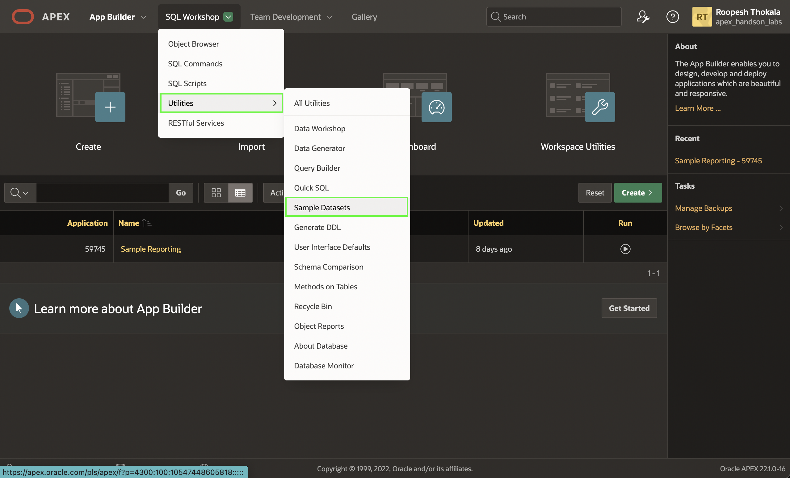
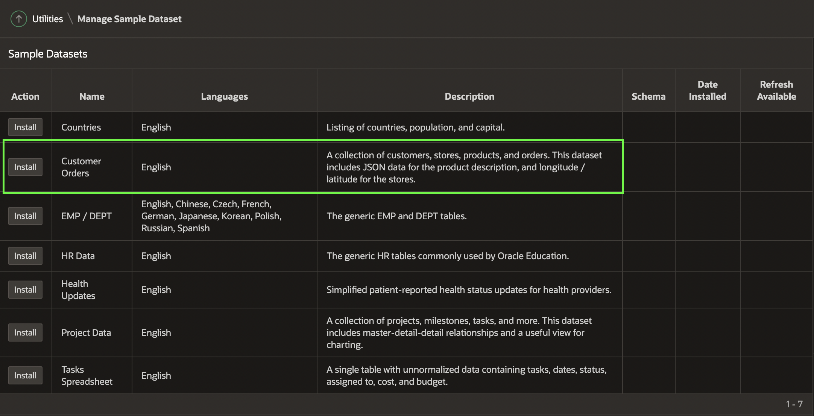
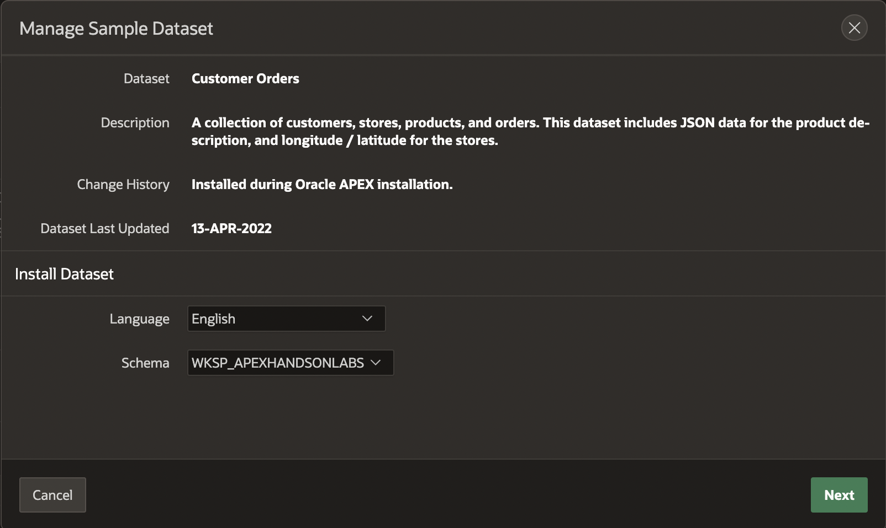
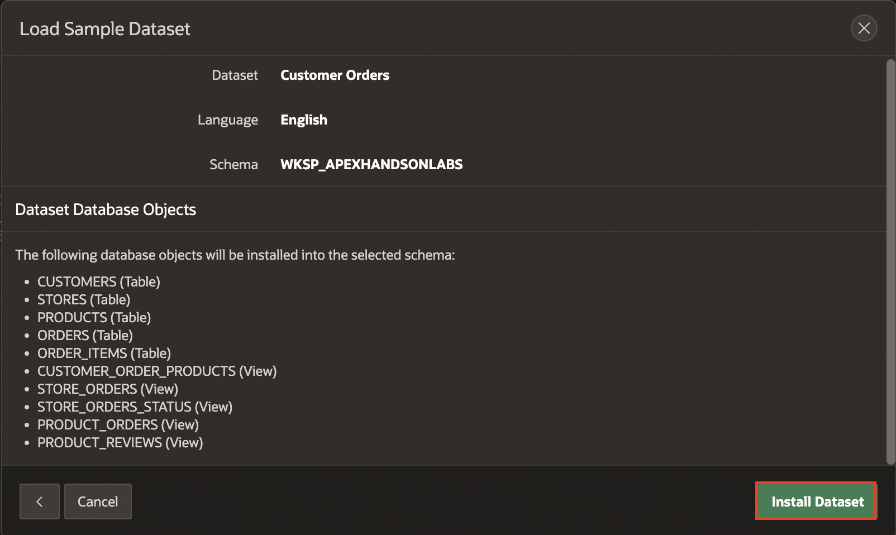
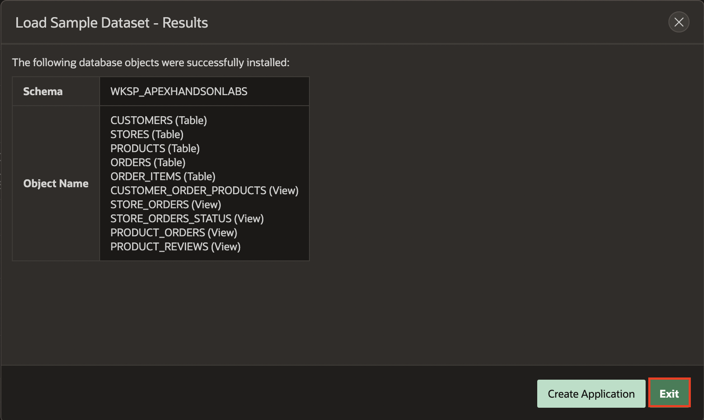

# Install a Sample Dataset

## Introduction

In this lab, you learn to install sample tables and views from Sample Datasets. This particular sample dataset is a collection of customers, stores, products, and orders used to manage the shopping cart.

Estimated Time: 5 minutes

<!--
Watch the video below for a quick walk through of the lab.

-->

### Objectives
In this lab, you will:
- Install a sample dataset into your Oracle APEX Workspace

## Task 1: Create Customer Orders Tables
1. Log into your workspace. If you are already logged in, click on the **APEX** Logo in the upper left hand corner of the page to return to the APEX workspace home page.

2. From the APEX workspace home page, select the down-arrow to the right of  **SQL Workshop**, then select **Utilities** to display the options, and choose **Sample Datasets**.

    

3. On the **Customer Orders** row, click Install.

    

4. Leave the settings to default and then click **Next**.

   *The schema name defaults to your current schema and hence will be different from the schema name shown below.*

    

5. Click **Install Dataset**.

    

6. Click **Exit**.

    

>**Note:** You do NOT want to click Create Application, as you will manually create an application later.

## **Acknowledgments**

- **Author** - Roopesh Thokala, Product Manager
- **Last Updated By/Date** - Roopesh Thokala, Product Manager, March 2022
