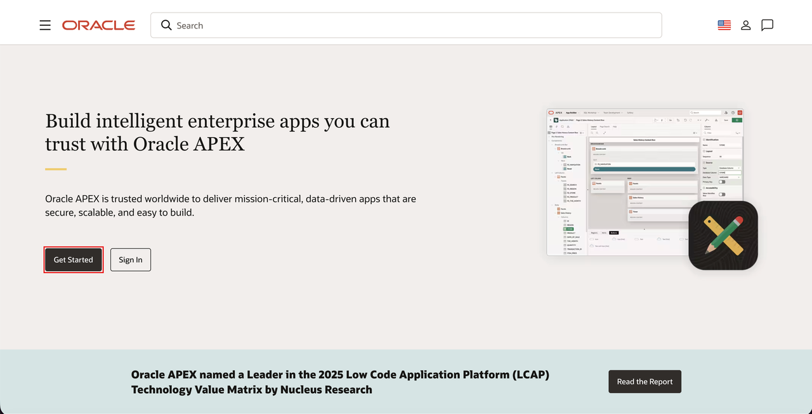
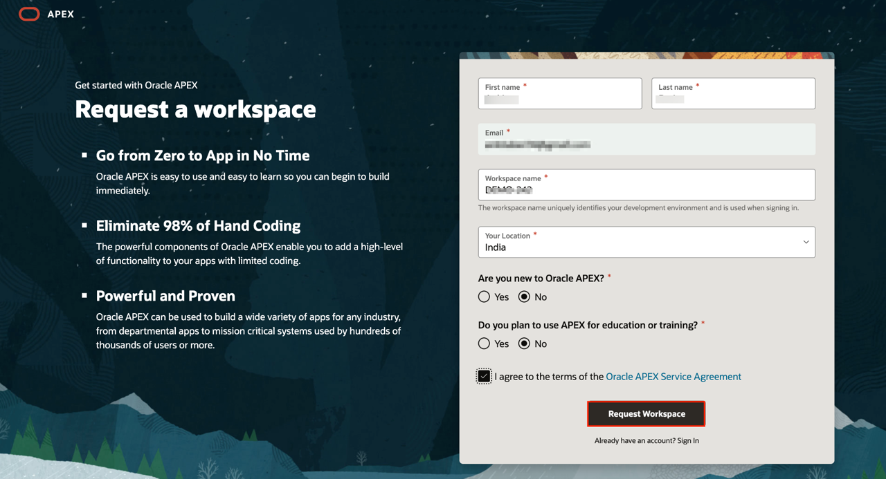
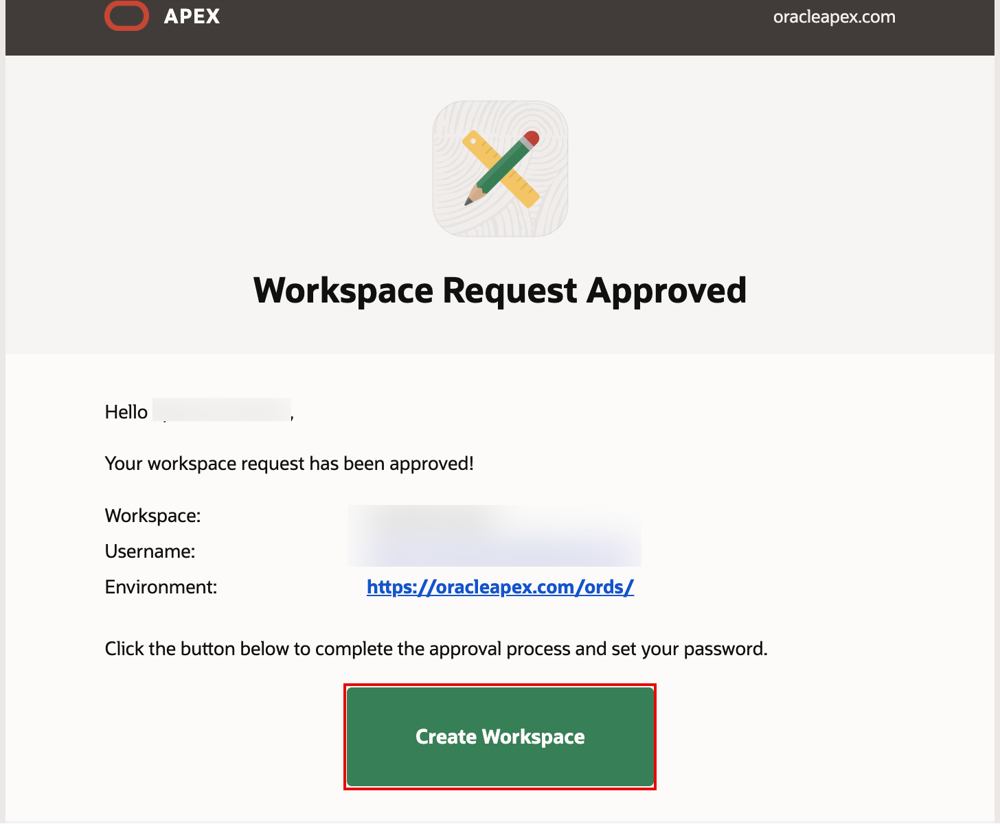
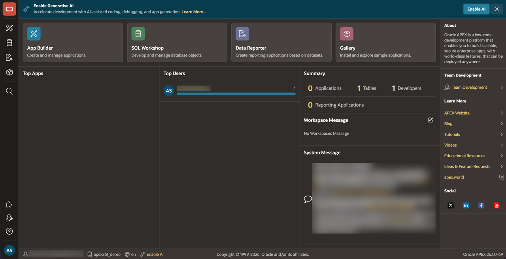

# Provision an APEX Workspace

## Introduction

Oracle APEX is an enterprise AI application platform for building secure, scalable web and mobile applications. Trusted by thousands of organizations, APEX powers systems that run core business operations every day. With Oracle AI Database and Oracle Cloud Infrastructure, every application inherits built-in reliability, governance, and security. APEX helps developers turn ideas into production-ready apps quickly, without sacrificing control or performance. To start, you will need to decide on the service you are going to use for this workshop and then create an APEX Workspace accordingly.

If you already have an APEX 26.1 Workspace provisioned, you can skip this lab.

Estimated Time: 5 minutes
<!--
Watch the video below for a quick walk through of the lab.

-->

### What is an APEX Workspace?

An APEX Workspace is a logical domain where you define APEX applications. Each Workspace is associated with one or more database schemas (database users) which are used to store the database objects, such as tables, views, packages, and more. APEX applications are built on top of these database objects.

### How Do I Find My APEX Release Version?

To determine which release of Oracle APEX you are currently running, do one of the following:

- View the release number on the Workspace home page:

  - Sign in to Oracle APEX. The Workspace home page appears. The current release version is displayed in the bottom right corner.

    

    

- View the about APEX page:

  - Sign in to Oracle APEX. The Workspace home page appears.

  - Select the help menu at the bottom-left of the page and select **About**. The About APEX page appears.

    

### Where to Run the Lab

You can run this lab in any Oracle Database with APEX 26.1 installed. This includes the APEX Application Development Service, the free, "Development Only" apex.oracle.com service, your on-premises Oracle Database (providing APEX 26.1 is installed), on a third-party cloud provider where APEX 26.1 is installed, or even on your laptop by installing Oracle XE or Oracle VirtualBox App Dev VM and installing APEX 26.1.

The following steps show how to sign up for an **APEX Application Development** service, an **Oracle Autonomous AI Database** cloud service, or the **oracleapex.com** service.

- The **oracleapex.com** service is also free, but it is designated only for development purposes. Running production apps is not allowed. You can use any of these options for this workshop.

- The **Oracle Autonomous AI Database** option is ideal for learning about Oracle Database and APEX. It comes with a minimum of 2 ECPU and 1 TB of storage and can be extended as needed. This service can also be used for production applications.

- The **APEX Application Development Service** is a flexible paid option that lets you focus on APEX development without worrying about database management. It provides 2 ECPU and 1 TB of storage and can be extended as needed.

### Types of Cloud Accounts

We offer two types of Cloud Accounts:

*Free Tier Accounts*: After you sign up for the free [Oracle Cloud promotion](https://signup.cloud.oracle.com/) or sign up for a paid account, you’ll get a welcome email. The email provides you with your cloud account details and sign-in credentials.

*Oracle Cloud Paid Accounts*: When your tenancy is provisioned, Oracle sends an email to the default administrator at your company with the sign-in credentials and URL. This administrator can create a user for each person who needs access to the Oracle Cloud. Check your email or contact your administrator for your credentials and account name.

### Objectives

- Learn how to log in to your Oracle Cloud account.

### Prerequisites

- Cloud account access is required but not mandatory.
- Cloud Account Name - The name of your tenancy (supplied by the administrator or in your Oracle Cloud welcome email).
- Username
- Password

Select one of the options below to proceed.

## Option 1: oracleapex.com

Signing up for oracleapex.com is simply a matter of providing details on the Workspace you wish to create and then waiting for the approval email.

1. Go to [oracleapex.com](https://www.oracle.com/apex/).

2. Select **Get Started**.

    

3. Under Getting Started with Oracle APEX, select **Sign Up for Free**.

    

4. On the **Request a Workspace** page, enter your identification details – **First Name, Last Name, Email, Workspace name**.

    > **Note:** For Workspace, enter a unique name, such as first initial and last name.

    Select **Request Workspace**.

    

    

5. Check your email. You should get an email from Oracle APEX within a few minutes.

    > **Note:** If you do not get an email, go back to step 3 and make sure you entered your email correctly.

    In the email body, select **Create Workspace**.

    

6. Select **Continue to Sign In Screen**.

    

7. Enter your password, and select **Change Password**.

    

8. You should now be in App Builder.

    

## Summary

At this point, you know how to create an APEX Workspace and you are ready to start building amazing apps, fast.

You may now proceed to the next lab.

## Acknowledgements

- **Author** -  Ankita Beri, Senior Product Manager
- **Last Updated By/Date**: Ankita Beri, Senior Product Manager, June 2026
