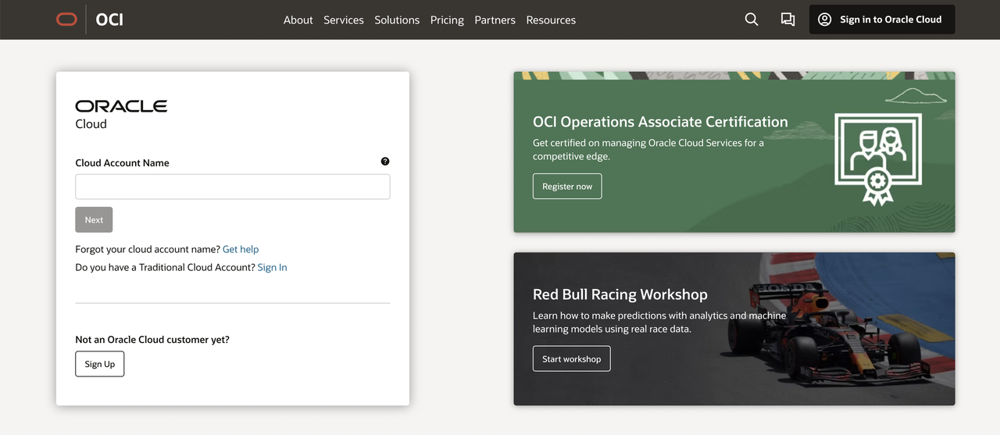
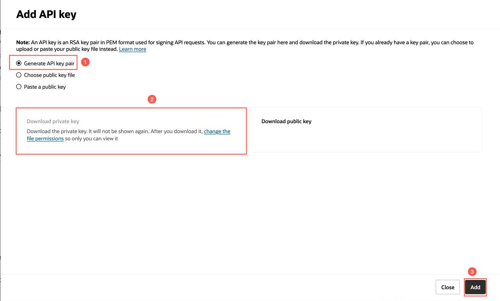
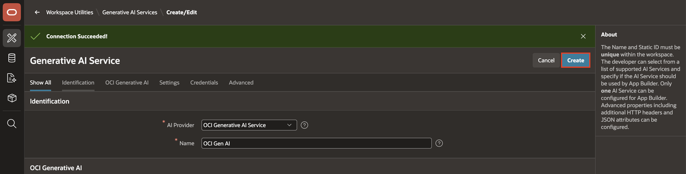
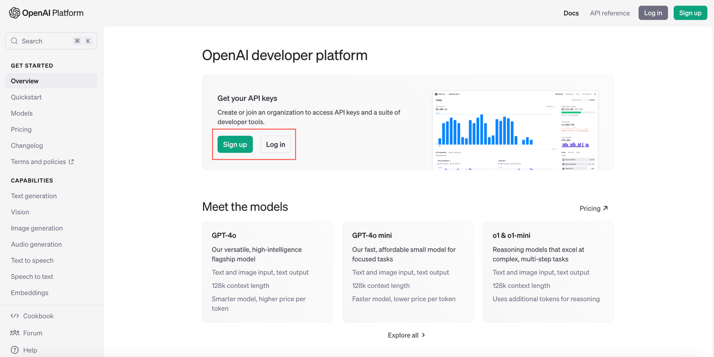
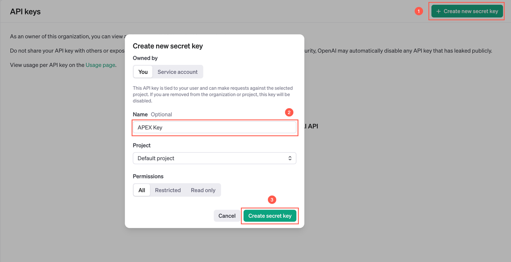

# Configure a Generative AI Service in APEX

## Introduction

To use the native Generative AI features in APEX, you must configure a Generative AI Service in APEX. To configure a Generative AI Service, you first need to obtain an API key from your preferred AI provider. You can choose OCI Generative AI, OpenAI, Cohere, Google Gemini, Anthropic Claude, Mistral AI, Ollama, or a generic OpenAI-compatible provider as your AI provider.

<if type="OCIGenAI">

In this lab, you use OCI Generative AI as the AI provider to build a conversational chatbot. To use OCI Generative AI Service in APEX, you need to configure the OCI API keys first. In Oracle Cloud Infrastructure (OCI), API keys are used for secure authentication when accessing OCI resources through REST APIs.

OCI API keys consist of two parts: a **public key** and a **private key**. You use OCI Console to generate the public/private key pair.

**Note:**

- OCI Generative AI Service is available in selected regions. To see whether your cloud region supports OCI Generative AI Service, visit the [documentation](https://docs.oracle.com/en-us/iaas/Content/generative-ai/overview.htm#regions).

- The screenshots in this workshop are taken using dark mode in APEX 26.1.

Estimated Time: 10 Minutes

### Objectives

In this lab, you will:

- Generate API keys using OCI Console.

## Task 1: Generate API keys using OCI Console

> **Note:** If you already have an OCI key pair, you may skip this lab.

To generate the API keys using OCI Console:

1. Log in to your OCI account.

    

2. Select **Profile** at the top-right corner and select your username.

    

3. Switch to the **Tokens and keys** tab. Select **Add API key**.

    

4. The Add API Key dialog is displayed. Select **Generate API Key Pair** to create a new key pair.

5. Select **Download Private Key**. A `.pem` file is saved to your local device. You do not need to download the public key.

    > **Note:** You will use this private key while configuring a Generative AI Service later in this lab.

6. Select **Add**.

    

7. The key is added, and the Configuration File Preview is displayed. Copy and save the configuration file snippet from the text box in a text editor. You will use this information while configuring a Generative AI Service in APEX.

    

## Task 2: Configure Generative AI Service

To use the Generative AI Service in APEX, you need to configure it at the Workspace level first.

1. To configure the Generative AI Service in your Workspace, navigate to the Workspace home page from the left navigation menu and select **Enable AI** in the top navigation bar. This option appears only if no AI service has been configured yet.

    Alternatively, from the Workspace home page, navigate to **App Builder > Workspace Utilities > Generative AI** to access the configuration settings.

    

    

2. Select **Create**.

    

3. For this workshop, if you prefer to use OCI Generative AI Service as the AI provider, enter or select the following:

    - AI Provider: **OCI Generative AI Service**

    - Name: **OCI Generative AI**

    - Static ID: **oci\_gen\_ai**

    - Compartment ID: *Enter your OCI Compartment ID*. Refer to the [Documentation](https://docs.oracle.com/en-us/iaas/Content/GSG/Tasks/contactingsupport_topic-Locating_Oracle_Cloud_Infrastructure_IDs.htm#:~:text=Finding%20the%20OCID%20of%20a,displayed%20next%20to%20each%20compartment.) to fetch your Compartment ID. If you have only one compartment, then use the OCID from the configuration file you saved in Task 1 of this lab.

    - Region: Enter an OCI region that supports OCI Generative AI Service and the selected model.

    - Model ID: **meta.llama-3.3-70b-instruct** (The pre-trained models are frequently deprecated. Refer to the [documentation](https://docs.oracle.com/en-us/iaas/Content/generative-ai/pretrained-models.htm#pretrained-models) for the latest pre-trained models.)

    - Used by App Builder: Toggle the button to turn it **ON**. Note that the Base URL is autogenerated.

    - Credential: **Create New**

    - **OCI User ID**: Enter the OCID of the Oracle Cloud user account. You can find the OCID in the Configuration File Preview generated during API key creation.
        Your OCI User ID looks similar to **ocid1.user.oc1..aaaaaaaa\*\*\*\*\*\*wj3v23yla**

    - **OCI Private Key**: Open the private key (`.pem`) file downloaded in the previous task. Copy and paste the API key.

    - **OCI Tenancy ID**: Enter the OCID for your tenancy. Your Tenancy ID looks similar to **ocid1.tenancy.oc1..aaaaaaaaf7ush\*\*\*\*cxx3qka**. Refer to Task 1, step 7.

    - **OCI Public Key Fingerprint**: Enter the fingerprint ID. Your fingerprint ID looks similar to **a8:8e:c2:8b:fe:\*\*\*\*:ff:4d:40**. Refer to Task 1, step 7.

4. Select **Test Connection**.

    

    

5. If the connection is successful, select **Create**.
   If unsuccessful, verify that you have configured the IAM policy on OCI correctly. Refer to the [Identity and Access Management](https://livelabs.oracle.com/pls/apex/r/dbpm/livelabs/run-workshop?p210_wid=624&p210_wec) workshop for more details.

    

## Summary

Congratulations! You've completed the lab.

You now know how to generate an API key using OCI Console and configure a Generative AI Service in APEX.

You may now **proceed to the next lab**.

</if>

<if type="OpenAI">

In this lab, you use OpenAI as the AI provider to build a conversational chatbot.

> **Note:** The screenshots in this workshop are taken using dark mode in APEX 26.1.

Estimated Time: 10 Minutes

Watch the video below for a quick walk-through of the lab.
[Configure a Generative AI Service in APEX](videohub:1_caybibul)

### Objectives

In this lab, you will:

- Generate an API key for OpenAI.

## Task 1: Generate API keys using OpenAI

1. Create and log in to your [OpenAI account](https://platform.openai.com/).

    

2. Navigate to the [API Keys](https://platform.openai.com/settings/organization/api-keys) page to create a new key.

    Select **Create new secret key**. Enter the details and select **Create secret key**.

    

3. A secret key is generated. Copy and save the API key in a text editor. You will use this information while configuring a Generative AI Service in APEX.

    

## Task 2: Configure Generative AI Service

To use the Generative AI Service in APEX, you need to configure it at the Workspace level first.

1. To configure the Generative AI Service in your Workspace, navigate to the Workspace home page from the left navigation menu and select **Enable AI** in the top navigation bar. This option appears only if no AI service has been configured yet.

    Alternatively, from the Workspace home page, navigate to **App Builder > Workspace Utilities > Generative AI** to access the configuration settings.

    

    

2. Select **Create**.

    

3. For this workshop, if you prefer to choose OpenAI as the AI provider, enter or select the following:

    - AI Provider: **OpenAI**

    - Name: **OpenAI**

    - Used by App Builder: Toggle the button to turn it **ON**

    - API Key: Enter your *OpenAI API* key that you generated in Task 1 of this lab.

    - AI Model: **gpt-5.4-nano** (Enter a preferred model of your choice)

    Select **Test Connection**.
    

4. If the connection is successful, select **Create**.
   If unsuccessful, go to the troubleshooting section in the Appendix lab.
   

## Summary

Congratulations! You've completed the lab.

You now know how to generate an API key using OpenAI.

You may now **proceed to the next lab**.
</if>

## Acknowledgements

- **Author** - Ankita Beri, Senior Product Manager
- **Last Updated By/Date** - Ankita Beri, Senior Product Manager, June 2026
