# Create a Supply Chain Management Application

## Introduction

This lab sets up the application and data foundation for the rest of the workshop. You will load the SCM data model and sample data, create the Supply Chain Management application, and verify that the seeded SCM objects are available before you begin configuring AI features.

Estimated Lab Time: 5 minutes

### Objectives

In this lab, you will:

- Download and run the SCM data model and sample data load scripts.
- Create a Supply Chain Management application in your workspace.
- Review the sample SCM objects and confirm the application shell is ready.

### Downloads

Use these files during the hands-on setup:

- [scm-datamodel.sql](files/scm-datamodel.sql)
- [scm-dataload.sql](files/scm-dataload.sql)

Run the files in the order listed above.

## Task 1: Install the SCM Data Model and Sample Dataset

This task prepares the workshop schema. You will upload and run the provided SQL scripts in SQL Workshop so the SCM tables, views, and sample replenishment data are ready for the later labs.

1. Download the following files from the **Downloads** section of this lab:

    - `scm-datamodel.sql`
    - `scm-dataload.sql`

2. Sign in to your Oracle APEX workspace and open **SQL Workshop**.

    

3. On the **SQL Workshop** page, click **SQL Scripts**.

    

4. Click **Upload**.

    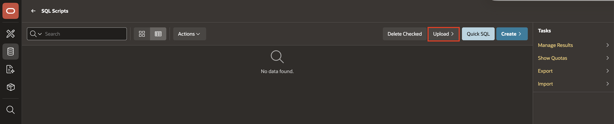

5. Select file `scm-datamodel.sql` and click **Upload**.

    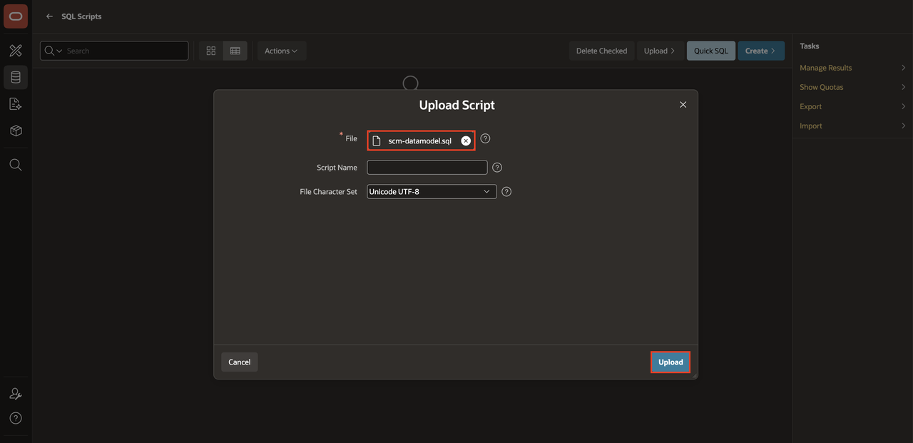

6. Click **Run** icon.

    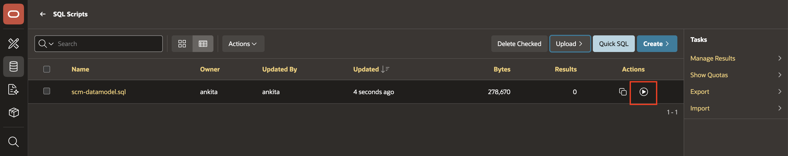

7. Click **Run** to execute the data model script.

    

8. Review the results and confirm the script status is **Complete** with **0** errors.

    

9. Return to **SQL Scripts**.

    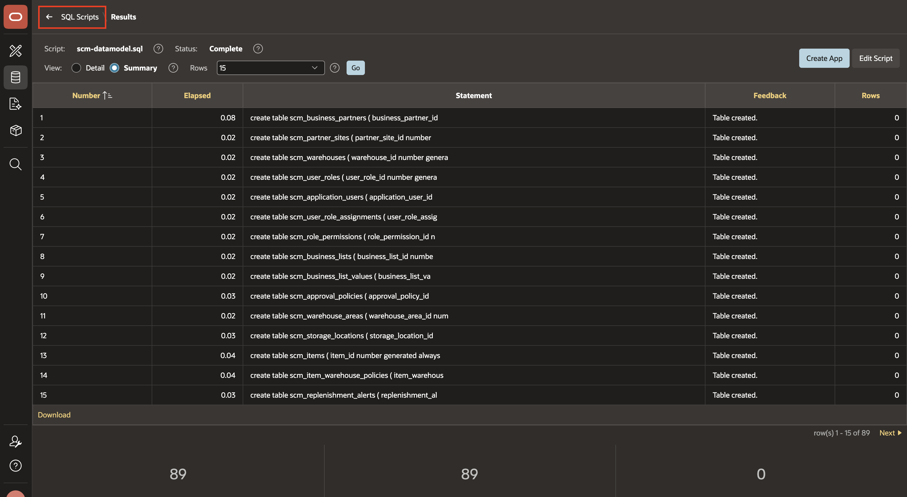

10. Click **Upload**.

    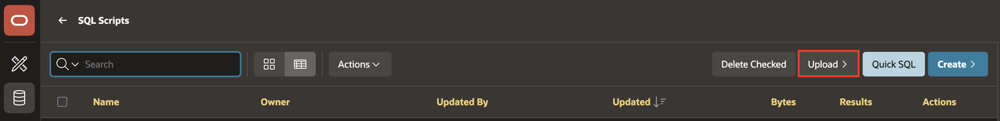

11. Now, select file `scm-dataload.sql`, and click **Upload** to load the SCM sample data.

    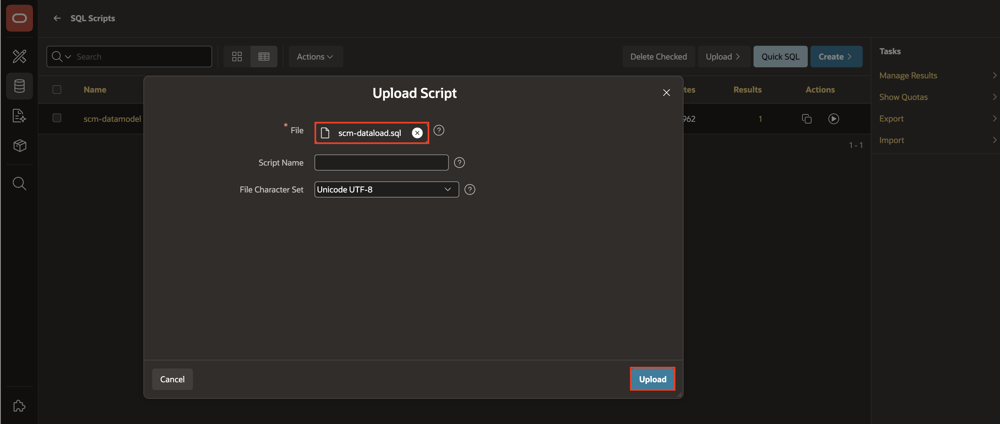

12. Click **Run** icon.

    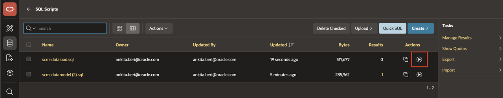

13. Click **Run** to execute the data load script.

    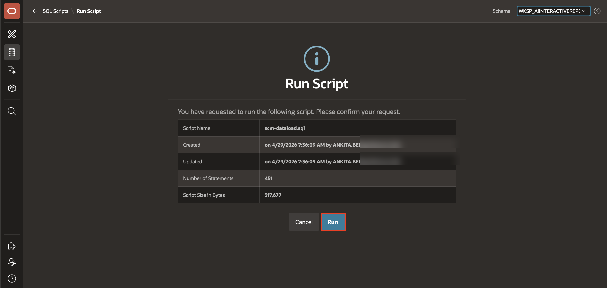

14. Verify that both scripts complete without errors before you continue.

    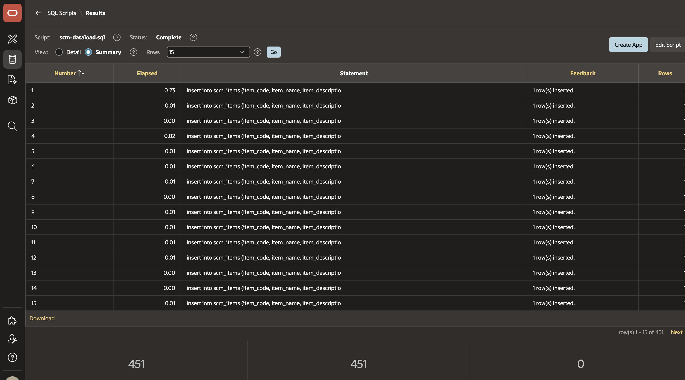

## Task 2: Create a Supply Chain Management Application

This task creates the application shell that you will enhance throughout the workshop. The goal is to create a new Supply Chain Management application in App Builder so later labs can focus on the AI-enabled reporting experience.

1. From the workspace home page, click **App Builder**.

    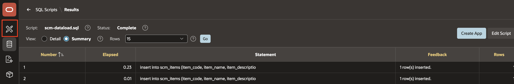

2. On the **App Builder** page, click **Create** and start a new application.

    

3. In the **Name** field, enter **Supply Chain Management**.

    

4. Click **Create Application**.

    

5. Confirm that the new application appears in **App Builder**.

    

## Task 3: Review the Database Objects

This task gives you context for the rest of the workshop. You will review the application home page created in Task 2 and confirm that the SCM objects needed for replenishment reporting were installed successfully.

1. Navigate to **SQL Workshop** icon , and then click **Object Browser**.

    

2. Review the installed SCM objects that support replenishment reporting, by searching with SCM_ in your Object Browser to list the core tables and views created by the setup scripts.

    

## Task 4: Refresh Data Dictionary

When we generate a data model, the database updates instantly but APEX’s schema metadata doesn’t. Refreshing the Data Dictionary ensures APEX reads the latest tables and makes them available in wizards and builders.In this task, we will refresh the Data Dictionary to synchronize APEX with the updated schema.

1. To refresh database objects, click APEX **Administration** icon from the left menu above your user profile. Then select **Manage Service > Manage Service**.

    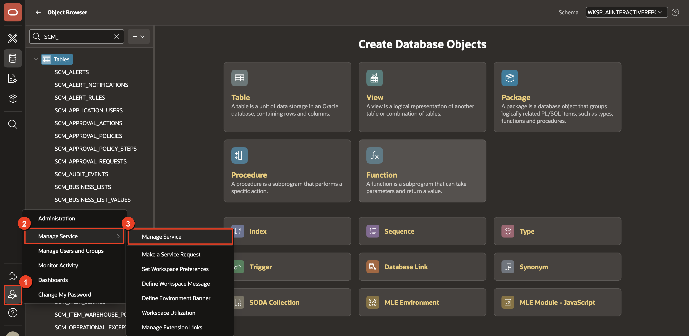

2. On the right-hand side, under **Manage Meta Data**, select **Data Dictionary Cache**.

    

3. To refresh the cache manually click **Refresh Cache Only**.

    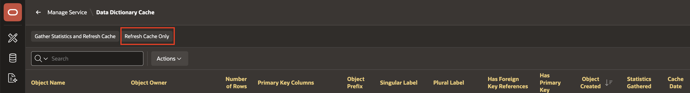

4. Now you will view refreshed cache for tables.

    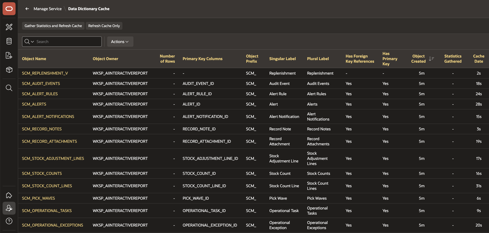

## Summary

You loaded the SCM setup scripts, created the Supply Chain Management application, and verified that the required SCM objects are available. The application and sample data are now ready for AI service configuration and report enhancement.

## Acknowledgements

- **Author** - Ankita Beri, Senior Product Manager
- **Last Updated By/Date** - Ankita Beri, Senior Product Manager, April 2026

