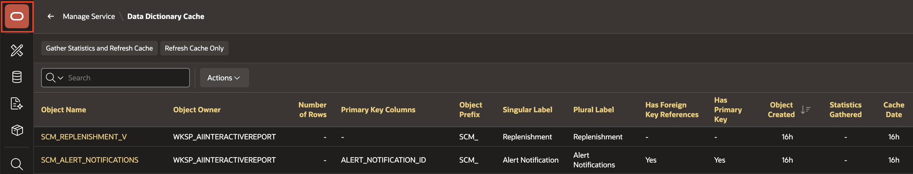
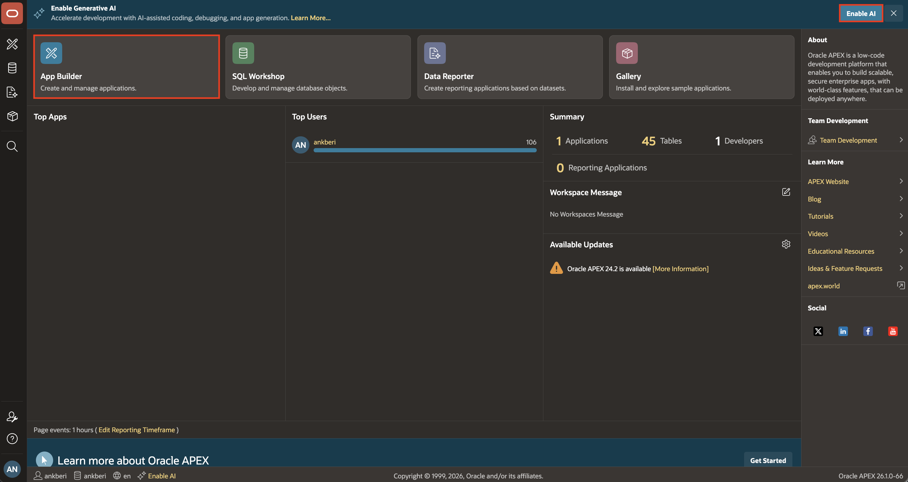
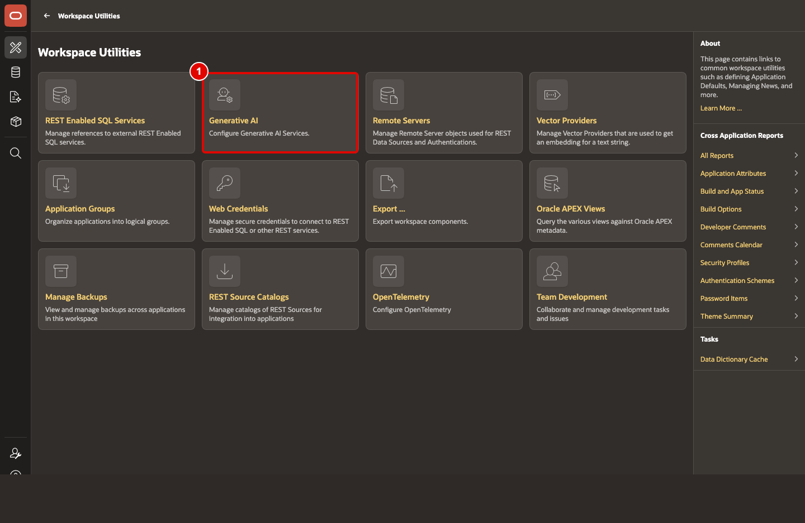
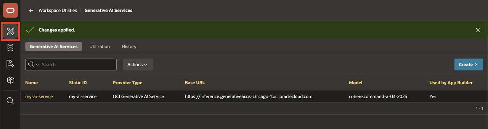
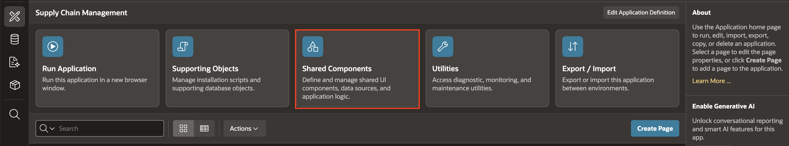
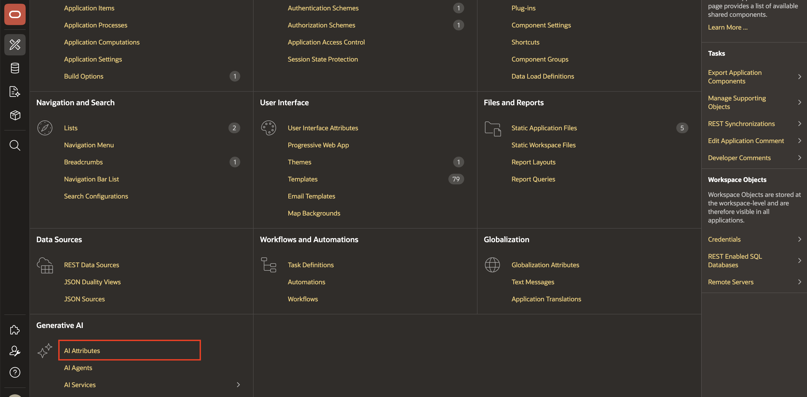
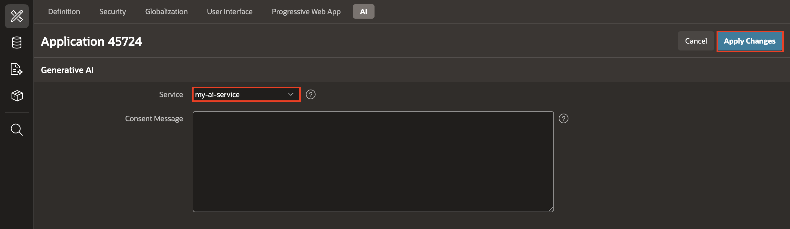

# Configure Generative AI Service

## Introduction

This lab configures the Generative AI connection that powers natural language report creation, Search with AI, and the Interactive Report chat assistant. You will define the provider, enable App Builder usage and verify the connection before you return to the report page.

Estimated Lab Time: 10 minutes

### Objectives

In this lab, you will:

- Configure the Generative AI provider used by the SCM application.

## Task 1: Configure the Generative AI Provider

Before you create an AI interactive report, you need to connect Oracle APEX to a Generative AI provider. In this lab, you will configure OCI Generative AI as a workspace-level service and assign it to the application. This provides the LLM backend that the AI Interactive report will use to process natural language in the following labs.

1. To configure the Generative AI service in your workspace, navigate back to Oracle APEX Homepage from the left navigation menu and click **Enable AI** in the top navigation bar. This option appears only if no AI service has been configured yet.

    Alternatively, from the workspace home page, navigate to **App Builder > Workspace Utilities > Generative AI** to access the configuration settings.

    

    

    

2. Click **Create**.

    

3. For this workshop, if you prefer to use OCI Generative AI Service as the AI provider, enter/select the following:

    - AI Provider: **OCI Generative AI Service**

    - Name: **OCI Gen AI**

    - Static ID: **oci\_gen\_ai**

    - Compartment ID: *Enter your OCI Compartment ID*. Refer to the [Documentation](https://docs.oracle.com/en-us/iaas/Content/GSG/Tasks/contactingsupport_topic-Locating_Oracle_Cloud_Infrastructure_IDs.htm#:~:text=Finding%20the%20OCID%20of%20a,displayed%20next%20to%20each%20compartment.) to fetch your Compartment ID. If you have only one compartment, then use the OCID from the configuration file you saved in Task 1 of this lab.

    - Region: **us-chicago-1** (Currently, the OCI Generative AI Service is only available in limited regions)

    - Model ID: **meta.llama-3.3-70b-instruct** (The pre-trained models are frequently deprecated. Refer to the [documentation](https://docs.oracle.com/en-us/iaas/Content/generative-ai/pretrained-models.htm#pretrained-models) for the latest pre-trained models.)

    - Used by App Builder: Toggle the button to turn it **ON**. Note that the Base URL is auto generated.

    - Credential: **Create New**

    - **OCI User ID**: Enter the OCID of the Oracle Cloud user Account. You can find the OCID in the Configuration File Preview generated during the API Key creation.
        Your OCI User ID looks similar to **ocid1.user.oc1..aaaaaaaa\*\*\*\*\*\*wj3v23yla**

    - **OCI Private Key**: Open the private key (.pem file) downloaded in the previous task. Copy and paste the API Key.

    - **OCI Tenancy ID**: Enter the OCID for Tenancy. Your Tenancy ID looks similar to **ocid1.tenancy.oc1..aaaaaaaaf7ush\*\*\*\*cxx3qka** (Refer to previous task step 7)

    - **OCI Public Key Fingerprint**: Enter the Fingerprint ID. Your Fingerprint ID looks similar to **a8:8e:c2:8b:fe:\*\*\*\*:ff:4d:40** (Refer to previous task step 7)

4. Click **Test Connection**.

    

    

5. If the connection is successful, click **Create**.
   If unsuccessful, verify if you have configured the IAM Policy on OCI correctly. Refer to the [Identity and Access Management](https://livelabs.oracle.com/pls/apex/r/dbpm/livelabs/run-workshop?p210_wid=624&p210_wec) workshop for more details.

    

6. From the Generative AI Services page, select the App Builder icon in the left navigation.

    

7. Select the **Supply Chain Application** from the App Builder applications list.

    

8. On the application home page, select **Shared Components**.

    

9. From Shared Components, select **AI Attributes**.

    

10. For Generative AI Service, select **OCI Gen AI** from the drop down, then select **Apply Changes**.

    

## Summary

You configured the Generative AI service provider, enabled App Builder access, and validated the connection. The SCM application can now use AI features inside App Builder and runtime.

## Acknowledgements

- **Author** - Ankita Beri, Senior Product Manager
- **Last Updated By/Date** - Ankita Beri, Senior Product Manager, April, 2026
