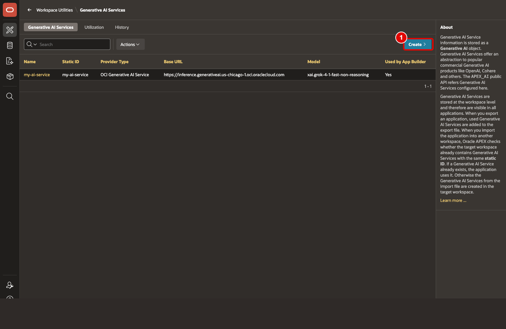
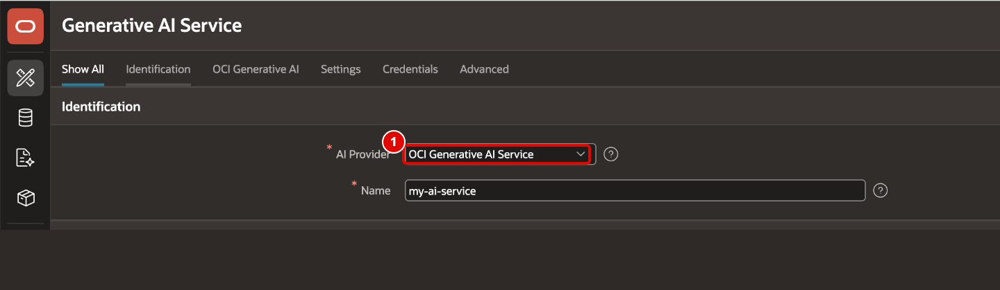
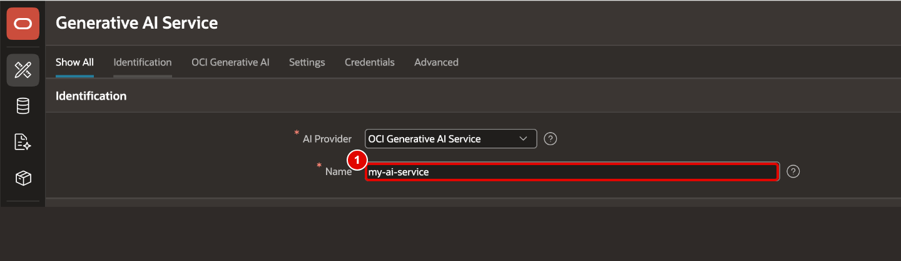
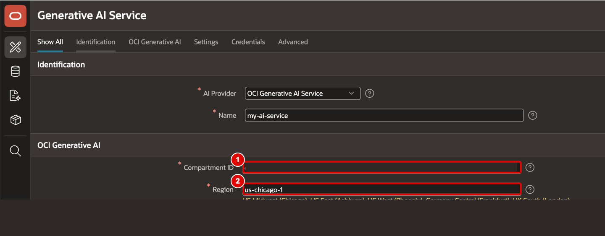
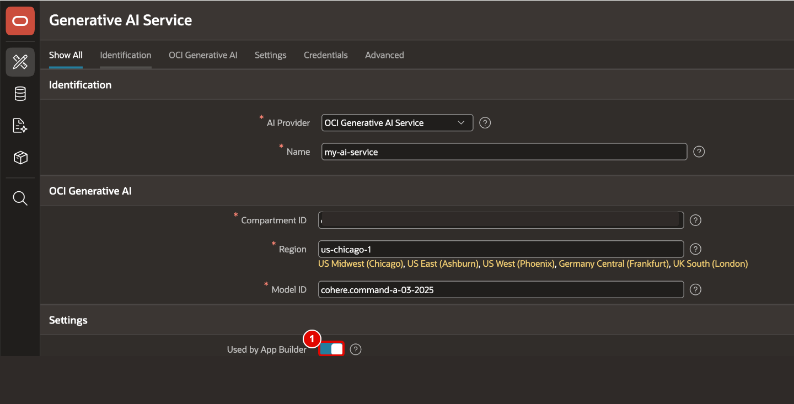
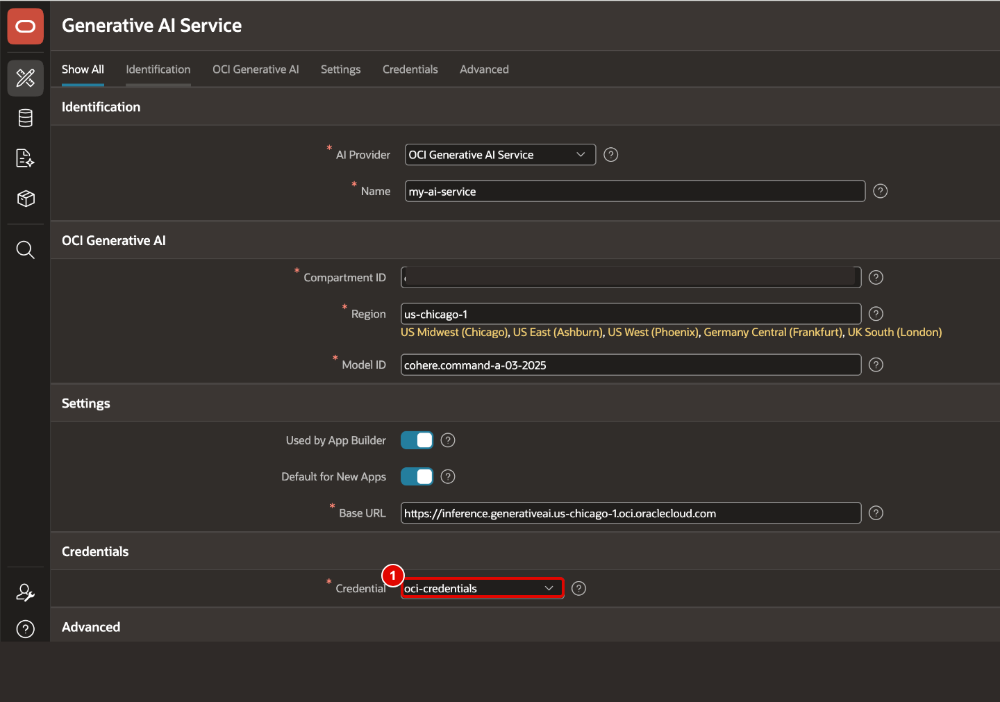
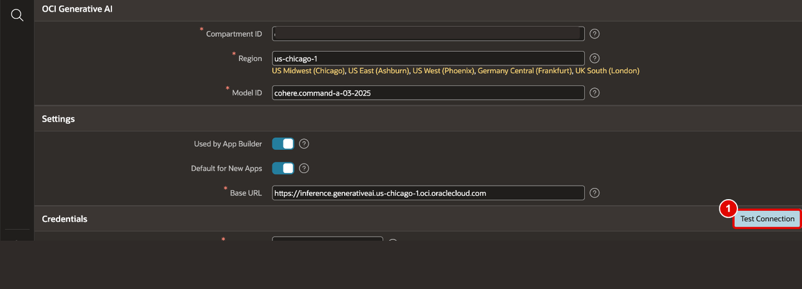
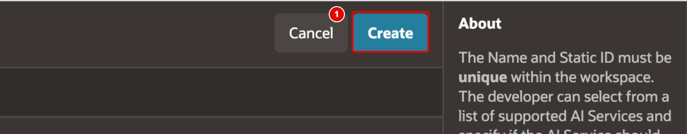

# Configure an AI Service

## Introduction

This lab configures the Generative AI connection that powers natural language report creation, Search with AI, and the Interactive Report chat assistant. You will define the provider, enable App Builder usage and verify the connection before you return to the report page.

Estimated Lab Time: 10 minutes

### Objectives

In this lab, you will:

- Configure the Generative AI provider used by the SCM application.

## Task 1: Define the Generative AI Provider

This task sets the service foundation for every AI-driven action later in the workshop. A valid provider and credential ensure that report creation, AI search, and chat interactions all use the same trusted connection.

1. From the workspace home page, click **App Builder > Workspace Utilities**. If no Generative AI service has been configured for your workspace, you can also click **Enable AI** in the top navigation bar to configure it.

    

2. Click **Generative AI**.

    

3. Click **Create**.

    

4. Set **AI Provider** to the provider required for your environment. In this workshop example, use **OCI Generative AI Service**.

    

5. Enter a meaningful service name such as **my-ai-service**.

    

6. Enter your **Compartment ID** and **Region** details if you are using **OCI Generative AI Service**.

    

7. Set **Use by App Builder** to **Yes** so AI features are available while you create the application.

    

8. Create or select the credential required by the provider.

    

9. Click **Test Connection**.

    

10. Confirm that the connection succeeds and click **Create**.

    

## Summary

You configured the AI provider, enabled App Builder access, selected the workshop model, and validated the connection. The SCM application can now use AI features inside App Builder and runtime.

## Acknowledgements

- **Author** - Ankita Beri, Senior Product Manager
- **Last Updated By/Date** - Ankita Beri, April, 2026
