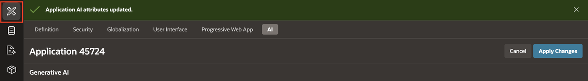
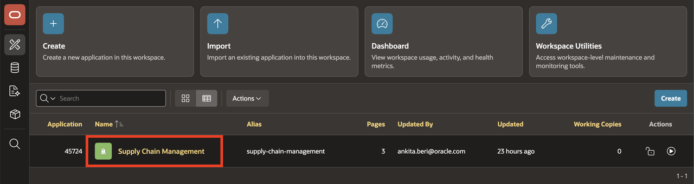
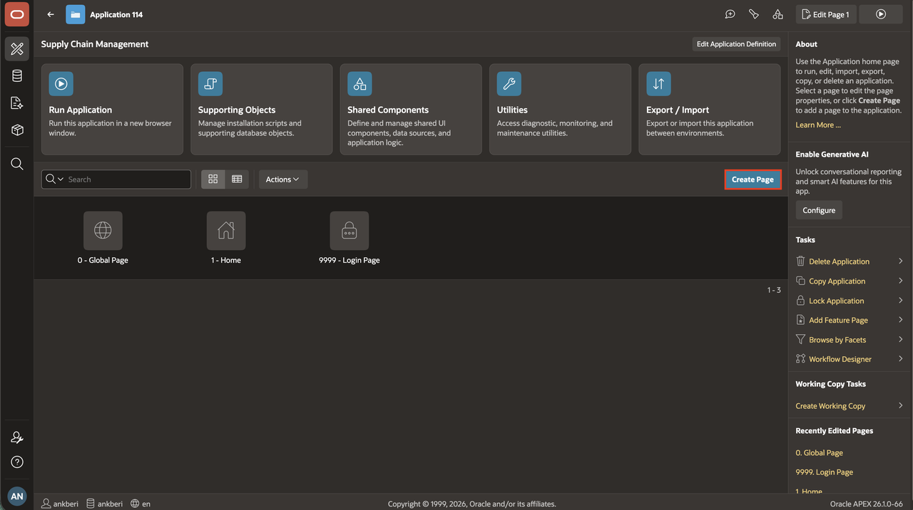
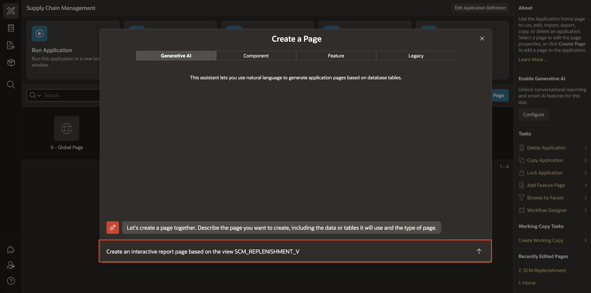
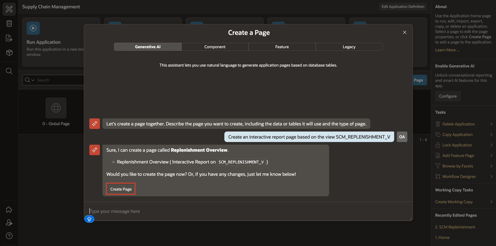
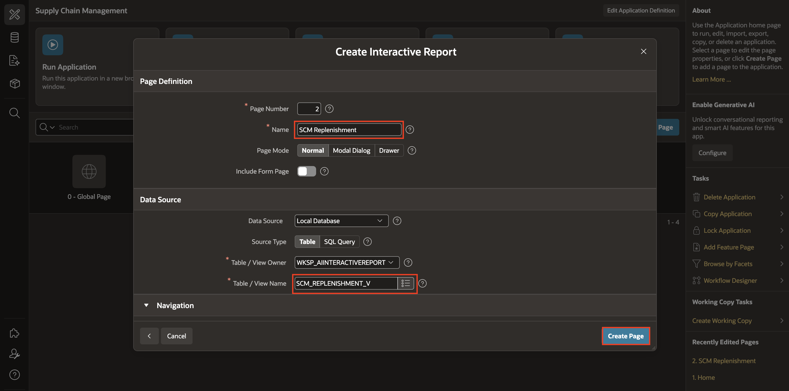
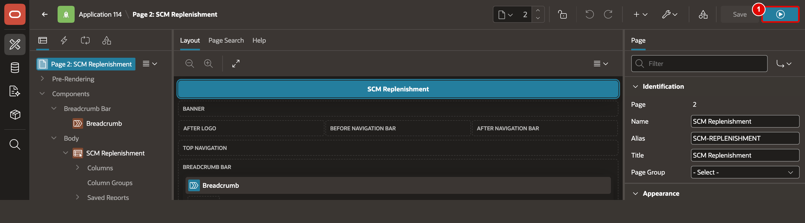
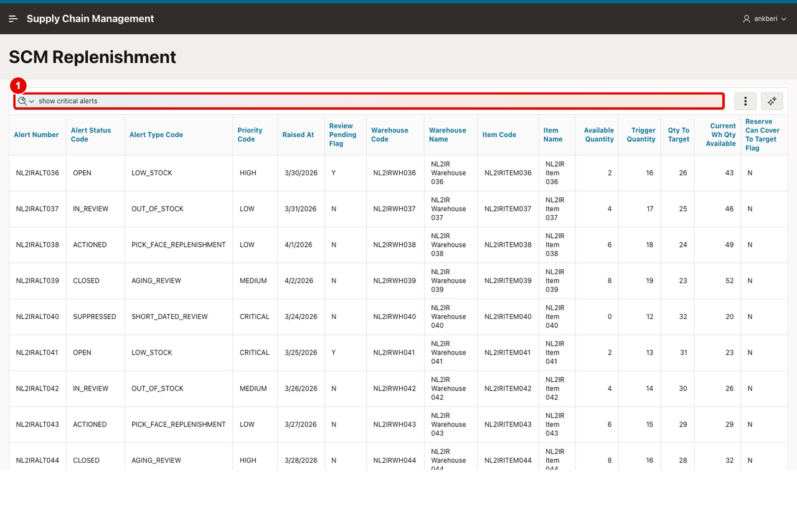

# Create an Interactive Report Using Natural Language

## Introduction

This lab creates the core replenishment report used throughout the rest of the workshop. With `SCM_REPLENISHMENT_V` already created by the setup script, you will build an Interactive Report page on that view and then enable natural language support directly on the report region.

Estimated Lab Time: 5 minutes

### Objectives

In this lab, you will:

- Create an Interactive Report page using natural language.
- Enable natural language support on the report region.

## Task 1: Build an Interactive Report page from a view

This task creates the replenishment report page used in the remaining labs. The setup script has already created **SCM\_REPLENISHMENT\_V**, so you only need to point the new Interactive Report page at that view.

1. Navigate to **App Builder** icon in the left navigation.

    

2. In **App Builder**, open the **Supply Chain Management** application and click **Create Page**.

    

    

3. When using Generative AI features within the APEX development environment for the first time, you will be asked to provide consent. In the APEX Assistant Wizard, if you see a Dialog regarding consent. Click on Accept.

   

4. Use natural language to request a new Interactive Report page based on the view **SCM\_REPLENISHMENT\_V**. For example, enter:

    ```
    <copy>
    Create an interactive report page based on the view SCM_REPLENISHMENT_V
    </copy>
    ```

    

5. Once you're okay with the page, click **Create Page**.

    

6. Review the suggested page details, change Page Name to **SCM Replenishment** and confirm that **Table / View Name** is **SCM\_REPLENISHMENT\_V**, then click **Create Page**.

    

7. Click **Run**.

    

    Confirm that the report renders from the view.

    

## Task 2: Enable Natural Language on the Interactive Report

This task turns the report into an AI-enabled search surface. You will enable natural language support on the region, choose the default AI search behavior, and provide report context so the model understands replenishment terminology.

1. In **Page Designer**, keep the **SCM Replenishment** region selected and open the **Attributes** tab.

2. In the **Generative AI** section, turn **Natural Language Support** **On**.

    

3. Confirm **Default Search Mode** is **Search with AI**.

4. In **Report Context**, enter the following text:

    ```
    <copy>
    Replenishment alerts show where stock should be moved into the pick face. High priority means urgent action. Qty to Target is the suggested replenishment quantity. Warehouse Code identifies the fulfillment location.
    </copy>
    ```

    

5. Click **Save and Run Page**.

6. Confirm that the report opens with the conversational search bar.

    

## Summary

You created an Interactive Report, enabled natural language support, and added SCM-specific report context. The report is now ready for column-level AI tuning.

## Acknowledgements

- **Author** - Ankita Beri, Senior Product Manager
- **Last Updated By/Date** - Ankita Beri, April, 2026
