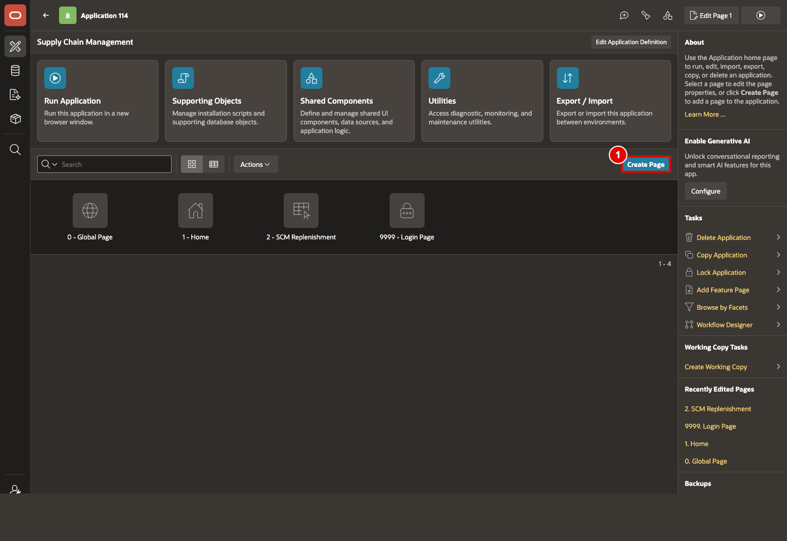
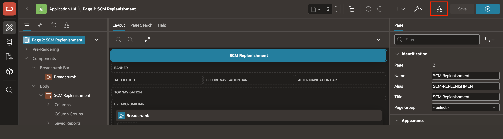
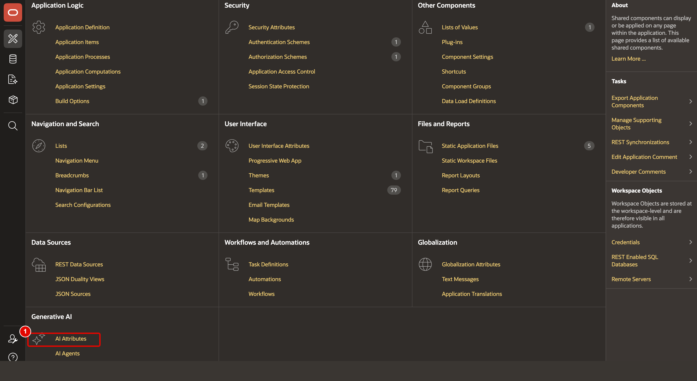
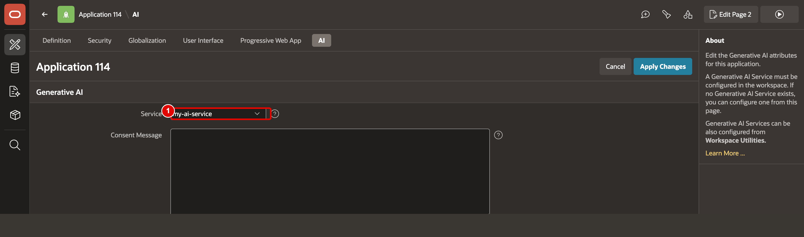
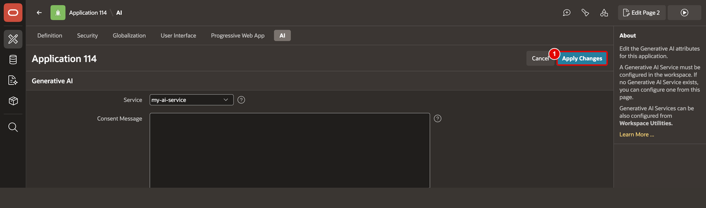
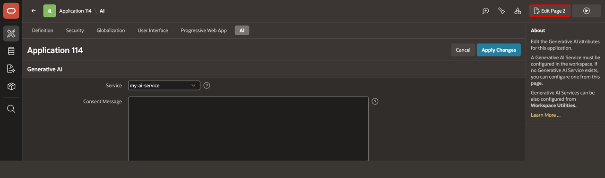
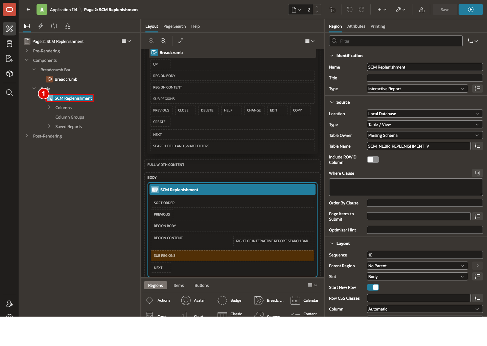
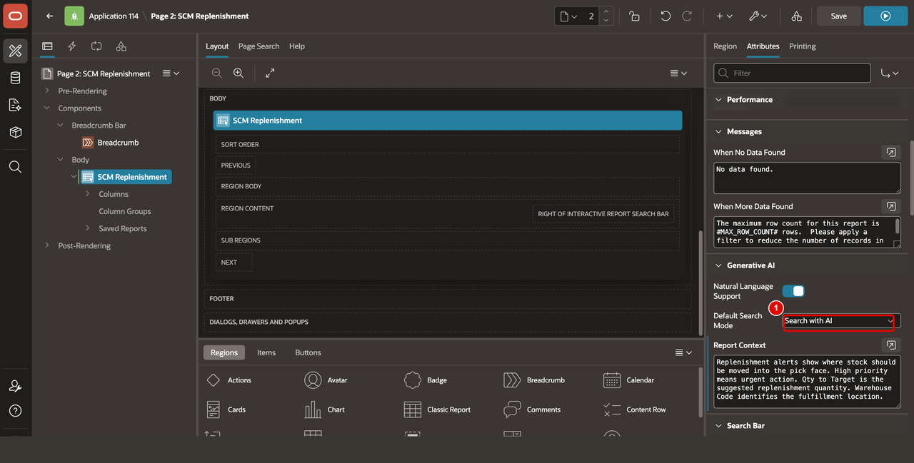
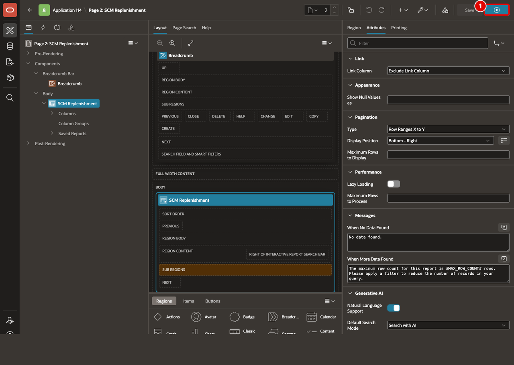

# Create an Interactive Report Using Natural Language

## Introduction

This lab introduces the core build experience for the new AI Interactive Report feature. With *`SCM_NL2IR_REPLENISHMENT_V`* already created by the data model setup script, you will use natural language to create an Interactive Report on top of that view and then enable natural language support directly on the report so end users can search the replenishment data conversationally.

Estimated Lab Time: 5 minutes

### Objectives

In this lab, you will:
- Build an Interactive Report page from a view.
- Enable natural language support on the report.

## Task 1: Create the Replenishment Report Page

This task creates the AI Interactive Report page for the SCM reporting surface referenced in the source material. The setup script has already created `SCM_NL2IR_REPLENISHMENT_V`, so you can focus directly on building the report page on top of that business-ready view.

1. In **App Builder**, click **Create Page**.

    

2. Use natural language to request a new Interactive Report page based on the view `SCM_NL2IR_REPLENISHMENT_V`. For example, enter:

    ```
    <copy>
    Create an interactive report page based on the view SCM_NL2IR_REPLENISHMENT_V
    </copy>
    ```

    

3. Once you're okay with the page, click **Create Page**.

    

4. Review the suggested page details, confirm that **Table / View Name** is `SCM_NL2IR_REPLENISHMENT_V`, then click **Create Page**.

    

5. Click **Run**.

    

    Confirm that the report renders from the view.

    

## Task 2: Enable Natural Language on the Interactive Report

This task turns the new report into an AI-enabled search surface. You will connect the report to the AI service configured earlier, choose the default search behavior, and add SCM report context so the AI understands replenishment terminology.

1. Before you edit the page, confirm that the AI service you created in Lab 2 is available in the workspace.

2. In **Page Designer**, click **Shared Components**.

    

3. Under Generative AI, click **AI Attributes**.

    

4. In the **Service** field, select `my-ai-service`.

    

5. Click **Apply Changes**.

    

6. Click **Edit Page 2** to return to **Page Designer**.

    

7. In **Page Designer**, select the Interactive Report region from the left pane.

    

8. In the right pane, select **Attributes**, open the **Generative AI** section and turn **Natural Language Support** **On**.

    

9. Set **Default Search Mode** to **AI Search** for this workshop. If your rollout requires a more conservative default, you can use **Row Search** instead.

    

10. In **Report Context**, enter the following SCM business context:

    ```
    <copy>
    Replenishment alerts show where stock should be moved into the pick face. High priority means urgent action. Qty to Target is the suggested replenishment quantity. Warehouse Code identifies the fulfillment location.
    </copy>
    ```

    

11. Click **Save and Run**.

    

12. Confirm that the report shows the **Search with AI** option and the AI processing indicator.

    

## Summary

You built an Interactive Report on `SCM_NL2IR_REPLENISHMENT_V`, enabled natural language support, and added SCM-specific report context. The report is now ready for column-level AI tuning.

## Acknowledgements

- **Author** - Ankita Beri, Senior Product Manager
- **Last Updated By/Date** - Ankita Beri, April, 2026
