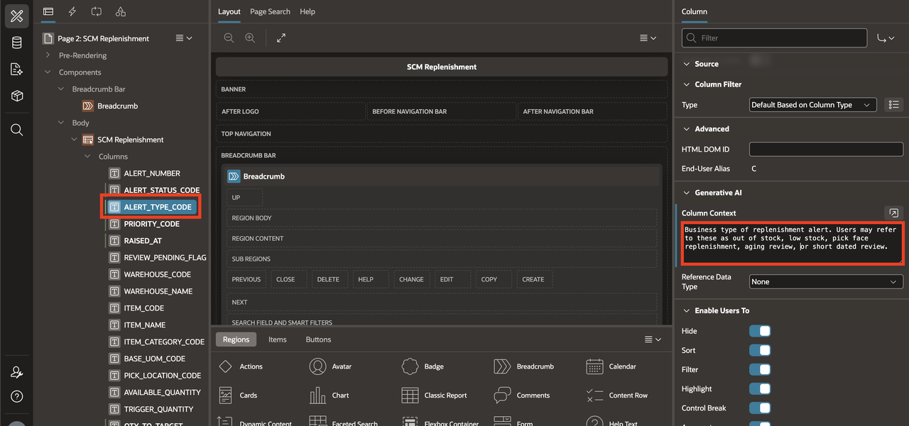
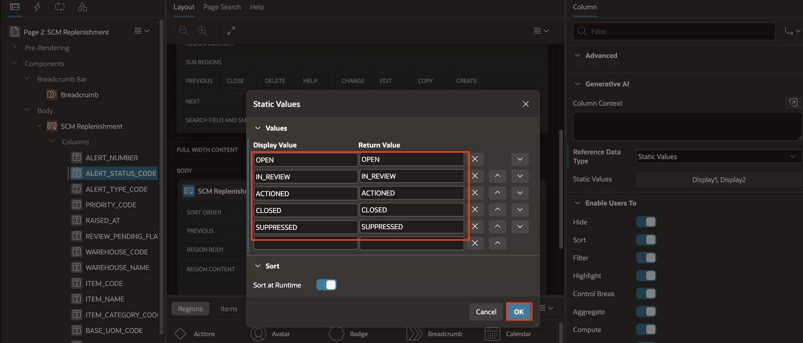
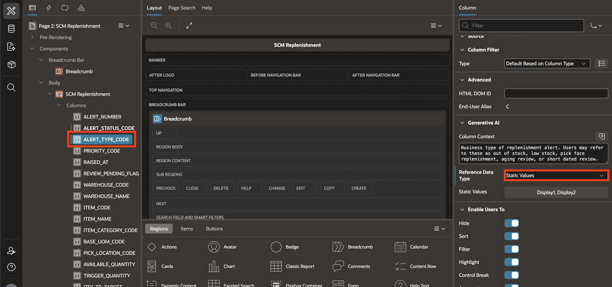
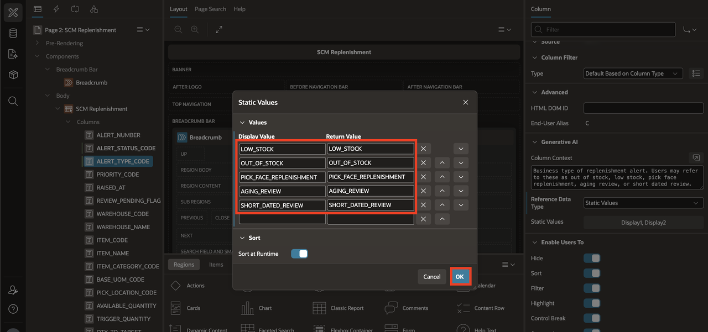

# Configure Column-Level AI Attributes

## Introduction

The AI does not have access to your actual business data. It relies entirely on the metadata you provide to understand your report columns. In the previous lab, you added report-level context that describes what the report is about. In this lab, you will go one level deeper and configure column-level AI attributes for key columns in `SCM_REPLENISHMENT_V`.

In APEX Interactive Reports, each report column includes a Generative AI section where developers can refine AI behavior for that specific column. There are two key settings: **Column Context**, which provides additional notes describing the purpose or interpretation of a column, and **Reference Data Type**, which indicates the type of reference data (Static Values, SQL Query, or Shared Component) that the AI can use when forming responses. By adding business descriptions and reference values, you give the AI the vocabulary it needs to correctly interpret column names, map user terms to valid filter values, and generate accurate report actions.

For example, without column context, the AI has no way to know that `PRIORITY_CODE` represents business urgency or that its valid values are CRITICAL, HIGH, MEDIUM, and LOW. With that metadata in place, a prompt like "show me high priority alerts" is correctly mapped to a filter on `PRIORITY_CODE = HIGH`.

Estimated Lab Time: 5 minutes

### Objectives

In this lab, you learn how to:

- Add SCM-specific column context to key report columns.
- Define reference values for status and warehouse-related columns.
- Validate that AI uses the column guidance correctly.

## Task 1: Add SCM Column Context

Report-level context tells the AI what the report is about, but column context tells it what each field means. Use column context when users ask questions using business language rather than database column names. Without it, a column like `QTY_TO_TARGET` is just a number. With context, the AI understands it represents the suggested replenishment quantity. Similarly, `RAISED_AT` could be any timestamp, but column context clarifies it as the date when the alert was raised. In this task, you will add business descriptions to key columns so the AI can generate accurate filters, sorts, and aggregations from natural language prompts.

1. In **App Builder**, open the Supply Chain Management application and open the replenishment report page in **Page Designer**.

    

2. In the left pane, expand the report columns.

    

3. Select the column **QTY\_TO\_TARGET**.

    

4. In the right pane, scroll to the **Generative AI** section for the selected column. If the section is collapsed, expand it.

    

5. In **Column Context**, enter the following context value:

    ```
    <copy>
    Suggested replenishment quantity to move into the pick face for this alert. Users may refer to this as replenishment quantity, suggested move quantity, restock amount, or quantity to replenish.
    </copy>
    ```

    

6. Select the column **PRIORITY_CODE**.

    

7. In the **Generative AI** section, enter the following **Column Context** value:

    ```
    <copy>
    Business urgency of the replenishment alert. CRITICAL means highest urgency requiring immediate action, HIGH means immediate attention, MEDIUM means normal attention, and LOW means lower urgency.
    </copy>
    ```

    

8. Select the column **RAISED_AT**.

    

9. In the **Generative AI** section, enter the following **Column Context** value:

    ```
    <copy>
    Timestamp when the replenishment alert was raised. Users may ask for alerts raised today, this week, recently, or in the last few days.
    </copy>
    ```

    

10. Select the column **ALERT\_TYPE\_CODE**. In the **Generative AI** section, enter the following **Column Context** value:

    ```
    <copy>
    Business type of replenishment alert. Users may refer to these as out of stock, low stock, pick face replenishment, aging review, or short dated review.
    </copy>
    ```

    

11. Select **Save**.

    

## Task 2: Configure Reference Data and Validate the Result

Column context describes what a field means, but reference data tells the AI what values are valid. Use reference data when users ask questions that name specific values from a known list. Without it, the AI might guess values that do not exist, use incorrect spelling or capitalization, or apply invalid filter values that return no results. For example, when a user asks for "open alerts," the AI needs to know that the valid status values are OPEN, IN_REVIEW, ACTIONED, CLOSED, and SUPPRESSED. In this task, you will define reference values for categorical columns so the AI maps user terms to the correct filter values.

1. Select the column **ALERT\_STATUS\_CODE**.

    

2. In the right pane, scroll to the **Generative AI** section.

3. Set **Reference Data Type** to **Static Values**.

    

4. Select **Static Values**. In the dialog, replace the sample rows with the alert status values used by the replenishment report. Enter the following values, using the same text for both **Display Value** and **Return Value**, and then select **OK**.

    | Display Value | Return Value |
    | --- | --- |
    | `OPEN` | `OPEN` |
    | `IN_REVIEW` | `IN_REVIEW` |
    | `ACTIONED` | `ACTIONED` |
    | `CLOSED` | `CLOSED` |
    | `SUPPRESSED` | `SUPPRESSED` |
    {: title="Alert Status Static Values"}

    

5. Select the column **ALERT\_TYPE\_CODE**. In the **Generative AI** section, set **Reference Data Type** to **Static Values**.

    

6. Select **Static Values**. In the dialog, enter the following values, using the same text for both **Display Value** and **Return Value**, and then select **OK**.

    | Display Value | Return Value |
    | --- | --- |
    | `LOW_STOCK` | `LOW_STOCK` |
    | `OUT_OF_STOCK` | `OUT_OF_STOCK` |
    | `PICK_FACE_REPLENISHMENT` | `PICK_FACE_REPLENISHMENT` |
    | `AGING_REVIEW` | `AGING_REVIEW` |
    | `SHORT_DATED_REVIEW` | `SHORT_DATED_REVIEW` |
    {: title="Alert Type Static Values"}

    

7. Select the column **WAREHOUSE_CODE**.

    

8. In the **Generative AI** section, set **Reference Data Type** to **SQL Query**.

    

9. In **SQL Query**, enter the following query so AI can retrieve the valid warehouse codes dynamically:

    ```
    <copy>
    select warehouse_code as d,
           warehouse_code as r
     from scm_replenishment_v
     group by warehouse_code
     order by warehouse_code
     </copy>
    ```

    

10. Select **Save and Run**.

    

11. The replenishment report opens again with the saved column-level AI settings. The remaining validation of AI search and assistant behavior is covered in the next two labs.

## Summary

You configured column context and reference data for key columns in the replenishment report. The AI can now correctly interpret business terms like "replenishment quantity," "high priority," and "open alerts," and map them to the appropriate columns and valid filter values. The report is ready for natural language interaction in the next labs.

You may now **proceed to the next lab**.

## Acknowledgements

- **Author** - Ankita Beri, Senior Product Manager
- **Last Updated By/Date** - Ankita Beri, Senior Product Manager, June 2026
