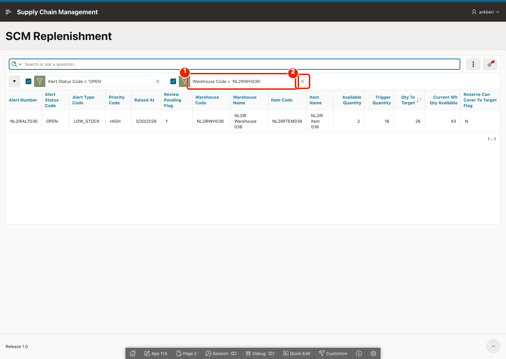

# Use Search with AI

## Introduction

This lab exercises the new AI Interactive Report search experience on the replenishment report. You will test simple filters, sorting, combined conditions, row search behavior, and chip adjustments to confirm that the report converts business language into Interactive Report actions.

Estimated Lab Time: 5 minutes

### Objectives

In this lab, you will:

- Run AI-generated filter and sort requests.
- Compare AI search behavior with row search behavior.
- Review and refine the generated report chips.

## Task 1: Run AI Search Scenarios on the Replenishment Report

This task validates that the report can interpret common SCM questions and translate them into useful report actions. The focus is on how business-friendly prompts become filters, sorts, and combinations of report chips.

1. Run the replenishment report page if it is not already open.

    

2. In the report search bar, enter the following and hit enter.

    ```
    <copy>
    Show only open replenishment alerts
    </copy>
    ```

    

3. Confirm that the report applies an `ALERT_STATUS_CODE = OPEN` filter chip.

    

4. In the same search bar, enter the following and hit enter.

    ```
    <copy>
    Sort by highest quantity to target
    </copy>
    ```

    

5. Confirm that the report applies a descending sort on `QTY_TO_TARGET`.

    

## Task 2: Review Search Modes and Applied Chips

This task helps you distinguish AI search from standard row search and shows how users can refine the generated result set after the AI has interpreted a prompt.

1. Remove the filter chip. In the search bar, enter the words *Warehouse NL2IRWH036* and hit enter.

    

2. Observe whether the report uses standard row search instead of Search with AI.

    

3. Now, remove the filter chip and enter the following AI-style prompt and hit enter.

    ```
    <copy>
    Show open alerts for warehouse NL2IRWH036
    </copy>
    ```

    

4. Confirm that the gradient AI processing indicator appears while the request is being interpreted.

    

5. Review the applied filter chips created by AI.

    

6. Remove one of the filter chip on clicking **X**.

    

7. Confirm that the result set refreshes and remains editable after the AI response.

    

## Summary

You tested Search with AI on the SCM replenishment report, compared it with row search, and reviewed the generated chips. The search experience is now validated for common SCM filter and sort requests.

## Acknowledgements

- **Author** - Ankita Beri, Senior Product Manager
- **Last Updated By/Date** - Ankita Beri, Senior Product Manager, April 2026