# Use Search with AI

## Introduction

Oracle APEX provides two distinct natural language entry points for Interactive Reports: Search with AI and the Chat Assistant. This lab focuses on the first - Search with AI. The familiar search bar now accepts natural language queries and intelligently applies the appropriate report configurations. It also preserves the existing Interactive Report behavior: entering one or two words triggers an immediate Row Search, providing continuity with existing end-user flows while enabling natural language input in the same control.

Estimated Lab Time: 5 minutes

### Objectives

In this lab, you will:

- Run AI-generated filter and sort requests.
- Compare AI search behavior with Row Search behavior.
- Review and refine the generated report chips.

## Task 1: Filter and Sort with AI Search

With all the AI configuration in place, you can now see the feature in action. When Search with AI is enabled, the gradient color in the search bar lets users know their query is being processed by AI, providing clear visual feedback. APEX interprets the natural language prompt and applies the appropriate Interactive Report actions automatically. In this task, you will test filter and sort prompts that a warehouse operations lead would use to check the morning alert queue.

1. Run the replenishment report page if it is not already open.

    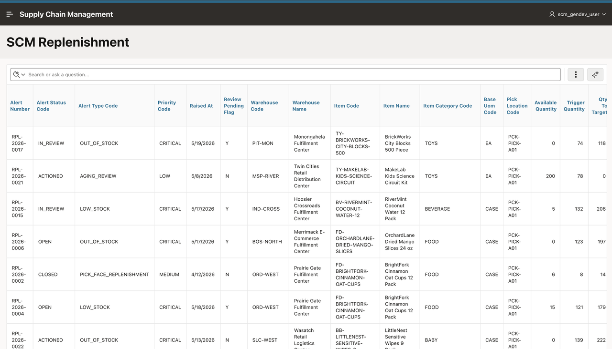

2. In the report search bar, enter the following and press **Enter**.

    ```
    <copy>
    Show only open replenishment alerts
    </copy>
    ```

    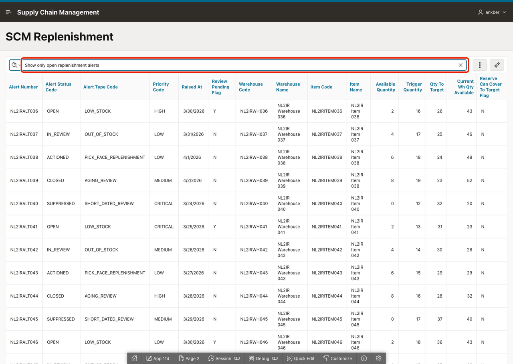

3. Confirm that the report applies a filter chip for open or in-review alerts, narrowing the list to unresolved items.

    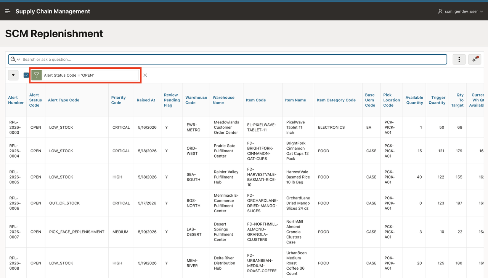

4. Remove the chip by selecting **X**.

    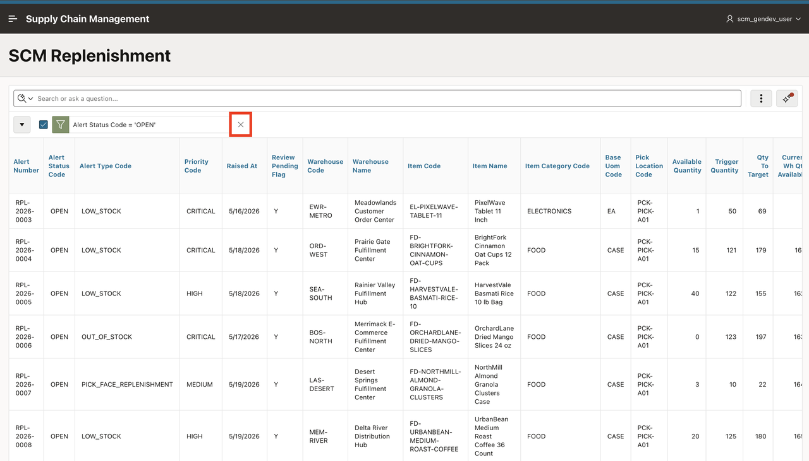

5. In the search bar, enter the following and press **Enter**.

    ```
    <copy>
    Which alerts have the largest stock gap, show the biggest first
    </copy>
    ```

    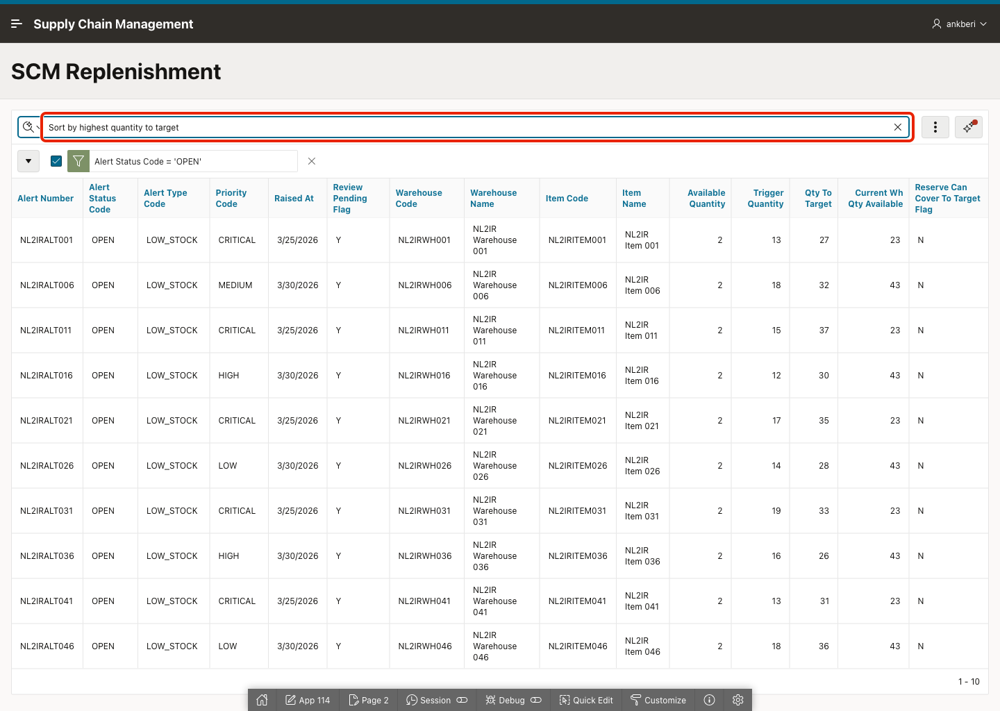

6. Confirm that the report applies a descending sort on `QTY_TO_TARGET`.

    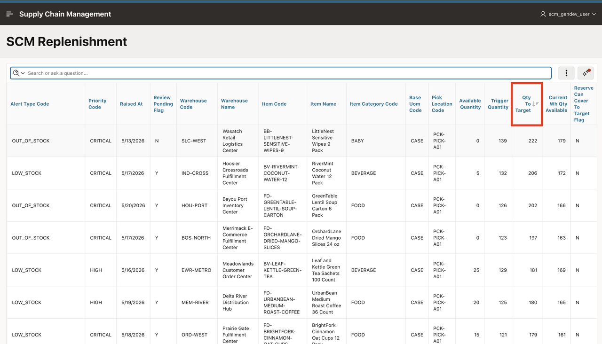

## Task 2: Compare AI Search with Row Search

The search bar supports two modes: Row Search and Search with AI. Short keyword inputs (fewer than three words) trigger an immediate Row Search, while longer natural language prompts are routed to the AI for interpretation. This design preserves the existing Interactive Report search behavior while enabling natural language input in the same control. In this task, you will compare both modes and observe how the report determines which one to apply.

1. Remove the filter chip. In the search bar, enter `PixelWave` and press **Enter**.

    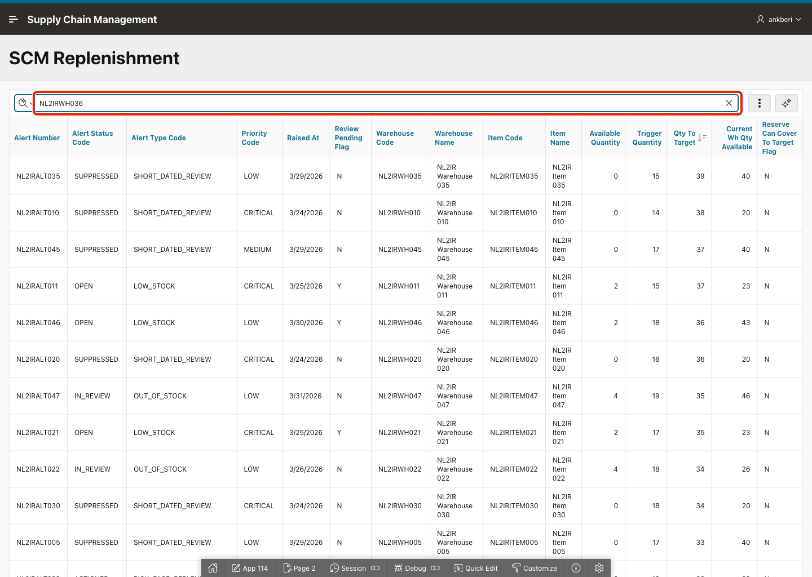

2. Observe that the report uses Row Search instead of Search with AI, because the input is fewer than three words. The report finds rows where "PixelWave" appears as text in any column.

    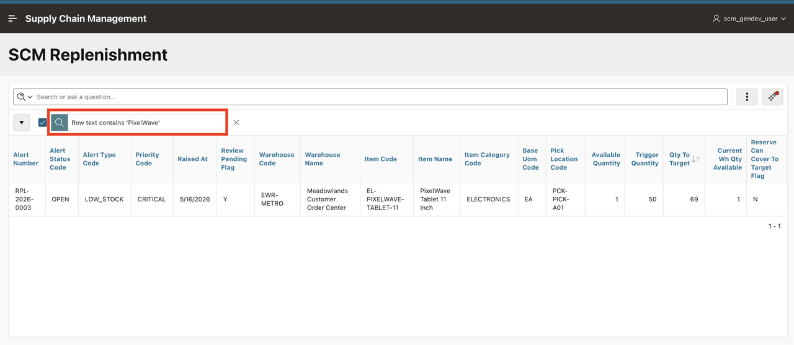

3. Now, remove the filter chip, enter the following AI-style prompt, and press **Enter**.

    ```
    <copy>
    Show me critical out of stock alerts that are still open
    </copy>
    ```

    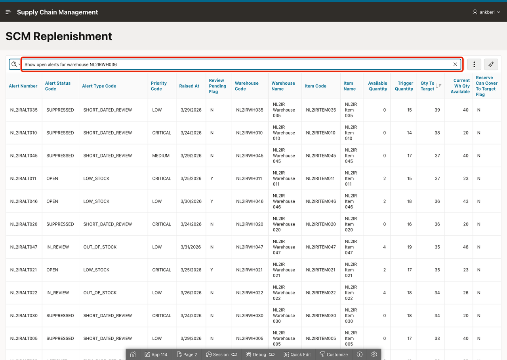

4. Confirm that the gradient AI processing indicator appears while the request is being interpreted.

    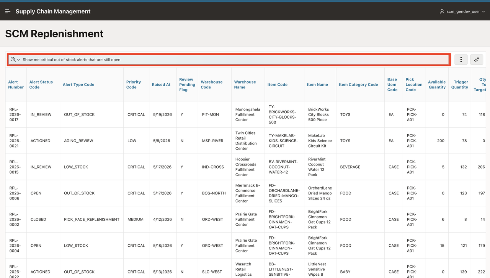

5. Review the applied filter chips created by AI. The assistant should apply filters for critical priority, out-of-stock alert type, and open status.

    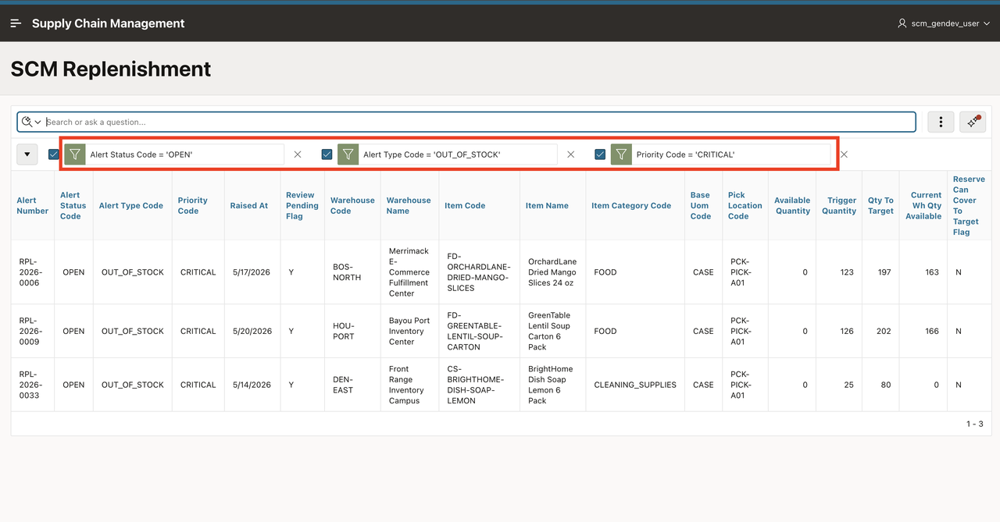

## Summary

You used Search with AI to filter and sort the replenishment report with natural language, compared it with Row Search, and refined the generated chips manually. Every configuration the AI applied was surfaced as a visible chip, making the result transparent, reviewable, and easy to adjust.

## Acknowledgements

- **Author** - Ankita Beri, Senior Product Manager
- **Last Updated By/Date** - Ankita Beri, Senior Product Manager, June 2026
