# Use the Interactive Report Chat Assistant

## Introduction

This lab uses the AI Interactive Report chat assistant to reshape the replenishment data without manually changing report settings. You will ask the assistant to group, aggregate, pivot, highlight, chart, and save views so the SCM report can support both operational users and executive review.

Estimated Lab Time: 5 minutes

### Objectives

In this lab, you will:

- Use the chat assistant to transform the replenishment report.
- Apply grouping, aggregation, pivoting, and highlighting through prompts.
- Visualize replenishment results as a chart.
- Save a reusable SCM report view.

## Task 1: Open the Assistant and Build Analytical Views

This task shows how the assistant can progressively reshape the report from a flat list into an analytical view. Each prompt builds on the previous result so you can see how conversational report design works for SCM data.

1. Run the replenishment report page and click **Assistant** to open the right-side chat panel for the Interactive Report.

    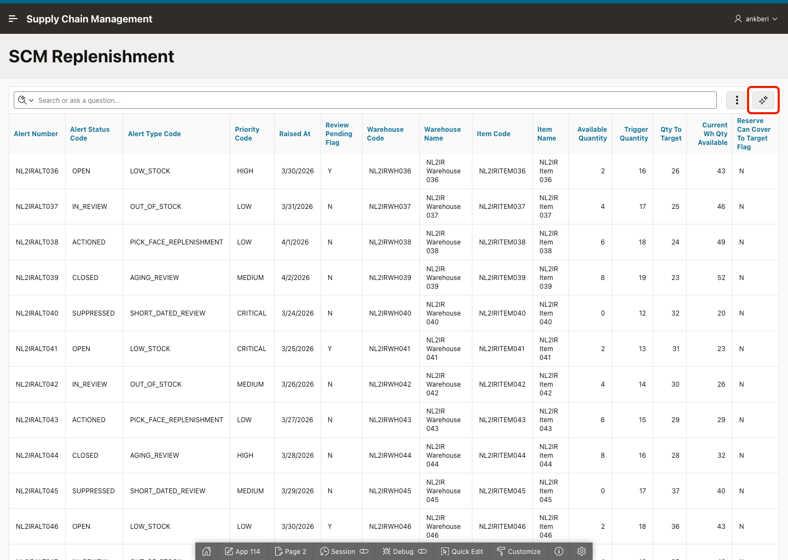

2. Enter *Group replenishment alerts by warehouse* and send the prompt.

    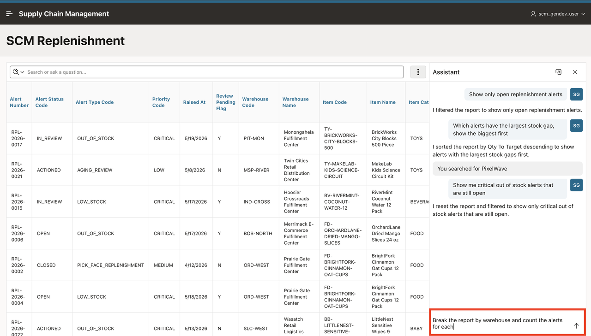

3. Confirm that a group-by chip is added for `WAREHOUSE_CODE` or `WAREHOUSE_NAME`.

    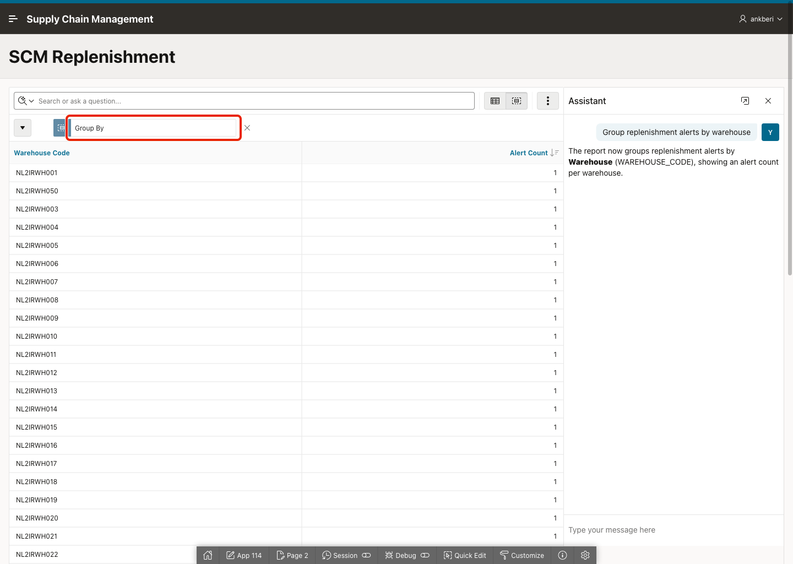

4. Enter *Show total quantity to target per warehouse* and send the prompt.

    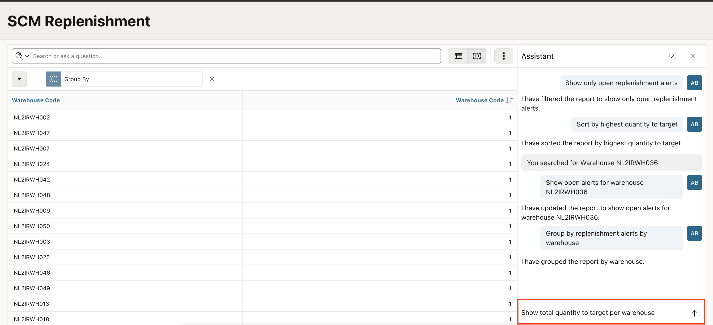

5. Confirm that an aggregate is added for `QTY_TO_TARGET`.

    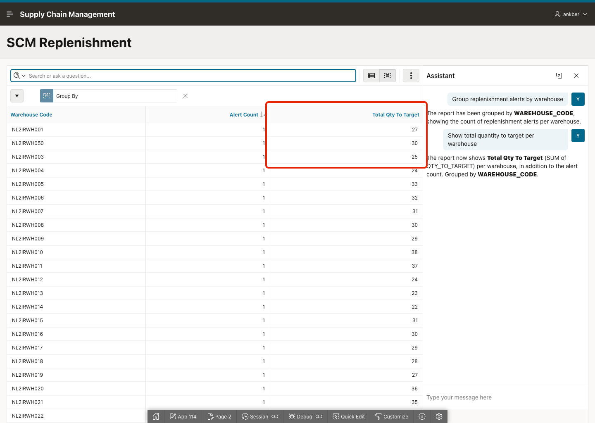

6. Enter *Create a pivot showing quantity to target by warehouse, with priorities across the top* and send the prompt.

    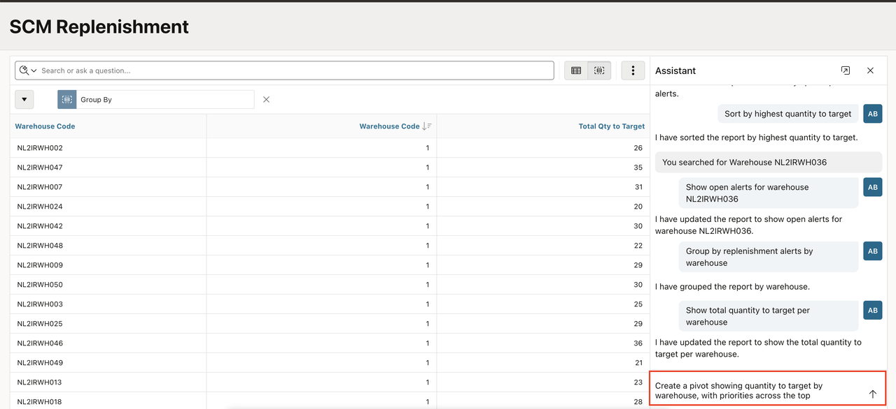

7. Review the generated pivot layout.

    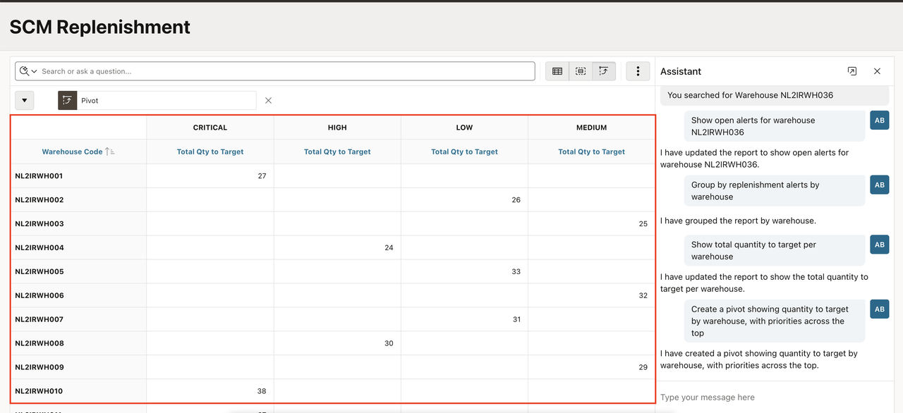

## Task 2: Highlight, Refine, Visualize, and Save the Report

This task demonstrates how the assistant can refine the same report session without starting over. You will highlight important records, narrow the business question, turn the result into a chart, and save the final layout for repeat use.

1. Enter: *Highlight rows where Qty To Target is greater than 10 in green* and send the prompt.

    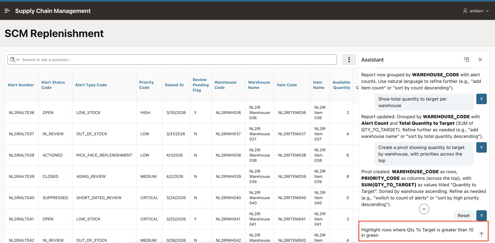

2. Confirm that the highlight rule is applied.

    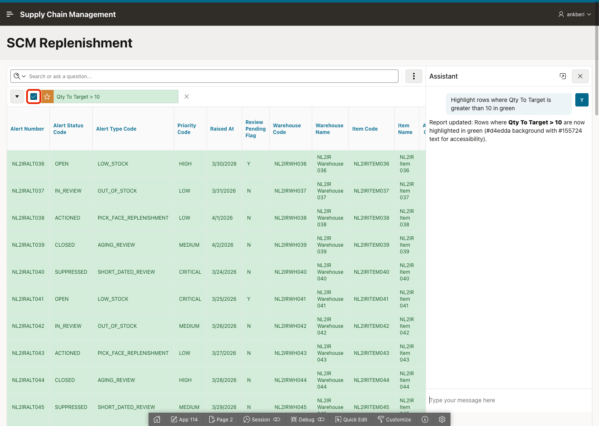

3. Enter: *Filter to only HIGH priority and OPEN alerts* and send the prompt.

    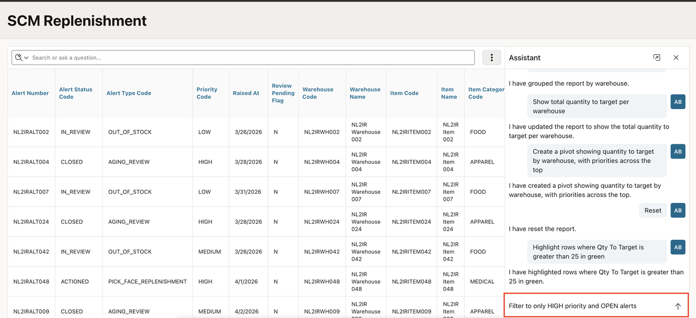

4. Confirm that the assistant adds or updates the relevant chips instead of rebuilding the report from scratch.

    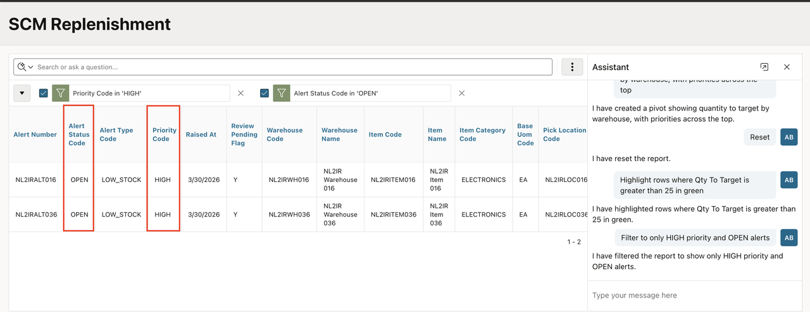

5. Enter: *Show Qty To Target by Warehouse Code as a bar chart* and send the prompt.

    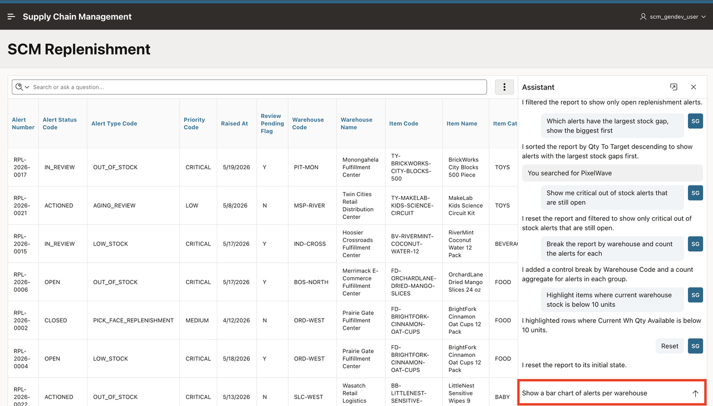

6. Confirm that the report switches to a chart-based visualization.

    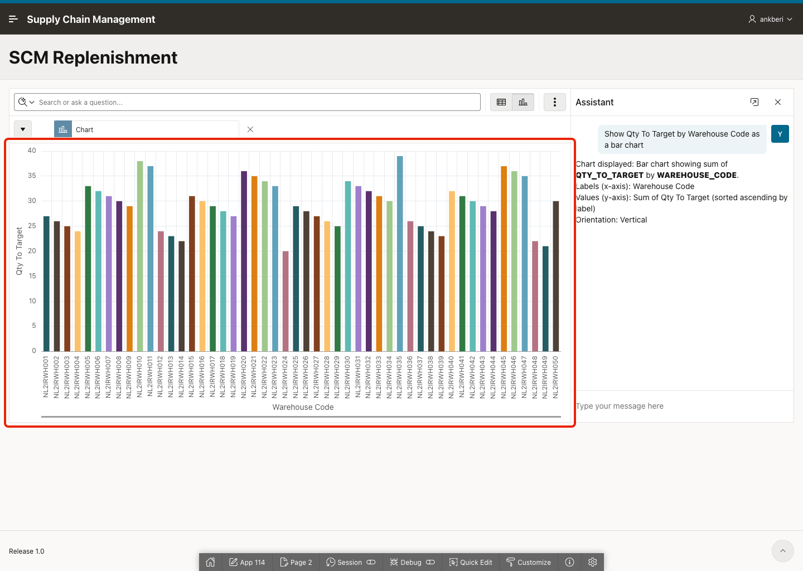

7. Enter: *Save this as Weekly Replenishment View* and send the prompt.

    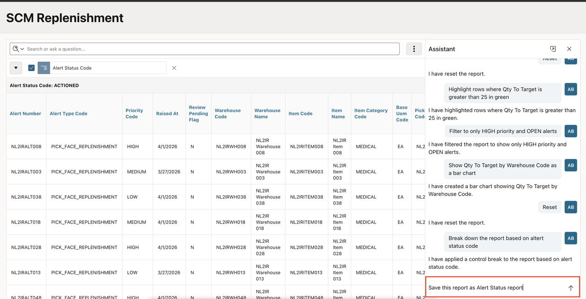

8. Confirm that the saved report appears in the available report views.

## Summary

You used the Interactive Report chat assistant to group, aggregate, pivot, highlight, filter, chart, and save an SCM replenishment report view. The report now supports both exploratory analysis and reusable business reporting.

## Acknowledgements

- **Author** - Ankita Beri, Senior Product Manager
- **Last Updated By/Date** - Ankita Beri, April, 2026
