# Enable Dictation Support

## Introduction

Oracle APEX supports browser-based dictation through the Web Speech API, allowing users to speak prompts instead of typing them. Once enabled, a microphone icon appears in the search bar and the Chat Assistant. In this lab, you will enable dictation at the application level and test voice input with the AI Interactive Report features you configured in previous labs.

Estimated Lab Time: 5 minutes

### Objectives

In this lab, you learn how to:

- Enable dictation in the application security settings.
- Use voice input to filter a report with Search with AI.
- Use voice input to configure a report with the Chat Assistant.

### Prerequisites

- Completed Labs 1 through 6.
- A browser that supports the Web Speech API (Chrome, Edge, or Safari).
- A working microphone connected to your device.

## Task 1: Enable Dictation in the Application Definition

Dictation is disabled by default because speech may be processed by third-party servers depending on the browser. In this task, you will enable dictation in the application security settings so the microphone icon appears in the search bar and Chat Assistant.

1. From the App Builder home page, open the **Supply Chain Management** application. On the Application home page, select **Shared Components**.

    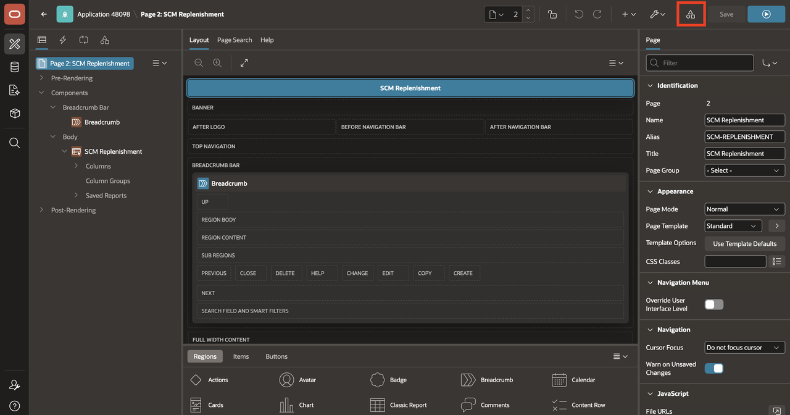

2. Under Security, select **Security Attributes**.

    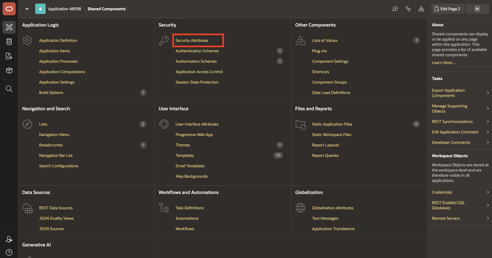

3. Select the **Browser Security** tab. Toggle **Enable Dictation** on.

    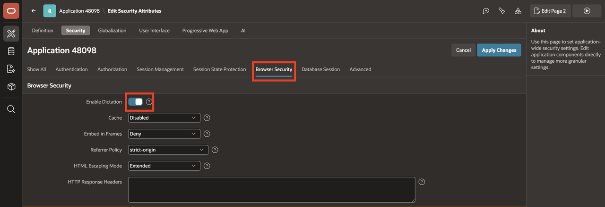

4. Select **Apply Changes**.

    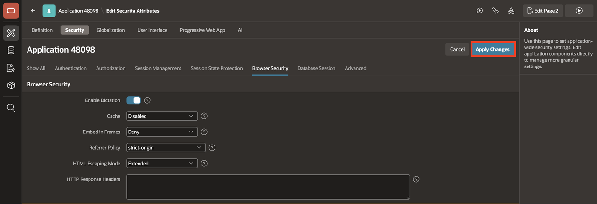

5. Select the **Run** icon to run the application.

    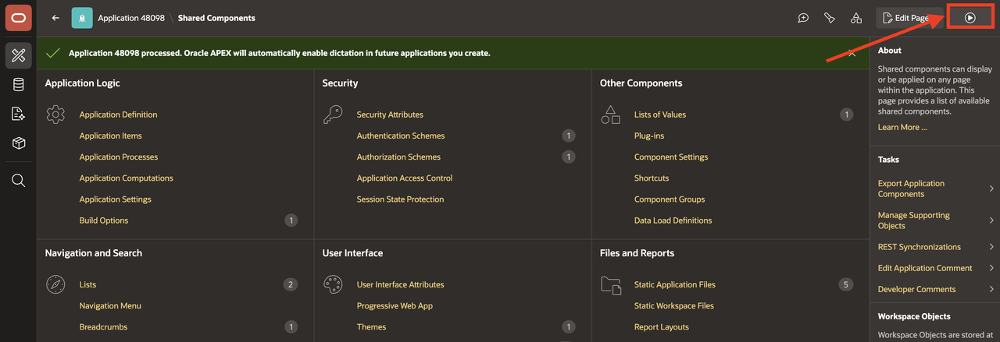

    > **Note:** Dictation must also be enabled at the instance level for this application setting to take effect. If the setting is not visible or cannot be changed, contact your Workspace administrator.

## Task 2: Use Dictation with Search with AI

With dictation enabled, a microphone icon now appears in the Interactive Report search bar. In this task, you will speak a search prompt and confirm that the AI applies the same report actions it would for typed input.

1. Run the **SCM Replenishment** report page.

2. In the report search bar, select the **microphone** icon to start dictation.

    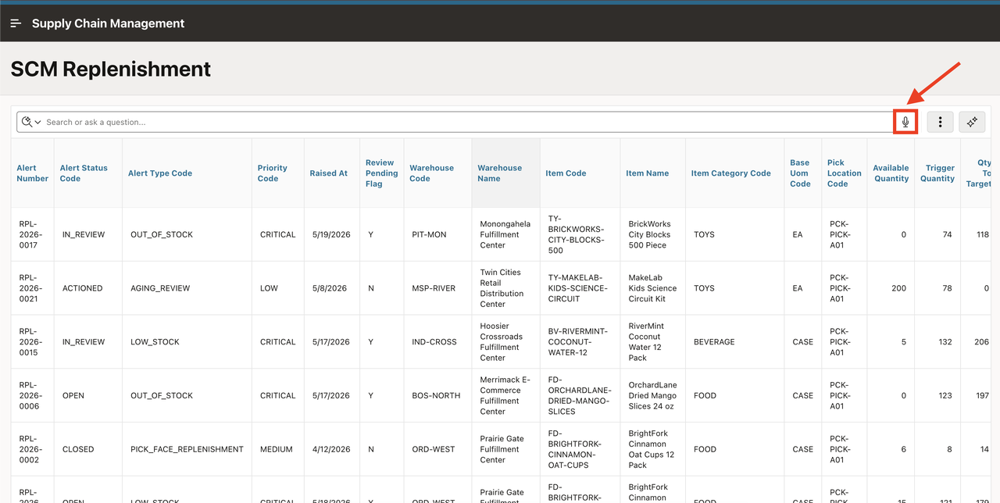

3. If the browser asks for permission to use your microphone, select **Allow**.

    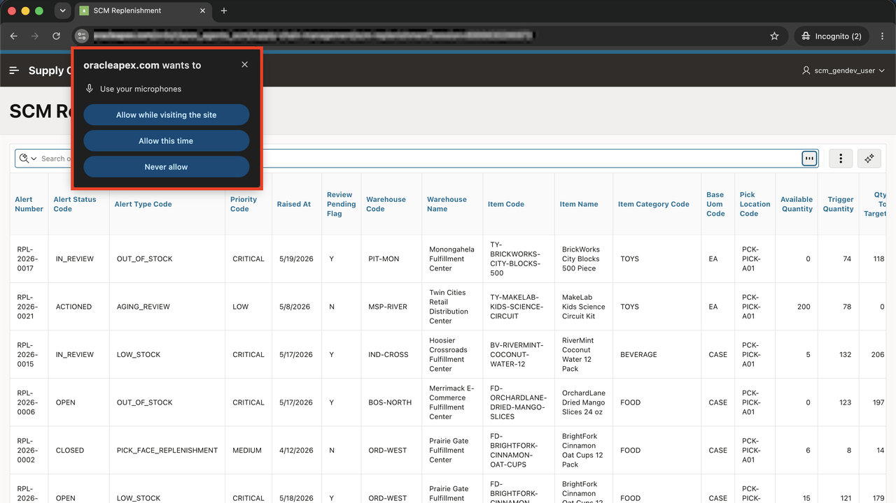

4. Speak a prompt such as:

    ```
    <copy>
    Show me all open alerts with high priority
    </copy>
    ```

    This prompt asks the AI to filter the report to only show alerts that have an open status and a high priority level.

5. After you finish speaking, the browser transcribes your speech into the search bar and submits the prompt. Confirm that the report applies the expected filter chips, just as it would with a typed prompt.

    [Dictation with the Chat Assistant](videohub:1_assssdui)

    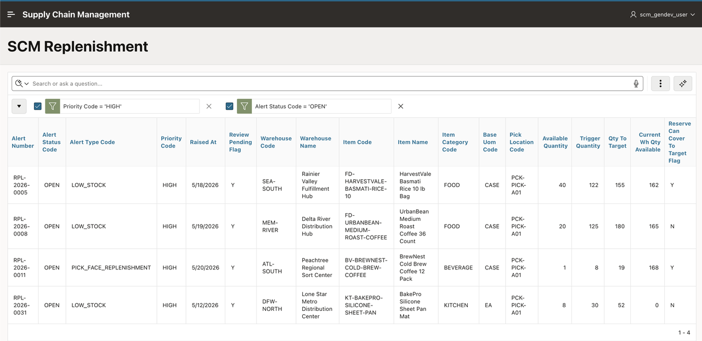

## Task 3: Use Dictation with the Chat Assistant

The microphone icon also appears in the Chat Assistant. In this task, you will speak a Group By prompt and confirm that the Assistant applies the report action from voice input.

1. Reset the report or close any filter chips applied in the previous task.

    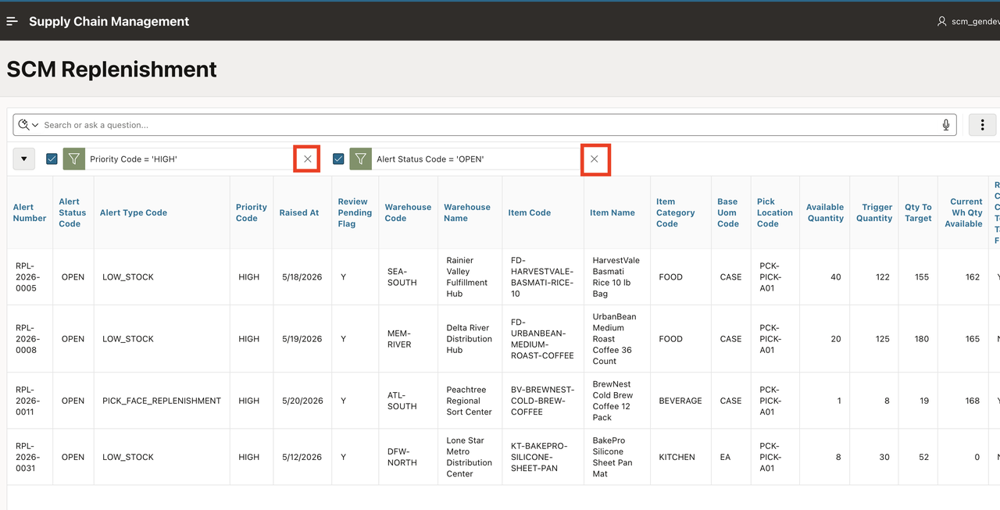

2. Select the **Assistant** icon to open the chat panel.

    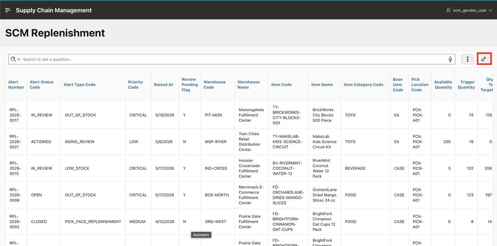

3. In the chat input field, select the **microphone** icon to start dictation.

    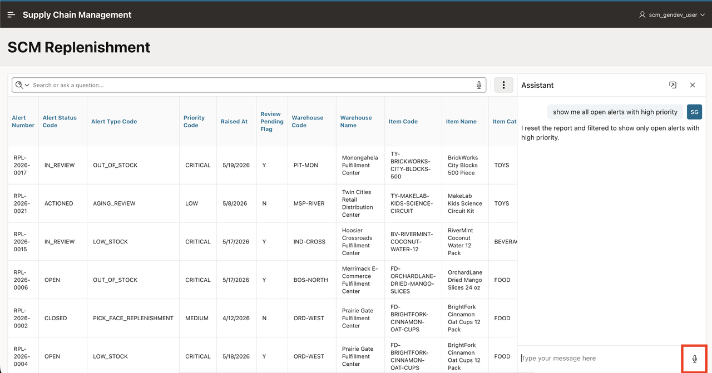

4. Speak a prompt such as:

    ```
    <copy>
    Which product lines generate the most alerts? Group by item category
    </copy>
    ```

    This prompt asks the Assistant to group the report by item category and count the alerts in each group, creating a summary view of alert volume by product line.

5. The browser transcribes your speech into the chat input field.
Select the **microphone** icon again to stop transcription, then press **Enter** or select the **Send Message** button to submit the prompt. Confirm that the Chat Assistant groups the report by item category with a count of alerts.

    [Dictation with Search with AI](videohub:1_bfqd2ni0)

    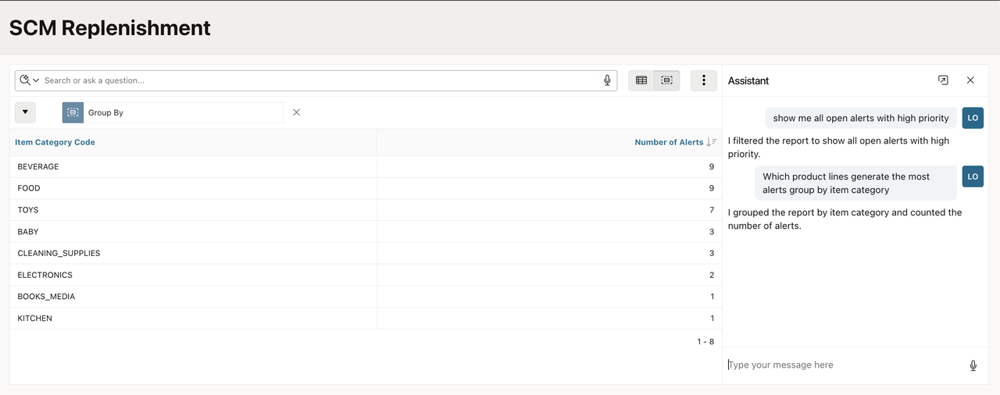

## Summary

You enabled dictation in the application security settings, used voice input to filter the replenishment report with Search with AI, and spoke a Group By prompt through the Chat Assistant. Both entry points process spoken input the same way they process typed text, giving users a hands-free option for interacting with AI Interactive Reports.

## Acknowledgements

- **Author** - Sahaana Manavalan, Senior Product Manager
- **Last Updated By/Date** - Sahaana Manavalan, Senior Product Manager, June 2026
