# Create a Supply Chain Management Application

## Introduction

This lab sets up the application and data foundation for the rest of the workshop. You will load the SCM data model and sample data, create the Supply Chain Management application, review the installed database objects, and refresh the data dictionary. These steps ensure that the schema, reference data, and APEX metadata are all in place before you begin configuring AI features.

Estimated Lab Time: 5 minutes

### Objectives

In this lab, you will:

- Set up the SCM data model.
- Load the reference data and operational data.
- Create a Supply Chain Management application in your workspace.
- Review the sample SCM objects and confirm the application shell is ready.

## Task 1: Set Up the Data Model

> **Note:** If you have already completed **Lab 1: Import the Data Model, Sample Data, and Base Application** in the *AI Agents* workshop using the same workspace, the data model and sample data are already loaded. You can skip **Task 1** and **Task 2** and proceed directly to **Task 3: Create a Supply Chain Management Application**.

Every AI Interactive Report feature in this workshop depends on a well-structured schema. In this task, you will upload and run the data model script that creates the warehouse tables, views, and the replenishment view (`SCM_REPLENISHMENT_V`). This view serves as the source for the Interactive Report you will build in Lab 3, and its column structure is what APEX shares with the LLM as report metadata when processing natural language prompts. The data model is compatible with Oracle Database 19c and later.

1. Download the [01\_SCM\_INV\_WMS\_DATAMODEL.sql](files/01_SCM_INV_WMS_DATAMODEL.sql) file to your local machine.

2. Sign in to your Oracle APEX workspace using the credentials provided for this workshop.

    

3. From the Oracle APEX Home page, select **SQL Workshop**.

    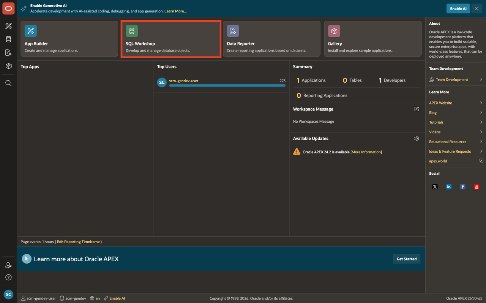

4. From the **SQL Workshop** page, select **SQL Scripts**.

    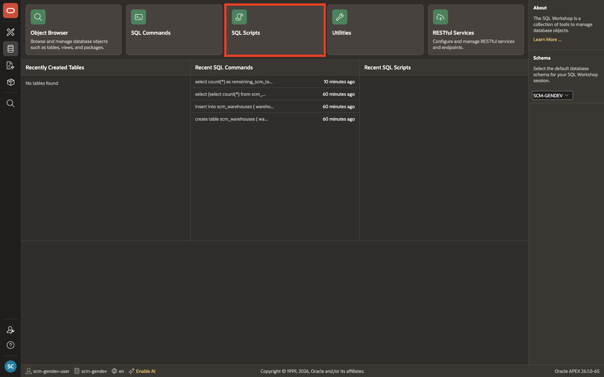

5. Select **Upload**.

    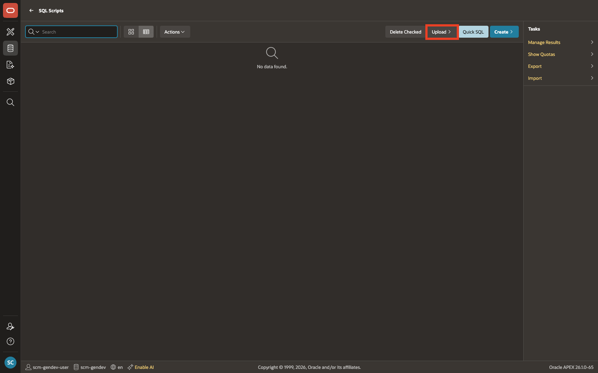

6. In the **Upload Script** dialog, select the downloaded file, enter **`scm_data_model`** for **Script Name**, and select **Upload**.

    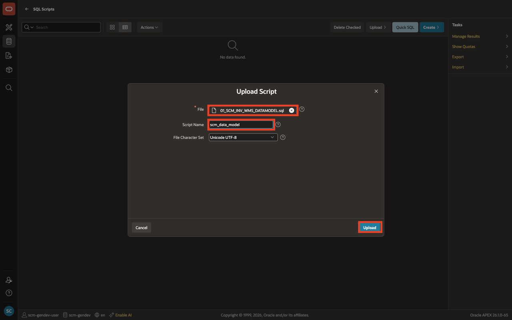

7. In the row for **`scm_data_model`**, select **Run**.

    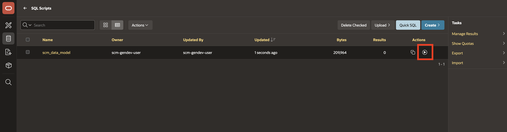

8. On the confirmation page, select **Run**.

    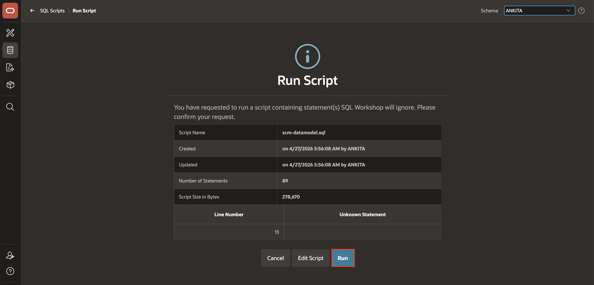

9. Verify that the script completes successfully with 0 errors.

    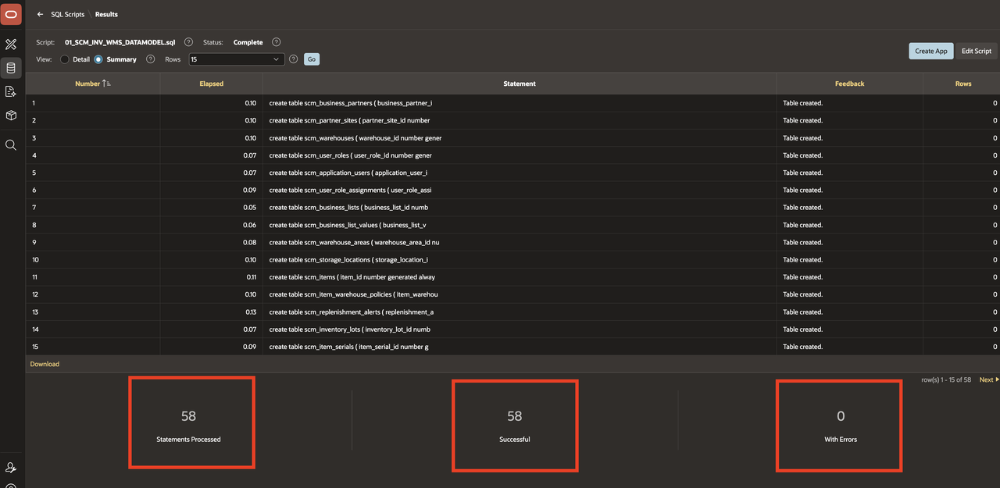

## Task 2: Load the Sample Data

With the schema in place, you now need data to work with. In this task, you will load two scripts that populate the model with realistic SCM data. The first script loads reference data: 20 warehouses, 200 items across multiple product categories, suppliers, and inventory balances. The second loads operational data: replenishment alerts, inbound receipts, and supplier delivery history. This is the dataset that the Interactive Report will display, and that you will query using natural language in Labs 5, 6, and 7.

1. Download both sample data files to your local machine:

    - [02\_SCM\_INV\_WMS\_SAMPLE\_DATALOAD.sql](files/02_SCM_INV_WMS_SAMPLE_DATALOAD.sql)
    - [03\_SCM\_INV\_WMS\_OPERATIONAL\_DATALOAD.sql](files/03_SCM_INV_WMS_OPERATIONAL_DATALOAD.sql)

2. In the top breadcrumb, select **SQL Scripts**.

    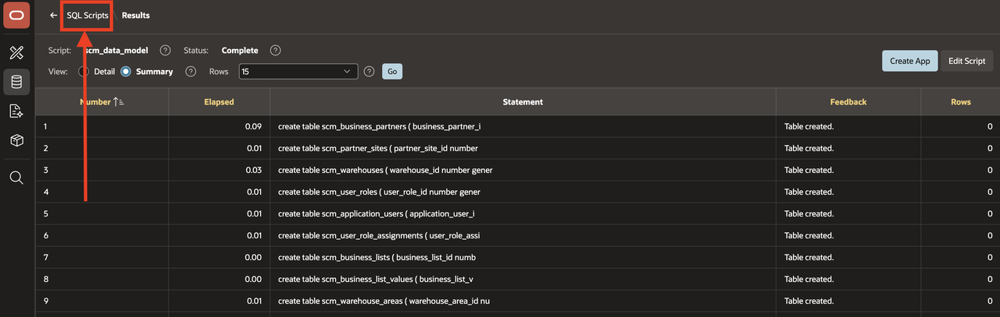

3. Select **Upload**.

    

4. In the **Upload Script** dialog, select or drag and drop the downloaded **`02_SCM_INV_WMS_SAMPLE_DATALOAD.sql`** file, enter **`scm_sample_data1`** for **Script Name**, and select **Upload**.

    

5. In the row for **`scm_sample_data1`**, select **Run**.

    

6. On the confirmation page, select **Run**.

    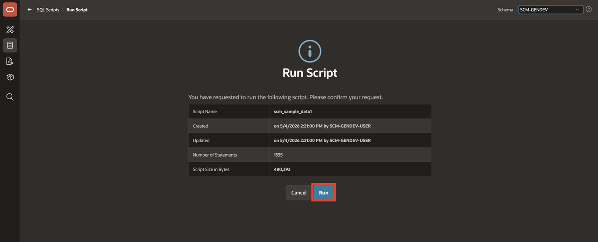

7. Verify that the script completes successfully with 0 errors.

    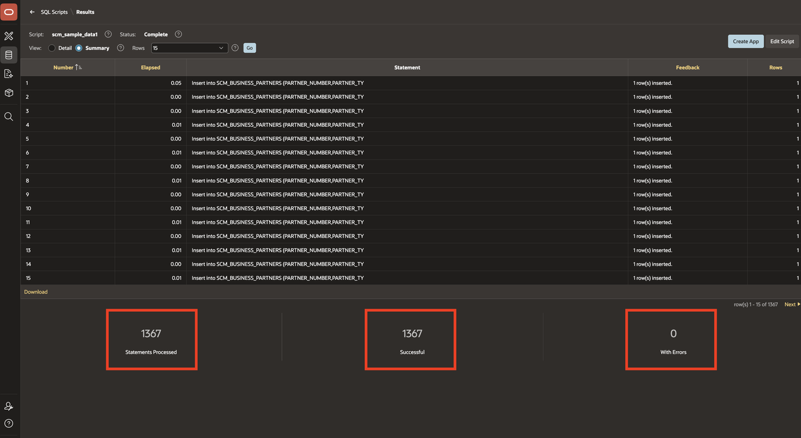

8. In the top breadcrumb, select **SQL Scripts**.

    

9. Select **Upload** again.

    

10. In the **Upload Script** dialog, select or drag and drop the downloaded **`03_SCM_INV_WMS_OPERATIONAL_DATALOAD.sql`** file, enter **`scm_sample_data2`** for **Script Name**, and select **Upload**.

    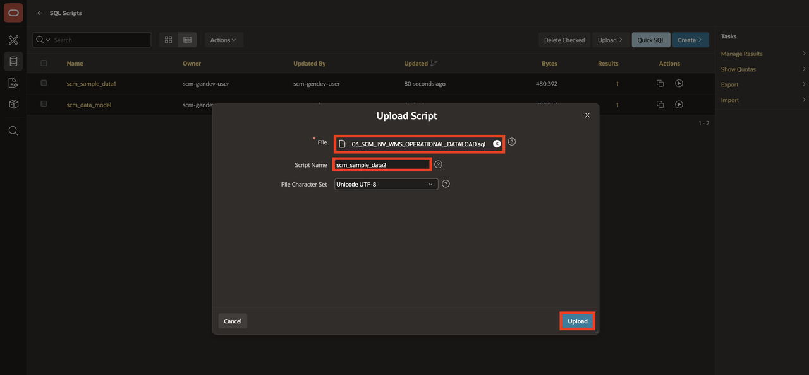

11. In the row for **`scm_sample_data2`**, select **Run**.

    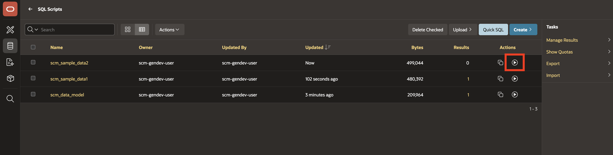

12. On the confirmation page, select **Run**.

    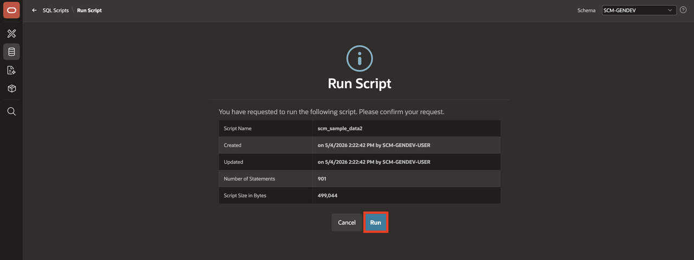

13. Verify that the script completes successfully with 0 errors.

    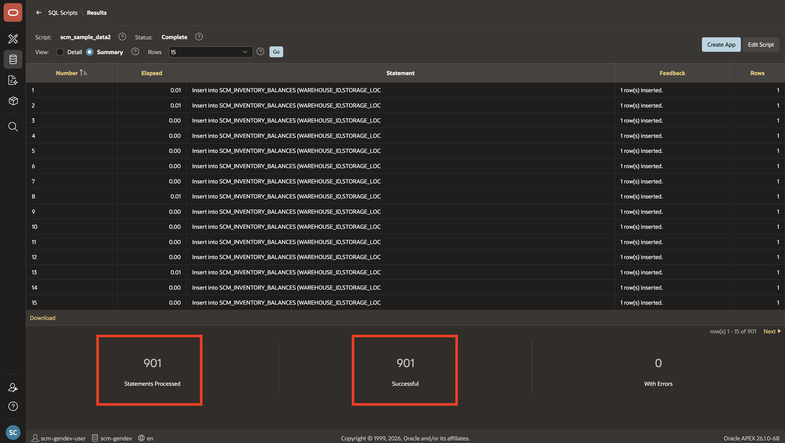

## Task 3: Create a Supply Chain Management Application

With the schema and data in place, you now need an APEX application to host the AI Interactive Report. In this task, you will create a new application in App Builder. This application serves as the container where you will configure the Generative AI service, build the report page, and enable all the natural language features in the following labs.

1. From the left navigation, select the **App Builder** icon.

    

2. On the **App Builder** page, click **Create** and start a new application.

    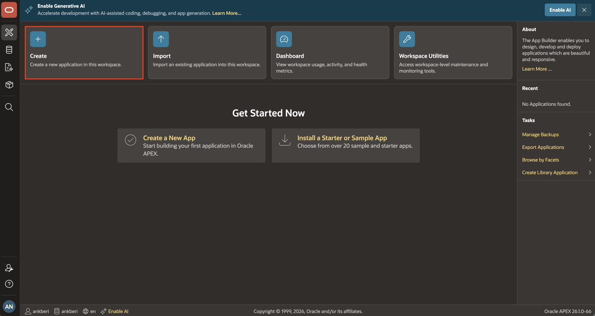

3. In the **Name** field, enter **Supply Chain Management**.

    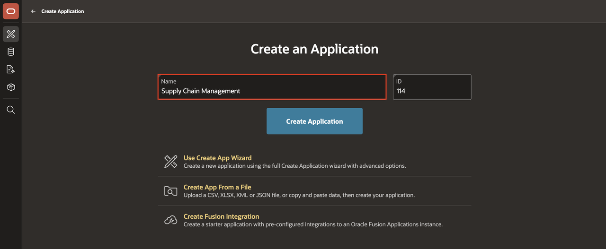

4. Click **Create Application**.

    

5. Confirm that the new application appears in **App Builder**.

    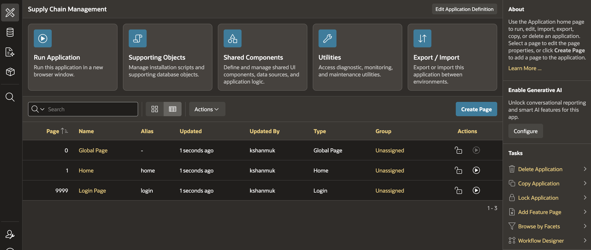

## Task 4: Review the Database Objects

Before moving on, it is worth confirming that the setup scripts created the expected objects. In this task, you will open Object Browser and verify that the SCM tables and views are present in your schema. This quick check ensures everything is in place before you start configuring AI features.

1. Navigate to **SQL Workshop** icon , and then click **Object Browser**.

    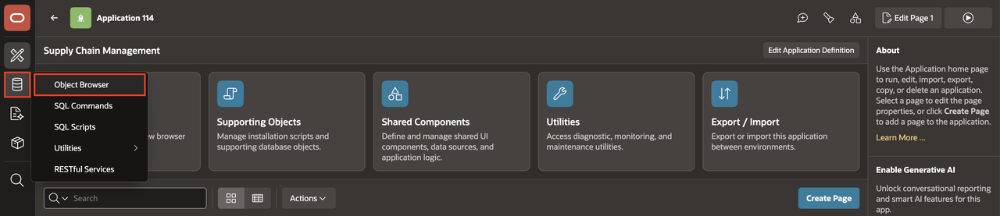

2. Review the installed SCM objects that support replenishment reporting, by searching with SCM_ in your Object Browser to list the core tables and views created by the setup scripts.

    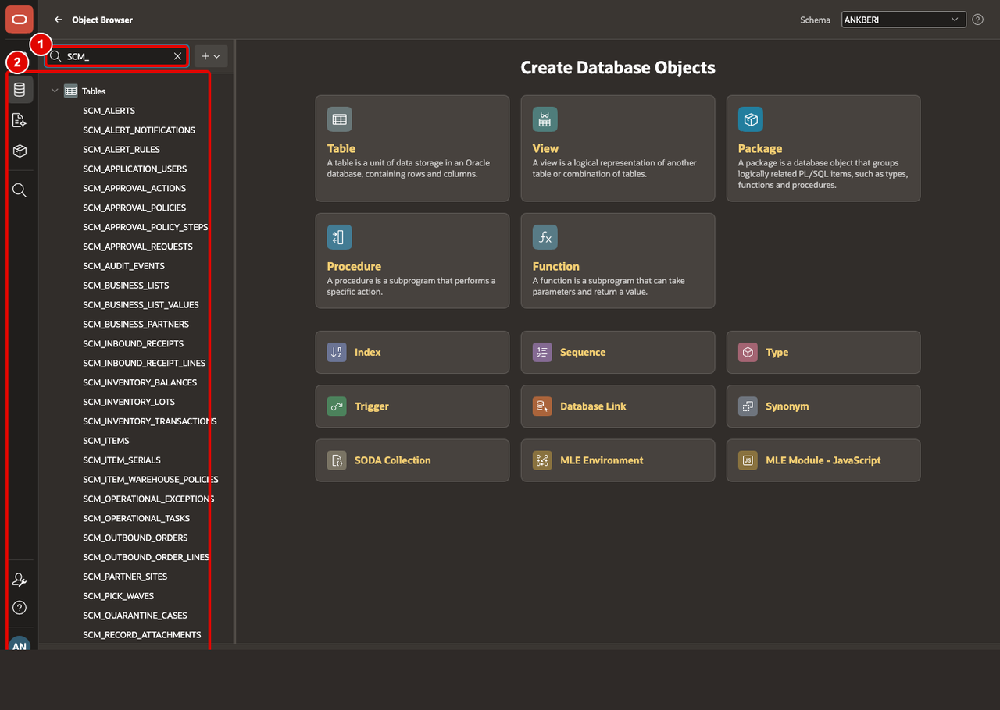

## Task 5: Refresh Data Dictionary

When tables and views are created, the database updates instantly, but the APEX metadata cache does not. Without a refresh, the new SCM objects may not appear in page wizards, LOV queries, or the natural language report builder. In this task, you will refresh the Data Dictionary so APEX recognizes the new schema objects and can include them when generating pages or processing natural language prompts.

1. To refresh database objects, click APEX **Administration** icon from the left menu above your user profile. Then select **Manage Service > Manage Service**.

    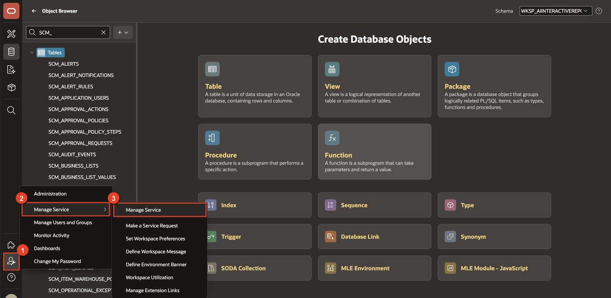

2. On the right-hand side, under **Manage Meta Data**, select **Data Dictionary Cache**.

    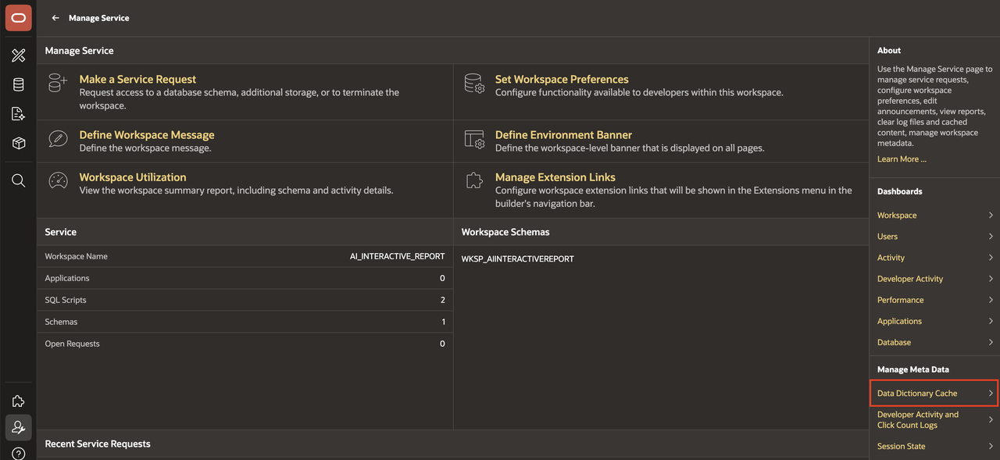

3. To refresh the cache manually, click **Refresh Cache Only**.

    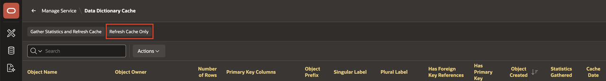

4. Verify that the cache refresh completes successfully.

    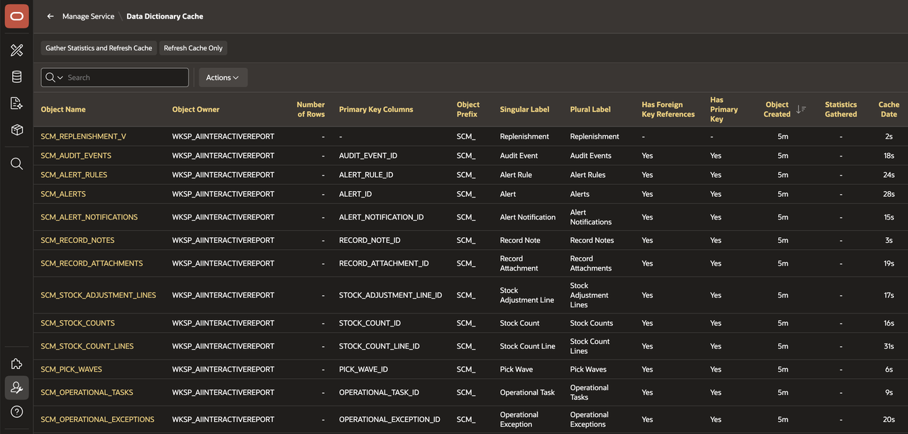

## Summary

You loaded the SCM data model and sample data, created the Supply Chain Management application, and verified that the required database objects are available. The application and data foundation are now ready for Generative AI configuration in the next lab.

## Acknowledgements

- **Author** - Ankita Beri, Senior Product Manager
- **Last Updated By/Date** - Ankita Beri, Senior Product Manager, June 2026
