# Configure Generative AI Service

## Introduction

Oracle APEX uses a Large Language Model (LLM) to interpret natural language prompts and convert them into trusted, declarative report settings. Before you can use AI Interactive Report features, you need to connect APEX to a Generative AI provider. In this lab, you will generate or gather the provider credentials, configure a workspace-level Generative AI Service, and link that service to the application. Once configured, APEX shares only report metadata and configuration context with the LLM - your business data never leaves your environment.

> **Important:** Oracle APEX acts as the application layer and connects to the Generative AI provider of your choice using your own credentials. You will need an active account with a supported provider to complete this lab. Any charges for API usage are billed directly by your AI provider. Please review your provider's pricing before proceeding.

Estimated Lab Time: 5 minutes

### Objectives

In this lab, you will:

- Generate or gather provider credentials

- Configure a Generative AI Service in your APEX workspace

- Link the Generative AI Service to the application

<if type="OCIGenAI">

## Task 1: Generate OCI API Keys

In this task, you will generate the OCI API key details needed to configure OCI Generative AI Service in APEX. If you already have an OCI key pair and configuration details, you may skip this task.

1. Log in to your OCI account.

    

2. Click **Profile** at the top-right corner and select your user name.

    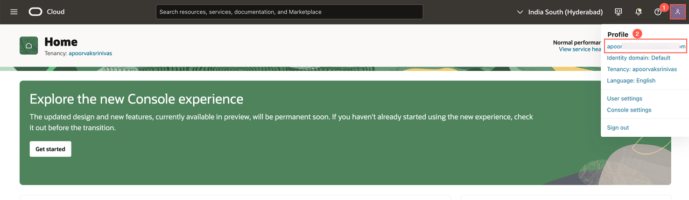

3. Open the **Tokens and keys** tab, then click **Add API key**.

    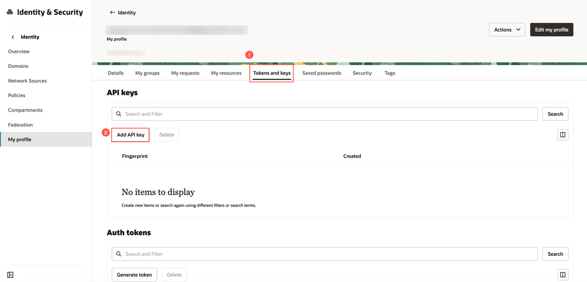

4. In the **Add API Key** dialog, select **Generate API Key Pair**.

5. Click **Download Private Key**. A `.pem` file is saved to your local machine. You do not need to download the public key.

6. Click **Add**.

    

7. Copy and save the configuration file preview. You will use these values when configuring the Generative AI Service in APEX.

    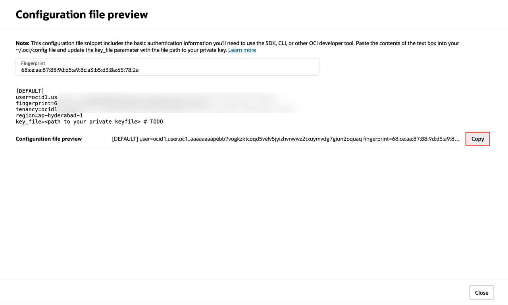

## Task 2: Configure Generative AI Service

In this task, you will configure OCI Generative AI Service in your APEX workspace.

1. To configure the Generative AI service in your workspace, navigate to Oracle APEX Homepage from the left navigation menu and click **Enable AI** in the top navigation bar. This option appears only if no AI service has been configured yet.

    Alternatively, from the workspace home page, navigate to **App Builder > Workspace Utilities > Generative AI** to access the configuration settings.

    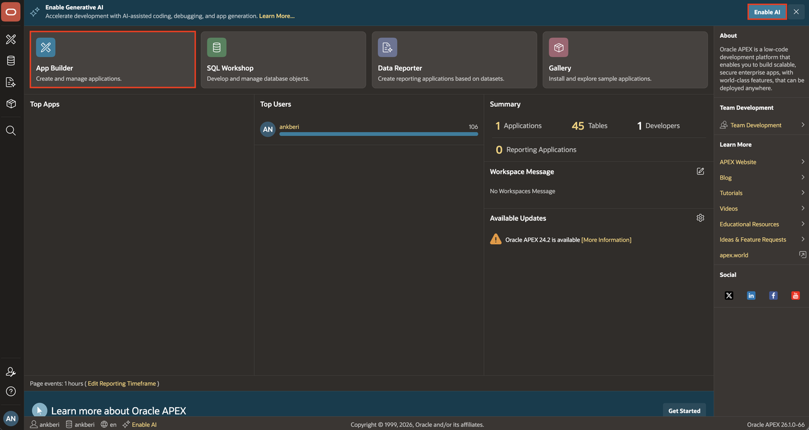

    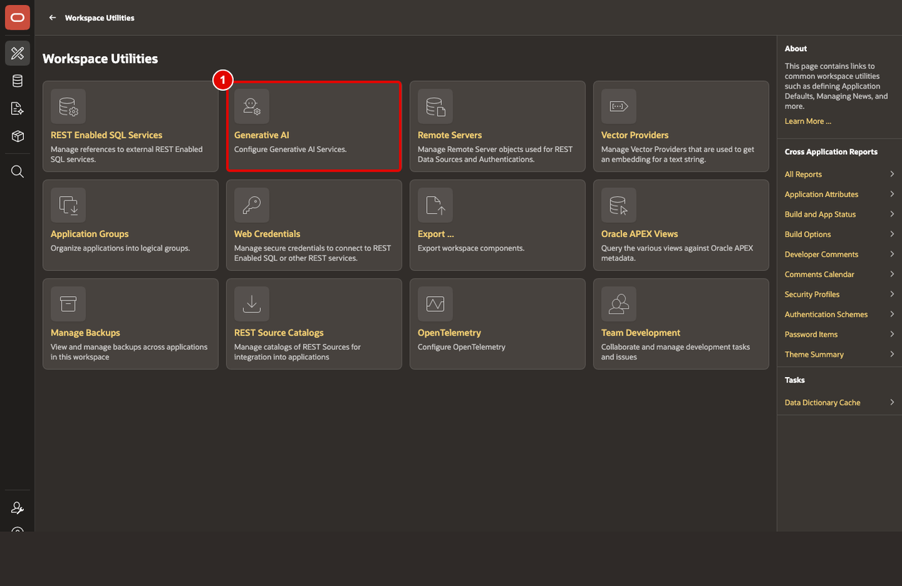

2. Click **Create**.

    

3. On the **Create Generative AI Service** page, enter/select the following:

    - AI Provider: **OCI Generative AI Service**
    - Name: **OCI Gen AI**
    - Compartment ID: Enter your OCI Compartment ID.
    - Region: Enter your OCI region. (Currently, the OCI Generative AI Service is only available in limited regions.)
    - Model ID: **meta.llama-3.3-70b-instruct** (The pre-trained models are frequently deprecated. Refer to the [documentation](https://docs.oracle.com/en-us/iaas/Content/generative-ai/pretrained-models.htm#pretrained-models) for the latest pre-trained models.)
    - Used by App Builder: Toggle **On**
    - Base URL: Leave the auto-generated value unchanged.
    - Credential: Select an existing OCI credential if one is already available in your workspace. Otherwise, create a new OCI credential using the configuration details from Task 1.

    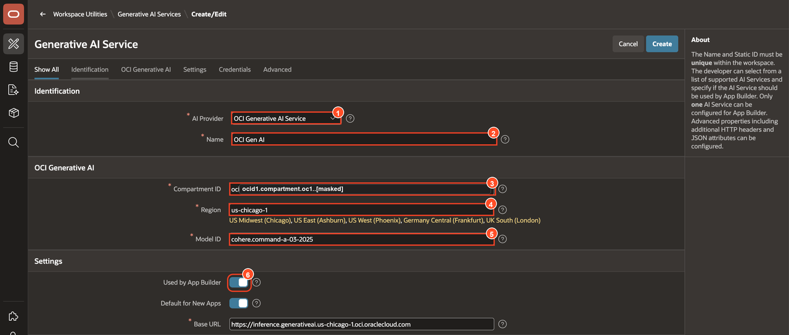

    

4. Click **Test Connection**.

5. If the connection is successful, click **Create**.
    If unsuccessful, verify if you have configured the IAM Policy on OCI correctly. Refer to the [Identity and Access Management](https://livelabs.oracle.com/pls/apex/r/dbpm/livelabs/run-workshop?p210_wid=624&p210_wec) workshop for more details.

    

</if>

<if type="OpenAI">

## Task 1: Generate an OpenAI API Key

In this task, you will create an OpenAI API key to configure OpenAI as the Generative AI provider in APEX. If you already have an OpenAI API key, you may skip this task.

1. Create and log in to your [OpenAI account](https://platform.openai.com/).

    

2. Navigate to the [API keys](https://platform.openai.com/settings/organization/api-keys) page and create a new secret key.

    

3. Copy and save the secret key. You will use it when you configure the Generative AI Service in APEX.

    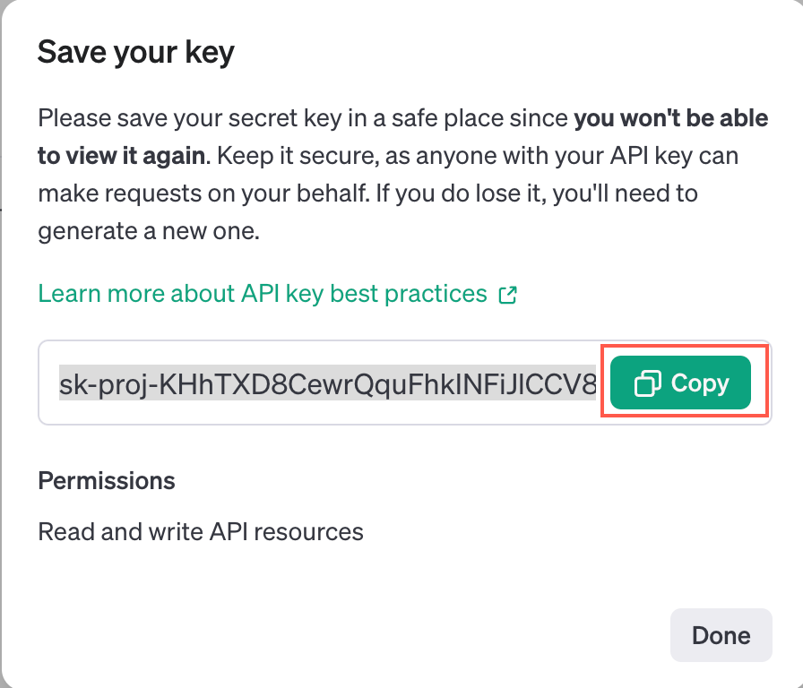

## Task 2: Configure Generative AI Service

In this task, you will configure OpenAI as a Generative AI Service in your APEX workspace.

1. To configure the Generative AI service in your workspace, navigate to Oracle APEX Homepage from the left navigation menu and click **Enable AI** in the top navigation bar. This option appears only if no AI service has been configured yet.

    Alternatively, from the workspace home page, navigate to **App Builder > Workspace Utilities > Generative AI** to access the configuration settings.

    

    

2. Click **Create**.

    

3. On the **Create Generative AI Service** page, enter/select the following:

    - AI Provider: **Open AI**
    - Name: **Open AI**
    - Used by App Builder: Toggle **On**
    - API Key: Enter the OpenAI API key you created in Task 1.
    - AI Model: Enter the OpenAI model you want to use for this workshop.

    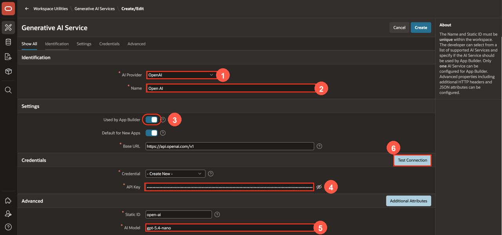

4. Click **Test Connection**.

5. If the connection is successful, select **Create**.

    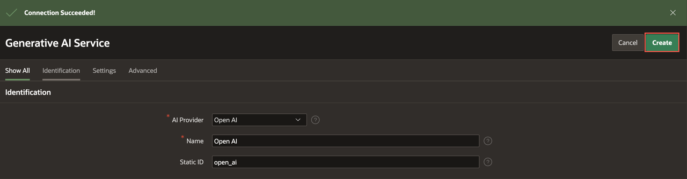

</if>

## Task 3: Link Your Generative AI Service to the Application

In this task, you will link the Generative AI Service you configured in Task 2 to the SCM application. The steps are the same for either provider.

1. From the **Generative AI Services** page, select the **App Builder** icon in the left navigation.

    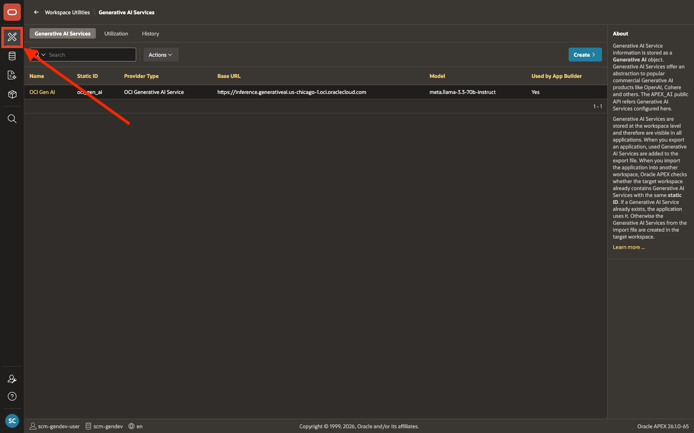

2. Select the **Supply Chain Management** application from the App Builder applications list.

    

3. On the application home page, select **Shared Components**.

    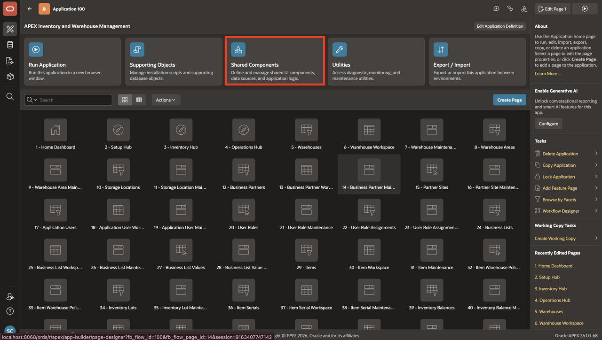

4. From **Shared Components**, select **AI Attributes**.

    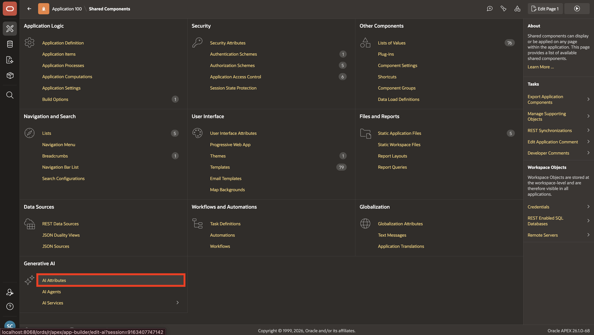

5. For **Generative AI Service**, select the service you configured earlier in this lab, then select **Apply Changes**.

    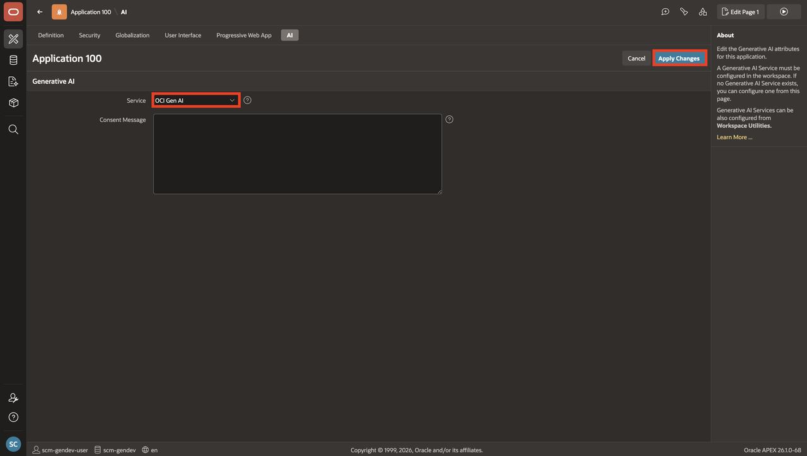

## Summary

The Generative AI Service is now configured and linked to the application. APEX can now send report metadata to the LLM when processing natural language prompts. You are ready to create the AI Interactive Report in the next lab.

You may now **proceed to the next lab**.

## Acknowledgements

- **Author** - Ankita Beri, Senior Product Manager
- **Last Updated By/Date** - Ankita Beri, Senior Product Manager, June 2026
