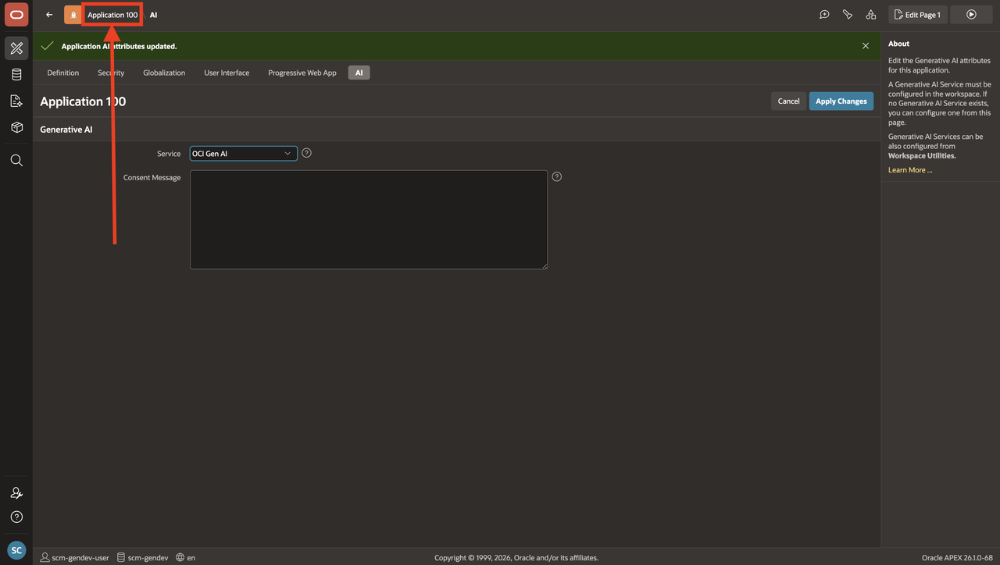
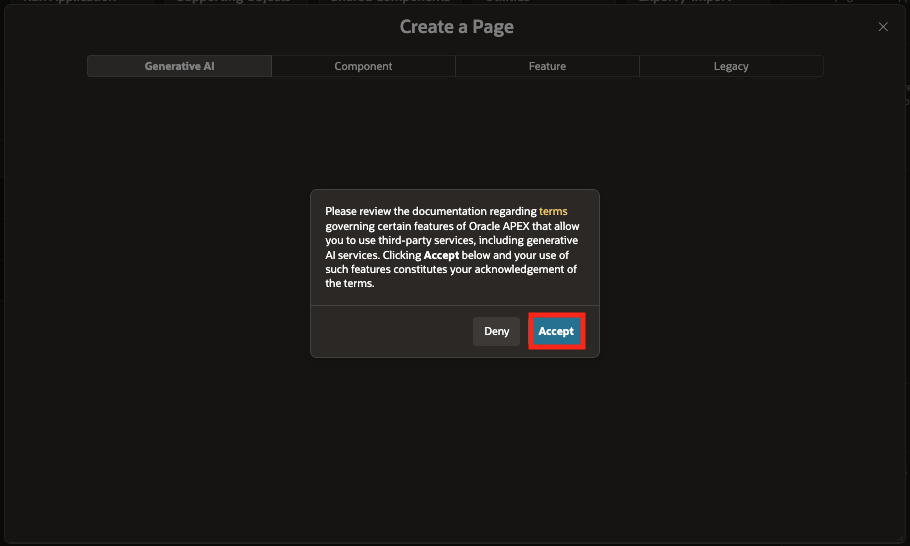
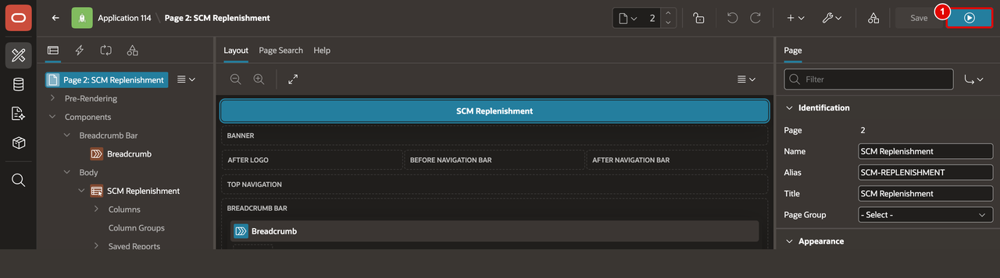
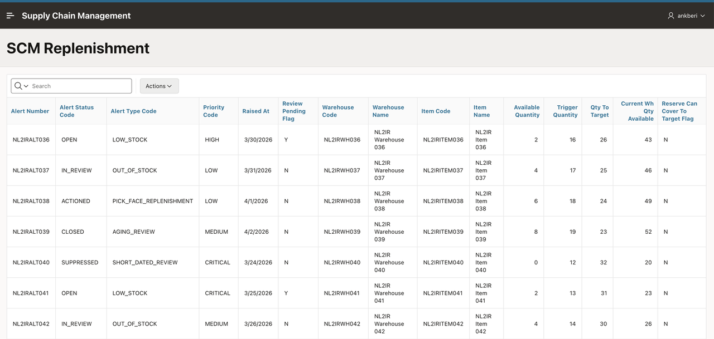
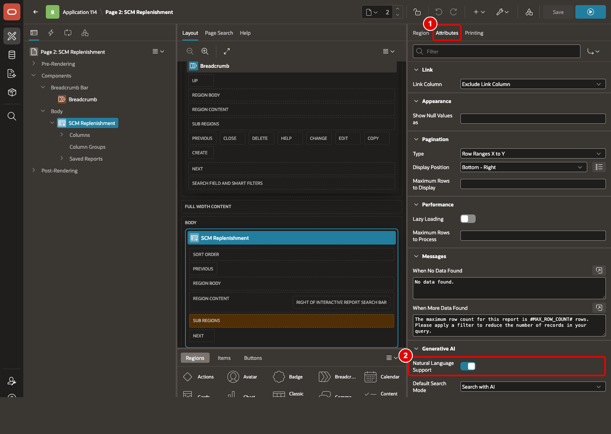
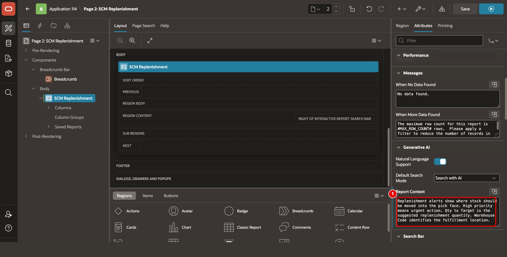
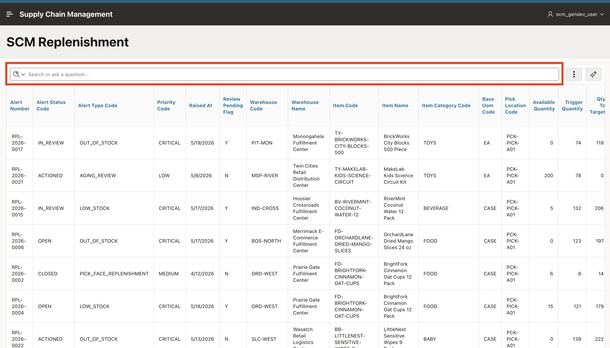

# Create an Interactive Report Using Natural Language

## Introduction

This lab creates the core replenishment report used throughout the rest of the workshop. With `SCM_REPLENISHMENT_V` already created by the data model script, you will build an Interactive Report page on that view and then enable natural language support on the report region. Once enabled, users can ask questions in plain language, and APEX automatically configures the report - applying filters, sorting, aggregates, and more based on the intent of the prompt.

Estimated Lab Time: 5 minutes

### Objectives

In this lab, you will:

- Create an Interactive Report page using natural language.
- Enable natural language support on the report region.

## Task 1: Build an Interactive Report page from a view

Oracle APEX can generate an Interactive Report page from a natural language description, selecting the appropriate source object and configuring the region automatically. No menus, no dialogs - just describe what you need. In this task, you will use that capability to create a replenishment report page on **SCM\_REPLENISHMENT\_V**, the view created by the data model script in Lab 1.

1. Click on **Application &lt;APP\_ID&gt;** in the breadcrumb to return to your application home page.

    

2. From your application home page, click **Create Page**.

    

3. When using Generative AI features within the APEX development environment for the first time, you will be asked to provide consent. In the APEX Assistant Wizard, if you see a Dialog regarding consent. Click on Accept.

    

4. Use natural language to request a new Interactive Report page based on the view **SCM\_REPLENISHMENT\_V**. For example, enter:

    ```
    <copy>
    Create an interactive report page based on the view SCM_REPLENISHMENT_V
    </copy>
    ```

    

5. Once you're okay with the page, click **Create Page**.

    

6. Review the suggested page details, change Page Name to **SCM Replenishment** and confirm that **Table / View Name** is **SCM\_REPLENISHMENT\_V**, then click **Create Page**.

    

7. Click **Run**.

    

    Confirm that the report renders from the view.

    

## Task 2: Enable Natural Language on the Interactive Report

Creating the report page is only half the setup. To generate report settings, APEX provides the LLM with Interactive Report context - including the report definition, column metadata, available reference values, and the current report state - so the model can determine the appropriate settings to apply. Importantly, the AI does not have direct access to your business data. It relies entirely on the metadata you provide to interpret natural language prompts. In this task, you will enable natural language support on the report region, choose the default AI search behavior, and provide a report-level context description that tells the AI what the report represents.

1. In **Page Designer**, keep the **SCM Replenishment** region selected and open the **Attributes** tab.

2. In the **Generative AI** section, turn **Natural Language Support** **On**.

    

3. Confirm **Default Search Mode** is **Search with AI**.

4. In **Report Context**, enter the following text:

    ```
    <copy>
    Replenishment alerts show where stock should be moved into the pick face. High priority means urgent action. Qty to Target is the suggested replenishment quantity. Warehouse Code identifies the fulfillment location.
    </copy>
    ```

    

5. Click **Save and Run Page**.

6. Confirm that the report opens with the conversational search bar.

    

## Summary

You created an Interactive Report using natural language, enabled natural language support on the report region, and added SCM-specific report context. The report is now ready for column-level AI configuration in the next lab.

## Acknowledgements

- **Author** - Ankita Beri, Senior Product Manager
- **Last Updated By/Date** - Ankita Beri, Senior Product Manager, April 2026
