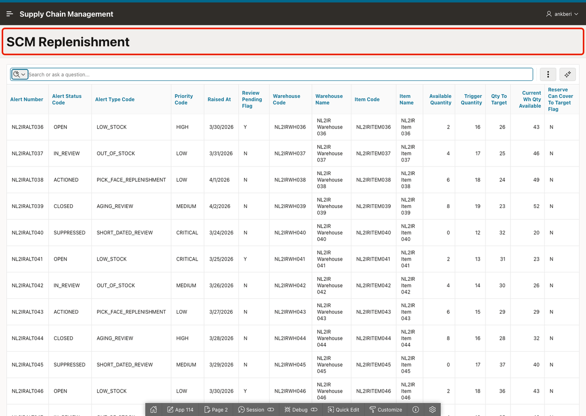
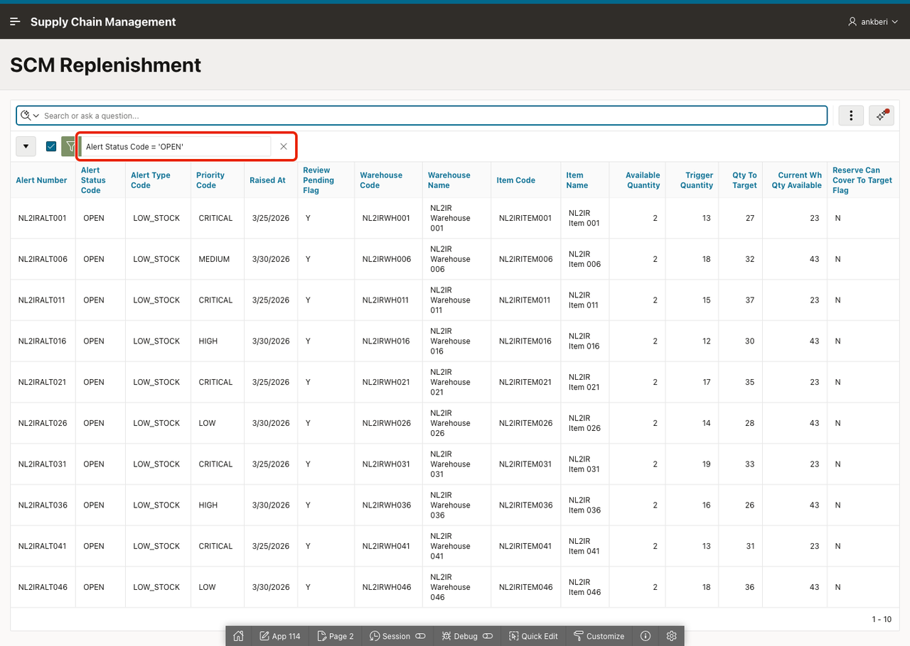
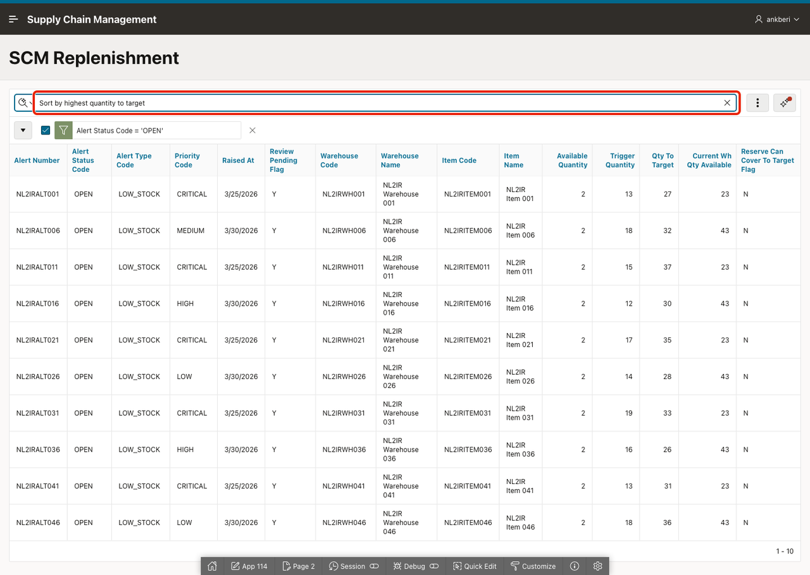
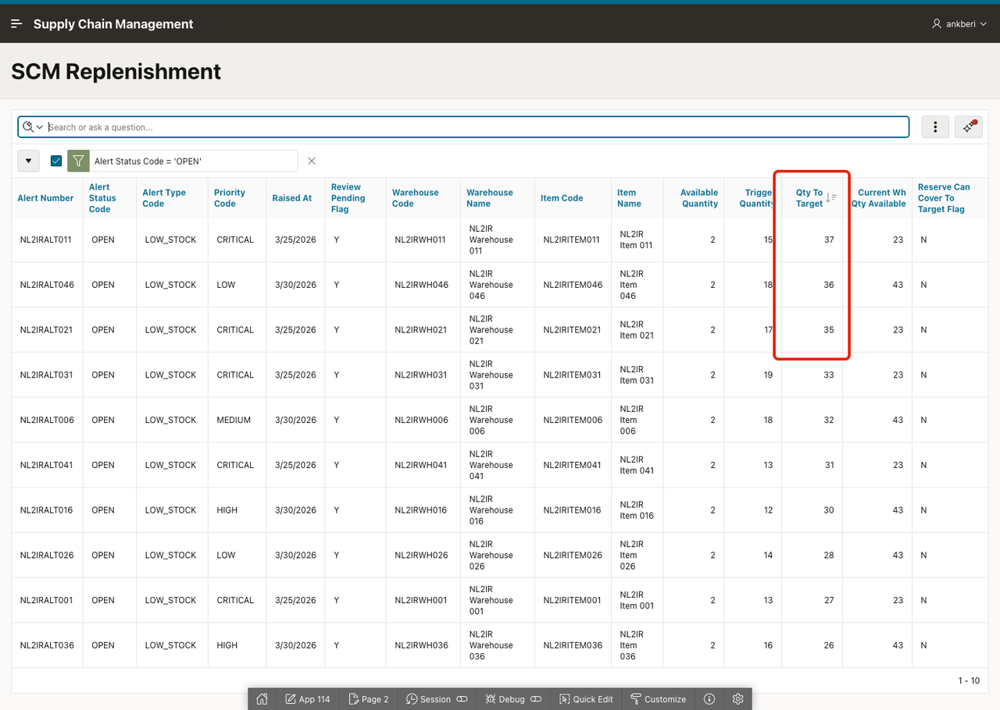
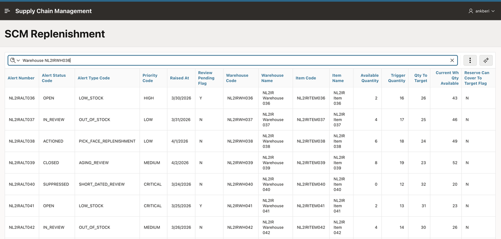
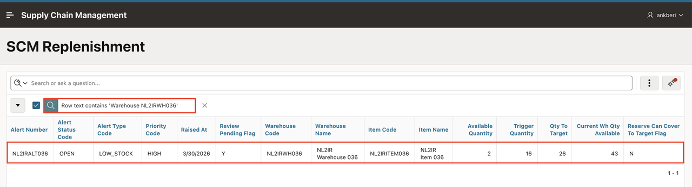
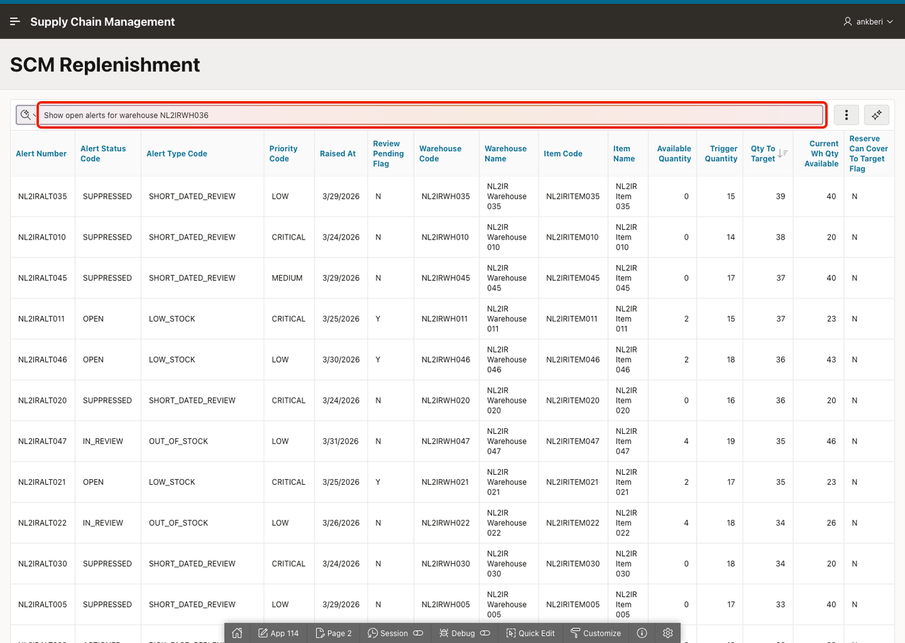
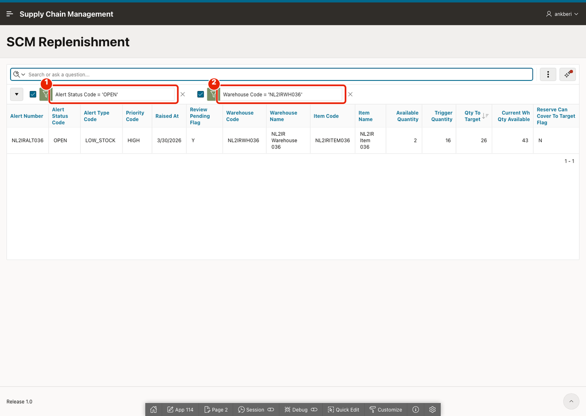
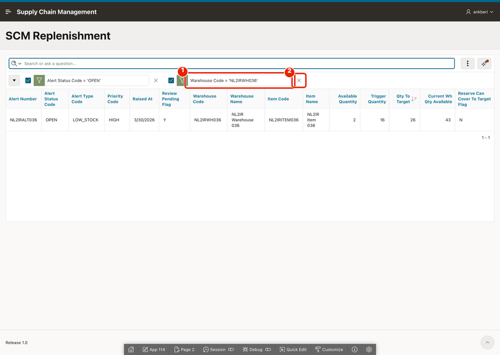
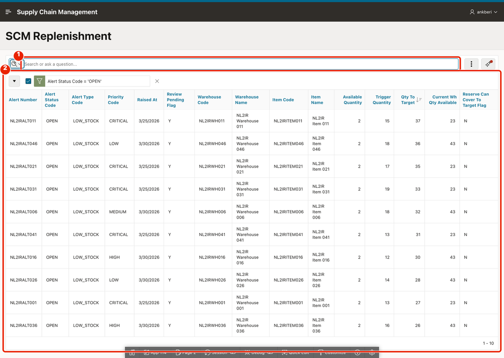

# Use Search with AI

## Introduction

This lab exercises the new AI Interactive Report search experience on the replenishment report. You will test simple filters, sorting, combined conditions, row search behavior, and chip adjustments to confirm that the report converts business language into Interactive Report actions.

Estimated Lab Time: 5 minutes

### Objectives

In this lab, you will:

- Run AI-generated filter and sort requests.
- Compare AI search behavior with row search behavior.
- Review and refine the generated report chips.

## Task 1: Filter and Sort with AI Search

A warehouse operations lead opens the replenishment report to check the morning's alert queue. In this task you will use AI search to filter and sort the report the way the lead would.

1. Run the replenishment report page if it is not already open.

    

2. In the report search bar, enter the following and hit enter.

    ```
    <copy>
    Show only the alerts that still need attention
    </copy>
    ```

    

3. Confirm that the report applies a filter chip for open or in-review alerts, narrowing the list to unresolved items.

    

4. Remove the chip. Now enter the following and hit enter.

    ```
    <copy>
    Which alerts have the largest stock gap, show the biggest first
    </copy>
    ```

    

5. Confirm that the report applies a descending sort on `QTY_TO_TARGET`.

    

## Task 2: Compare AI Search with Row Search

This task shows how the report decides between AI search and standard row search. Inputs with fewer than three words trigger a row search. Longer, natural language inputs trigger Search with AI.

1. Remove the filter chip. In the search bar, enter *Oat Cups* and hit enter.

    

2. Observe that the report uses standard row search instead of Search with AI, because the input is fewer than three words. The report finds rows where "Oat Cups" appears as text in any column.

    

3. Now, remove the filter chip and enter the following AI-style prompt and hit enter.

    ```
    <copy>
    Show me critical out of stock alerts that are still open
    </copy>
    ```

    

4. Confirm that the gradient AI processing indicator appears while the request is being interpreted.

    

5. Review the applied filter chips created by AI. The assistant should apply filters for critical priority, out-of-stock alert type, and open status.

    

6. Remove one of the filter chips by clicking **X**.

    

7. Confirm that the result set refreshes and remains editable after the AI response.

    

## Summary

You used AI search to filter and sort the replenishment report with natural language, compared it with standard row search, and refined the generated chips manually. The report interprets business intent and translates it into Interactive Report actions.

## Acknowledgements

- **Author** - Ankita Beri, Senior Product Manager
- **Last Updated By/Date** - Ankita Beri, Senior Product Manager, April 2026