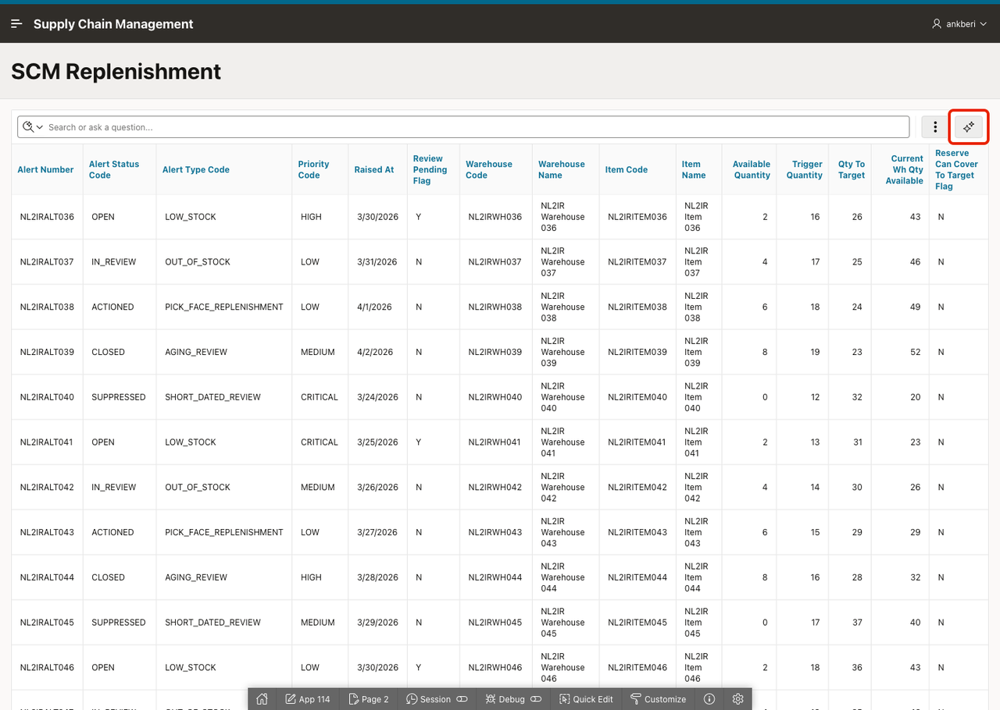

# Use the Interactive Report Chat Assistant

## Introduction

This lab uses the Interactive Report chat assistant to reshape the replenishment report for a weekly network review. Instead of navigating menus and dialogs, you will ask the assistant to group, aggregate, pivot, highlight, chart, and save views using conversational prompts. The assistant uses the column context you configured in Lab 4 to interpret business terms without requiring column names.

Estimated Lab Time: 5 minutes

### Objectives

In this lab, you will:

- Use the chat assistant to filter and sort the report for urgent replenishment risks.
- Organize the report by warehouse, highlight low stock, and chart alert volume.
- Save a finished report view for repeat use.

## Task 1: Identify Urgent Replenishment Risks

An operations director is preparing for the weekly network review. The team wants to know where the most urgent replenishment problems are and which items still need attention. In this task you will use the chat assistant to surface those answers.

1. Remove any existing filter chips and click **Assistant** to open the right-side chat panel for the Interactive Report.

    

2. Enter the following and send the prompt.

    ```
    <copy>
    Which warehouses have critical priority alerts that are still open?
    </copy>
    ```

3. Confirm that the assistant filters the report to show only rows where the priority is CRITICAL and the alert status is OPEN. The result tells the director which warehouses need immediate action.

4. Enter *Reset* to clear the report state, then enter the following and send the prompt.

    ```
    <copy>
    Show items where the review is still pending, sorted by quantity to target descending
    </copy>
    ```

5. Confirm that the assistant filters to rows where the review pending flag is Y and sorts by quantity to target in descending order. The largest unreviewed replenishment gaps appear at the top, giving the team a prioritized action list.

## Task 2: Build a Visual Report for the Review Meeting

The director now wants to prepare a view to present at the meeting: organize by warehouse, flag low-stock items visually, chart alert volume, and save the report so the team can reuse it each week.

1. Enter *Reset* to return the report to its initial state.

2. Enter the following and send the prompt.

    ```
    <copy>
    Add a control break on warehouse name
    </copy>
    ```

3. Confirm that the report splits into sections with a header for each warehouse. This gives the team a site-by-site walkthrough for the review meeting.

4. Enter the following and send the prompt.

    ```
    <copy>
    Highlight items where current warehouse stock is below 10 units
    </copy>
    ```

5. Confirm that the highlight rule is applied. Within each warehouse section, rows where warehouse-wide stock is critically low now stand out in color, making it easy for each site manager to spot their problem items.

6. Enter *Reset* to return to the default view, then enter the following and send the prompt.

    ```
    <copy>
    Chart the count of alerts by warehouse as a bar chart
    </copy>
    ```

7. Confirm that the report switches to a bar chart. Each bar represents a warehouse, making it immediately clear which sites carry the heaviest alert load across the network.

8. Enter the following and send the prompt.

    ```
    <copy>
    Save this report as Weekly Network Review
    </copy>
    ```

9. Confirm that the saved report appears in the available report views. The team can now reopen this view each week without reconfiguring the report.

## Summary

You used the Interactive Report chat assistant to surface critical open alerts by warehouse, identify the largest unreviewed replenishment gaps, organize the report by warehouse with a control break, highlight low-stock items, chart alert volume by site, and save the finished view for reuse. The assistant interpreted business terms using the column context configured in Lab 4.

## Acknowledgements

- **Author** - Ankita Beri, Senior Product Manager
- **Last Updated By/Date** - Ankita Beri, Senior Product Manager, June 2026
