# Enable Dictation Support

## Introduction

This lab enables dictation so users can interact with AI Interactive Reports using their voice. Oracle APEX uses the Web Speech API to convert speech into text directly in the browser. Once enabled, a microphone icon appears in the search bar and the Chat Assistant, allowing hands-free interaction with the AI features you configured in previous labs. Speech is processed by the end user's browser and may be sent to third-party servers depending on the browser implementation, which is why dictation is disabled by default.

Estimated Lab Time: 5 minutes

### Objectives

In this lab, you will:

- Enable dictation at the application level.
- Use voice input with the Interactive Report search bar.
- Use voice input with the Interactive Report chat assistant.

### Prerequisites

- Completed Labs 1 through 6.
- A browser that supports the Web Speech API (Chrome, Edge, or Safari).
- A working microphone connected to your device.

## Task 1: Enable Dictation in the Application Definition

Oracle APEX supports browser-based dictation through the Web Speech API. Because this is a security and privacy consideration, the setting must be explicitly enabled by the developer. In this task, you will enable dictation at the application level so the microphone icon appears in supported components.

1. In the App Builder, click the **Shared Components** icon.

    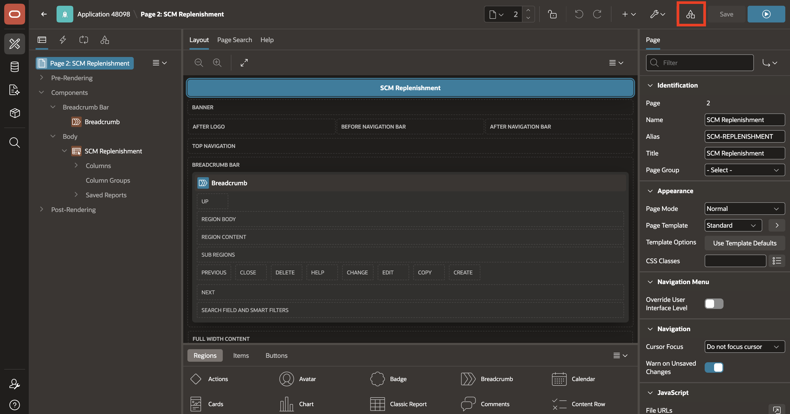

2. Under **Security**, click **Security Attributes**.

    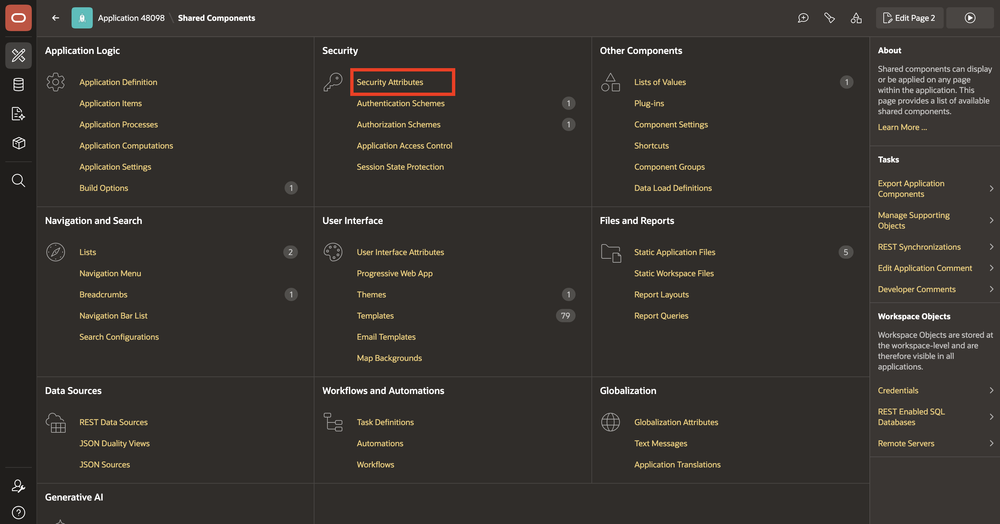

3. Click the **Browser Security** tab. Toggle **Enable Dictation** on.

    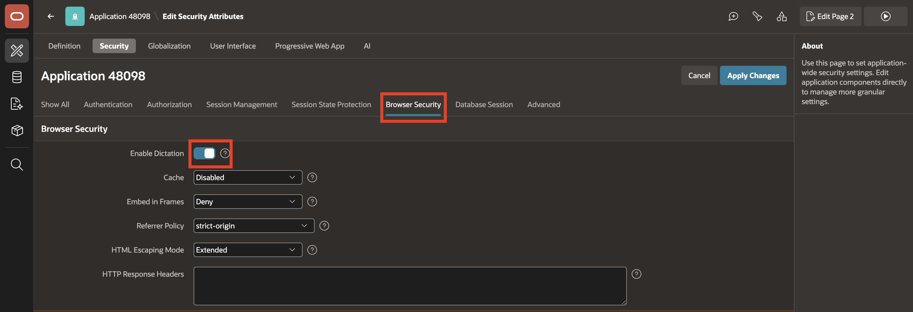

4. Click **Apply Changes**.

    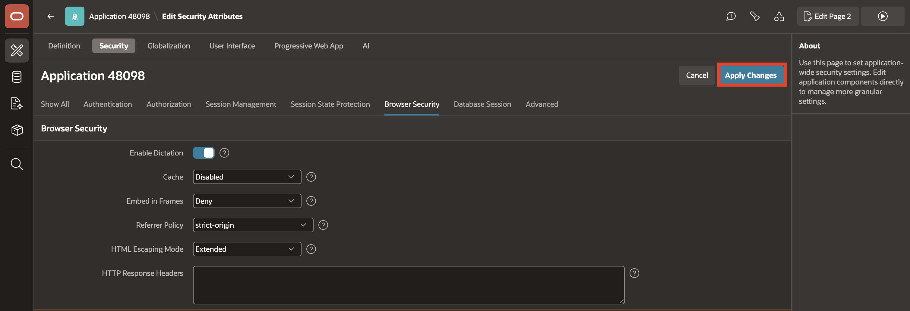

5. Click the **Run** icon to run the application.

    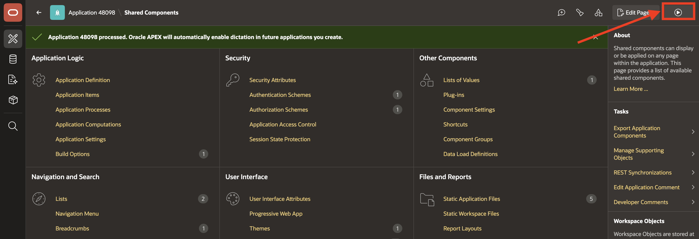

    > **Note:** Dictation must also be enabled at the instance level for this application setting to take effect. If the setting is not visible or cannot be changed, contact your workspace administrator.

## Task 2: Use Dictation with Search with AI

With dictation enabled, a microphone icon now appears in the Interactive Report search bar. In this task, you will use voice input to submit a search prompt and confirm that the AI processes spoken input the same way it processes typed text. The search bar does not differentiate between typed and dictated input - both are interpreted by the AI and applied as Interactive Report settings.

1. Run the **SCM Replenishment** report page.

2. In the report search bar, click the **microphone** icon to start dictation.

    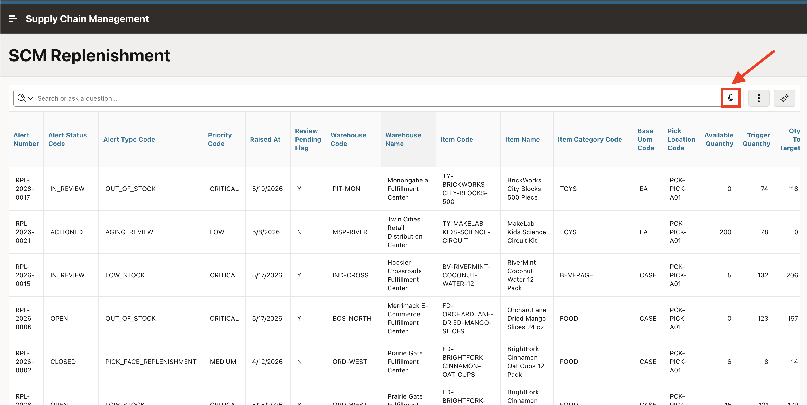

3. Speak a prompt such as:

    *"Show me all open alerts with high priority"*

4. After you finish speaking, confirm that dictation ends and the browser transcribes your speech into text in the search bar.

5. Confirm that the report applies the expected filter chips, just as it would with a typed prompt.

    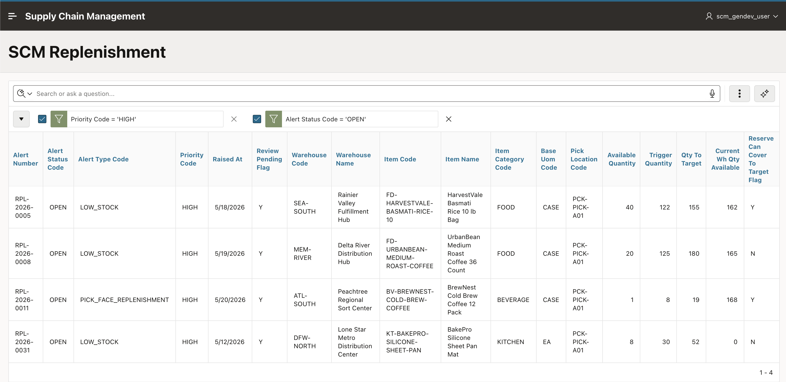

## Task 3: Use Dictation with the Chat Assistant

The microphone icon also appears in the Chat Assistant you used in Lab 6. In this task, you will use voice input to submit a Group By prompt, demonstrating that the Assistant can handle complex report actions from spoken input. This also exercises the Group By feature, which creates a summary view showing grouped data with an aggregate function - a capability not covered in the previous labs.

1. Before asking a new question, reset the report or close any filter chips applied in the previous task.

    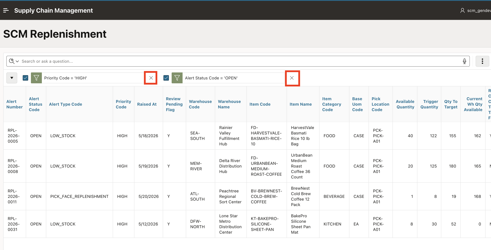

2. Click **Assistant** icon to open the chat panel.

    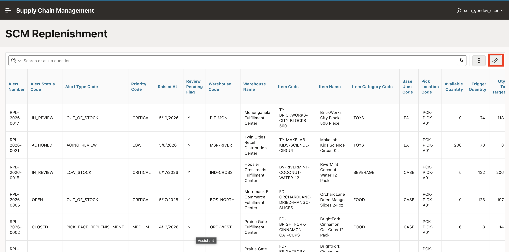

3. In the chat input field, click the **microphone** icon to start dictation.

    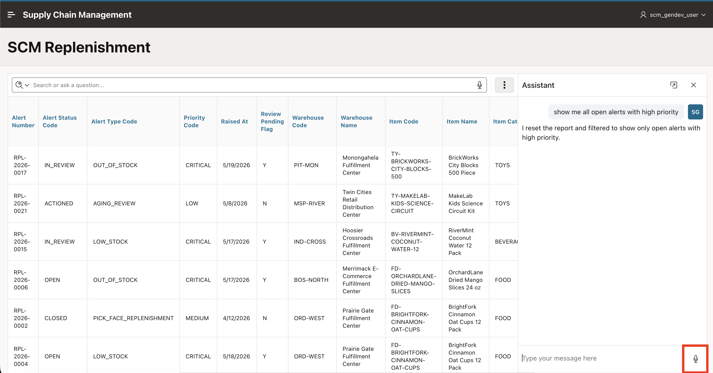

4. Speak a prompt such as:

    *"Which product lines generate the most alerts? Group by item category"*

5. Confirm that the browser transcribes your speech into the chat input field. Click the **microphone** icon again or press **Enter** to stop dictation.

6. Send the prompt and confirm that the assistant applies a group by on item category with a count of alerts. The report switches to a summary view showing how many alerts each product line has.

    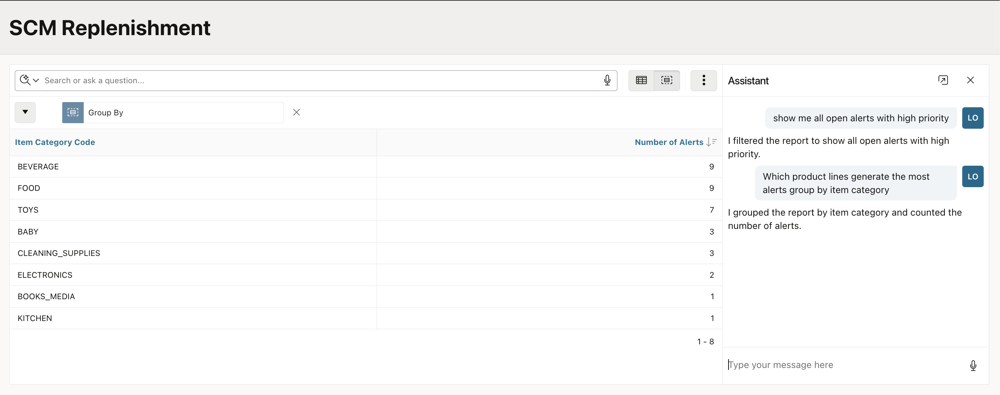

## Summary

You enabled dictation in the application security settings and verified that voice input works with both Search with AI and the Chat Assistant. Users can now interact with AI Interactive Report features using speech, bridging the gap between everyday users and the full power of their data.

## Acknowledgements

- **Author** - Ankita Beri, Senior Product Manager
- **Last Updated By/Date** - Ankita Beri, Senior Product Manager, June 2026
