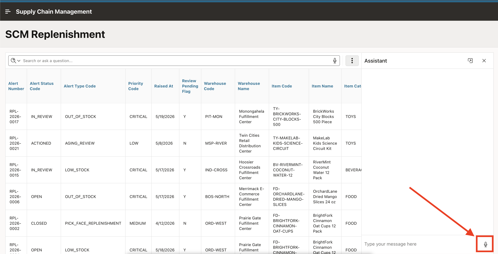

# Enable Dictation Support

## Introduction

This lab enables dictation so you can use your voice to enter prompts in the Interactive Report search bar and chat assistant. Oracle APEX uses the Web Speech API to convert speech into text directly in the browser. Once enabled, a microphone icon appears in supported components, allowing hands-free interaction with the AI features you configured in previous labs.

Estimated Lab Time: 5 minutes

### Objectives

In this lab, you will:

- Enable dictation at the application level.
- Use voice input with the Interactive Report search bar.
- Use voice input with the Interactive Report chat assistant.

### Prerequisites

- Completed Labs 1 through 6.
- A browser that supports the Web Speech API (Chrome, Edge, or Safari).
- A working microphone connected to your device.

## Task 1: Enable Dictation in the Application Definition

Dictation is disabled by default for security and privacy. Speech is processed by the end user's browser and may be sent to third-party servers depending on the browser implementation. In this task you will enable the setting so the microphone icon appears in supported components.

1. In the App Builder, click the **Shared Components** icon.

    

2. Under **Security**, click **Security Attributes**.

    

3. Click the **Browser Security** tab. Toggle **Enable Dictation** on.

    

4. Click **Apply Changes**.

    

5. Click the **Run** icon to run the application.

    

    > **Note:** Dictation must also be enabled at the instance level for this application setting to take effect. If the setting is not visible or cannot be changed, contact your workspace administrator.

## Task 2: Use Dictation with Search with AI

With dictation enabled, a microphone icon now appears in the Interactive Report search bar you configured in Lab 5. In this task you will use voice input to submit a search prompt.

1. Run the **SCM Replenishment** report page.

2. In the report search bar, click the **microphone** icon to start dictation.

    

3. Speak a prompt such as:

    *"Show me all open alerts with high priority"*

4. Confirm that the browser transcribes your speech into text in the search bar.

5. Press **Enter** or click the search button to submit the prompt.

6. Confirm that the report applies the expected filter chips, just as it would with a typed prompt.

## Task 3: Use Dictation with the Chat Assistant

The microphone icon also appears in the chat assistant you used in Lab 6. In this task you will use voice input to submit a chat prompt.

1. On the same report page, click **Assistant** to open the chat panel.

2. In the chat input field, click the **microphone** icon to start dictation.

    

3. Speak a prompt such as:

    *"Which product lines generate the most alerts? Group by item category"*

4. Confirm that the browser transcribes your speech into the chat input field.

5. Send the prompt and confirm that the assistant applies a group by on item category with a count of alerts. The report switches to a summary view showing how many alerts each product line has.

## Summary

You enabled dictation in the application security settings and verified that voice input works with both the Interactive Report search bar and the Chat Assistant. Users can now interact with AI features using speech instead of typing.

## Acknowledgements

- **Author** - Ankita Beri, Senior Product Manager
- **Last Updated By/Date** - Ankita Beri, Senior Product Manager, June 2026
