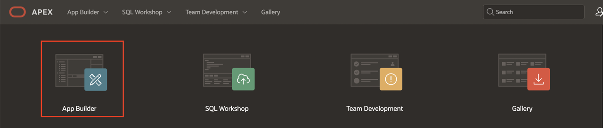
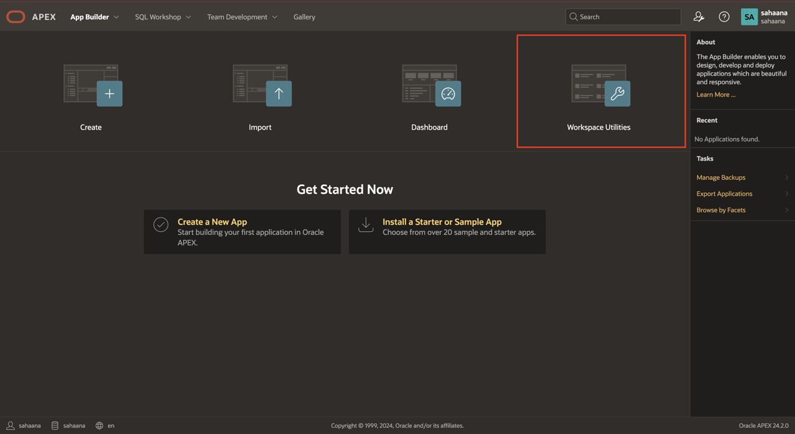
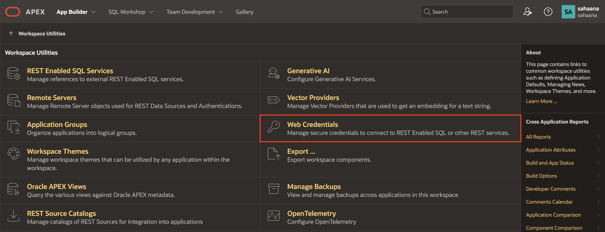
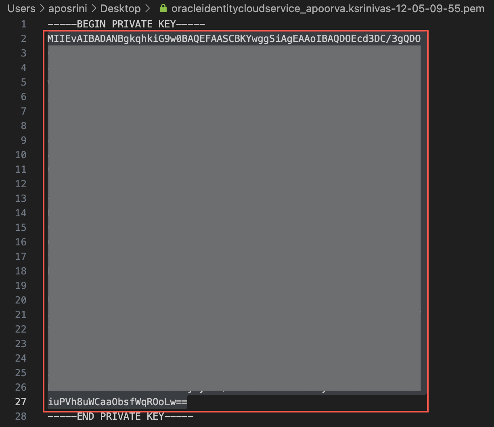
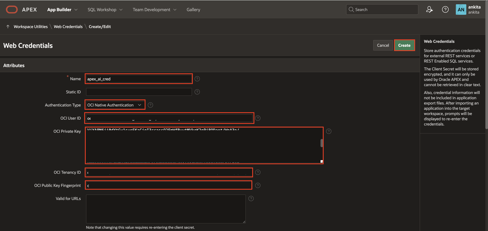

# Create the Web Credentials

## Introduction

In this lab, you learn to create web credentials in Oracle APEX using the OCI API keys. In Oracle Cloud Infrastructure (OCI), API keys are used for secure authentication when accessing OCI resources through REST APIs.

Web credentials are used to authenticate connections to external REST services or REST Enabled SQL services from APEX.

Creating web credentials securely stores and encrypts authentication credentials for use by Oracle APEX components and APIs. Credentials cannot be retrieved in clear text. Credentials are stored at the workspace level and are visible to all applications.

Estimated Time: 10 minutes

### Objectives

In this lab, you learn how to:

- Create web credentials in Oracle APEX.

## Prerequisites

- Download the zip file from [Your OCI API Key](?lab=hol3318).

## Task 1: Create Web Credentials in Oracle APEX

To create a Web Credential in Oracle APEX:

1. Log in to your Oracle APEX workspace.

    

2. On the Workspace home page, click **App Builder**.

    

3. Click **Workspace Utilities**.

    

4. Select **Web Credentials**.

    

5. Click **Create**.

    

6. Enter the following details using the configuration file from the zip file you downloaded in the prerequisites.

    - Name: **apex\_ai\_cred**

    - Authentication Type: **OCI Native Authentication**

    - **OCI User ID**: Enter the OCID of the Oracle Cloud user account. You can find the OCID in the zip folder you downloaded as part of the prerequisites.

      Your OCI User ID looks similar to **ocid1.user.oc1..aaaaaaaa\*\*\*\*\*\*wj3v23yla**

    - **OCI Private Key**: Open the private key (.pem file) from the zip file. Copy and paste the API key.

      

    - **OCI Tenancy ID**: Enter the OCID for tenancy. Your Tenancy ID looks similar to **ocid1.tenancy.oc1..aaaaaaaaf7ush\*\*\*\*cxx3qka**

    - **OCI Public Key Fingerprint**: Enter the Fingerprint ID. Your Fingerprint ID looks similar to **a8:8e:c2:8b:fe:\*\*\*\*:ff:4d:40**

      

7. Click **Create**.

## Summary

You know how to create web credentials in Oracle APEX.

You may now **proceed to the next lab**.

## Acknowledgments

- **Author** - Roopesh Thokala, Principal Product Manager; Ankita Beri, Senior Product Manager
- **Last Updated By/Date** - Sahaana Manavalan, Senior Product Manager, May 2026

## Acknowledgements

* **Author** - TODO: Your Name, Your Title, Your Organization
* **Last Updated By/Date** - TODO: Your Name, Month Year
