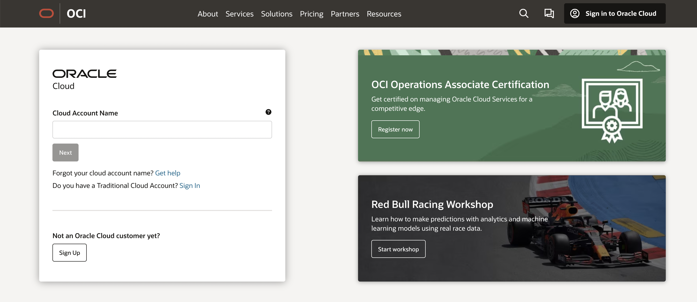
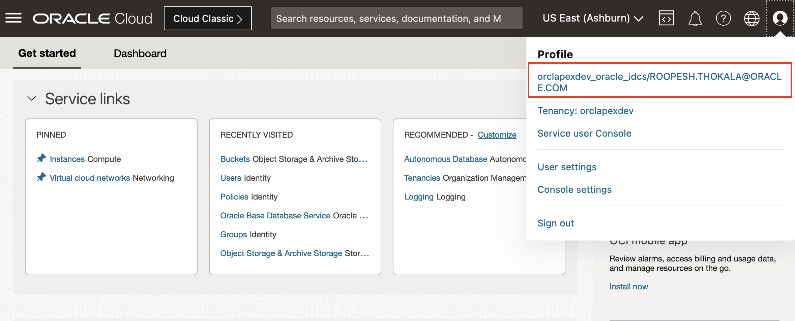
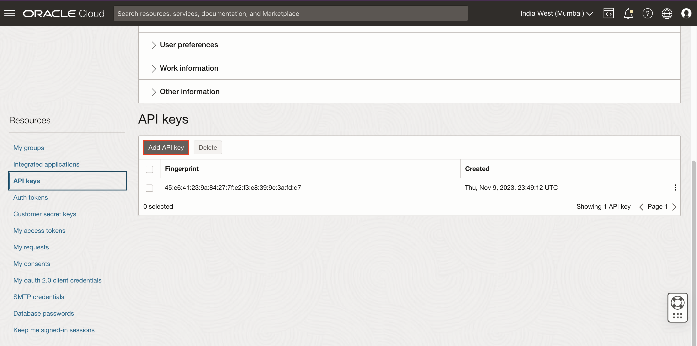
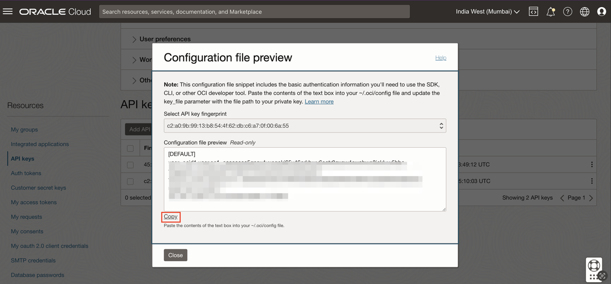
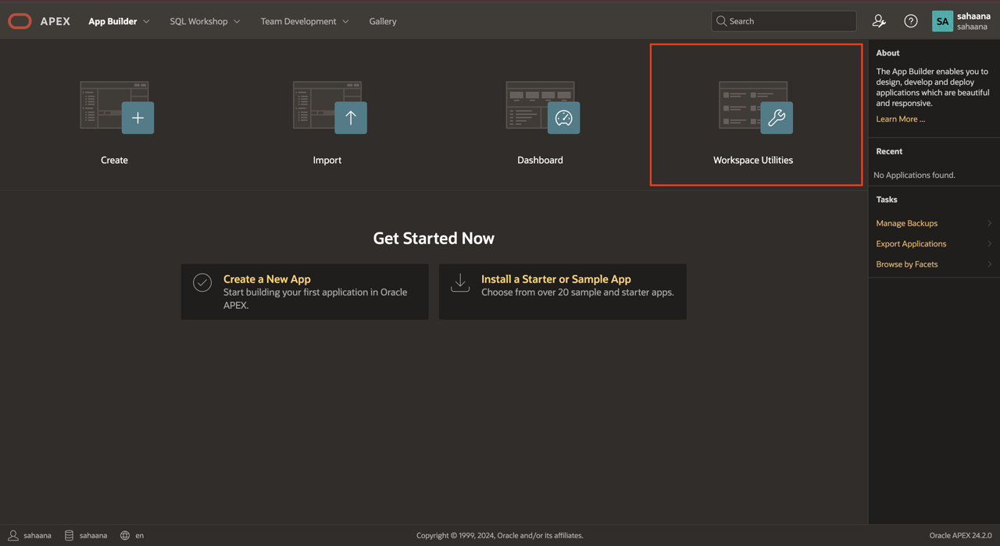
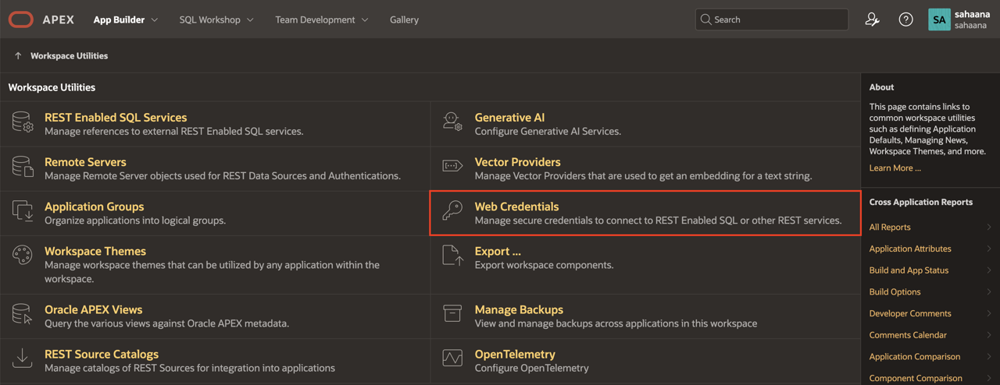
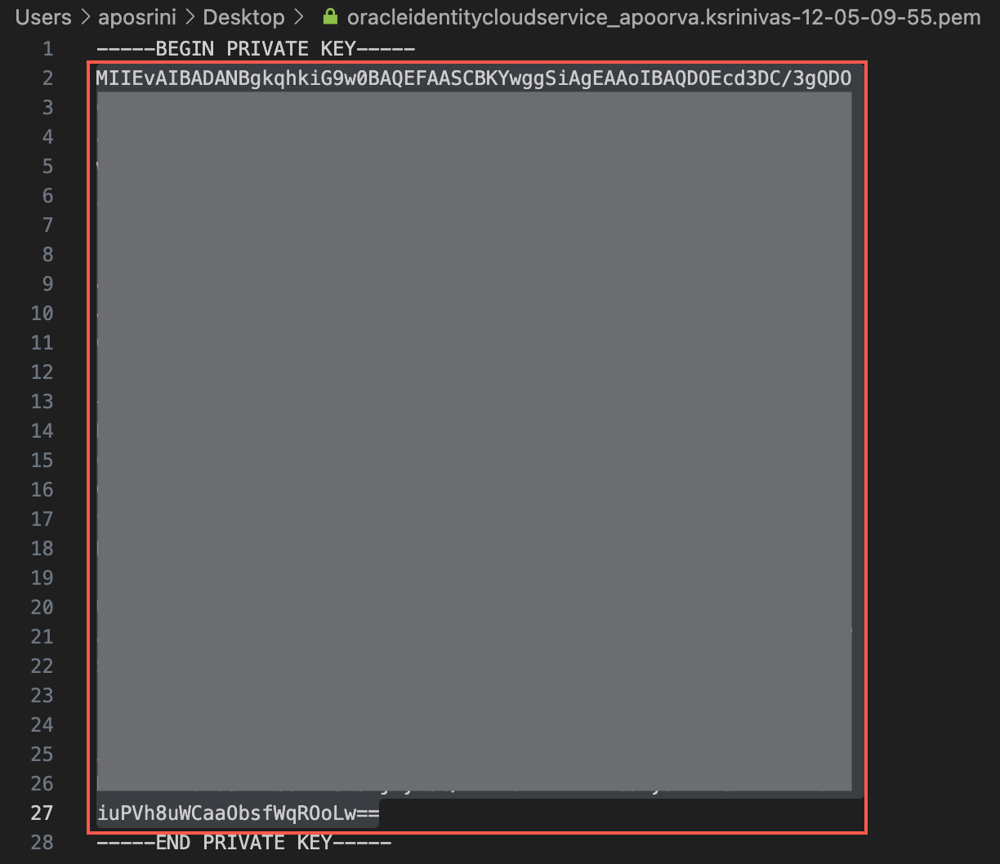
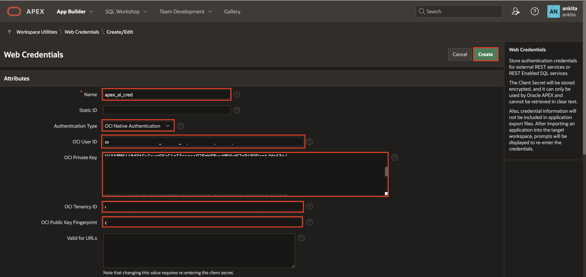

# Configure the OCI API keys

## Introduction

In this lab, you learn how to configure the OCI API keys. In Oracle Cloud Infrastructure (OCI), API keys are used for secure authentication when accessing OCI resources through REST APIs.

OCI API keys consist of two parts: a **Public key** and a **Private key**. You use the OCI console to generate the Private/Public key pair.

Estimated Time: 10 Minutes

### Objectives
In this lab, you:

- Generate API Keys using OCI Console
- Create Web Credentials in Oracle APEX

## Task 1: Generate API Keys using OCI Console

To Generate the API Keys using OCI Console:

1. Login into your OCI Account.

   

2. Click on the Profile icon at the top-right corner and select your Profile hyperlink.

    

3. Under Resources section at the bottom-left, select **API Keys** and then click **Add API Key**.

    

4. The Add API Key dialog is displayed. Select **Generate API Key Pair** to create a new key pair.

5. Click **Download Private Key**. A *.pem* file is saved to your local device. You do not need to download the public key.

   *Note: You will use this private key while configuring the web credentials in Oracle APEX in the upcoming lab.*

6. Click **Add**.

    

7. The key is added, and the Configuration File Preview is displayed. Copy and save the configuration file snippet from the text box into a notepad. You will use this information for creating Oracle APEX Web Credentials.

    

## Task 2: Create Web Credentials in Oracle APEX

Web credentials are used to authenticate connection to external REST services, or REST Enabled SQL services from APEX.

Creating Web Credentials securely stores and encrypts authentication credentials for use by Oracle APEX components and APIs. Credentials cannot be retrieved back in clear text. Credentials are stored at the workspace level and therefore are visible to all applications.

To create a Web Credential in Oracle APEX:

1. Login into your Oracle APEX workspace.

   

2. On the Workspace home page, click **App Builder**.

   

3. Click **Workspace Utilities**.

   

4. Select **Web Credentials**.

   

5. Click **Create**.

   

6. Enter the following details using the configuration file you copied in the previous task.

    - **Name**: apex\_ai\_cred

    - **Authentication Type**: Oracle Cloud Infrastructure (OCI)

    - **OCI User ID**: Enter the OCID of the Oracle Cloud user Account. You can find the OCID in the Configuration File Preview generated during the API Key creation.
    Your OCI User ID looks similar to **ocid1.user.oc1..aaaaaaaa\*\*\*\*\*\*wj3v23yla**

    - **OCI Private Key**: Open the private key (.pem file) downloaded in the previous task. Copy and paste the API Key. 

      

    - **OCI Tenancy ID**: Enter the OCID for Tenancy. Your Tenancy ID looks similar to **ocid1.tenancy.oc1..aaaaaaaaf7ush\*\*\*\*cxx3qka**

    - **OCI Public Key Fingerprint**: Enter the Fingerprint ID. Your Fingerprint ID looks similar to **a8:8e:c2:8b:fe:\*\*\*\*:ff:4d:40**

   

5. Click **Create**.

## Summary

You now know how to generate API Keys using OCI console. Furthermore, you know how to create web credentials in Oracle APEX.

You may now **proceed to the next lab**.   

## Acknowledgments
- **Author** - Roopesh Thokala, Senior Product Manager
- **Co-Author** - Ankita Beri, Product Manager
- **Last Updated By/Date** - Apoorva Srinivas, Senior Product Manager, December 2023
