# Configure the OCI API Keys

## Introduction

In this lab, you learn how to configure the OCI API keys. In Oracle Cloud Infrastructure (OCI), API keys are used for secure authentication when accessing OCI resources through REST APIs.

OCI API keys consist of two parts: a **public key** and a **private key**. You use the OCI Console to generate the private/public key pair.

Estimated Time: 10 minutes

### Objectives

In this lab, you learn how to:

- Generate API keys using the OCI Console.
- Create web credentials in Oracle APEX.

## Task 1: Generate API Keys Using OCI Console

To generate API keys using the OCI Console:

1. Log in to your OCI account.

    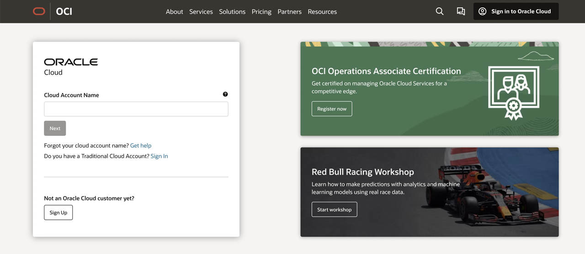

2. Click **My Profile** at the top right.

    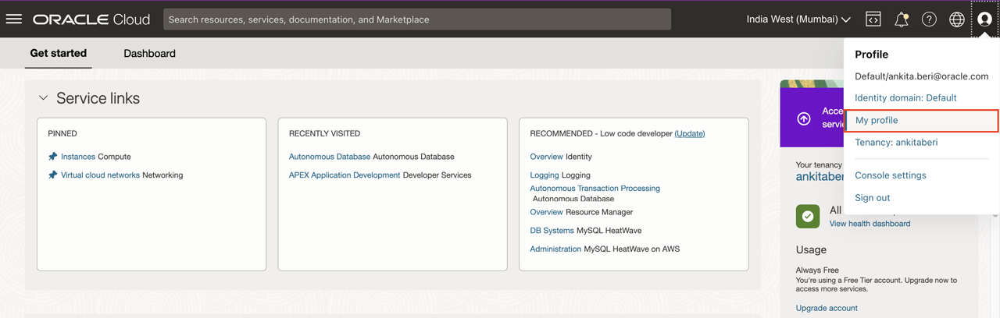

3. Under Resources at the bottom left, select **API Keys**.

    Click **Add API Key**.

    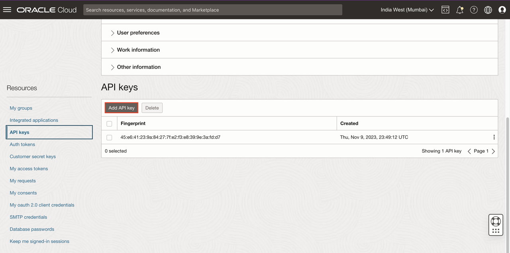

4. The Add API Key dialog is displayed.

    Select **Generate API Key Pair** to create a new key pair.

5. Click **Download Private Key**.

    A *.pem* file is saved to your local device. You do not need to download the public key.

    *Note: You will use this private key while configuring the web credentials in Oracle APEX in the next task.*

6. Click **Add**.

    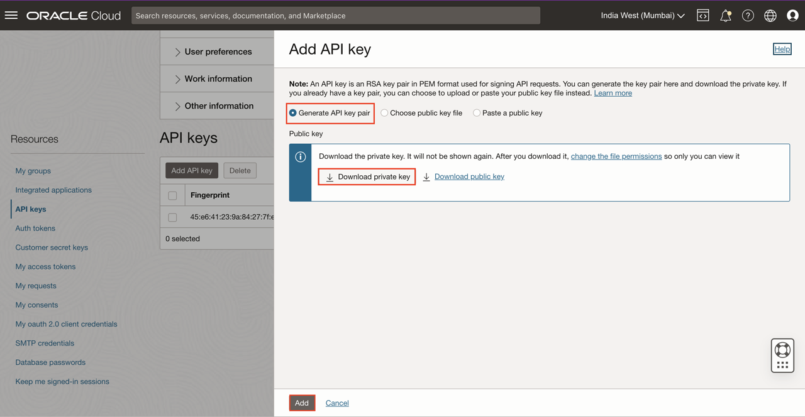

7. The key is added, and the Configuration File Preview is displayed.

    Copy and save the configuration file snippet from the text box into a text editor. You will use this information to create Oracle APEX web credentials.

    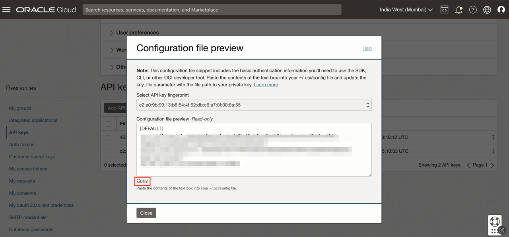

## Task 2: Create Web Credentials in Oracle APEX

Web credentials are used to authenticate connections to external REST services or REST Enabled SQL services from APEX.

Creating web credentials securely stores and encrypts authentication credentials for use by Oracle APEX components and APIs. Credentials cannot be retrieved in clear text. Credentials are stored at the workspace level and are visible to all applications.

To create a Web Credential in Oracle APEX:

1. Log in to your Oracle APEX workspace.

    

2. On the Workspace home page, click **App Builder**.

    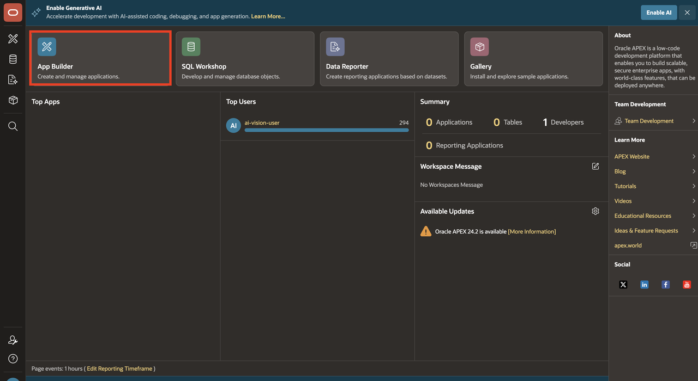

3. Click **Workspace Utilities**.

    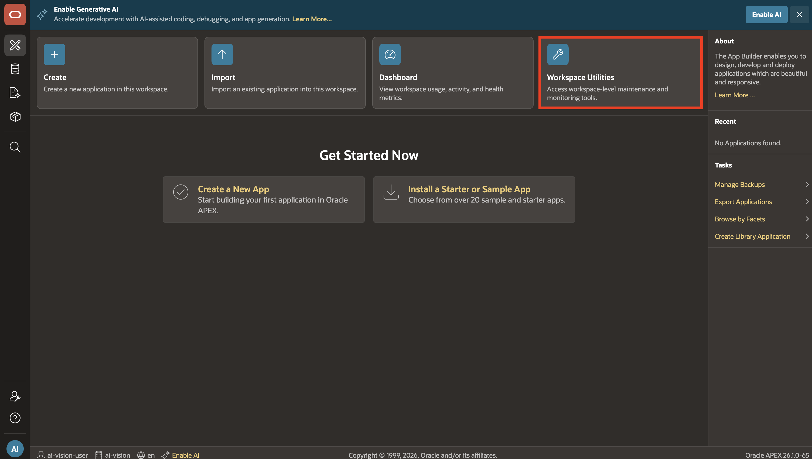

4. Select **Web Credentials**.

    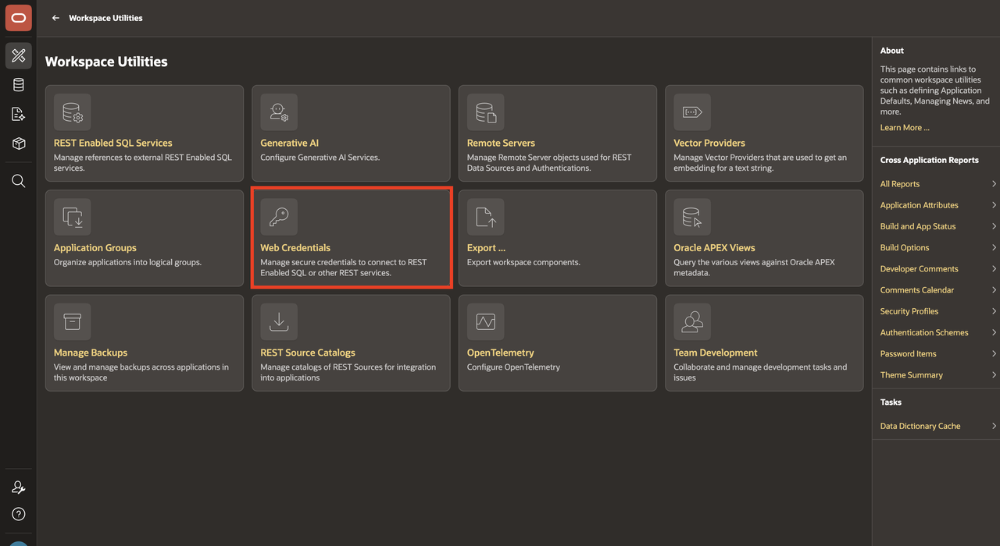

5. Click **Create**.

    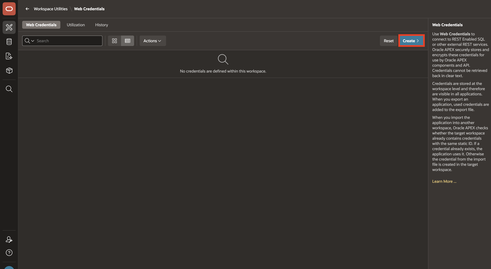

6. Enter the following details using the configuration file you copied in the previous task.

    - Name: **apex\_ai\_cred**

    - Authentication Type: **OCI Native Authentication**

    - **OCI User ID**: Enter the OCID of the Oracle Cloud user account. You can find the OCID in the Configuration File Preview generated during API key creation.

      Your OCI User ID looks similar to **ocid1.user.oc1..aaaaaaaa\*\*\*\*\*\*wj3v23yla**

    - **OCI Private Key**: Open the private key (.pem file) downloaded in the previous task. Copy and paste the API key.

    - **OCI Tenancy ID**: Enter the OCID for tenancy. Your Tenancy ID looks similar to **ocid1.tenancy.oc1..aaaaaaaaf7ush\*\*\*\*cxx3qka**

    - **OCI Public Key Fingerprint**: Enter the Fingerprint ID. Your Fingerprint ID looks similar to **a8:8e:c2:8b:fe:\*\*\*\*:ff:4d:40**

    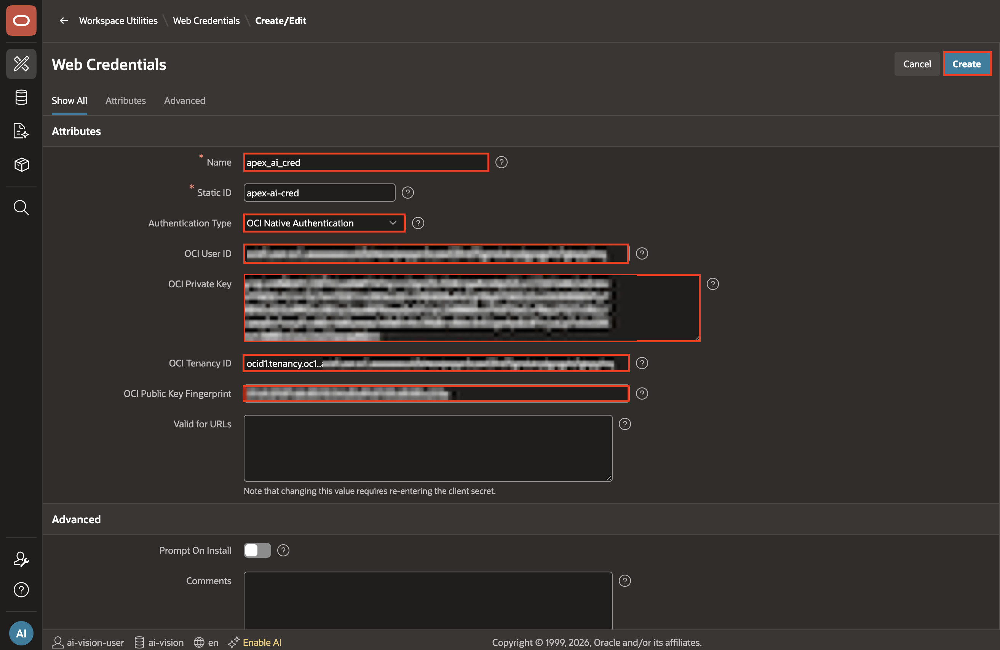

7. Click **Create**.

   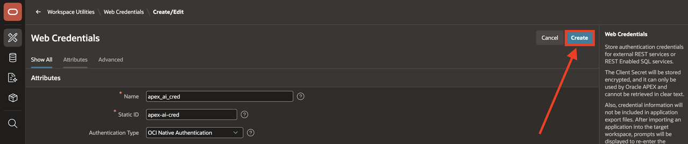

## Summary

You now know how to generate API keys using the OCI Console and create web credentials in Oracle APEX.

You may now **proceed to the next lab**.

## Acknowledgments

- **Author** - Roopesh Thokala, Principal Product Manager; Ankita Beri, Senior Product Manager
- **Last Updated By/Date** - Sahaana Manavalan, Senior Product Manager, May 2026
