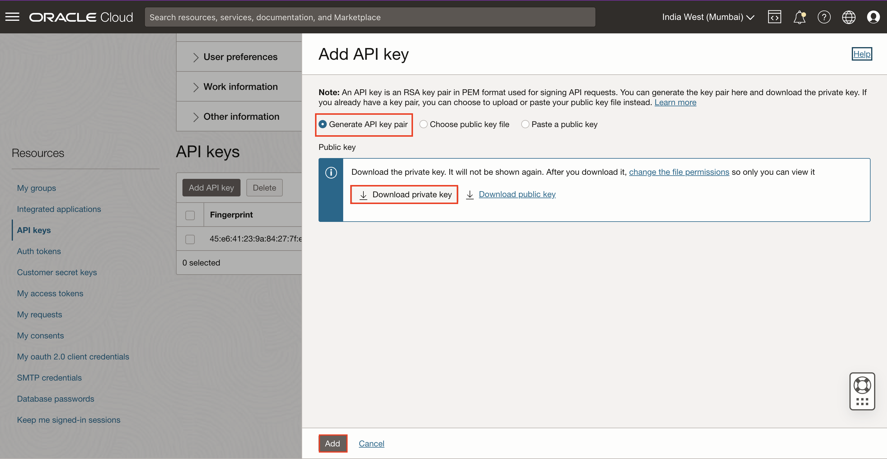
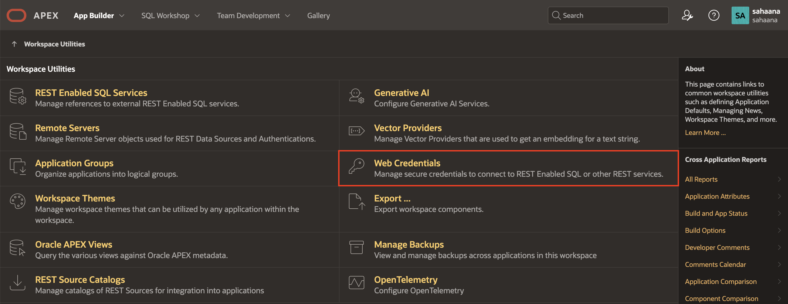

# Configure OCI API keys

## Introduction

In this lab, you learn how to configure OCI API keys. In Oracle Cloud Infrastructure (OCI), API keys are used for secure authentication when accessing OCI resources through REST APIs.

OCI API keys consist of two parts: a **Public key** and a **Private key**. You use the Console to generate the Private/Public key pair.

Estimated Time: 20 Minutes

### Objectives
In this lab, you:

- Generate API Keys using OCI Console
- Create Web Credentials in Oracle APEX

## Task 1: Generate API Keys using OCI Console

To Generate API Keys using OCI Console:

1. Login into your OCI Account.

   

2. Open the Profile menu and click Profile hyperlink.

    

3. In the Resources section at the bottom left, click **API Keys** and then click **Add API Key**.

    

4. The Add API Key dialog displays. Select **Generate API Key Pair** to create a new key pair.

5. Click **Download Private Key** and save it to your local device. You do not need to download the public key.

   *Note: You will use this private key while configuring web credentials in Oracle APEX later in this workshop.*

6. Click **Add**.

    

7. The key is added, and the Configuration File Preview is displayed. Copy and paste the configuration file snippet from the text box. You will use this information in Oracle APEX Web Credentials.

    

## Task 2: Create Web Credentials in Oracle APEX

Web credentials are used to authenticate connection to external REST services, or REST Enabled SQL services.

Creating Web Credentials securely stores and encrypts authentication credentials for use by Oracle APEX components and APIs. Credentials cannot be retrieved back in clear text. Credentials are stored at the workspace level and therefore are visible in all applications.

To create web credentials in Oracle APEX:

1. Login into your Oracle APEX workspace.

   

2. On the Workspace home page, click App Builder.

   

3. Click Workspace Utilities.

   

4. Click Web Credentials.

   

5. Please enter the following details using the configuration file details you copied before and the API Key.

    - **Name**: apex\_ai\_cred

    - **Authentication Type**: Oracle Cloud Infrastructure (OCI)

    - **OCI User ID**: Enter the OCID of the Oracle Cloud user Account. You can find this in the Configuration File Preview generated during API Key creation.
    Your OCI User ID looks similar to **ocid1.user.oc1..aaaaaaaa\*\*\*\*\*\*wj3v23yla**

    - **OCI Private Key**: Enter the API Key. Remove the header, footer, and carriage returns.

    - **OCI Tenancy ID**: Enter OCID for the Tenancy.

    - **OCI Public Key Fingerprint**: Enter the Fingerprint ID.

   

5. Click Create.

## Summary

You now know how to generate API Keys using OCI console. Also, you know how to create web credentials in Oracle APEX.

You may now **proceed to the next lab**.   

## Acknowledgments
- **Author** - Roopesh Thokala, Senior Product Manager
- **Co-Author** - Ankita Beri, Product Manager
- **Last Updated By/Date** - Ankita Beri, Product Manager, August 2023
