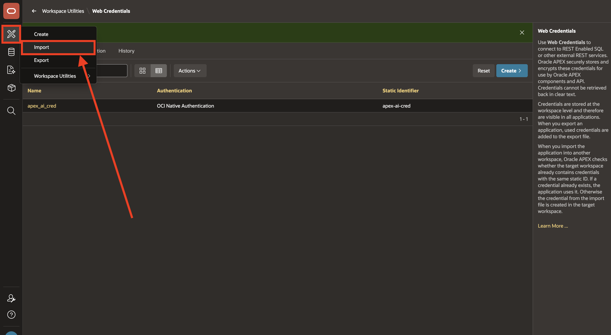
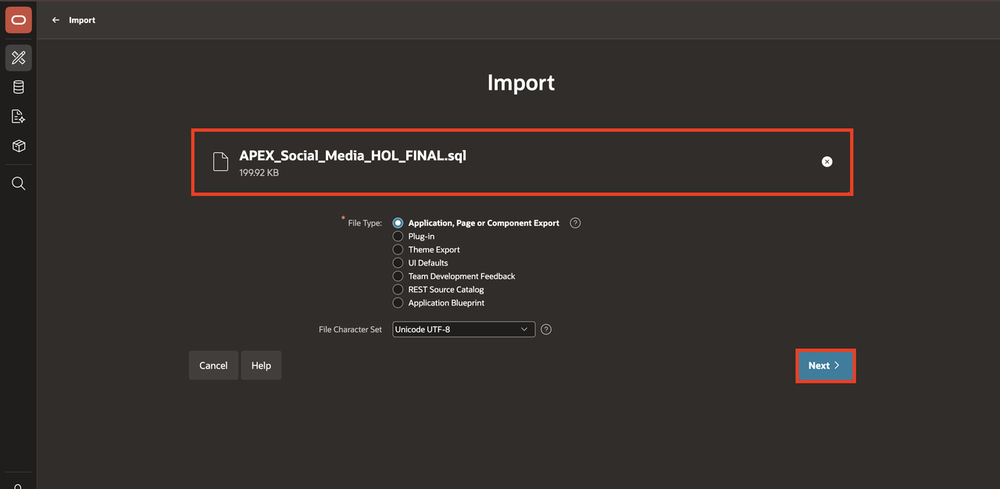
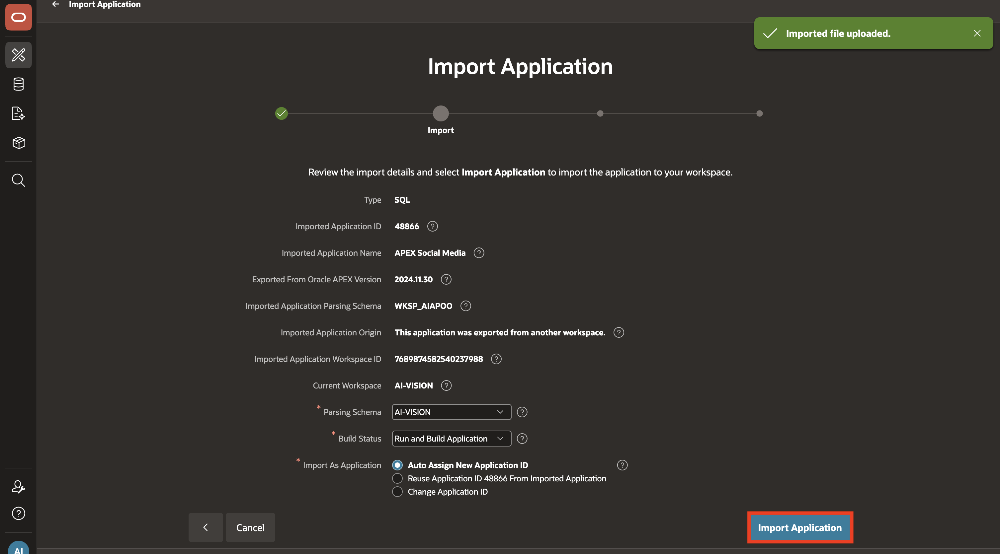
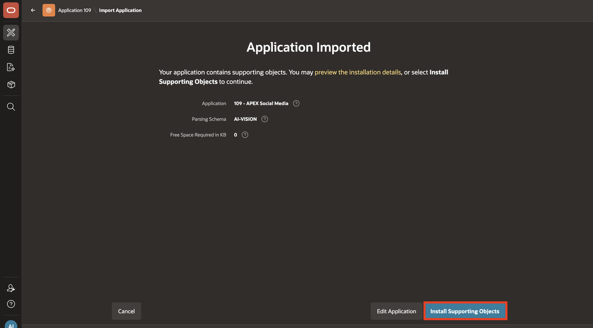
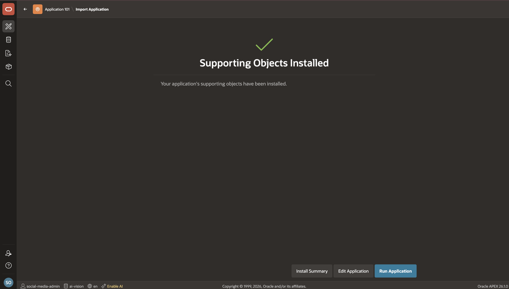
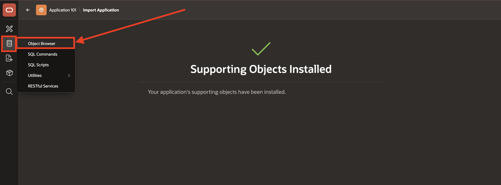
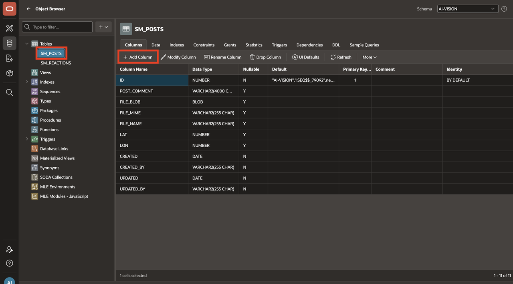
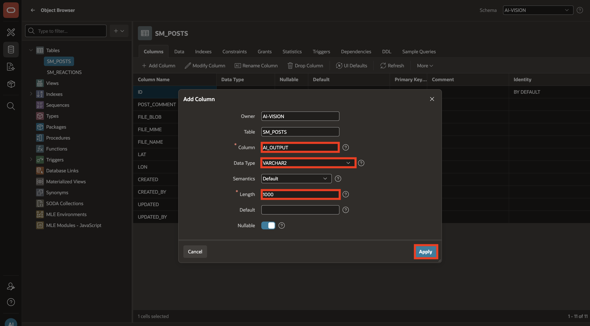
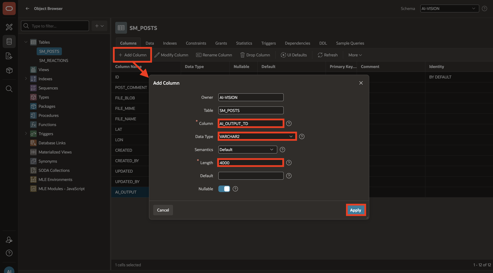

# Import the Social Media Application

## Introduction

In this lab, you import the Social Media application into your APEX workspace. You use this imported app to integrate with the OCI Vision service.

Estimated Time: 15 minutes

### Objectives

In this lab, you learn how to:

- Import the Social Media application into your APEX workspace.
- Add columns to a table using Object Browser to store the AI response.

## Task 1: Import the Social Media Application

1. Download the [Social Media application](files/APEX_Social_Media_HOL_FINAL.sql).

2. In the left navigation bar, hover over the **App Builder** icon.

    Click **Import**.

    

3. The Import dialog is displayed. Perform the following steps:

    - Drag and drop the file, or navigate to the file.

    - Click **Next**.

    

4. Accept the defaults.

    Click **Import Application**.

    

5. Click **Install Supporting Objects**.

    

6. Verify that the application's supporting objects were installed successfully.

    

## Task 2: Add Columns to the Table Using Object Browser

To store the output generated by the OCI Vision service, add two columns to the **SM\_POSTS** table.

To add two new columns to the **SM\_POSTS** table:

1. In the left navigation bar, hover over the **SQL Workshop** icon.

    Click **Object Browser**.

    

2. In the object tree, expand Tables and select **SM\_POSTS** table.

    On the columns tab, click **Add Column**.

    

3. In the Add Column wizard, enter the following:
      - Column: **AI\_OUTPUT**
      - Data Type: **VARCHAR2**
      - Length: **1000**

      Click **Apply**.

    

4. Click **Add Column** and enter the following:

    - Column: **AI\_OUTPUT\_TD**
    - Data Type: **VARCHAR2**
    - Length: **4000**

    Click **Apply**.

    

## Summary

You now know how to import an Oracle APEX application and add columns to a table.

You may now **proceed to the next lab**.

## Acknowledgements

- **Author** - Roopesh Thokala, Principal Product Manager; Ankita Beri, Senior Product Manager
- **Last Updated By/Date** - Sahaana Manavalan, Senior Product Manager, May 2026
