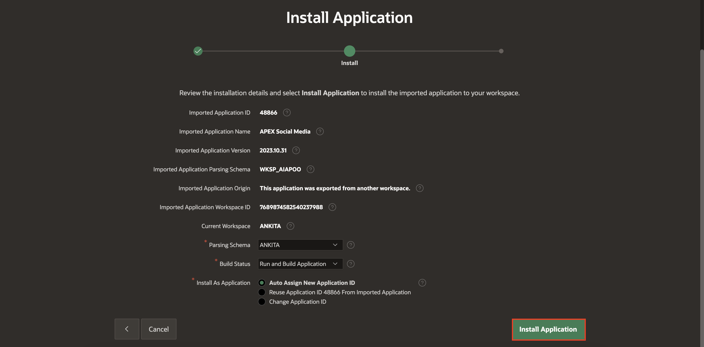
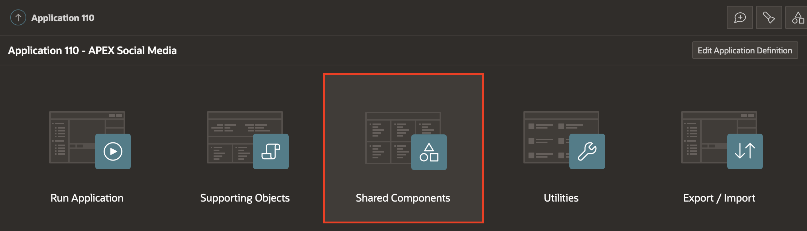

# Import the Social Media Application:

In this lab, you explore the integration of a Social Media application with OCI AI vision.

You can download the Catchup Scripts of the Social Media Application [here](files/APEX_Social_Media_HOL_FINAL.zip).

## Task 1: Import the Social Media application

1. On the Workspace home page, click the App Builder icon.
   On the App Builder home page, click Import.

    

2. The Import dialog displays. Download the Export File of the APEX Social Medial Application and then perform the following steps.
    - Drag and drop, or navigate to the file.
    - File Type - Indicate the type of export file to be imported. Select Application, Page, or Component Export.
    - File Character Set - Verify that the File Character Set is correct.
    - Click Next.
   The export file is imported. Next, you have the option to install it. You can also go ahead and install this file at a later time by navigating to the Export Repository.

    

3. To install the export file, click Next.

    

4. Click Install Application.

    

5. Install Supporting Objects - This option only appears if the Export includes supporting objects.
To continue and install supporting objects, enable Install Supporting Objects and click Next.

    

6. Click Install.

    

   The export is installed. What appears next, depends upon whether you install supporting objects.

7. Select the appropriate button:
    - Upgrade Application
    - Install Summary
    - Edit Application
    - Run Application
   In this scenario, please click Edit Application.

   

## Task 2: Change the Authentication Type in Social Media Application

The Social Media application is configured with a custom Security Authentication scheme. In this lab, you change the Authentication Type to Oracle APEX Accounts.

1. On the Workspace home page, click the App Builder icon. Select an application. On the Application home page, click Shared Components. The Shared Components page appears.

   

2. Under Security, select Authentication Schemes.
   The Authentication Schemes page appears.

   

3. To create a new authentication scheme, click Create.

   

4. Specify how the scheme should be created. In this case, select Based on a pre-configured scheme from the gallery.

   

5. Specify a Name for Authentication Scheme.  For Scheme Type, select Oracle APEX Account.

   

6. Click Create Authentication Scheme.

## Task 3: Add a Column to the Table using Object Browser

To collect the output generated by OCI AI Vision, you add a new column in SM_POSTS Table. This addition enables you to store and retrieve the relevant information seamlessly.

To Add a new column to the SM\_POSTS Table:

1. Navigate to Object Browser, Object Tree, expand Tables and select table SM_POSTS.

    

2. On the columns tab, Click Add Column under SM\_POSTS Table.

3. Configure the Add Column attributes. At a minimum, enter a column name and select a type. Depending upon the column type, specify whether the column requires precision, scale, a default value, or is nullable. For more details on an attribute, see field-level Help.

4. Enter the following and click Apply.
      - Column     - AI_OUTPUT
      - Data Type - VARCHAR2
      - Length     - 1000

   

## **Summary**
You now know how to import the Oracle APEX application, change the authentication type, and add a new column.

You may now **proceed to the next lab**.   

## Acknowledgments
- **Author** - Roopesh Thokala, Senior Product Manager
- **Co-Author** - Ankita Beri, Product Manager
- **Last Updated By/Date** - Ankita Beri, Product Manager, August 2023   
