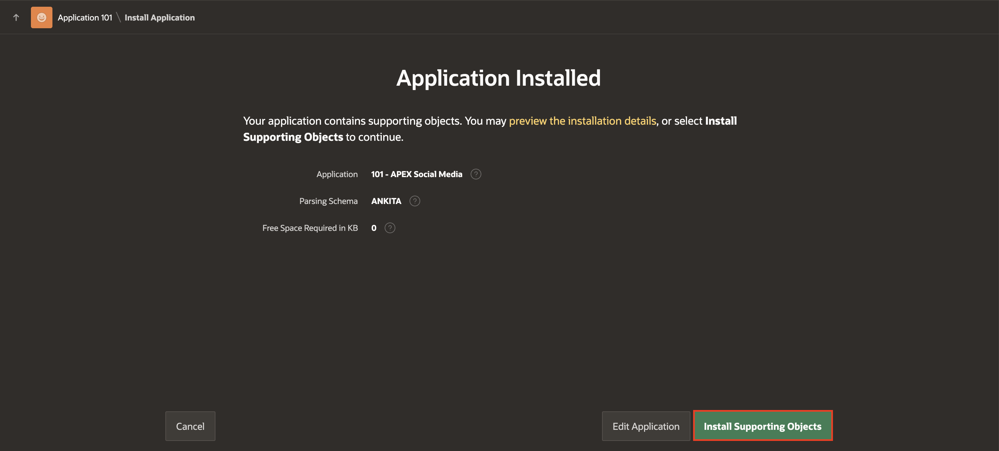
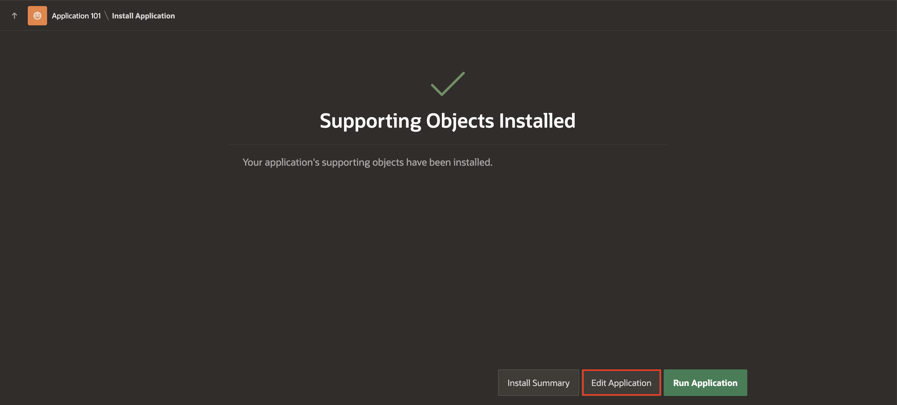
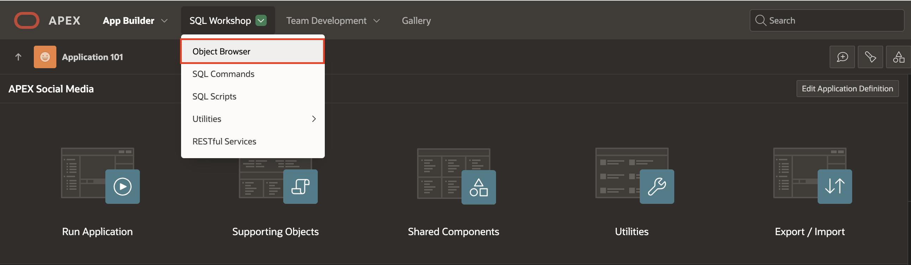
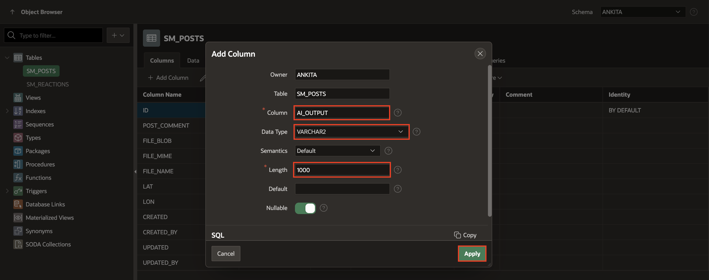

# Import the Social Media Application

## Introduction

In this lab, you import the Social Media application into your APEX workspace. You will use this imported app to integrate with the OCI Vision service.

You can download the Social Media Application [here](https://objectstorage.us-ashburn-1.oraclecloud.com/p/0Wfm2hnGpVe92JvuFjLYYIyouK4MgVpFDJyp9mKxuxfjAG6BB3P58m-79eOLKkPV/n/c4u04/b/livelabsfiles/o/developer-library/APEX_Social_Media_HOL_FINAL.zip).

Estimated Time: 15 Minutes

### Objectives
In this lab, you:

- Import the Social Media Application into your APEX workspace
- Add a Column to the Table using Object Browser to store the AI response

## Task 1: Import the Social Media Application

1. On the Workspace home page, click the **App Builder** icon.
   On the App Builder home page, click **Import**.

    

2. The Import dialog displays. Download the [Zip File](https://objectstorage.us-ashburn-1.oraclecloud.com/p/0Wfm2hnGpVe92JvuFjLYYIyouK4MgVpFDJyp9mKxuxfjAG6BB3P58m-79eOLKkPV/n/c4u04/b/livelabsfiles/o/developer-library/APEX_Social_Media_HOL_FINAL.zip) of the APEX Social Media Application and then perform the following steps.
    - Drag and drop, or navigate to the file.

    - File Type: Indicate the type of export file to be imported. Select **Application, Page, or Component Export**.

    - File Character Set: Verify that the File Character Set is correct.

    - Click **Next**.
   
   The export file is imported.

    

3. Accept the defaults, click **Install Application**.

    

4. Click **Install Supporting Objects**.

    

5. Click **Edit Application**.

   

## Task 2: Add a Column to the Table using Object Browser

To store the output generated by OCI AI Vision service, you add a new column in the SM\_POSTS Table. This addition enables you to store and retrieve the relevant information seamlessly.

To Add a new column to the SM\_POSTS Table:

1. Click **SQL Workshop** and navigate to **Object Browser**. 

    

2. In the object tree, expand Tables and select **SM\_POSTS** table. On the columns tab, click **Add Column**.

    

3. The Add Column wizard is displayed. Configure the Add Column attributes. At a minimum, enter a column name and select a type. Depending upon the column type, specify whether the column requires precision, scale, a default value, or is nullable. For more details on an attribute, see field-level Help.

   Enter the following:
      - **Column**: AI_OUTPUT
      - **Data Type**: VARCHAR2
      - **Length**: 1000

      Click **Apply**.

   

## Summary

You now know how to import an Oracle APEX application, add a new column to a table.

You may now **proceed to the next lab**.   

## Acknowledgments

- **Author** - Roopesh Thokala, Senior Product Manager
- **Co-Author** - Ankita Beri, Product Manager
- **Last Updated By/Date** - Ankita Beri, Product Manager, November 2023   
