# Integrate OCI Vision with Oracle APEX

## Introduction

OCI Vision can classify images into thousands of categories to simplify common digital asset management scenarios or identify items that need attention, such as anomaly in X-Ray. Developers can also identify and localise objects in images to automate counting of common items, such as packages and vehicles.

In this lab, you learn how to integrate OCI Vision REST API with Oracle APEX to analyse and index the images uploaded by the user.

## Task 1: Configure OCI Vision REST API as REST Data Source

In this task, you create a REST Data Source with OCI vision REST API as the endpoint.

1. Navigate to the application home page and Click Shared components.

   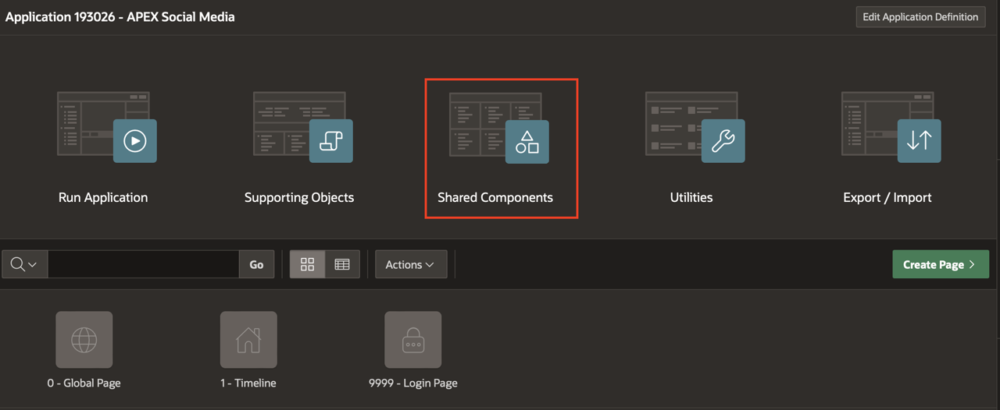

2. Click REST Data Sources under Data Sources.

   

3. Click Create.

   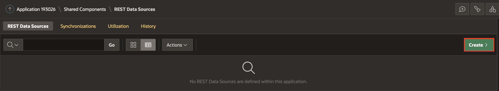

4. Select From scratch and Click Next.

   

5. Under Create REST Data Source, Enter the following attributes:
    - For Rest Data Source Type : Select ** Oracle Cloud Infrastructure (OCI)**

    - For Name : Enter **OCI Vision**

    - For URL Endpoint : Enter https://vision.aiservice.us-ashburn-1.oci.oraclecloud.com/20220125/actions/analyzeImage

*Note: URL Endpoint may differ based on your OCI tenancy. Refer to the below link for more details.
https://docs.oracle.com/en-us/iaas/api/#/en/vision/20220125/*

Click **Next**.

   

6. Under Create REST Data Source - Remote Server, Click **Next**.

   

7. Under Authentication,

    - For Authentication : Enable **Authentication Required**  

    - For Credentials: Select **apex\_ai\_cred**


8. Click REST Source Manually.
   REST data source is successfully created. The next step to configure the POST operation parameters for this REST Data Source.

   

9. On the REST Data Sources page, Click OCI Vision.

   

10. Select Operations Tab and Click Edit icon for the POST operation and Enter the following:
    - For Database Operation: Select **-Not Mapped-**

    - For Request Body Template: Copy and paste below JSON

    ```
   <copy>
      {
         "compartmentId": "#COMPARTMENT_ID#",
         "image": {
         "source": "INLINE",
         "data": "#FILE_DATA#"
       },
      "features": [
      {
         "featureType": "#FEATURE_TYPE#",
         "maxResults": 5
         }
        ]
      }
    <copy>
     ```

    

    

11. Under Operations Parameter, Click **Synchronize with Body** to auto-create substitutions strings in the request body template as operation parameters. Then, Click **OK**.

   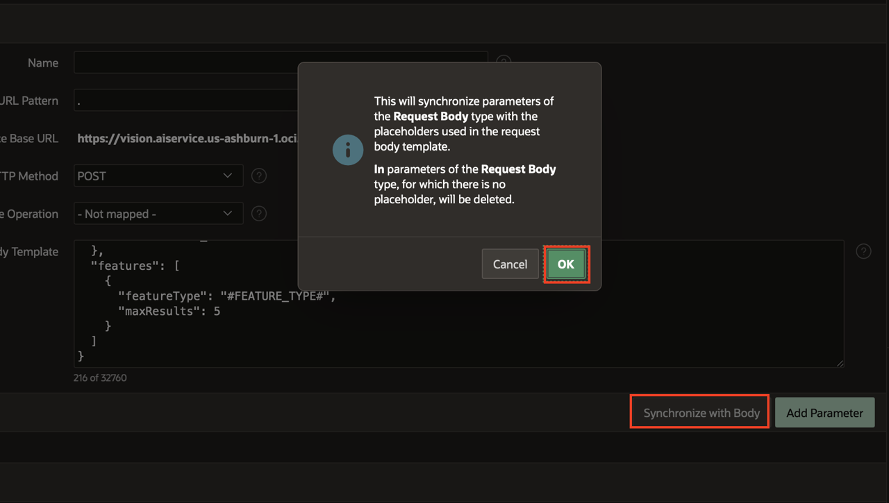

12. Select Operations Parameter Tab and Click **Add Parameter**

   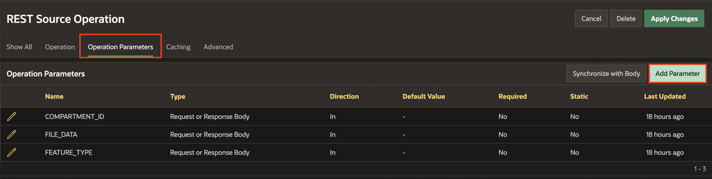

13. Under Edit REST Data Source Parameter:

    - For Type: Select **Request or Response Body**

    - For Name: Enter **RESPONSE**

    - For Direction: Select **Out**

    Click **Add and Add Another**

    

14. Under Edit REST Data Source Parameter:

    - For Type: Select **HTTP Header**

    - For Name: Enter **Content-Type**

    - For Direction: Select **In**

    - For Default value: Enter **application/json**

    - For Static: Enable Static

    Click **Add Parameter**

    

15. Click **Apply Changes**

    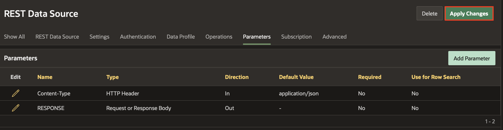


## Task 2: Invoke the OCI Vision REST Data Source through a page process

In this task, you create a page process to invoke the OCI Vision REST Data Source implemented in the previous task.


1. Navigate to Application Homepage by clicking on the Application ID.

   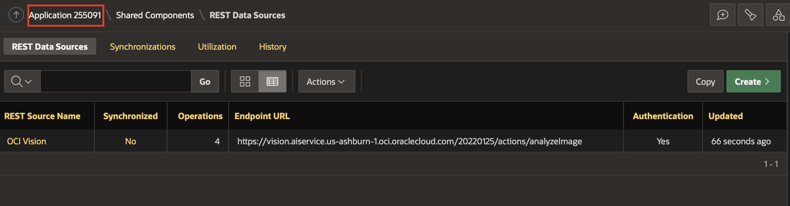

2. Click **1-Timeline** page.  

   

3. Right click **Timeline** region under Body and Click **Create Page Item**.

   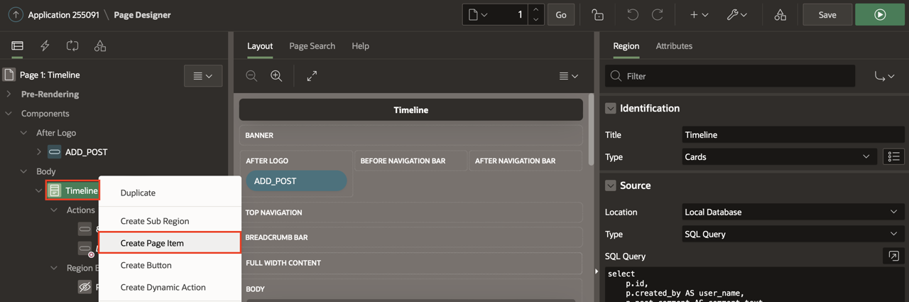

4. In the Property Editor, Enter the following:

   Under Identification:

    - For Name: Enter **P1\_RESPONSE**

    - For Type : Select **Hidden**

   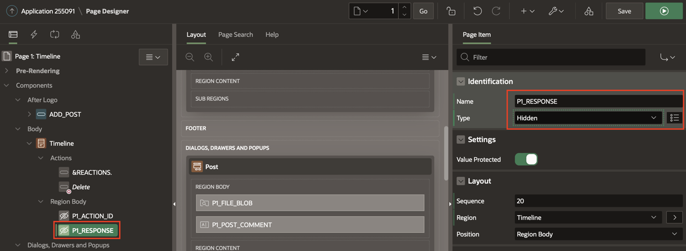

5. Navigate to Processing Tab (left pane) and Right click on Processing Tab or Processes and click Create Process.

   

6. In the Property Editor, Enter the following:

  Under Identification section:

    - For Name : Enter **Analyze Image**

    - For Type : Select **Execution Chain**

  Under Settings:

    - Enable **Execute in Background**

    

7. Right click on the Analyze Image Process you just created and Select Add Child Process.

    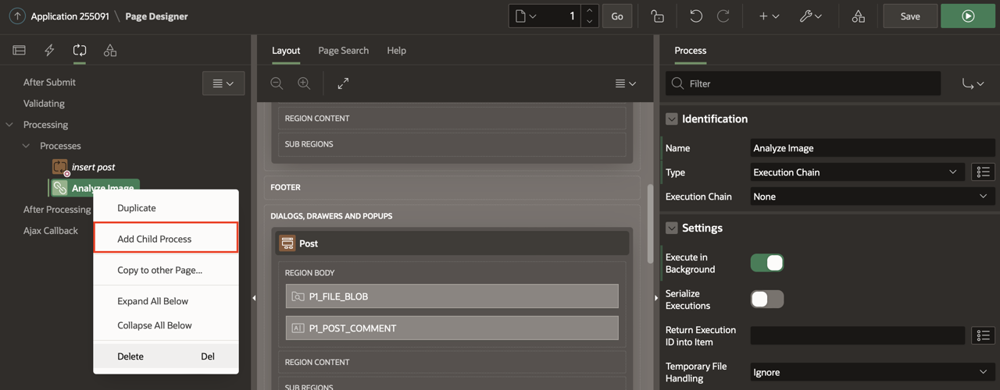

8. In the Property Editor, Enter the following:

   Under Identification section:

    - For Name : Enter **Invoke REST Data Source**

    - For Type : Select **Invoke API**

    - For Execution Chain : Select **Analyze Image**.

   Under Settings Section:

    - For Type : Select REST Source

    - For REST Source : Select OCI Vision

    - For Operation : Select **POST**

    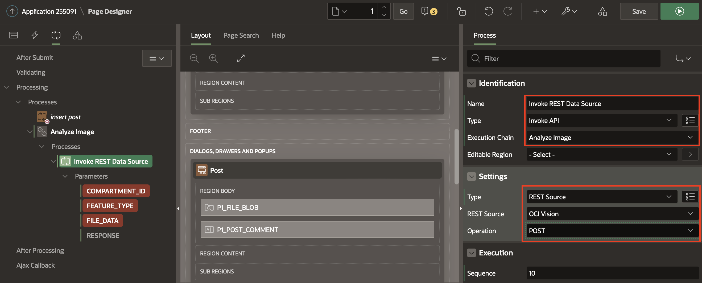

9. Click **COMPARTMENT\_ID** and Enter the following:

   Under Value :

    - For Type: Select **Static Value**

    - For Value: Enter the Compartment ID.

   *Note: If you are using the root compartment enter the tenancy OCID from the configuration preview file generated during API Key creation.If you are using a different compartment, you can find the corresponding compartment OCID from OCI Console.*

   

10. Click **FEATURE_TYPE** and Enter the following:

   Under Value :

    - For Type: Select **Static Value**

    - For Value: Enter **IMAGE_CLASSIFICATION**.

    

11. Click **FILE_DATA** and Enter the following:

   Under Value:

    - For Type: Select **SQL Query(Return Single Value)**

    - For SQL Query: Copy and paste it in the SQL Code editor:

   ```
   <copy>
   select replace(replace(apex_web_service.blob2clobbase64(file_blob), chr(10),''),chr(13),'')
   from SM_posts
   where ID = :P1_ID;
   <copy>
   ```

   

12. Click **RESPONSE** and Enter the following:

    - Under Parameter: Disable **Ignore Output**

    Under Value :

    - For Item: Select **P1\_RESPONSE**

    

13. Right click on the Analyze Image Process and Select Add Child Process.

    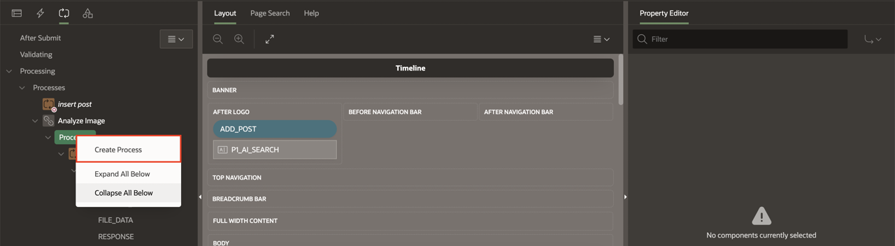

14. In the Property Editor,Enter the following:

    Under Identification :

    - For Name : Enter **Parse the Response**

   Under Source:

    - For PL/SQL : Copy and paste it in the PL/SQL Code editor:

  ```
  <copy>
  UPDATE SM_POSTS
  SET
    AI_OUTPUT = (
        SELECT
            LISTAGG(obj_name, ',') WITHIN GROUP(
            ORDER BY
                obj_name
            )
        FROM
            JSON_TABLE ( :P1_RESPONSE, '$.labels[*]'
                COLUMNS
                    obj_name VARCHAR2 ( 100 ) PATH '$.name[*]'
            )
    )
   WHERE
    ID = :P1_ID;
   <copy>
   ```

   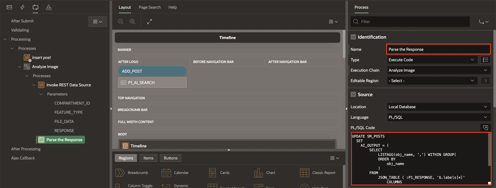

15. Click **Save**

## Task 3: Enhance Timeline Region to include AI Search
In this task, you create a page item P1\_AI\_SEARCH using which the end user can enter the search terms and search through the images.

1. Go To Rendering tab, right click on the After Logo section and select **Create Page Item**.

    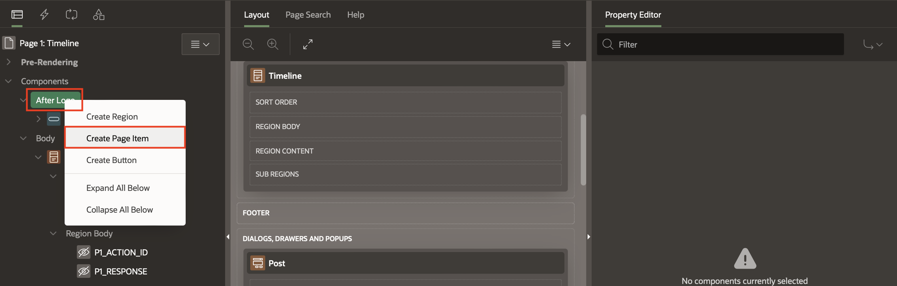

2. In the property editor, Enter the following:

   Under Identification:

    - For Name: Enter **P1\_AI\_SEARCH**

   Under Label:

    - For Label : Enter **AI Search**

   Under Settings:

    - Enable Submit when Enter pressed

   Under Appearance:

    - For Width : Enter **100**

   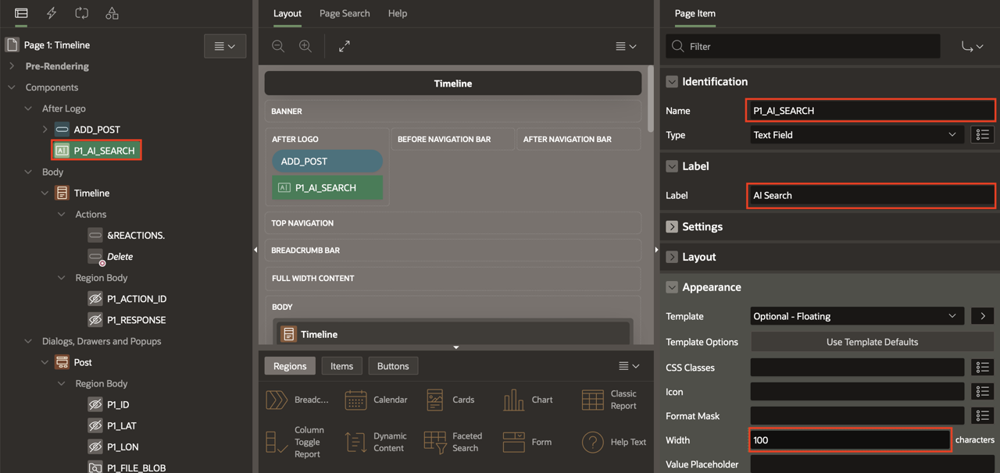

3. Select Timeline region, In the property editor, Enter the following:
   Under Source:
    - For SQL Query: Copy and paste the below SQL query in the code Editor

    ```
    <copy>
    select
    p.id,
    p.created_by AS user_name,
    p.post_comment AS comment_text,
    p.file_blob,
    p.file_mime,    
    apex_util.get_since(p.created) post_date,
    (
        select count(*) from SM_REACTIONS smr
        where smr.post_id=p.id
    ) as REACTIONS,
    (
        select 'user-has-liked' from SM_REACTIONS smr
        where smr.post_id=p.id and created_by=UPPER(:APP_USER)
    ) USER_REACTION_CSS
    from SM_POSTS p
    where (:P1_AI_SEARCH IS NOT NULL AND upper(ai_output) like upper('%'||:P1_AI_SEARCH||'%'))OR :P1_AI_SEARCH IS NULL
    order by p.created desc;
   <copy>
   ```
    - For Page items to Submit: Select **P1\_AI\_SEARCH**

    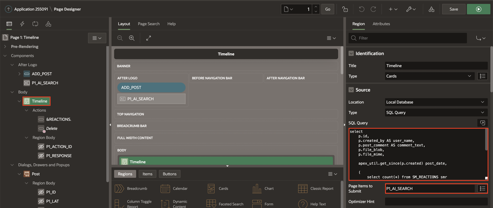

4. Click **Save and Run**.


## **Summary**
You now know how to integrate OCI AI Vision into Oracle APEX through a REST API Call.

You may now **proceed to the next lab**.   

## Acknowledgments
- **Author** - Roopesh Thokala, Senior Product Manager
- **Co-Author** - Ankita Beri, Product Manager
- **Last Updated By/Date** - Ankita Beri, Product Manager, August 2023
