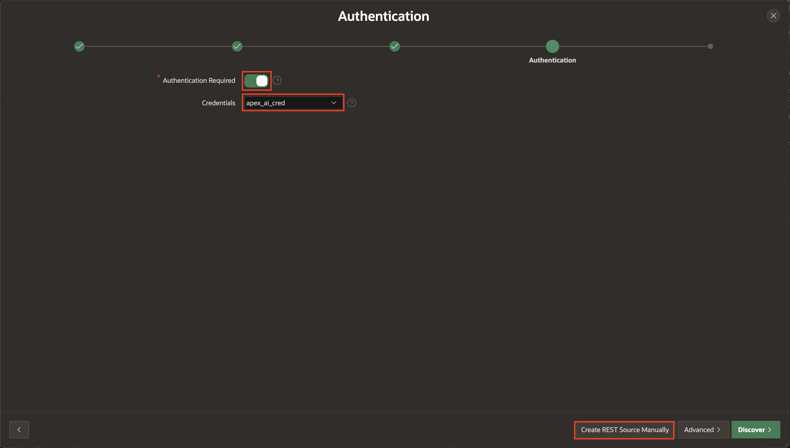
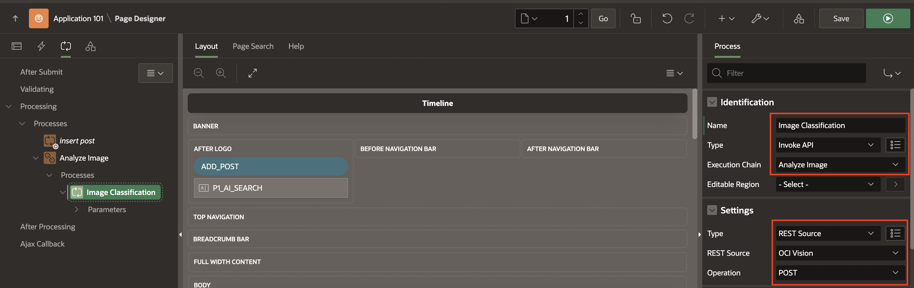
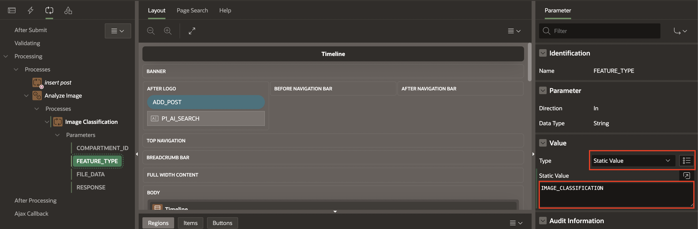
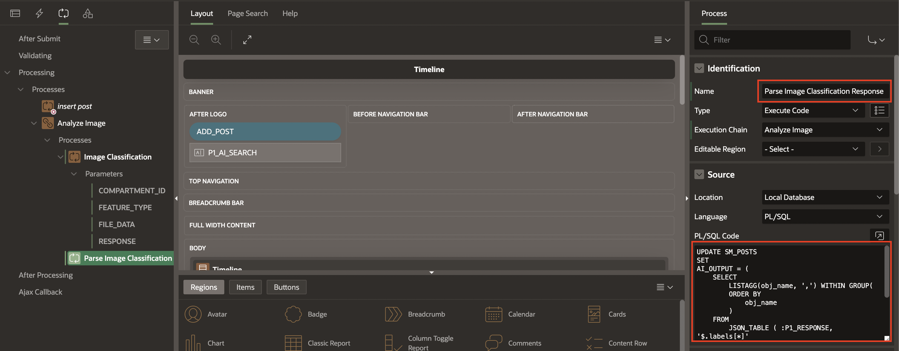
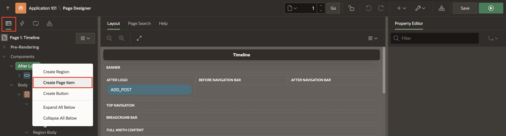

# Integrate OCI Vision with Oracle APEX

## Introduction

OCI Vision can classify images into thousands of categories to simplify common digital asset management scenarios or identify items that need attention, such as anomaly in an X-Ray. Developers can also identify and localise objects in images to automate counting of common items, such as packages and vehicles.

In this lab, you learn how to integrate OCI Vision REST API with Oracle APEX to analyse and index the images uploaded by the user.

Estimated Time: 20 Minutes

### Objectives
In this lab, you:

- Configure OCI Vision REST API as REST Data Source
- Invoke the OCI Vision REST Data Source through a Page Process
- Enhance Timeline Region to include AI Search

## Task 1: Configure OCI Vision REST API as REST Data Source

In this task, you create a REST Data Source with OCI vision REST API as the endpoint.

1. Navigate to the application home page and click **Shared Components**.

   

2. Under Data Sources, click **REST Data Sources**.

   

3. Click **Create**.

   

4. Select **From scratch** and click **Next**.

   

5. Under Create REST Data Source, enter the following attributes and click **Next**.
    - **Rest Data Source Type**: Oracle Cloud Infrastructure (OCI)

    - **Name**: OCI Vision

    - **URL Endpoint**: https://vision.aiservice.us-ashburn-1.oci.oraclecloud.com/20220125/actions/analyzeImage

    **Note**: URL Endpoint may differ based on your OCI tenancy. Refer to the following link for more details- https://docs.oracle.com/en-us/iaas/api/#/en/vision/20220125

   

6. Under Create REST Data Source - Remote Server, click **Next**.

   

7. Under Authentication,

    - **Authentication Required**: Toggle the button to **ON** 

    - **Credentials**: apex\_ai\_cred


8. Click **REST Source Manually**.
   REST data source is successfully created. The next step to configure the POST operation parameters for this REST Data Source.

   

9. On the REST Data Sources page, click **OCI Vision**.

   

10. Select Operations Tab and click **Edit icon** for the POST operation and enter the following:
    - **Database Operation**: -Not Mapped-

    - **Request Body Template**: Copy and paste JSON given below.

    ```
    <copy>
      {
         "compartmentId": "#COMPARTMENT_ID#",
         "image": {
         "source": "INLINE",
         "data": "#FILE_DATA#"
       },
      "features": [
      {
            "featureType": "#FEATURE_TYPE#",
            "maxResults": 5
         }
        ]
      }
    <copy>
     ```

    

    

11. Under Operation Parameters, click **Add Parameter**.

   

12. In the **Edit REST Data Source Parameter** wizard, add the following 5 parameters one after the other:

   |   | Type | Name | Direction | Default Value | Static |
   |---|-------|------|----------| --------------| ------ |
   | 1 | Request or Response Body| COMPARTMENT_ID | In |
   | 2 | Request or Response Body| FILE_DATA | In |
   | 3 | Request or Response Body| FEATURE_TYPE | In |
   | 4 | Request or Response Body| RESPONSE | Out |
   | 5| HTTP Header| Content-Type | In | application/json | ON
   {: title="POST Operation Parameters"}


    


    


    

17. Click **Apply Changes**.


## Task 2: Invoke the OCI Vision REST Data Source through a Page Process

In this task, you create a page process to invoke the OCI Vision REST Data Source implemented in the previous task.


1. Navigate to the application homepage by clicking on the **Application ID**.

   

2. Click **1-Timeline** page.  

   

3. Right-click **Timeline** region in the Rendering Pane and click **Create Page Item**.

   

4. In the Property Editor, enter the following:

   Under Identification:

    - **Name**: P1\_RESPONSE

    - **Type**: Hidden

   

5. Navigate to the **Processing** Tab (left pane), right-click **Processes** and select **Create Process**.

   

6. In the Property Editor, enter the following:

  Under Identification section:

    - **Name**: Analyze Image

    - **Type**: Execution Chain

  Under Settings:

    - Enable **Run in Background**.

    

7. Right click on the **Analyze Image** Process and select **Add Child Process**.

    

8. In the Property Editor, enter the following:

   Under Identification section:

    - **Name**: Invoke REST Data Source

    - **Type**: Invoke API

    - **Execution Chain**: Analyze Image

   Under Settings Section:

    - **Type**: REST Source

    - **REST Source**: OCI Vision

    - **Operation**: POST

    

9. Click **COMPARTMENT\_ID** and enter the following:

   Under Value :

    - **Type**: Static Value

    - **Value**: Enter the Compartment ID.

   *Note: If you are using the root compartment, enter the tenancy OCID from the configuration preview file generated during API Key creation. If you are using a different compartment, you can find the corresponding compartment OCID from OCI Console.*

   

10. Click **FEATURE_TYPE** and enter the following:

   Under Value :

    - **Type**: Static Value

    - **Value**: IMAGE_CLASSIFICATION

    

11. Click **FILE_DATA** and enter the following:

   Under Value:

    - **Type**: SQL Query(Return Single Value)

    - **SQL Query**: Copy and paste the below code in the SQL Code editor:

      ```
      <copy>
      select replace(replace(apex_web_service.blob2clobbase64(file_blob), chr(10),''),chr(13),'')
       from SM_posts
       where ID = :P1_ID;
      <copy>
      ```

   

12. Click **RESPONSE** and enter the following:

    - Under **Parameter**: Disable **Ignore Output**

    Under Value :

    - For **Item**: Select **P1\_RESPONSE**

    

13. Right click on the **Analyze Image** process and select **Add Child Process**.

    

14. In the Property Editor, enter the following:

    Under Identification :

    - For **Name** : Parse the Response

    Under Source:

    - For **PL/SQL Code** : Copy and paste the below code in the PL/SQL Code editor:

    ```
    <copy>
    UPDATE SM_POSTS
    SET
    AI_OUTPUT = (
        SELECT
            LISTAGG(obj_name, ',') WITHIN GROUP(
            ORDER BY
                obj_name
            )
        FROM
            JSON_TABLE ( :P1_RESPONSE, '$.labels[*]'
                COLUMNS
                    obj_name VARCHAR2 ( 100 ) PATH '$.name[*]'
            )
      )
     WHERE
     ID = :P1_ID;
     <copy>
     ```

   

15. Click **Save**.

## Task 3: Enhance Timeline Region to include AI Search
In this task, you create a search bar where the end user can enter the search terms and search through the images.

1. Go to the Rendering tab, right-click **After Logo** and select **Create Page Item**.

    

2. In the property editor, enter the following:

   Under Identification:

    - For Name: Enter **P1\_AI\_SEARCH**

   Under Label:

    - For Label : Enter **AI Search**

   Under Settings:

    - Enable **Submit when Enter pressed**

   Under Appearance:

    - For Width : Enter **100**

   

3. Select **Timeline** region, in the property editor, enter the following:
   Under Source:
    - For **SQL Query**: Copy and paste the below SQL query in the code Editor

    ```
    <copy>
    select
    p.id,
    p.created_by AS user_name,
    p.post_comment AS comment_text,
    p.file_blob,
    p.file_mime,    
    apex_util.get_since(p.created) post_date,
    (
        select count(*) from SM_REACTIONS smr
        where smr.post_id=p.id
    ) as REACTIONS,
    (
        select 'user-has-liked' from SM_REACTIONS smr
        where smr.post_id=p.id and created_by=UPPER(:APP_USER)
    ) USER_REACTION_CSS
    from SM_POSTS p
    where (:P1_AI_SEARCH IS NOT NULL AND upper(ai_output) like upper('%'||:P1_AI_SEARCH||'%'))OR :P1_AI_SEARCH IS NULL
    order by p.created desc;
   <copy>
   ```
    - For Page items to Submit: Select **P1\_AI\_SEARCH**

    

4. Click **Save and Run**.


## Summary
You now know how to integrate OCI AI Vision into Oracle APEX through a REST API Call.

You may now **proceed to the next lab**.   

## Acknowledgments
- **Author** - Roopesh Thokala, Senior Product Manager
- **Co-Author** - Ankita Beri, Product Manager
- **Last Updated By/Date** - Ankita Beri, Product Manager, November 2023
