# Integrate OCI Vision with Oracle APEX

## Introduction

OCI Vision can classify images into thousands of categories to simplify common digital asset management scenarios or identify items needing attention, such as X-ray anomalies. Developers can also identify and localize objects in images to automate counting common items, such as packages and vehicles.

Optionally, to get an overview of the OCI Vision service, try the [AI Services: Introduction to OCI Vision](https://livelabs.oracle.com/pls/apex/r/dbpm/livelabs/run-workshop?p210_wid=931&p210_wec=&session=6626792478361) workshop.

In this lab, you learn how to integrate OCI Vision REST API with Oracle APEX to analyze and index the images and images with text uploaded by the user.

Estimated Time: 20 Minutes

### Objectives

In this lab, you:

- Configure OCI Vision REST API as REST Data Source
- Invoke the OCI Vision REST Data Source for Image Classification
- Invoke the OCI Vision REST Data Source for Text Detection
- Enhance Timeline Region to include AI Search

## Task 1: Configure OCI Vision REST API as REST Data Source

In this task, you create a REST Data Source with OCI vision REST API as the endpoint.

1. Navigate to the application home page and click **Shared Components**.

   

2. Under Data Sources, click **REST Data Sources**.

   

3. Click **Create**.

   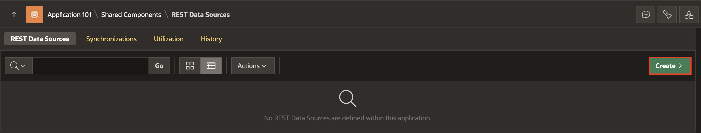

4. Select **From scratch** and click **Next**.

   

5. Under Create REST Data Source, enter the following attributes and click **Next**.

    - **Rest Data Source Type**: Oracle Cloud Infrastructure (OCI)

    - Rest Data Source Type: **Oracle Cloud Infrastructure (OCI)**

    - Name: **OCI Vision**

    - URL Endpoint: **<https://vision.aiservice.us-ashburn-1.oci.oraclecloud.com/20220125/actions/analyzeImage>**

    **Note**: URL Endpoint may differ based on your OCI tenancy. Refer to the following link for more details- <https://docs.oracle.com/en-us/iaas/api/#/en/vision/20220125>

   

6. Under Create REST Data Source - Remote Server, click **Next**.

   

7. Under Authentication,

    - Authentication Required: Toggle the button to **ON**

    - Credentials: **apex\_ai\_cred**

8. Click **Create REST Source Manually**.
   The REST data source is created successfully. The next step is to configure the POST operation parameters for this REST Data Source.

   

9. On the REST Data Sources page, click **OCI Vision**.

   

10. Select the Operations tab, click **Edit icon** for the POST operation and enter the following:
    - Database Operation: -Not Mapped-

    - Request Body Template: **Copy and paste the JSON given below.**
        ```
         <copy>
         {
             "compartmentId": "#COMPARTMENT_ID#",
             "image": {
             "source": "INLINE",
             "data": "#FILE_DATA#"
         },
         "features": [
         {
                 "featureType": "#FEATURE_TYPE#",
                 "maxResults": 5
             }
             ]
         }
         </copy>
        ```

    

    

11. Under Operation Parameters, click **Synchronize with body** and click **OK**.

    

    

12. Under Operation Parameters, Click **Add Parameter**.

    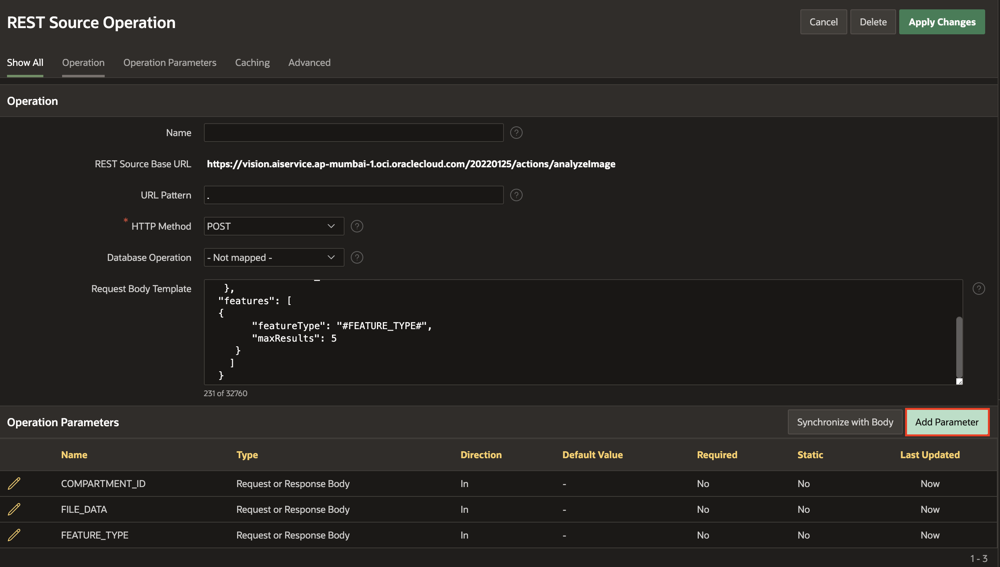

13. In the **Edit REST Data Source Parameter** dialog, add the following two parameters one after the other:

    |     | Type                     | Name         | Direction | Default Value    | Static |
    | --- | ------------------------ | ------------ | --------- | ---------------- | ------ |
    | 1   | Request or Response Body | RESPONSE     | Out       |
    | 2   | HTTP Header              | Content-Type | In        | application/json | ON     |
    {: title="POST Operation Parameters"}

    

    

14. Click **Apply Changes**.

    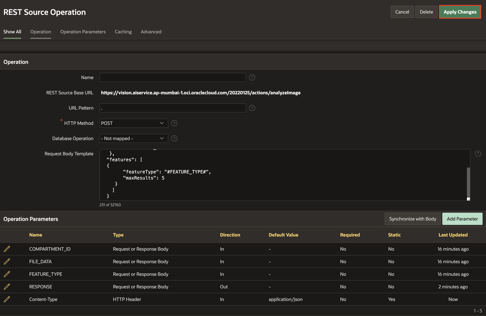

## Task 2: Invoke the OCI Vision REST Data Source for Image Classification

In this task, you create a page process to invoke the OCI Vision REST Data Source for image classification implemented in the previous task.

1. Navigate to the application homepage by clicking the **Application ID**.

   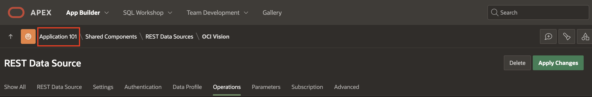

2. Click **1-Timeline** page.

   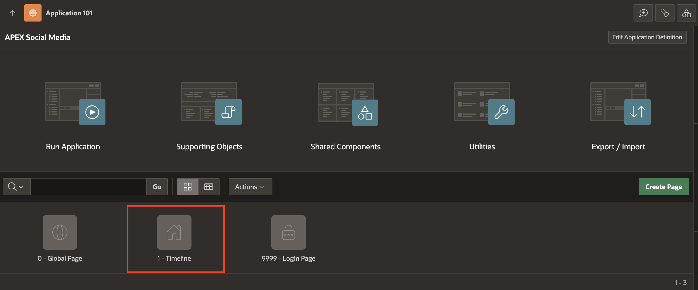

3. Right-click **Timeline** region in the Rendering Pane and Select **Create Page Item**.

   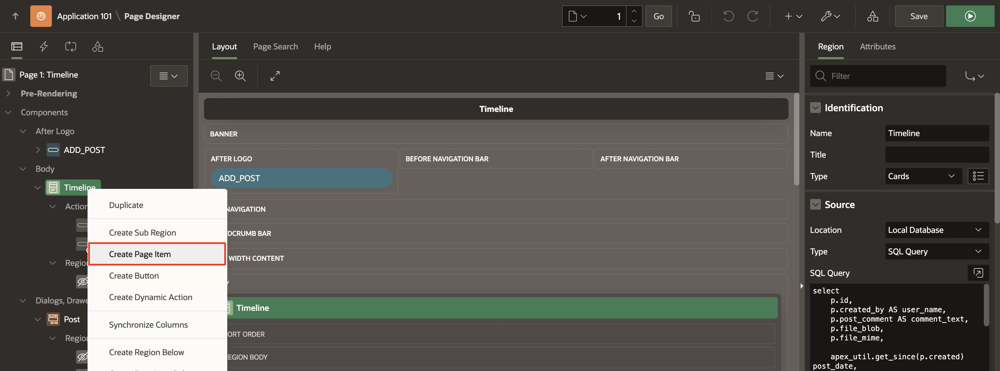

4. In the Property Editor, enter the following:

    - Under Identification:

        - Name: **P1\_RESPONSE**

        - Type: **Hidden**

   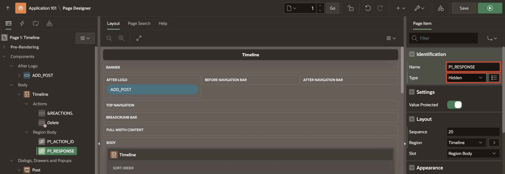

5. Navigate to the **Processing** Tab (left pane), right-click **Processes** and select **Create Process**.

   

6. In the Property Editor, enter the following:

    - Under Identification:

        - Name: **Analyze Image**

        - Type: **Execution Chain**

    - Settings > Enable **Run in Background**.

    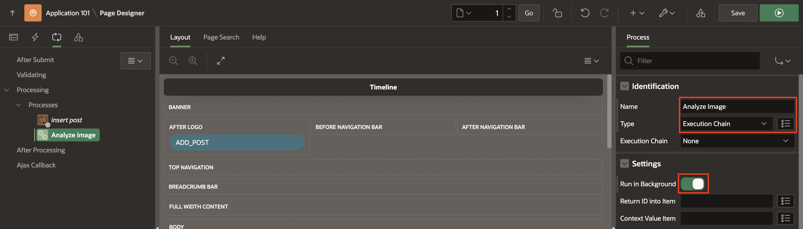

7. Right click on the **Analyze Image** process and select **Add Child Process**.

    

8. In the Property Editor, enter the following:

    - Under Identification:

        - Name: **Image Classification**

        - Type: **Invoke API**

    - Under Settings:

        - Type: **REST Source**

        - REST Source: **OCI Vision**

        - Operation: **POST**

    

9. Expand Parameters and Select **COMPARTMENT\_ID** and enter the following:

    - Under Value:

        - Type: **Static Value**

        - Value: **Enter the Compartment ID.**

   *Note: If using the root compartment, enter the tenancy OCID from the configuration preview file generated during API Key creation. If you use a different compartment, you can find the corresponding compartment OCID from the OCI Console.*

   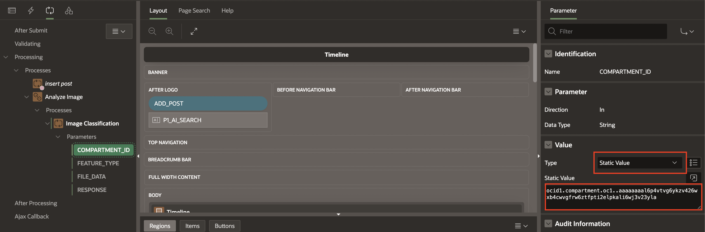

10. Select **FEATURE_TYPE** and enter the following:

    - Under Value:

        - Type: **Static Value**

        - Value: **IMAGE_CLASSIFICATION**

    

11. Select **FILE_DATA** and enter the following:

    - Under Value:

        - Type: **SQL Query (Return Single Value)**

        - SQL Query: Copy and paste the below code in the SQL Code editor:

            ```
             <copy>
             select replace(replace(apex_web_service.blob2clobbase64(file_blob), chr(10),''),chr(13),'')
             from SM_posts
             where ID = :P1_ID;
             </copy>
            ```

    

12. Select **RESPONSE** and enter the following:

    - Parameter > Disable **Ignore Output**

    - Value > Item: Select **P1\_RESPONSE**

    

13. Right click on the **Analyze Image** process and select **Add Child Process**.

    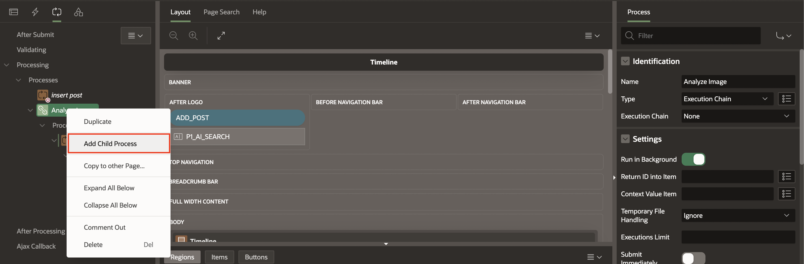

14. In the Property Editor, enter the following:

    - Identification > Name: **Parse Image Classification Response**

    - Source > PL/SQL Code: Copy and paste the below code in the PL/SQL Code editor:

        ```
         <copy>
         UPDATE SM_POSTS
         SET
         AI_OUTPUT = (
            SELECT
                LISTAGG(obj_name, ',') WITHIN GROUP(
                ORDER BY
                    obj_name
                )
            FROM
                JSON_TABLE ( :P1_RESPONSE, '$.labels[*]'
                    COLUMNS
                        obj_name VARCHAR2 ( 100 ) PATH '$.name[*]'
                )
         )
         WHERE
         ID = :P1_ID;
         </copy>
        ```

    

15. Click **Save**.

## Task 3: Invoke the OCI Vision REST Data Source for Text Detection

In this task, you duplicate the page process to invoke the OCI Vision REST Data Source for text detection.

1. Under Processing, right-click **Image Classification** and select **Duplicate**. Drag and drop it under Parse Image classification Response.

    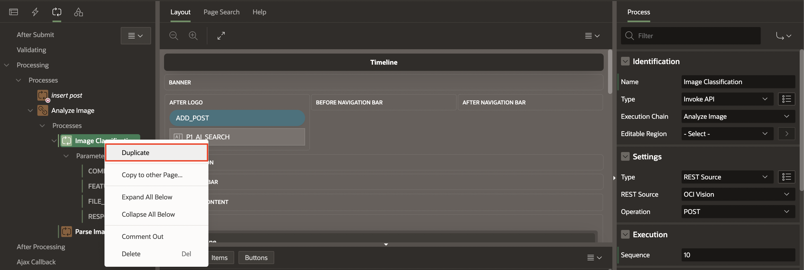

    

2. In the Property Editor, enter the following:

    - Identification > Name: **Text Detection**

    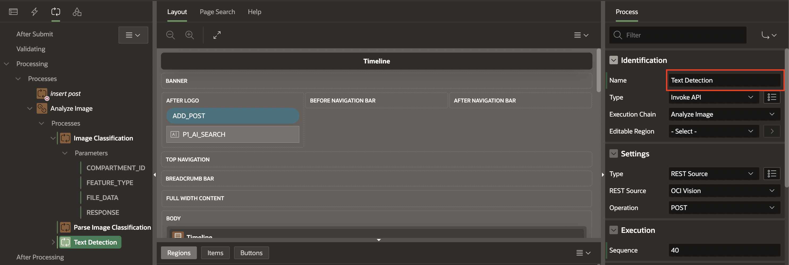

3. Expand Parameters, select **FEATURE_TYPE** and enter the following:

    - Under Value :

        - Type: **Static Value**

        - Value: **TEXT_DETECTION**

    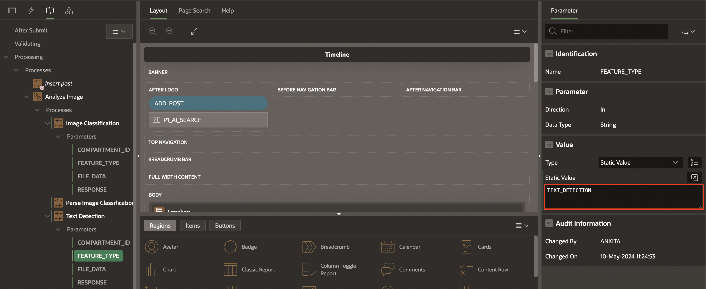

4. Right click on the **Parse Image classification Response** child process and select **Duplicate**. Drag and drop it after **Text Detection**.

    

    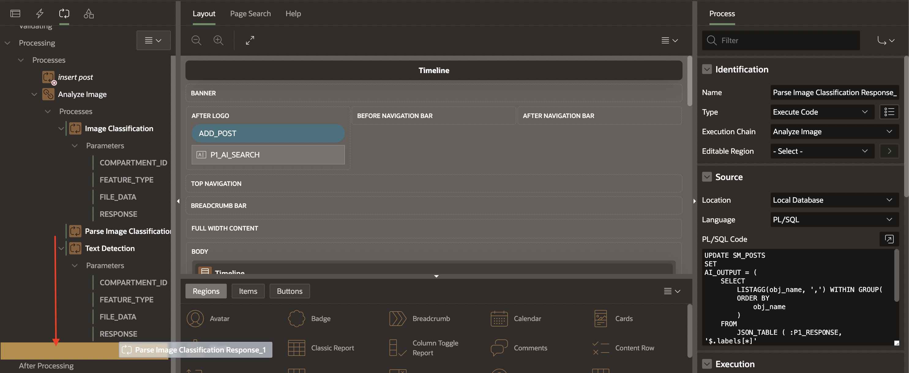

5. In the Property Editor, enter the following:

    - Identification > Name : **Parse Text Detection Response**

    - Source > PL/SQL Code: Update the below code in the PL/SQL Code editor:

        ```
         <copy>
         UPDATE SM_POSTS
         SET
         AI_OUTPUT_TD = (
            SELECT
                LISTAGG(obj_name, ',') WITHIN GROUP(
                ORDER BY
                    obj_name
                )
            FROM
                JSON_TABLE ( :P1_RESPONSE, '$.imageText.words[*]'
                    COLUMNS
                        obj_name VARCHAR2 ( 100 ) PATH'$.text[*]'
                )
         )
         WHERE
         ID = :P1_ID;
         </copy>
        ```

        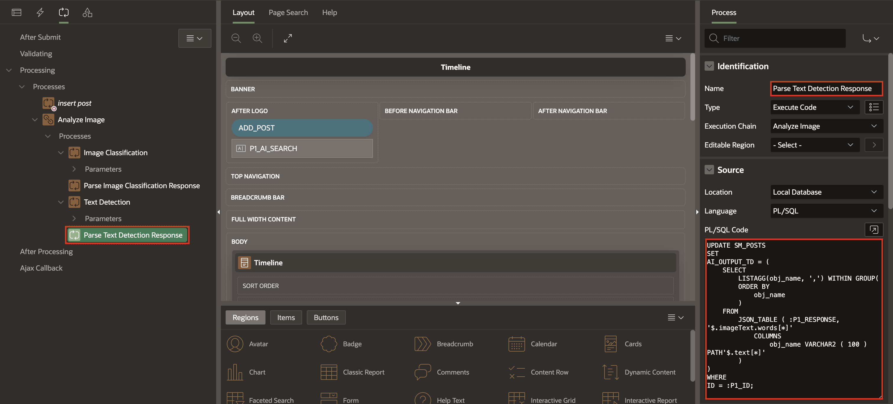

6. Click **Save**.

## Task 4: Enhance Timeline Region to include AI Search

In this task, you create a search bar where the end user can enter the search terms and search through the images and texts.

1. Go to the Rendering tab, right-click **After Logo** and select **Create Page Item**.

    

2. In the property editor, enter the following:

    - Identification > Name: **P1\_AI\_SEARCH**

    - Label > Label: **AI Search**

    - Settings > Enable **Submit when Enter pressed**

    - Appearance > Width: **100**

   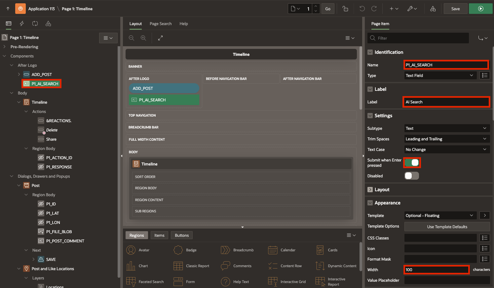

3. Select the **Timeline** region in the property editor and enter the following:

    ```
     <copy>
     select
     p.id,
     p.created_by AS user_name,
     p.post_comment AS comment_text,
     p.file_blob,
     p.file_mime,
     apex_util.get_since(p.created) post_date,
     (
     select count(*) from SM_REACTIONS smr
     where smr.post_id=p.id
     ) as REACTIONS,
     (
     select 'user-has-liked' from SM_REACTIONS smr
     where smr.post_id=p.id and created_by=UPPER(:APP_USER)
     ) USER_REACTION_CSS
     from SM_POSTS p
     where (:P1_AI_SEARCH IS NOT NULL AND
     (upper(ai_output) like upper('%'||:P1_AI_SEARCH||'%') OR upper(ai_output_td) like upper('%'||:P1_AI_SEARCH||'%')
     )
     )OR :P1_AI_SEARCH IS NULL
     order by p.created desc;
     <copy>
    ```

    - Page items to Submit: Select **P1\_AI\_SEARCH**

    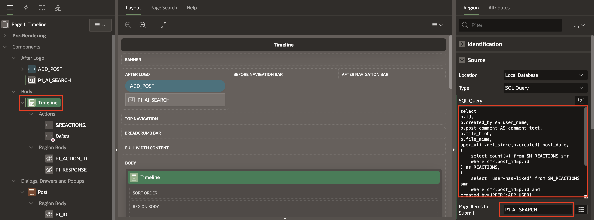

4. Click **Save and Run**.

## Summary

You now know how to integrate OCI AI Vision into Oracle APEX through a REST API Call.

You may now **proceed to the next lab**.

## Acknowledgments

- **Author** - Roopesh Thokala, Senior Product Manager
- **Co-Author** - Ankita Beri, Product Manager
- **Last Updated By/Date** - Sahaana Manavalan,Senior Product Manager, January 2025
