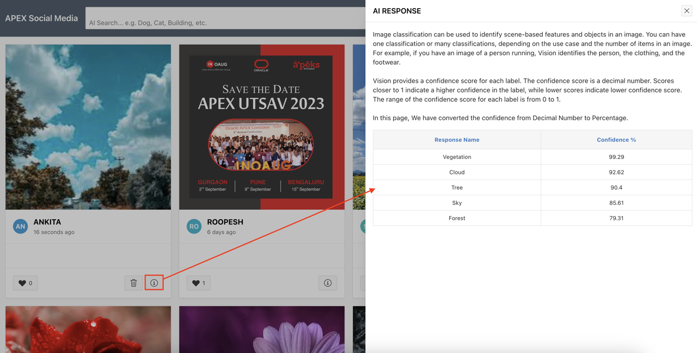

# Run the Application

## Introduction

In this lab, you run APEX Social Media application and perform the AI Search on the uploaded images.

## Task 1 : Run the Application

1. Login to the application using the credentials created under Manage Users and Groups.

    *Note: If you are using any other authentication types, Login using your Credentials.*

    

2. Click Add Post Button available on the Navigation Bar.

3. Drag and Drop the image from your local system or use the Choose File button to upload image from your local system. Then, Click Post.

    

    

4. Now, Type your Search Term in the AI Search Field available in the Navigation Bar and then Click Enter.

    

## **Summary**
You now know how to post image and Search Term in the AI Search.

## Acknowledgments
- **Author** - Roopesh Thokala, Senior Product Manager
- **Co-Author** - Ankita Beri, Product Manager
- **Last Updated By/Date** - Ankita Beri, Product Manager, August 2023
