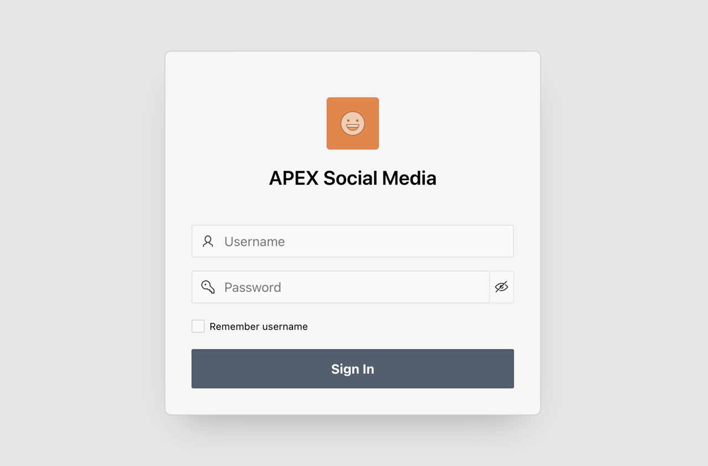
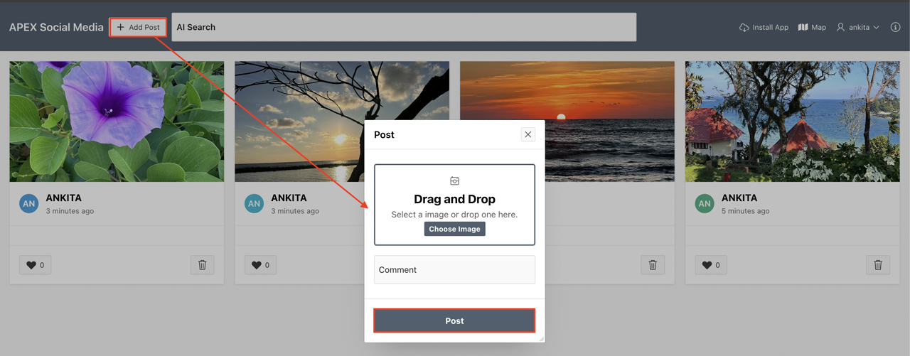
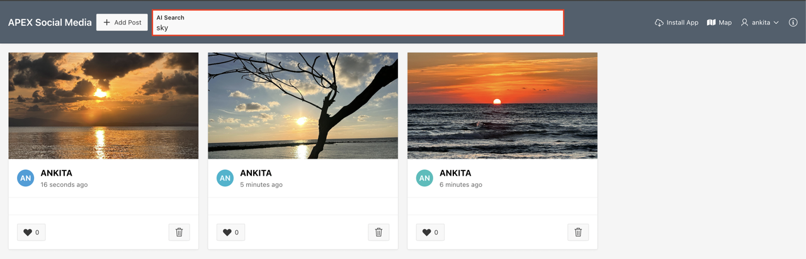
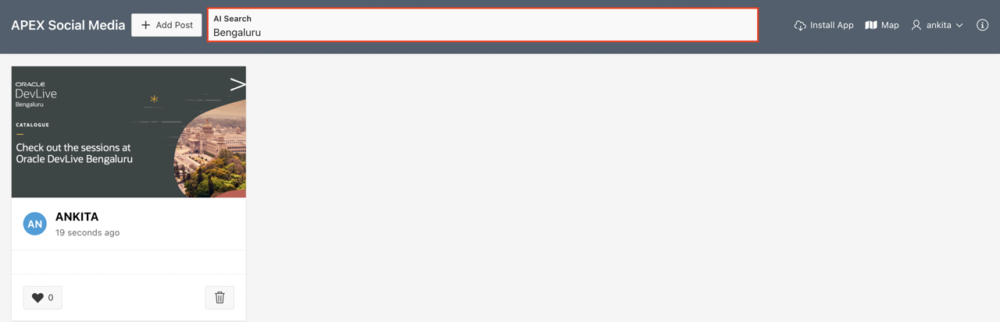

# Run the Application

## Introduction

In this lab, you run the APEX Social Media application and perform AI Search on the uploaded images.

Estimated Time: 5 minutes

### Objectives

In this lab, you learn how to:

- Run the application.
- Upload images to the Timeline page.
- Search images using AI Search.

## Task 1: Run the Application

1. Log in to the application using your APEX workspace credentials.

    

2. Click **Add Post** on the navigation bar.

3. Drag and drop the image from your local system, or use the **Choose File** button to upload an image from your local system.

    Click **Post**.

    

    The image is posted to your timeline. Add additional posts as needed.

4. Enter a search term in the AI Search field available in the navigation bar.

   Press **Enter**.

    The application searches for and displays all images that contain the corresponding search term.

    *Note: Image analysis runs in the background. If a newly uploaded image does not appear in the search results immediately, wait a few seconds and search again.*

    In the following example, when you enter **Sky** in the AI Search field, the application displays all images with the sky for image classification.

    

    In the following example, for text detection, when you enter **Bengaluru** in the AI Search field, the application displays all images with the text **Bengaluru**.

    

## Summary

You now know how to post an image and search for images and text within images using AI search.

You may now **proceed to the next lab**.

## Acknowledgments

- **Author** - Roopesh Thokala, Principal Product Manager; Ankita Beri, Senior Product Manager
- **Last Updated By/Date** - Sahaana Manavalan, Senior Product Manager, May 2026

## Acknowledgements

* **Author** - TODO: Your Name, Your Title, Your Organization
* **Last Updated By/Date** - TODO: Your Name, Month Year
