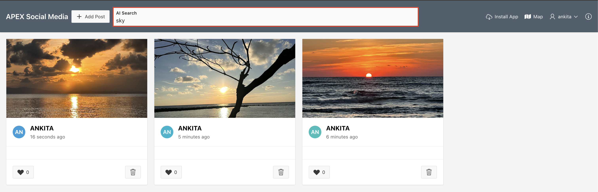

# Run the Application

## Introduction

In this lab, you run the APEX Social Media application and perform AI Search on the uploaded images.

Estimated Time: 5 Minutes

### Objectives

In this lab, you:

- Run the Application

## Task 1: Run the Application

1. Login to the application. The username and password are the same as your APEX workspace user credentials.

    

2. Click **Add Post** on the Navigation Bar.

3. Drag and Drop the image from your local system or use the **Choose File** button to upload an image from your local system. Then, click **Post**.

    

    The image has been posted on your timeline. Similarly, add as many posts as you would like.

4. Now, type your Search Term in the AI Search Field available in the Navigation Bar and then click **Enter**. The app searches for and displays all the images that contain the corresponding search term.

    In the following example, when you enter 'Sky' in the AI Search Field, the app displays all the images with the sky for image classification.

    

    In the following example, for text detection, when you enter 'Bengaluru' in the AI Search Field, the app displays all the images with the text 'Bengaluru'.

    

## Summary

You now know how to post an image and search for images and images with text using AI search.

## Acknowledgments

- **Author** - Roopesh Thokala, Senior Product Manager
- **Co-Author** - Ankita Beri, Product Manager
- **Last Updated By/Date** - Sahaana Manavalan,Senior Product Manager, January 2025
