# Enhance the App with Mobile Features

## Introduction

In this lab, you improve the user experience of the Social Media App by including an APEX 23.2 new item called Image Upload that allows the user to crop images before uploading. You also implement a 'Share' button where a user can share the uploaded images to other users via email or 3rd party apps. Finally, you add mobile capabilities to the app by enabling Push Notifications for the Social Media App where a user receives a notification on their device whenever a user likes the image. You also learn to add Shortcuts and Screenshots to the pwa app.

Estimated Time: 30 minutes

### Objectives

In this lab, you:

- Implement the crop image feature while adding a new post
- Add a 'Share' button to share the post using other apps
- Enable Push Notifications
- Add Shortcuts to the pwa app
- Include screenshots to be displayed while installing the pwa app

## Task 1: Add the Image Upload item

In this task, you make use of the Image Upload item that allows user to crop images before adding a post.

1. In the Timeline page, navigate to the **P1\_FILE\_BLOB** item in the rendering tree. 
In the Property Editor, for Identification -> Type, select **Image Upload**.

    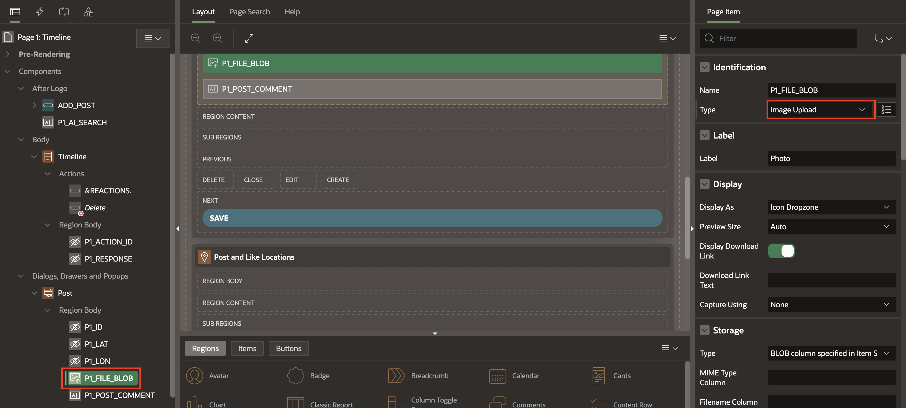

2. In the Property editor, update the following:
    - Under Display, for Display As: Select **Block Dropzone**
    - Under Cropping, toggle **Allow Cropping** to ON.

    

3. Click **Save and Run** to test the changes.
    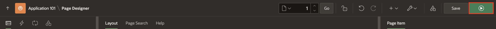

4. Click **Add Post**. An Image Upload dialog opens. Choose an image or drag-and-drop the image. You will now be able to crop the image and click on **Apply Changes**. Once ready, click on **Post** to post the image to your Timeline.

    


    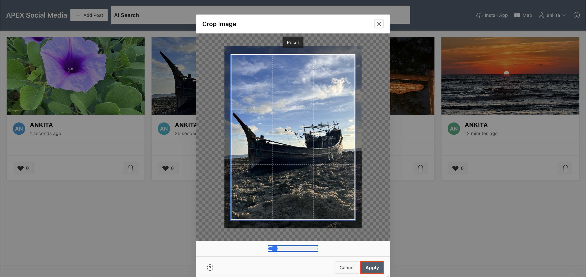


5. The new image now appears on your Social Media Timeline.
    


## Task 2: Add the Share Button

In this task, you add a Share button that allows a user to share the post via email, or other apps.

**Note**: 
- On macOS, Share will **NOT** work on Chrome and Firefox browsers. Use Edge or Safari browsers. 
- On Windows, Share will **NOT** work on Edge browser. Use Chrome, Edge or Safari browsers.

1. Navigate to the Timeline page. Under the **Timeline** region, right-click **Actions** and select **Create Action**.

    

2. In the Property Editor, update the following properties:
    - Under Identification:
        - **Type**: Button
        - **Label**: Share
    - Under Link:
        - **Type**: Redirect to URL
        - Target: 
            - **Type**: URL
            - **URL**: #action$share?id=&ID.

            Click **Ok**.

    

    

3. In the Property Editor, under the Appearance group, update the following properties:
    - **Display Type**: Icon
    - **Icon**: fa-share-alt

    

4. In the Rendering Tree on the left pane, select **Page 1: Timeline**. In the Property Editor, update **Javascript > Execute When Page Loads** with the following code snippet:

    ```
    <copy>
        apex.actions.add([{
        name: "like",
        action: (event, element, args) => {
            apex.items.P1_ACTION_ID.value = args.id;
            apex.event.trigger(document, 'action-like');
        }
    }, {
        name: "delete",
        action: (event, element, args) => {
            apex.items.P1_ACTION_ID.value = args.id;
            apex.event.trigger(document, 'action-delete');
        }
    }, {
        name: "open-map",
        action: () => {
            apex.event.trigger(document, 'action-open-map');
        }
    }, {
        name: "open-about",
        action: () => {
            apex.event.trigger(document, 'action-open-about');
        },
    },
    {
        name: "share",
        action: (event, element, args) => {
            apex.items.P1_ACTION_ID.value = args.id;
            apex.event.trigger(document, 'action-share');
    }
}
 
]);
</copy>
```

    

    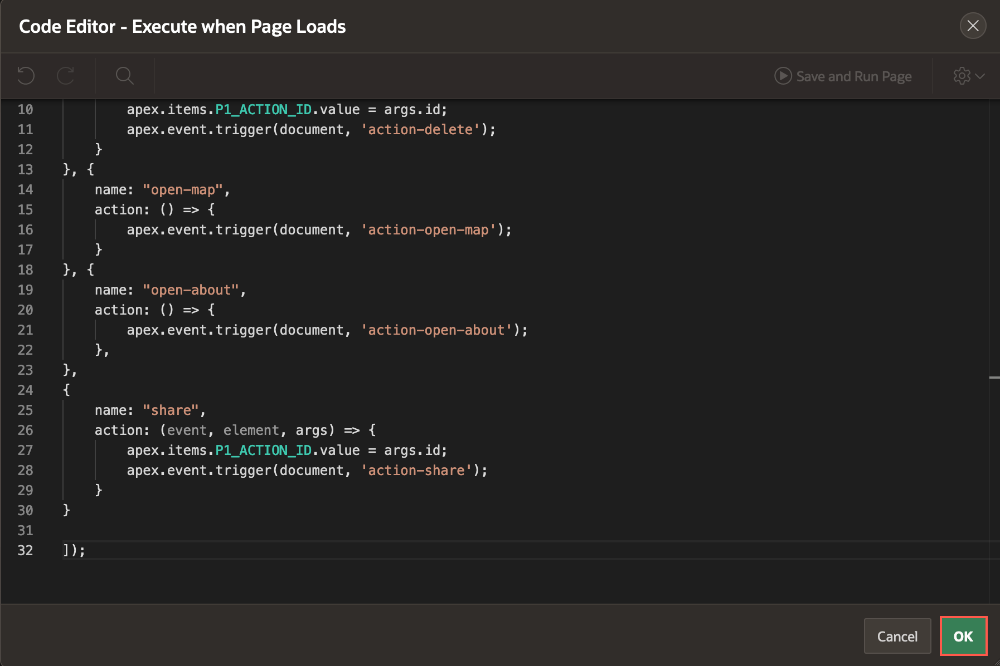

5. In the Rendering Tree, click on the **Dynamic Actions** tab. Right-click on **Custom** and select **Create Dynamic Action**.
    


6. In the Property Editor, update the following properties:
    - Identification > Name: **action-share**
    - Under When:
        - Event: **Custom**
        - Custom Event: **action-share**
        - Selection Type: **Javascript Expression**
        - Javascript Expression: **document**
    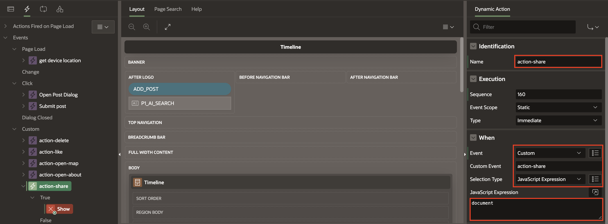

7. In the left pane, under **action-share**, click on the **True** action. Now, in the property editor, update the following properties:
    - **Identification > Action**: Share
    - Under Settings:
        - **Title**: Image Shared on Social Media App
        - **Text**: &APP_USER. is sharing a file.
        - **Share Type**: File(s)
        - **File(s) Source**: SQL Query
        - **SQL Query**: 
            ```
            <copy>
                SELECT FILE_BLOB, FILE_NAME, FILE_MIME 
                FROM SM_POSTS WHERE ID = :P1_ACTION_ID;
            </copy>
            ```
        - **Items to Submit**: P1\_ACTION\_ID

    


8. **Save and Run** the page. You can see a Share button for each post. Click on **Share** to open a context menu and choose the app you want to share with. In this example, choose **Mail** and the post is attached as an image in an email draft with an associated text.

    

    

## Task 3: Enable Push Notifications

In this task, you enable Push Notifications for the Social Media App. Whenever a user 'Likes' your post, you will receive a Push Notification on your system.

1. First, we need to add a new column to the SM\_REACTIONS table in order to track the notifications. To do so, navigate to the Object Browser and select **SM\_REACTIONS** table on the left. On the right pane, click **Add Column**.

    

2. In the Add Column wizard, enter the following information:
    - **Column**: NOTIFIED
    - **Data Type**: VARCHAR2
    - **Length**: 1
    - **Deafult**: 'N'  (By default, all rows in the SM\_REACTIONS will have the default value 'N' to indicate that the user has not yet been notified.)

    Click **Apply**.

    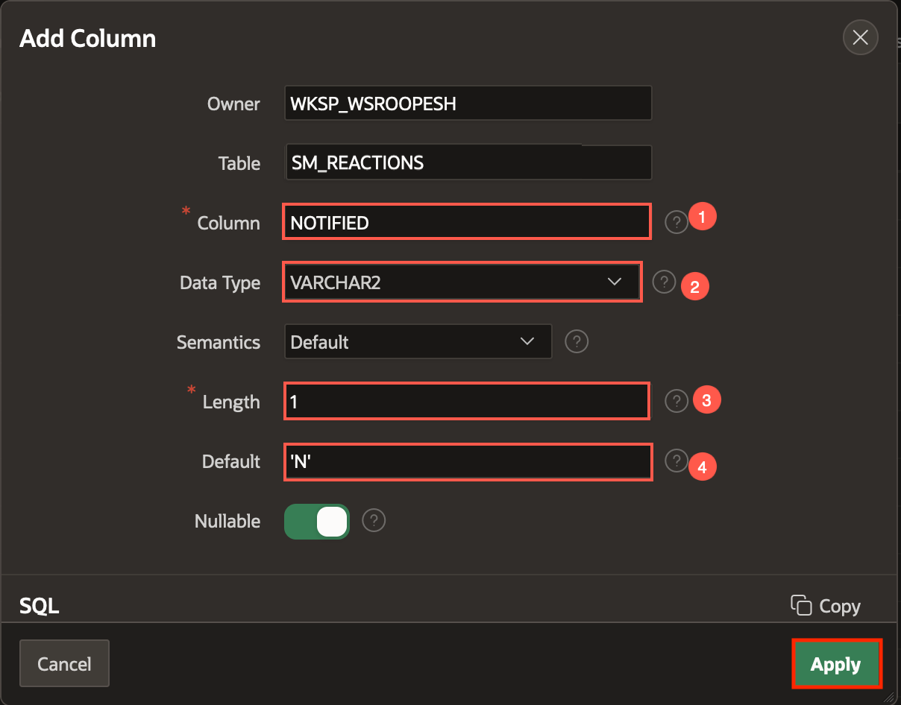

3. The next step is to create an Automation. This automation will frequently check if there has been any update to the SM\_POSTS table and will trigger the Push Notification accordingly. 
To create an Automation, navigate to **Shared Components** and under Workflows and Automations, click **Automations**.

    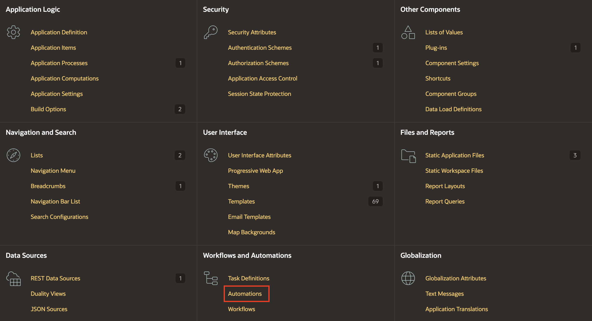

4. Click **Create**.

    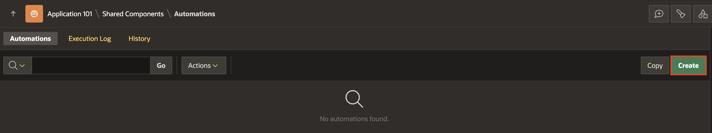

5. In the Create Automation wizard, enter the following:
    - **Name**: Notification
    - **Type**: Scheduled
    - **Execution Schedule**: Custom
    - **Frequency**: Minutely
    - **Interval**: 2
    
    Click **Next**.

    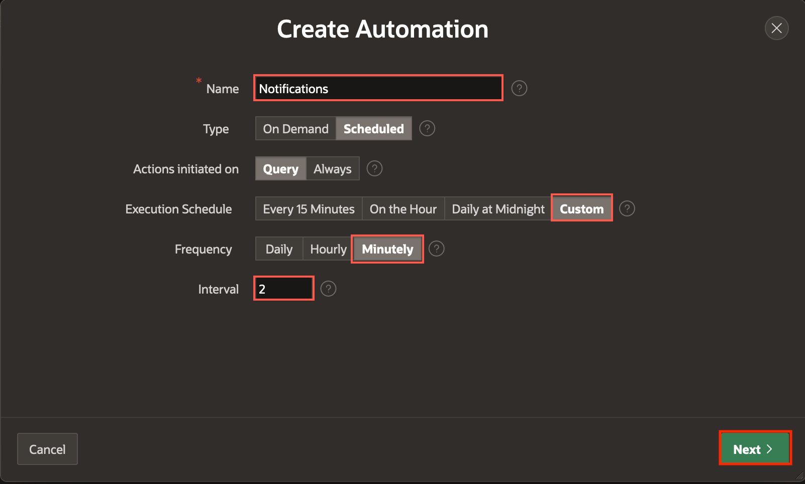

6. For **Source Type**, select **SQL Query** and enter the following SQL statement in the code box:
    ```
    <copy>
        SELECT r.id, p.created_by as post_owner, r.created_by as liked_by 
        from SM_POSTS p, SM_REACTIONS r 
        where p.id (+) = r.post_id and r.notified = 'N'
    </copy>
    ```

    Click **Create**.

    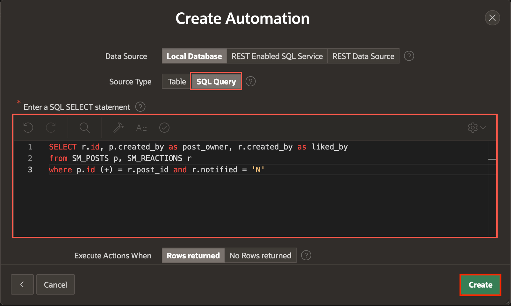

7. Automation has been created and is in *Disabled* state. Under Settings, change the 'Schedule Status' to **Active**.

    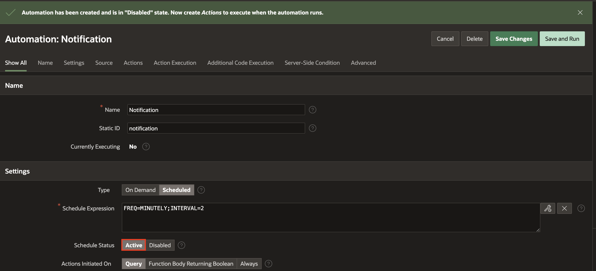

8. Now, let us create two Actions to execute when the automation runs. Scroll down to **Actions** and click on the **Edit icon** for New Action.

    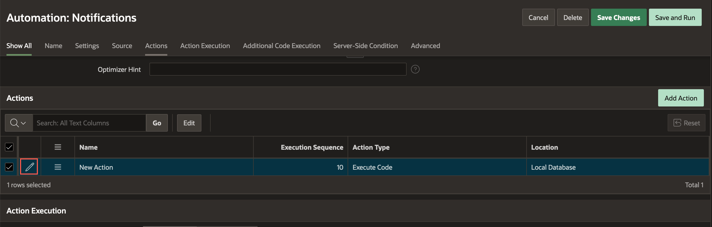

9. In the Edit Action page, update the following informations:
    - **Name**: Send Push Notification
    - **Type**: Send Push Notification
    - **To**: &POST\_OWNER.
    - **Title**: &LIKED\_BY. liked your post.
    
    Click **Apply Changes**.

    

10. Click **Add Action** to add a second action. 

    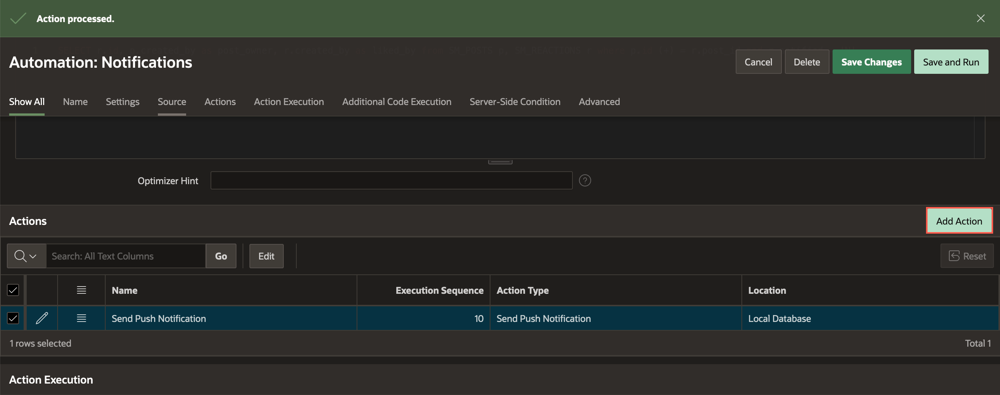

11. In the Edit Action page, update the following:

    - Name: **Update Reactions Table**
    - Type: **Execute Code**
    - Code: 
        ```
        <copy>
        update SM_REACTIONS set NOTIFIED = 'Y' WHERE ID = :ID;
        </copy>
        ```

    Click **Create**.

    The **Update Reactions Table** action will update the Notified column value in the SM\_REACTIONS table to 'Y' to indicate that the user has been notified about the reaction.

    

12. We need to enable Push Notifications for the app. To do so, navigate to the **Shared Components**.

    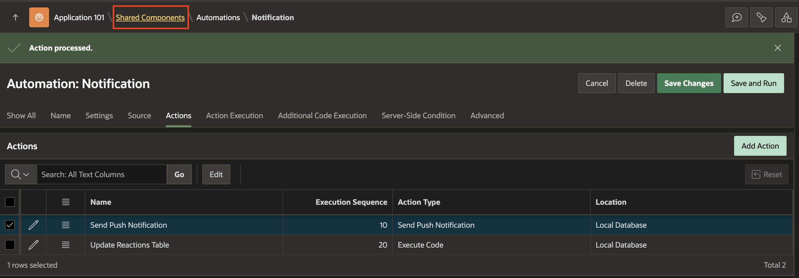

13. Under User Interface, select **Progressive Web App**.

    

14. Click **Push Notifications** tab and toggle the **Enable Push Notifications** button to ON. Click **+ Generate Credentials** and select **Generate Credentials** in the confirm dialog window.

    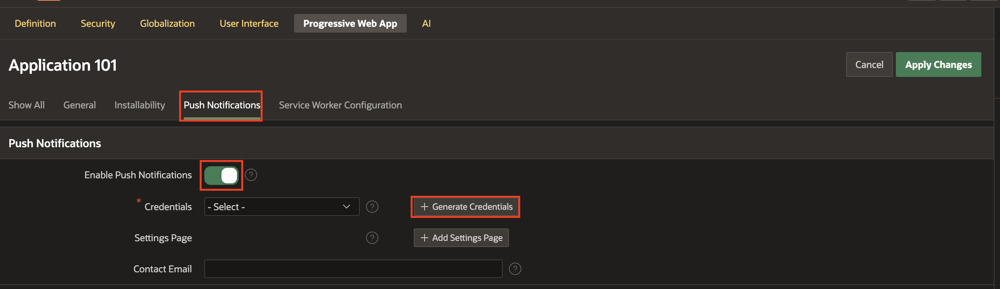

    

15. Click **+ Add Settings Page**.

    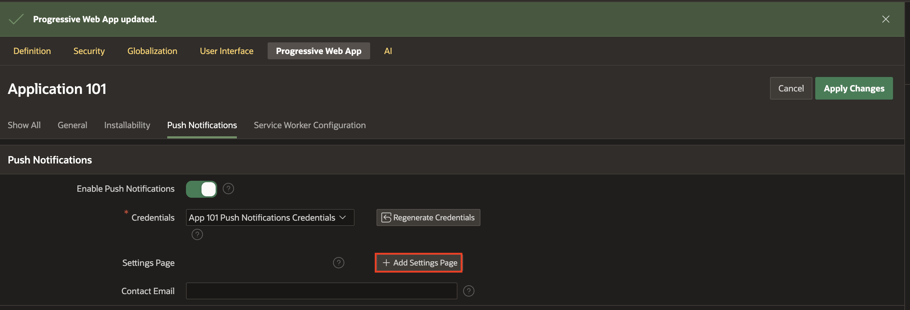

16. **Create Push Notifications Settings Page** dialog window appears. Click **Create**.

    

17. Progressive Web App is updated. Now, **Save and Run** the page. 

        

18. In the Social Media App, click on your username at the top-right corner and select **Settings**.

      

19. Push Notifications is disabled by Default. Click **Off** and enable the checkbox for **Enable push notifications on this device**.

      

    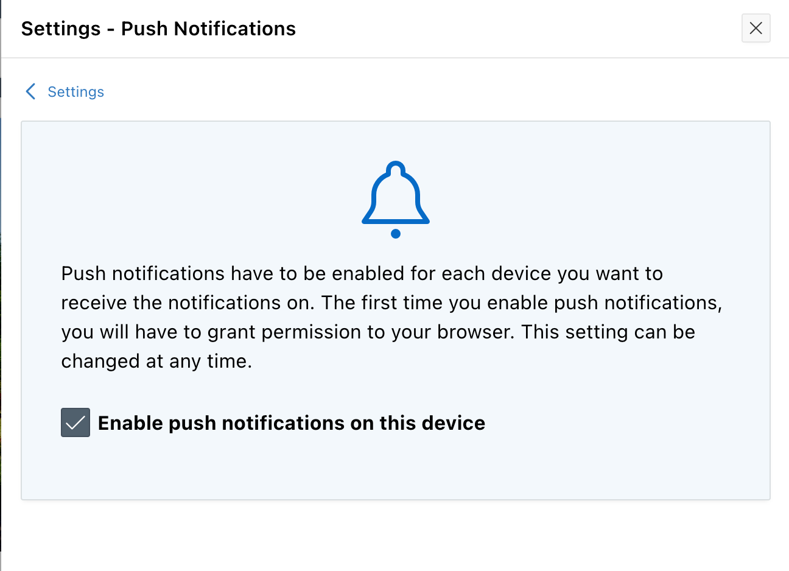 

20. Now, if a user 'Likes' any of your posts, you will receive a push notification on your device.

      

Note: 
- If you are unable to see the Push Notifications, ensure that the DND option is disabled in your system and your browser has necessary permissions to send notifications.
- View the compatibility matrix of Push Notifications [here](https://apex.oracle.com/pls/apex/r/apex_pm/apex-pwa-reference/push-notifications)

## Task 4: Add Shortcuts for the PWA app

1. Navigate to **Shared Components > Progressive Web App**.

        

2. Scroll down to Shortcuts and click **Enable for All Sessions**. In the popup window, confirm by clicking **Enable for All Sessions**. Note: This option does not work in *apex.oracle.com* instance.

      

    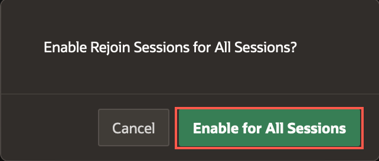 

3. Click **Add Shortcut**.

      

4. In the Add Shortcut dialog, enter the following:
    - **Name**: Timeline
    - **Target URL**: *Select the Timeline page*
    - **Upload an icon**: *Upload an icon for the shortcut*

    Click **Create**. 

     

    You will see how the shortcut looks after completing Task 5. Similarly, you can add multiple shortcuts, each pointing to a different page in your app.

## Task 5: Enhance the PWA install experience with Screenshots

The Oracle APEX Progressive Web App screenshots are used for promotional purposes, and are displayed when users are prompted to install the Progressive Web App.

1. In the Progressive Web App page, under Screenshots, click **Add Screenshot**.

     

2. In the PWA Screenshot wizard, enter a Description, upload a Screenshot and click **Create**. 

     

3. Repeat steps 1-2 to add as many screenshots as you would like and click **Apply Changes**.

     

4. Click **Save and Run** the page.

    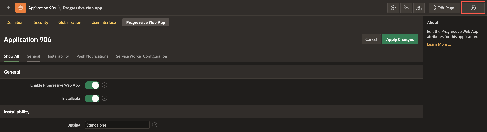 

4. Click **Install App** to install as pwa. A popup window displays the screenshots and a message to confirm the install of the app. Follow the on-screen instructions to install the app.
     

     

5. Once the pwa is installed, right-click on the app icon in your taskbar/dock and view the shortcut called **Timeline** that we created earlier. Clicking on the shortcut will directly open the corresponding page in the app.

     

**Note:** 
- View the compatibility matrix for the **Screenshots** [here](https://apex.oracle.com/pls/apex/r/apex_pm/apex-pwa-reference/installation).
- View the compatibility matrix for the **Shortcuts** [here](https://apex.oracle.com/pls/apex/r/apex_pm/apex-pwa-reference/app-icon).

## Summary
You now know how to enhance the Social Media app with mobile features such as Cropping and Sharing Images, Push Notifications, and add the latest pwa features like Shortcuts and Screenshots.

## Acknowledgments
- **Author** - Toufiq Mohammed, Senior Product Manager; Apoorva Srinivas, Senior Product Manager
- **Last Updated By/Date** - Apoorva Srinivas, Senior Product Manager, December 2023