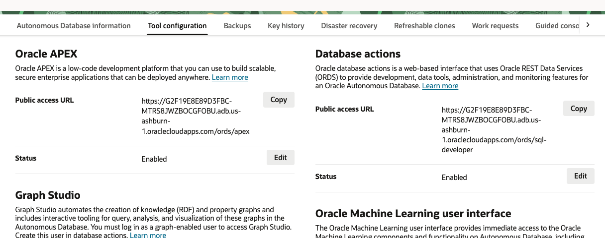
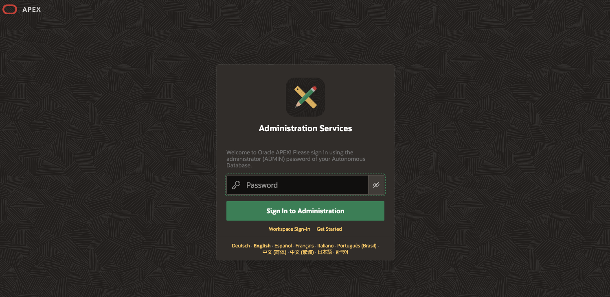
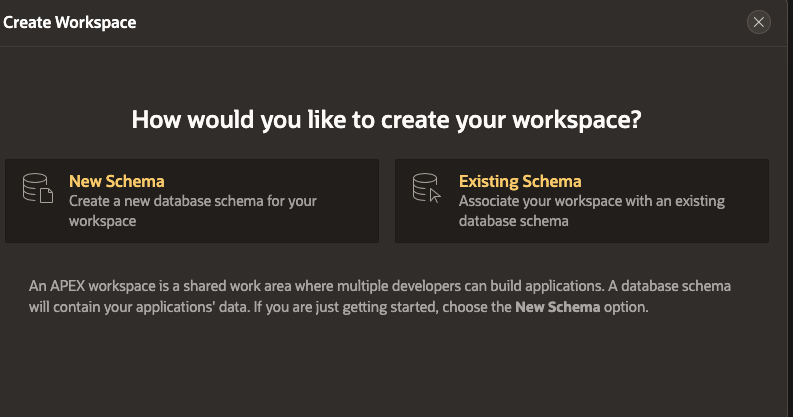
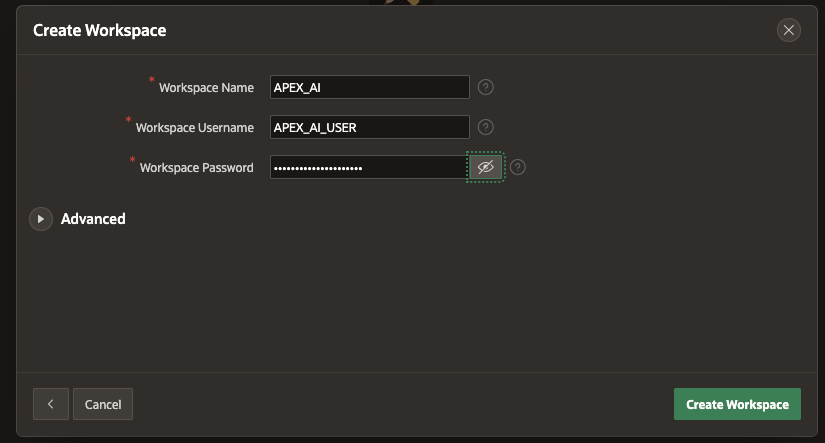
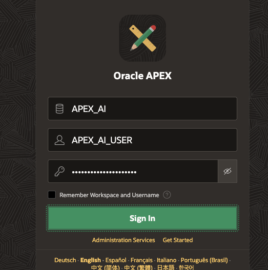
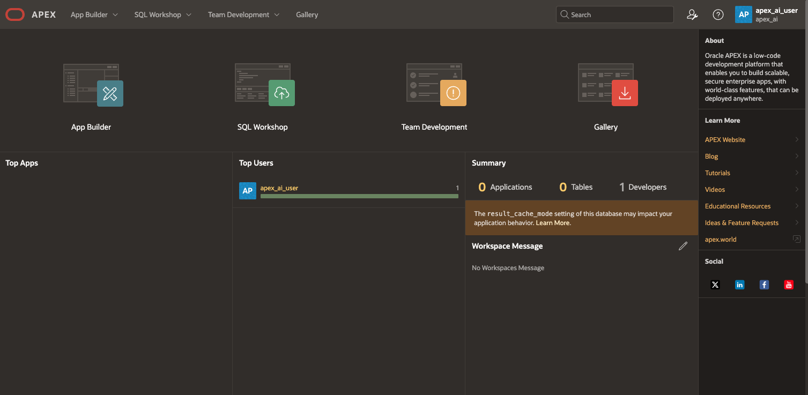

# Deploy Autonomous Database and Create APEX Workspace

## Introduction: 

In this Lab we will walk through process of deploying a 23ai Autonomous Database and creating an APEX workspace to start developing applications.

***Add more on APEX workspace???***

### Objectives

In this lab, you will:
* Deploy an ADB (Autonomous Database)
* Create an APEX workspace

### Prerequisites

This lab assumes you have the following:

Access to Oracle Cloud Infrastructure (OCI), paid account or free tier, in a region that has:
Generative AI
Basic experience with OCI Cloud Console and standard components.

## Task 1: Create Autonomous Databse

1. Navigate to the OCI home console and expand the side-menu bar. 

2. Select the Oracle Database and click the Autonomous Database Option. 

3. Select your desired compartment and select Create Autonomous Database.  

4. Follow the instructions in the provisioning, provide a unique name, password and select 23ai as DB Version. ***Insert on Free Tier*** 

## Task 2: Create APEX Workspace on your ADB

1. Once your ADB has been provisioned, you can select Tool Configuration and copy your Public Access URL under Oracle APEX. Open this URL in a new tab. 
    

2. Here you will enter your admin password from you ADB to access APEX Administration Services.
    

3. You will be greeted with a welcome to APEX page and you can select Create Workspace. A workspace in APEX is simply a protected area within an APEX environment where developers and users can create and manage APEX applications or interact with the underlying database. Here you will select whether you would like a New Schema for your workspace, or to use an existing Schema in your ADB. In this case, we will select New Schema.
    

4. You can now choose a Workspace Name, Workspace Admin Username, and Workspace Admin Password. These credentials will be used to login to the workspace once created. Click Create Workspace.
    

5. Once the workspace is created, you can sign out of the Administrative Services in the upper right corner. You can now return to the sign in screen and input your newly created workspace name, Workspace Admin Username, and Workspace Admin Password.
    

6. Once logged in, you will land on the APEX home page where we can select App Builder to begin working on our applications. Move on to Lab 2 where will configure GenAI.
    

You may proceed to the next lab.

## Acknowledgements

* **Authors:**
* Karol Stuart, Master Principal Cloud Architect 
* Graham Anderson, Senior Cloud Architect 

* **Last Updated by/Date** - Graham Anderson, August 2025