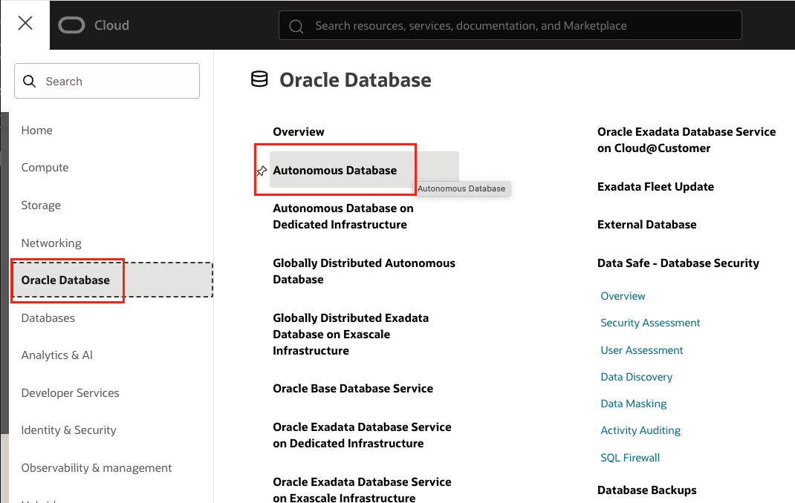
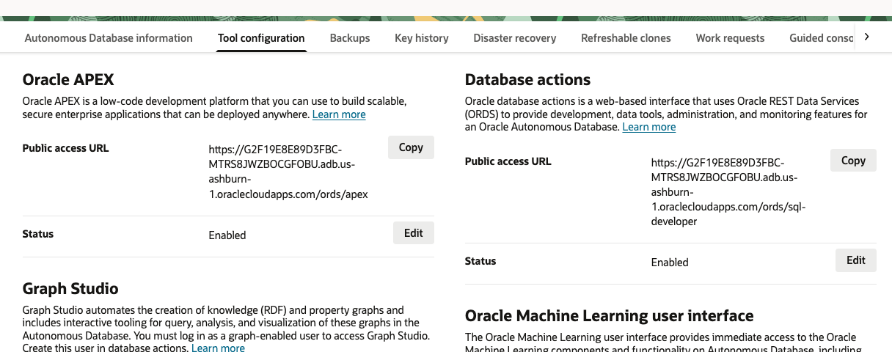
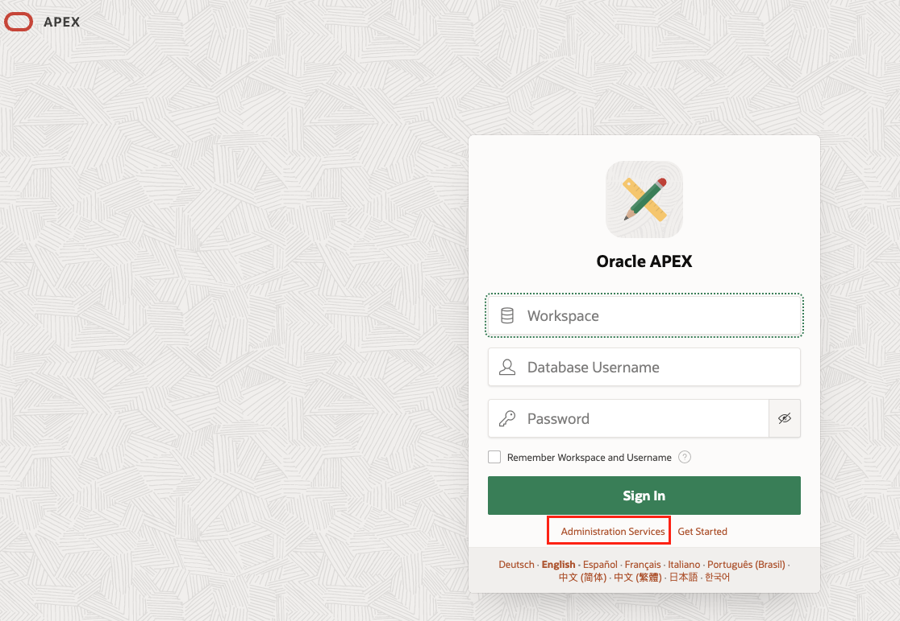
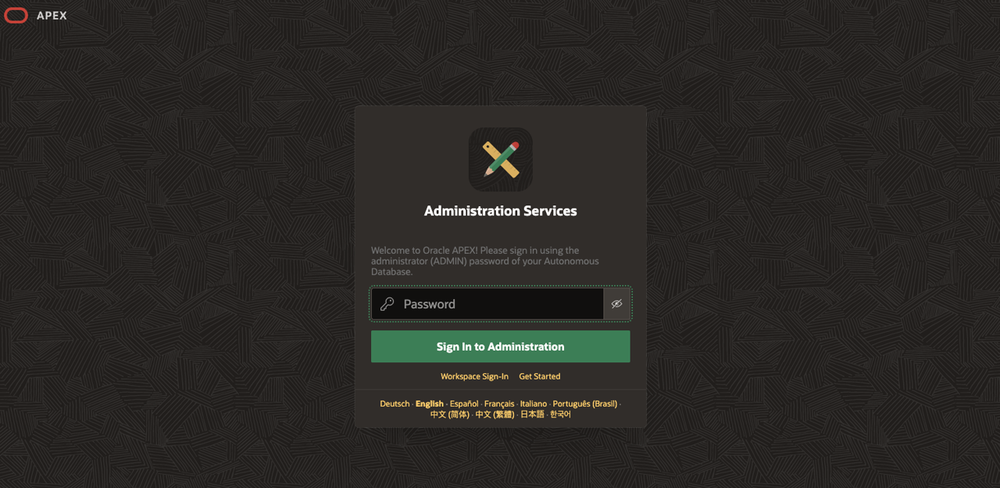
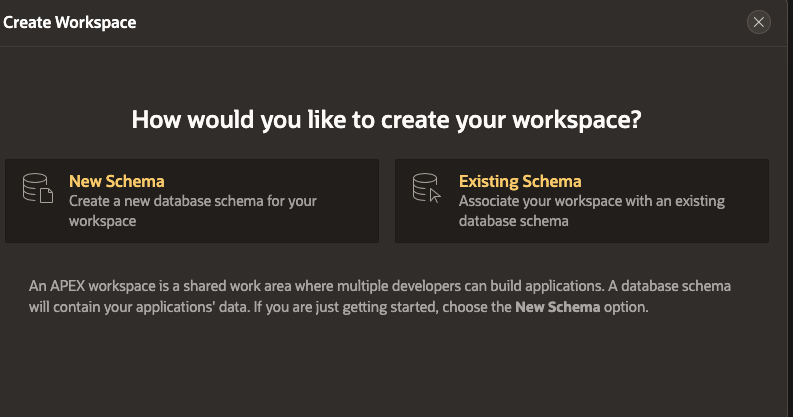
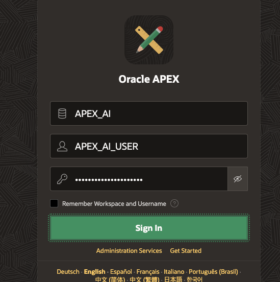
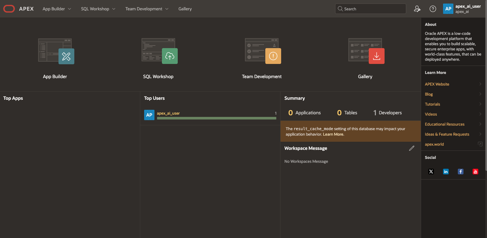

# Deploy Autonomous Database and Create APEX Workspace

## Introduction

In this Lab we will walk through process of deploying a 23ai Autonomous Database and creating an APEX workspace to start developing applications.

An APEX workspace is a secure, private area within the Oracle APEX environment where developers and users can create and manage applications on top of your database. Each workspace can have its own schemas, users, and applications, allowing you to organize development projects, control access, and maintain separation between different teams or projects.

By the end of this lab, you’ll have a fully configured workspace connected to your Autonomous Database, ready to start building low-code applications enriched with data and ready for Generative AI integration.

Estimated Time: 15–20 minutes

[Deploy Autonomous Database and Create APEX Workspace Video Recording](videohub:1_qjaoc6v5)

### Objectives

In this lab, you will:
* Deploy an ADB (Autonomous Database)
* Create an APEX workspace

### Prerequisites

This lab assumes you have the following:

Access to Oracle Cloud Infrastructure (OCI), paid account or free tier, in a region that has:
Generative AI
Basic experience with OCI Cloud Console and standard components.

## Task 1: Create Autonomous Database

1. Navigate to the OCI home console and expand the side-menu bar. 

2. Select the Oracle Database and click the Autonomous Database Option.  
    

3. Select your desired compartment and select Create Autonomous Database.  

4. Follow the instructions in the provisioning wizard:  

- Enter a unique display and database name (e.g., `LiveLabDB01`)  
- Select your assigned compartment
- Select deployment type: `Transaction Processing`  
- Choose `Developer` option  
- Set database version: `23ai`  
- Provide an admin password that meets OCI requirements (e.g., `StrongPass#2025`)  
- Click `Create` Autonomous Database  
- Verify the database is ready after provisioning completes  

## Task 2: Create APEX Workspace on your ADB

1. Once your ADB has been provisioned, you can select Tool Configuration and copy your Public Access URL under Oracle APEX. Open this URL in a new tab.  
    

2. Here you will enter your admin password from your ADB to access APEX Administration Services.  
    

    

3. You will be greeted with a welcome to APEX page and you can select Create Workspace. A workspace in APEX is simply a protected area within an APEX environment where developers and users can create and manage APEX applications or interact with the underlying database. Here you will select whether you would like a New Schema for your workspace, or to use an existing Schema in your ADB. In this case, we will select New Schema.  
    

4. You can now choose a Workspace Name, Workspace Admin Username, and Workspace Admin Password. These credentials will be used to login to the workspace once created. Click Create Workspace.  
    

5. Once the workspace is created, you can sign out of the Administrative Services in the upper right corner. You can now return to the sign in screen and input your newly created workspace name, Workspace Admin Username, and Workspace Admin Password.  
    

6. Once logged in, you will land on the APEX home page where we can select App Builder to begin working on our applications. Move on to Lab 2 where we will configure GenAI.  
    

You may now **proceed to the next lab**

## Acknowledgements

* **Authors:**
* Karol Stuart, Master Principal Cloud Architect 
* Graham Anderson, Senior Cloud Architect 

* **Last Updated by/Date** - Graham Anderson, August 2025
