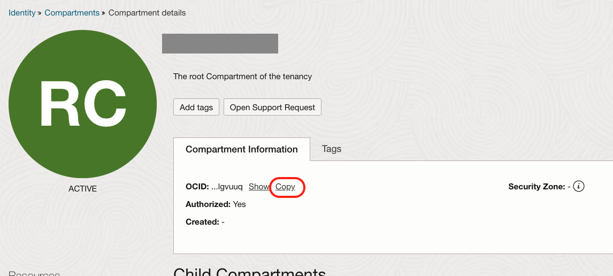

# Configure GenAI in your Tenancy & APEX Workspace

## Introduction

In this Lab we will walk through process of configuring your OCI tenancy and APEX workspace to utilize GenAI. Both the Web Credential and GenAI configuration we create in your APEX Workspace will be available across any APEX application you create in your workspace. 

By the end of this lab, you will understand how to gather OCI tenancy information, configure a Web Credential in APEX and create a Generative AI configuration.

Estimated Time: 20–25 minutes

[Configure GenAI in your Tenancy & APEX Workspace Video Recording](videohub:1_9ikcl1lc)

### Objectives

In this lab, you will:
* Configure Web Credentials in APEX
* Configure Generative AI in APEX

### Prerequisites

This lab assumes you have the following:

Access to Oracle Cloud Infrastructure (OCI), paid account or free tier, in a region that has:
Generative AI
Basic experience with OCI Cloud Console and standard components.

## Task 1: Gather your OCI Tenancy Information

1. Navigate to the OCI Cloud Console. Open the Menu in the top left corner and select Identity & Security. Under Identity, select Compartments. Copy the OCID for the compartment you wish to use. 

2. Now click on the top right user icon and select your user (xxxx.xxxx@xxxx.com)
    

3. Copy down your user OCID
    

4. Next, select Tokens and Keys tab along the top bar.
    

5. Select Add API Key and select Generate API key pair, ensure you Download Public and Private Key. Then, the Add button will be enabled and then click 'Add'
    
    

6. You can then copy the Fingerprint
    
    
7. Now click Compartments on the left and select your compartment. 
    
    

8. Copy down your Compartment OCID.
    

9. Now click on your user in the top right again, this time select your tenancy. 
    

10. Copy down your Tenancy OCID.
    

## Task 2: Configure Web Credentials & Generative AI in your APEX Workspace

1. Now we have all necessary information from your tenancy, you can return to your APEX workspace, if you don’t already have it open. Return to your Autonomous Database, go to Tool Configuration, and open your APEX URL. 

2. Once back in your APEX workspace. Select App Builder, and click Workspace Utilities
    

3. Now select Web Credentials and click Create.
    
    

4. From the drop down for 'Authentication Type' select *OCI Native Authentication*. Give your Credentials a name. Then we will use the data we copied from our tenancy in previous steps. Enter your

    OCI User ID (User OCID),  
    OCI Private Key (downloaded),  
    *Note: Open the downloaded OCI private key file (`vi` on macOS or Notepad on Windows), copy its contents, and paste in below screen*.  
    OCI Tenancy ID (Tenancy OCID) and  
    OCI Public Key Fingerprint.  

    Then click Create
    

5. With our Web Credential created, return to Workspace Utilities and select Generative AI. Here we will click Create.
    
    

6. Select OCI Generative AI Service as the AI Provider. Then enter a name for your Generative AI Configuration. Next you can copy in the Compartment ID from above and select the appropriate region. There will be a default model, or you can choose another from this list. Ensure the model is available in the region you select.

    [Click here](https://docs.oracle.com/en-us/iaas/Content/generative-ai/pretrained-models.htm) to see pre-trained models available.

    
    

7. Enable the Used by App Builder setting if you would like to add a Generative AI option in the Create Application Wizard and include Generative AI support (APEX Assistant) in all APEX Code Editors. Only one Generative AI Service at a time can be configured with the Used by App Builder setting enabled. 

8. Now click Test Connection to ensure it works. With a success, click Create.

You have successfully created your web credential and utilized it to create your Generative AI configuration. You may now **proceed to the next lab**.

## Acknowledgements

* **Authors:**
* Karol Stuart, Master Principal Cloud Architect 
* Graham Anderson, Senior Cloud Architect 

* **Last Updated by/Date** - Graham Anderson, August 2025
