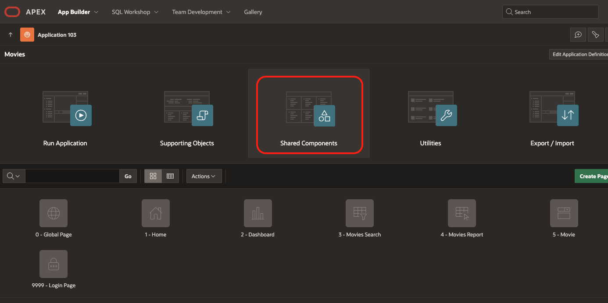
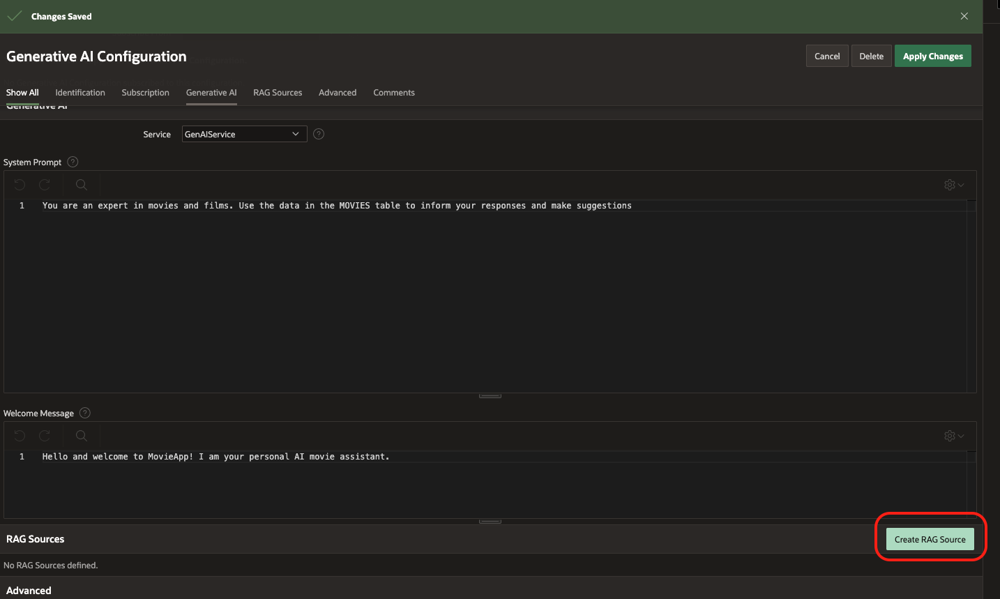

# Create APEX Application and Integrate AI Chatbot

## Introduction

In this Lab we will import sample data into our Autonomous Database, create a simple APEX application on the data, and then add GenAI Chatbot into our application. If you have existing data in your Oracle Database, this is a great opportunity to quickly build a powerful application on top of it.


### Objectives

In this lab, you will:
* Upload sample data to your ADB
* Create a simple APEX application
* Add a GenAI Chatbot to interact with your data

### Prerequisites

This lab assumes you have the following:

Access to Oracle Cloud Infrastructure (OCI), paid account or free tier, in a region that has:
Generative AI
Basic experience with OCI Cloud Console and standard components.

## Task 1: Load Sample Data and Create APEX Application

1. In your APEX Workspace, click App Builder and Click Create. Here we can Select Create App From a File . 
    

2. Here we will load in our data. Download the [sample](./datasets/movies_sample.csv) data. Click the select file option and select the correct file from your file browser. 
    

3. Give this table a name, Movies, and click Load Data
    

4. Click Create Application 

5. Give the application a name, and select an Icon if you would like to change it. By default, APEX will create some pages for you in the application.
    

6. You can select Access Control from the features selection so we can manage how users login. ***Add details on how to manage users, maybe later step***
    

7. Now you will see all the pages that were created for the application. Launch the application by clicking the play button Run Application so we can see what it looks like.
    

8. At the login screen, enter your workspace credentials 

9. Click Movies Report to see an Interactive Report, where you can search, inspect and edit existing movies, or add new ones. 

## Task 2: Create GenAI Chatbot in your Application

1. To enhance the experience for finding movies, we will utilize the OCI GenAI connection we made earlier. Return to the App Builder and select the newly created app and select Shared Components.
    
        

2. In the lower left, select AI Configurations under the Generative AI Section. Click Create. Here we will enter a name for the configuration and select our Credential from Lab 2 from the Service drop down. 
    
    
    

3. In the System Prompt field, enter a prompt for our GenAI configuration so it know what to do 
    ```
    You are an expert in movies and films. Use the data in the MOVIES table to inform your responses and make suggestions.
    ```

    

4. Enter a welcome message to greet users when they begin a conversation with our AI. Click Create
    ```
    Hello and welcome to MovieApp! I am your personal AI movie assistant.

    ```
        

5. Next we will add our database table as a RAG source for our AI Assistant. Click Create RAG Source. Enter a name and for the SQL query, enter
    ```
    SELECT * FROM MOVIES
    ```
    Click "Create" in the top right and then click "Apply Changes"
    
    

6. Return to App Builder and select Page 1 – Home. On the left side, known as the rendering tree, right click on Page Navigation and select Create Region Below. Now drag this newly created region above the Page Navigation Region. We will use this region to give users a quick understanding of the application, as well as a location to launch our AI Assistant.
    
    

7. With our New Region selected on the left side, navigate to the right side of your screen for this selected region.  Enter a title, 'Welcome to the APEX Movie DB' and a Name for the region, 'Welcome'. Now we will enter a short message in the HTML source code to give users an understanding of the application:  
    
    “&lt;h3&gt;Welcome to a database where you can explore and interact with movie data, find new films to watch, and learn more about popular movies&lt;/h3&gt; 

    &lt;h3&gt;To enhance your experience, try our AI Movie Assistant by clicking below&lt;/h3&gt;”
    

8. To clean up the UI we can delete the Movie region from the Breadcrumb Bar on the Rendering tree, right click on the region and select Delete.

        

9. Now click the green play button in the top right to save and run your application to see your changes.

       

10. Let’s now add our AI Assistant, return to Page 1 App Builder. On the Rendering Tree, right click our Welcome region and select Create Button. 
    

Click on the newly created button, and navigate to the right side of the screen. Here we will give the button a name, _Launch_AI_Assistant_. Next, scroll down the right side and on the Button Template attribute, select Text with Icon from the drop down. In the Icon attribute below, enter _fa-ai-generative_, this will give a small icon next our text. On the Layout Section, Select _Below Region_ for the _Slot_ attribute, and align it to the left side.
    

11. Scroll down to the Behavior section and on the action attribute, select Defined by Dynamic Action from the drop down. Dynamic Actions allow developers to take actions or function-like execution using a variety of custom or prebuilt actions.
    

12. On the left side Rendering Tree, right click our button and click Create Dynamic Action. Click the newly created action and give it a name, Launch Assistant, it will already know the context for when to execute this action since we right clicked on the button.
    
    

13. Now click on the True action from the rendering tree under our Dynamic Action. This is where we will select what action to take when the above When Criteria is met (in this case, clicking the button). 
    
On the right side Action attribute, select Show AI Assistant. Now select our Configuration from the drop down.
    
    

14. You can save and run the Application, then click on the new button and test out the AI Assistant. Try prompts like:
   - *I’m in a nostalgic mood and want something heartwarming.*  
   - *I’m feeling adventurous and need something thrilling!*  

               

    You can validate the values from the original source files 
    
    

You have successfully created your application and created a dynamic action to launch your GenAI Chatbot to interact with your the data in your Autonomous Database. You may now **proceed to the next lab**.

## Acknowledgements

* **Authors:**
* Karol Stuart, Master Principal Cloud Architect 
* Graham Anderson, Senior Cloud Architect 

* **Last Updated by/Date** - Graham Anderson, August 2025