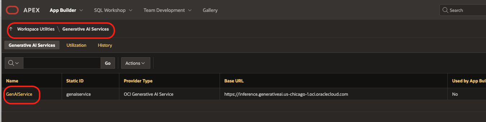
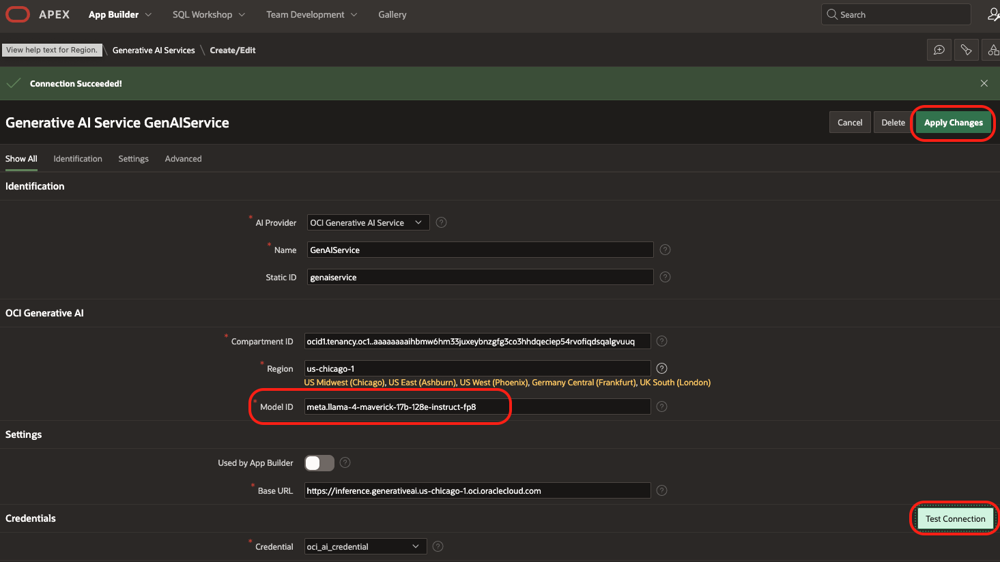
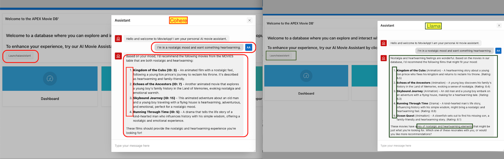
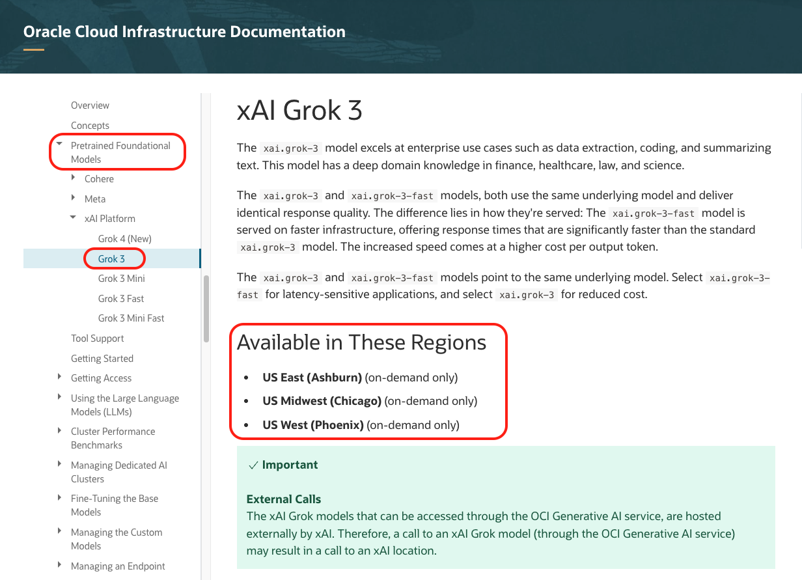

# Extend your APEX App with Llama or Grok Models.

##  Introduction
In this lab, we’ll enhance the GenAI assistant experience by exploring how to switch between different OCI Generative AI models.  
Different models may perform better depending on your application’s domain — testing them helps you deliver the best user experience.

By the end of this lab, users will have learned how to extend their APEX application by integrating and experimenting with different Generative AI models, such as Llama and Grok. 

Estimated Time: Approximately 15–20 minutes.

###  Objectives
By the end of this lab, you will:
- Learn how to utilize additional LLMs (like Llama or Grok) within your APEX App.

###  Prerequisites
This lab assumes you have:
- Access to Oracle Cloud Infrastructure (OCI) (paid account or free tier) in a region with Generative AI available.  
- Basic experience** with the OCI Console and APEX components.  

---

## Task 1: Try out Meta Llama Model in your APEX Application 

### Step 1: Explore Available Models to use Llama Model
1. Open the documentation for pre-trained models:  
   [OCI Generative AI Pre-trained Models](https://docs.oracle.com/en-us/iaas/Content/generative-ai/pretrained-models.htm)  

   

2. Browse through the list of available models and note the **Model ID** you want to test.  
   Example:  *meta.llama-4-maverick-17b-128e-instruct-fp8*

   [Meta Llama 4 Maverick Model](https://docs.oracle.com/en-us/iaas/Content/generative-ai/meta-llama-4-maverick.htm#meta.llama-4-maverick:~:text=Model%20Name-,OCI%20Model%20Name,-Pricing%20Page%20Product)

---

### Step 2: Update Your APEX Application
1. Return to your APEX Workspace, open Workspace Utilities and select Generative AI. Open the Gen AI Service already created.
   

2. In the ModelID field, replace the old model id with the new one (e.g.)  *meta.llama-4-maverick-17b-128e-instruct-fp8*
    and test the connection

3. Click Apply Changes to save.  

---

### Step 3: Run and Compare
1. Return to your application in App Builder and select the Movie app.

2. Click Run Application.  

3. Interact with the assistant and observe how it responds. Try the same prompt, which you tried in the previous lab and compare the results.:
   - *I’m in a nostalgic mood and want something heartwarming.*  

   

   You can also try other questions and see how the new model responds back 

   - *I’m feeling adventurous and need something thrilling!*  

    

Try switching between two models — note differences in:
- **Tone** (formal vs casual)  
- **Detail level** (short vs comprehensive)  
- **Response speed**  

---

## Task 2: Try out Grok Model in your APEX Application 

### Step 1: Explore Available Models to use Grok Model
1. Open the documentation for pre-trained models:  
   [OCI Generative AI Pre-trained Models](https://docs.oracle.com/en-us/iaas/Content/generative-ai/pretrained-models.htm)  

   

2. Browse through the list of available models and note the **Model ID** you want to test.  
   Example:  *xai.grok-3*

   [xai.grok-3 Model](https://docs.oracle.com/en-us/iaas/Content/generative-ai/xai-grok-3.htm#:~:text=Model%20Name-,OCI%20Model%20Name,-Pricing%20Page%20Product)

### Step 1: Update Your APEX Application to use Grok Model
1. Return to your APEX Workspace, open Workspace Utilities and select Generative AI. Open the Gen AI Service already created.
   

2. In the ModelID field, replace the old model id with the new Grok model (e.g.)  *xai.grok-3*
    and test the connection

   *Note: For Grok models are on demand only. (pay-as-you-go usage)*

3. Click Apply Changes to save.  

---

### Step 2: Run and test Grok Model
1. Return to your application in App Builder and select the Movie app.

2. Click Run Application.  

3. Interact with the assistant and observe how it responds. Try the same prompt, which you tried in the previous lab and compare the results.:
   - *I’m in a nostalgic mood and want something heartwarming.*  

   

You’ve successfully extended your APEX app by experimenting with **different LLMs (like Llama and Grok)**.  
This approach allows you to fine-tune the assistant experience based on different model selection.

---

## Acknowledgments

* **Authors:**

* Karol Stuart, Master Principal Cloud Architect 
* Graham Anderson, Senior Cloud Architect 

* **Last Updated by/Date** - Karol Stuart, August 2025