# Create REST Data Sources

## Introduction
This lab will walk you through how to set up REST Data Sources that will be used to get movie data from TMDB API. You will use these REST sources in later labs to build out the movie search functionality.  Make sure you have easy access to your API key that you signed up for in the Introduction steps, as you will need it to build out the REST sources.

Estimated Lab Time: 15 minutes

### Objectives
In this lab, you will:  
- Create a REST data source for The Movie Database Popular Movies.  
- Create a REST data source for The Movie Database Search Movies.

### Prerequisites
- Completion of workshop through Lab 1
- A TMDB API key

## Task 1: Create a Popular Movies REST Data Source

The first REST source you will create is the Popular Movies source because it is the simplest to implement and a good way to introduce the process of creating REST data sources. From there, you will implement a couple more REST sources, with each being a little more complicated than the last. You are creating the Popular Movies data source because you will need to display these when a user has not yet searched for a movie.

1. In the App Builder tab in your browser, click **Shared Components** in the middle of your Application home.

    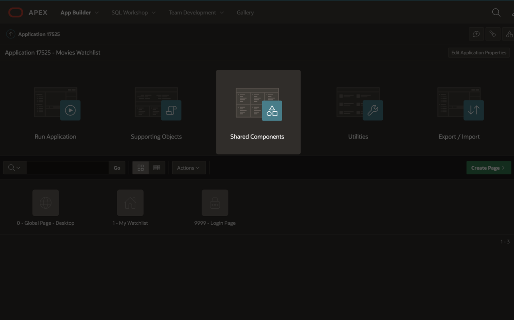

2. In the Data Sources section at the bottom of the page, click on **REST Data Sources**.

    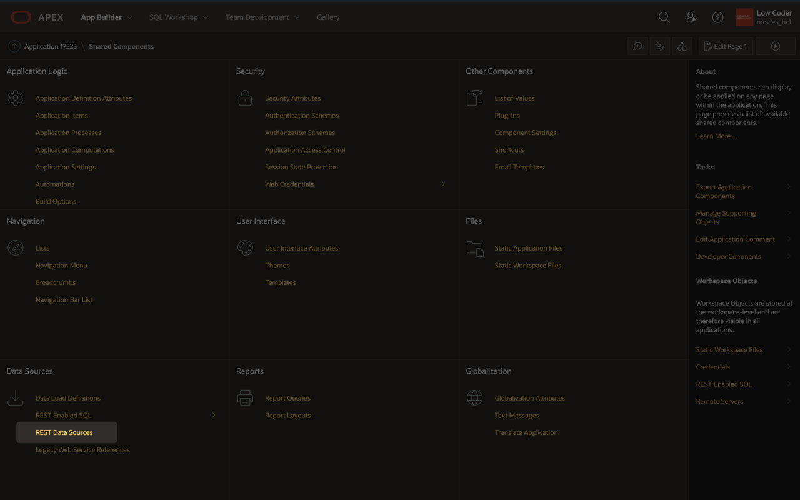

3. Click **Create** at the top right of the page.

4. Select **From Scratch** and click **Next**.

    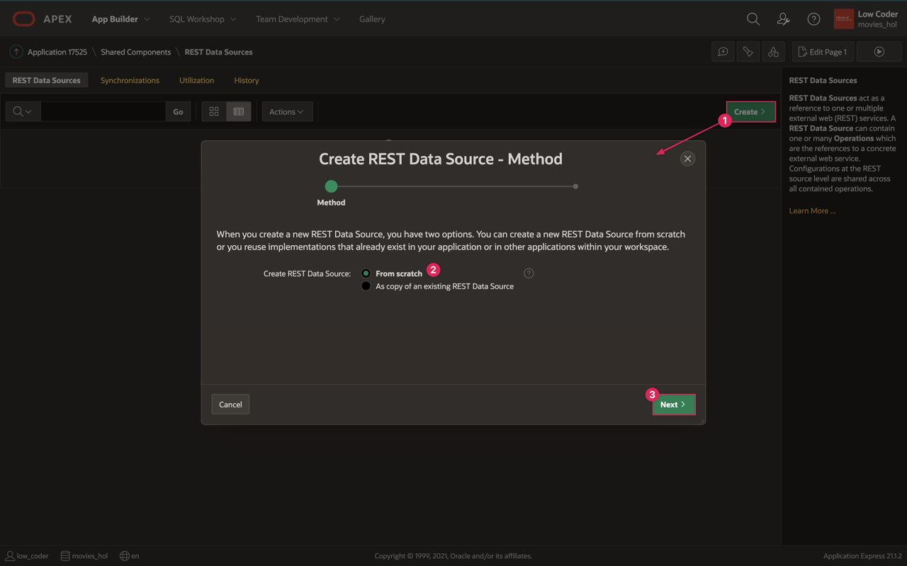

5. Name: **Popular Movies**

6. URL Endpoint: **https://api.themoviedb.org/3/movie/popular?api\_key=API\_KEY&language=en-US&page=1**  
*Note: Make sure to replace API\_KEY with the API code you get from TMDB API*

7. Click **Next**.

    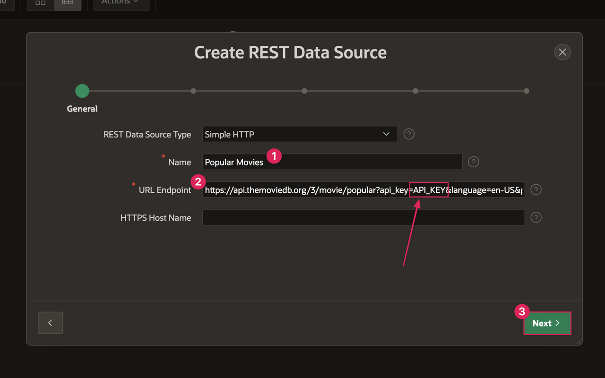

8. Oracle APEX automatically divides the URL into the Base Path and Service URL Path. However, you want these to be slightly different than what APEX chose so that the Base Path is consistent across all the REST sources you make. Adjust the Base and Service URLs to the following:

    * Base URL: **https://api.themoviedb.org/3/**

    * Service URL Path: **movie/popular?api\_key=API\_KEY&language=en-US&page=1**  
    *Note: Make sure you have replaced API\_KEY with the API code you get from TMDB API and that there are no spaces in your URL endpoint.*

9. Click **Next** again.

    

10. Click **Discover**.

    * APEX makes a call to the TMDB API and finds the popular movies data to parse into columns that you will be able to use as your data source when building your app.

    * You should now be able to view and scroll through a preview of the table of data that has been generated. 

    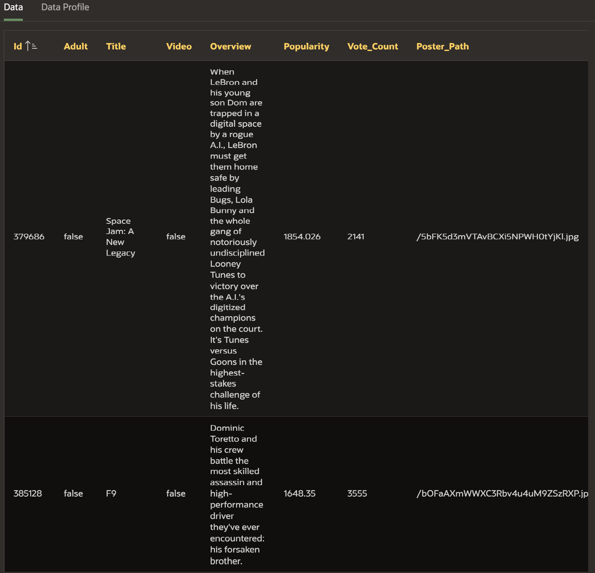

11. Click **Create REST Data Source**.

## Task 2: Edit The REST Source Data Profile 
You have now created your new data source, but you are going to update it to improve the data you get from Popular Movies. One of the columns you get back from the TMDB Popular Movies API is POSTER\_PATH. It includes the unique poster identifier needed to grab the poster image for a movie. However, it does not contain the full URL, which means that if you want to use POSTER\_PATH, you have to manually add the first part of the URL when using it on the front end. Instead of having to add that each time you want to use the poster path, you can edit the Data Profile for Popular Movies and add a column derived from POSTER\_PATH that contains the entire URL so that later you can access it directly.

1. In the REST Source Name column of the REST Data Sources page, click on your **Popular Movies** source.

2. Click on the **Data Profile** tab within the REST Data Source page.

3. Within the Data Profile tab, you can see that there are 13 visible columns for Popular Movies. You can edit the data profile to add, remove, and edit columns, which will adjust the data that gets returned from the data source.

4. Click the **Edit Data Profile** button.

    

    * On the Data Profile dialog page, click the **Add Column** button.

        - Name: **POSTER_URL**

        - Visible: **on**

        - Column Type: **SQL Expression**

        - SQL Expression: **CONCAT('https://image.tmdb.org/t/p/w500', POSTER_PATH)**

            + This SQL Expression concatenates a string that contains the secure base URL and image size with the POSTER_PATH column that gets returned with the Popular Movies data. The base URL and image size come from [TMDB Configuration API](https://developers.themoviedb.org/3/configuration/get-api-configuration).

        - Click **Create**.

        

    * Click **Apply Changes** to save and close the Edit Data Profile dialog.

5. Click **Apply Changes** at the top of the REST Data Source page.

## Task 3: Create a Search Movies REST Data Source
The process to create the Search Movies source is similar to the process for the Popular Movies source, but you will use a plug-in to assist with setting it up. Plug-ins are ready-to-use components created by other APEX developers that enable you to extend your APEX applications with custom functionality. A plug-in can be useful for creating REST data sources that return multiple pages of results. For example, when you make a request to TMDB search movies API, you must also include the page number within that request, and you can only get one page at a time with individual API calls. There is a REST data sources plug-in to work around this problem, which allows you to make one API request and get all results from all the pages.

1. [Click here](./files/web_source_type_fixedpagesize.sql) to download the plug-in.  

2. In your App Builder, return to your Movies Watchlist application home by clicking the Application XXXXX link under the APEX toolbar.

    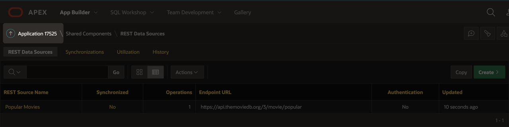

3. Click **Export/Import**.

    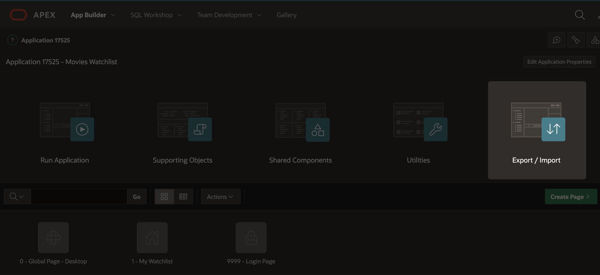

    * Click **Import**.

    * Click on the Drag and Drop region to open the file selector.

        - In your Downloads folder, select the **web\_source\_type\_fixedpagesize.sql** file.

        - Click **Open**.

    * File Type: **Plug-in**

    * Click **Next**.

    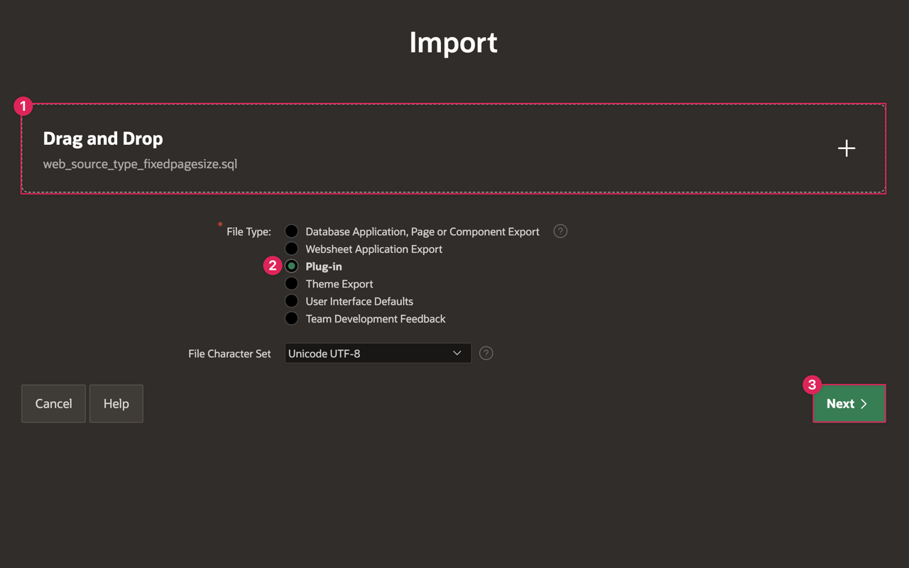

    * Click **Next**.

    * Click **Install Plug-in**.

    * You should finish on the Plug-ins page within the Shared Components of your Application and see your imported plug-in. You can now create your Search Movies REST source with this plugin.

4. Navigate to the Shared Components page by clicking the **Shared Components** link in the page path below the APEX toolbar.

    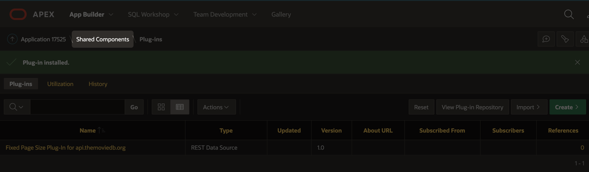

5. Under Data Sources, click on **REST Data Sources**.

6. Click **Create**. 

    * Select **From Scratch** and click **Next**.

    * REST Data Source Type: **Fixed Page Size Plug-In for api.themoviedb.org [Plug-in]**

    * Name: **Search Movies**

    * URL Endpoint: **https://api.themoviedb.org/3/search/movie?api\_key=API\_KEY&language=en-US&query=harry%20potter&page=1&include\_adult=false**  
    *Note: Make sure to replace API\_KEY with the API code you get from TMDB API and that there are no spaces in your URL endpoint.*

    * Click **Next**.

    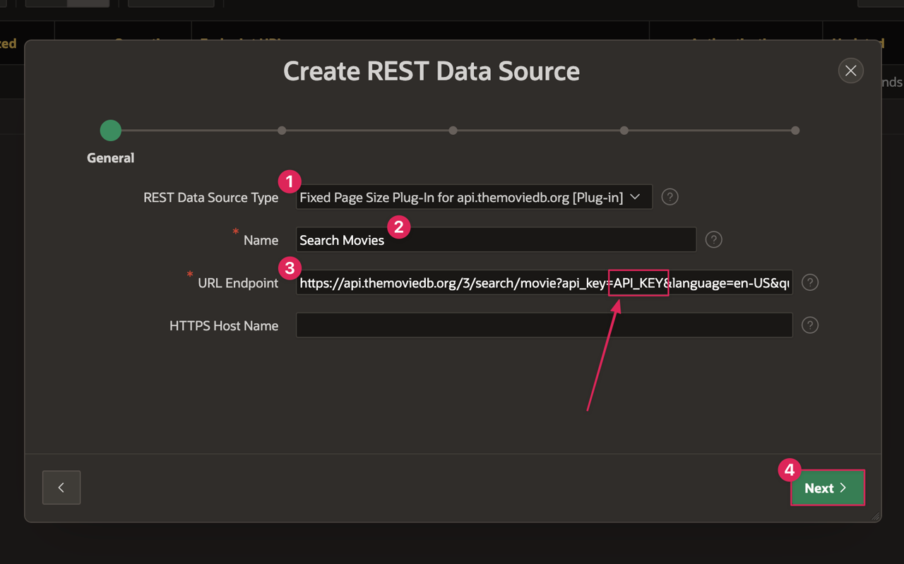

    * When you set up the Popular Movies REST data source, you created a remote server for TMDB API. APEX recognizes that remote server based on the Search Movies URL and automatically splits the URL into the correct Base URL and Service URL paths. Click **Next** again.

    * Authentication Required: **on**

    * Authentication Type: **URL Query String**

    * Name: **api_key**

    * Value: *Insert your unique API key here.*

    * Click **Discover**.

    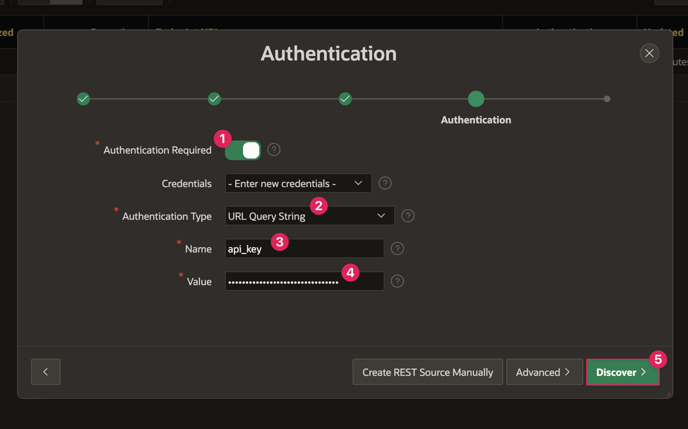

    * You should be able to view a preview of the table of data that has been generated.

    * Click **Create REST Data Source**.  

    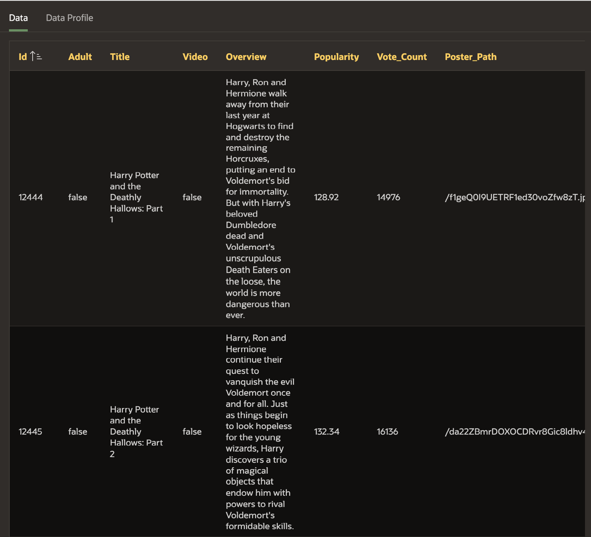

7. Return to [Task 2](#Task2:EditTheRESTSourceDataProfile) and follow the same steps for the Search Movies source to edit the data profile and create a POSTER_URL column.

You now know how to create and edit REST data sources in Oracle APEX and will be able to get data from The Movie Database to use for your application. You may now **proceed to the next lab**.

## Resources

- [REST Data Sources Documentation](https://docs.oracle.com/en/database/oracle/application-express/21.1/htmdb/managing-REST-data-sources.html#GUID-93D7A596-03A9-48AF-9FC9-6538BCC25DED)  

- [REST Data Sources Video](https://www.youtube.com/watch?v=ctCwvD1qavs)  

- [Explore APEX Plug-ins](https://apex.oracle.com/en/solutions/apps/#plug_ins)  

## Stuck? Download the Application Here
Stuck on a step or struggling with the lab? You can download a copy of the Movies Watchlist application through Lab 2 and follow the instructions below to import it into your Oracle APEX workspace.

- [Click here](./files/lab2.sql) to download a copy of the app at the end of Lab 2.

- You can import Lab 2 to your APEX workspace by clicking **Import** in the App Builder home page and following the wizard steps.

- Once the application is installed, you will need to update the API key for both the Popular Movies and Search Movies REST data sources.

- Go to the App Home by clicking on **Edit Application** from the Application Installed success page.

- Click on **Shared Components**.

- Click on **REST Data Sources**.

- Click on **Popular Movies**.

- Click the **Parameters** tab at the top of the Popular Movies REST Data Source page.

    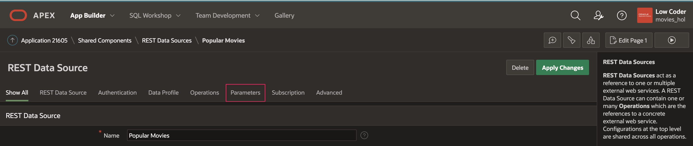

- Click the **Edit** icon next to the **api_key** parameter.

    

    - Within the Edit REST Data Source Parameter dialog, past your unique TMDB API key in the Value text box.

    - Click **Apply Changes** to save and close the dialog.

        

- Follow the same process for the Search Movies REST source.

## Acknowledgments

- **Author** - Paige Hanssen
- **Additional Contributors** - Kay Jasanya, Shakeeb Rahman, Steve Muench, Monica Godoy, Eli Feuerstein, Carlos Maciel, Dalia Vazquez
- **Last Updated By/Date** - Paige Hanssen, March 2022