# Create the Movie Details Page

## Introduction
In this lab, you will set up a new REST data source called Movie Details, that retrieves the details of a single movie. After the data source has been set up, you will create a new page that displays those movie details when a user clicks on a movie from the Movie Search page.

Estimated Lab Time: 10 minutes

### Objectives
In this lab, you will:  
- Set up the Movie Details REST Data Source.  
- Create a new page, Movie Details.  
- Use the Movie Details REST source to display data on the Movie Details page.  
- Connect the Movie Details page to the Movie Search page.

### Prerequisites
- Completion of workshop through Lab 3

## Task 1: Create the Movie Details REST Data Source
While the process for setting up the Movie Details REST source is similar to the Popular and Search Movies sources, it is a little more involved because you have to define the response structure as well as specify variables to be able to query for any movie.

1. Just like you did for Popular Movies and Search Movies, click on **Shared Components**. 

    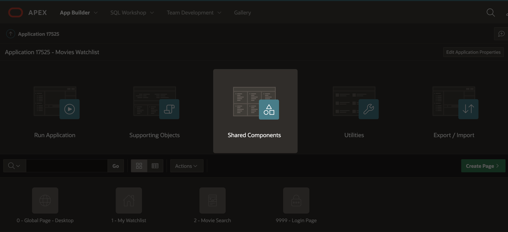

2. Under Data Sources, click on **REST Data Sources**.

3. On the REST Data Sources page, click **Create**. 

    * In the wizard dialog, select **From Scratch**.

    * Click **Next**.

    * Name: **Movie Details**

    * URL Endpoint: **https://api.themoviedb.org/3/movie/:movie_id**

        - At the end of the URL Endpoint, you are creating a bind variable, :movie_id, using the : syntax. This is what will allow you to pass in any value for the movie ID so that you can get the details for any movie. To learn more about bind variables, see the Resources section at the end of this lab.

    * Click somewhere within the Create REST Data Source dialog to unfocus from the URL Endpoint. APEX will display a URL Parameter line, where you can set the :movie_id parameter value.

    * Value: **505**

    * Click **Next**.

    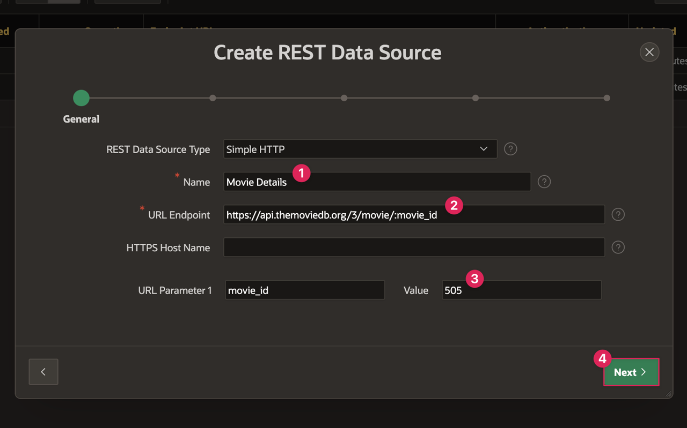

    * Just like the Search Movies source, APEX automatically divides the URL Endpoint into the Remote Server and Service URL Path. Click **Next** again.

    * On the Authentication step, you will set up authentication with your API key.

        - Authentication Type: **URL Query String**

        - Name: **api_key**

        - Value: *Insert your unique API key here.*

    * Click on the **Advanced** button at the bottom of the dialog.

    

    * Within the Advanced page, you can set up additional parameters and define what the response should look like. You should see your movie_id URL Pattern variable as a parameter, so the only thing you have to do is define the response.

    * Type a single period **.** in the **Row Selector (leave empty for auto-detection)** text field and hit Enter/Return.
    
        - This instructs APEX to use the root of the JSON object that gets returned from TMDB Movie Details API. To learn more, see the Resources section at the end of this lab.

    * For the Returns parameter, select **Single Row**.

        - Typically, APEX looks for a table with multiple rows of data. However, since you are getting data for a singular movie, there will be only a single row of data.

    * Click **Discover**.

    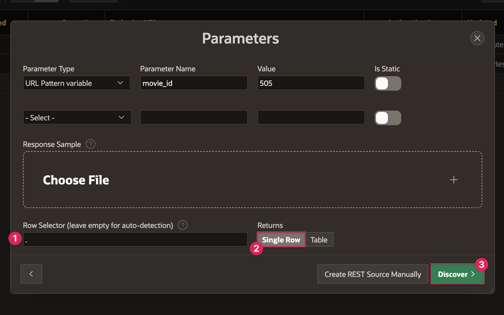

    * In the next page, you should see a table with one row of data containing the details for the movie with ID 505.

    * Click **Create REST Data Source**.

    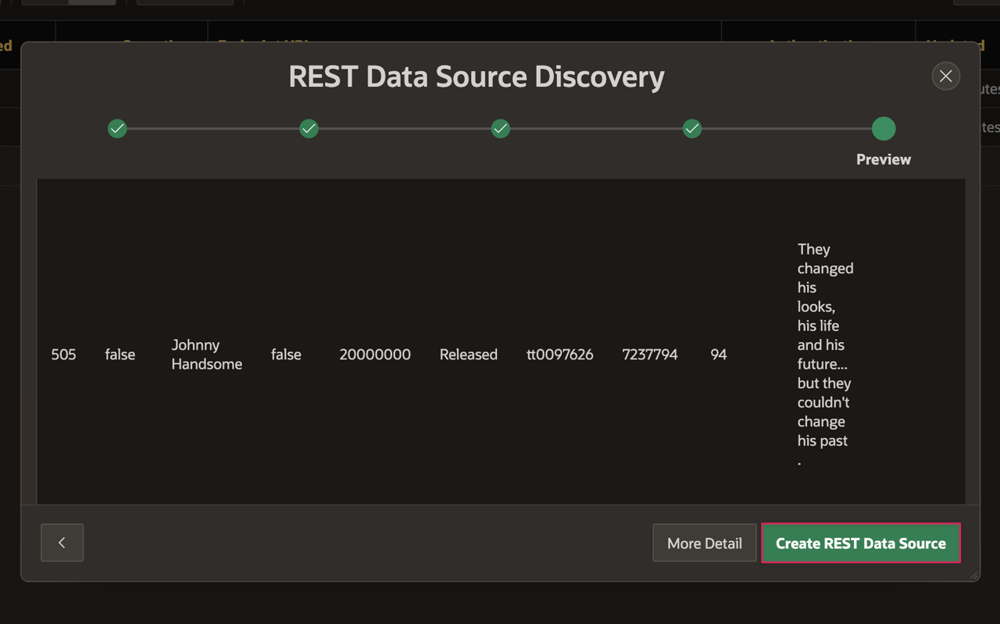

4. On the REST Data Sources page, click on Movie Details.

5. In Lab 2, you added a new column to the data profile for the full poster URL. You will now do the same thing for Movie Details, but you will add 2 visible columns:

    * **POSTER\_URL**: CONCAT('https://image.tmdb.org/t/p/w500', POSTER\_PATH)

    * **BACKDROP\_URL**:  CONCAT('https://image.tmdb.org/t/p/w500', BACKDROP\_PATH)

6. Follow the instructions in <a href="?lab=creating-rest-sources#Task2:EditTheRESTSourceDataProfile" target="_blank">Lab 2, Task 2</a> to add the BACKDROP\_URL and POSTER\_URL columns.

## Task 2: Create the Movie Details Page
Just like you did for the Movie Search page, you will create a new page and set a couple page properties before connecting the Movie Details REST source to the page.

1. Go to your Movies Watchlist Application home.

2. Click the **Create Page** button.

    * Click **Blank Page**.

    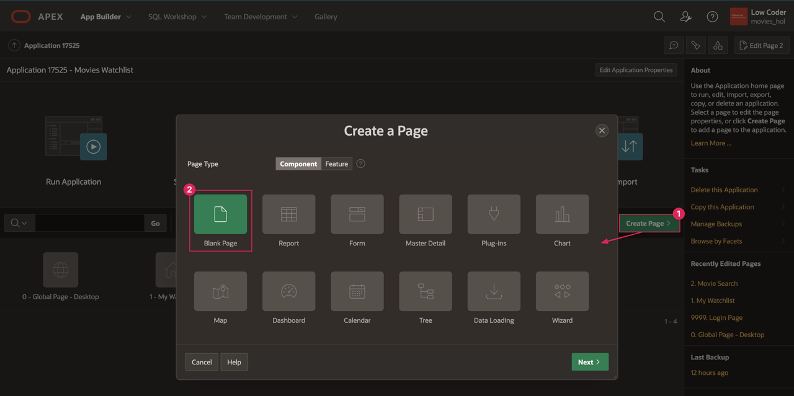

    * Set Name: **Movie Details**

    * Select Page Mode: **Modal Dialog**

    * Click **Next**.

    

    * Click **Next**.

    * Click **Finish**.

    * You should now be on page 3, the **Movie Details** page.

    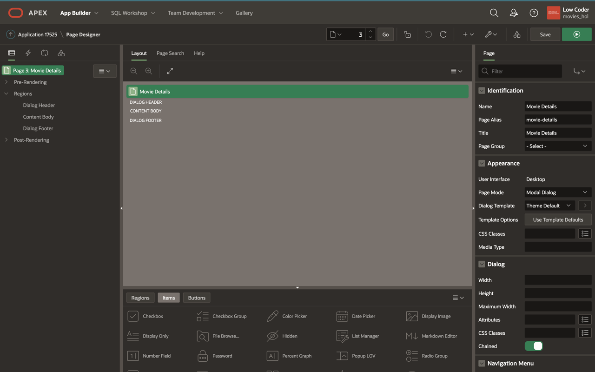

3. Make sure **Page 3: Movie Details** is selected in the rendering tree.

4. Within the Appearance property group, open the **Template Options** dialog. 

5. Select **Stretch to Fit Window**.

6. Click **Ok**.

    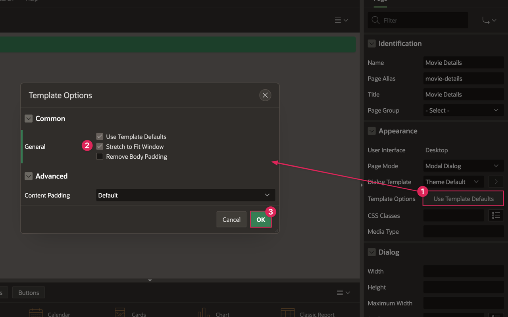

## Task 3: Connect the Movie Details REST Source to Page
When you set up the Movie Details API, you created the movie_id parameter. You can link that parameter to a page item that contains the movie id, which will allow you to call the details for whatever movie you select from the Movie Search page.

1. In the Movie Details page, right click on the Content Body region and select **Create Region**.

    * Title: **Movie**

    * Type: **Form**

    * Under the **Source** section:

        - Location: **REST Source**

        - REST Source: **Movie Details**

    * Once you select the source, you can see in the rendering pane that an item has been created for each data column under the Movie form region.

    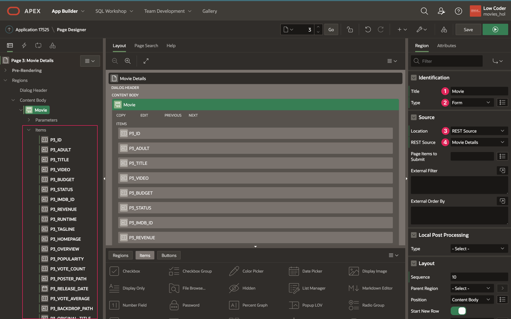

2. Click on the **P3\_ID** column under the Movie region.

    * Scroll down to **Source** and switch Primary Key to **on**.

    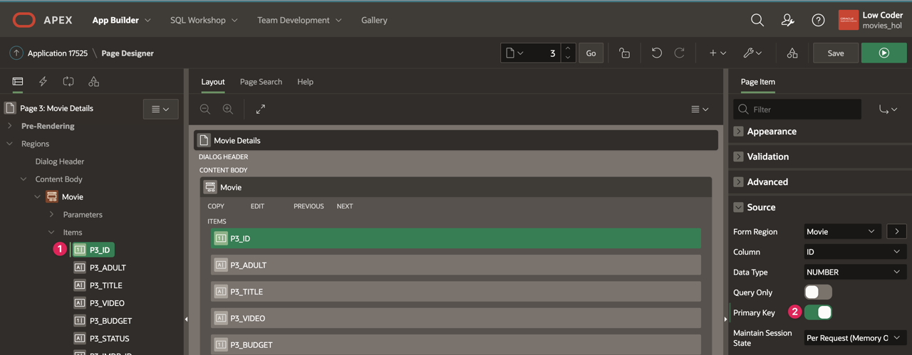

3. If you look at the Movie region, there is also a **Parameters** section in addition to the Items section. This is similar to the Searched Movies region on the Movie Search page. When you click the dropdown next to Parameters, you can see **movie_id**, which is the parameter you set up earlier in the Movie Details REST Data Source.

4. Click on the **movie_id** parameter.

    * Change the Value → Type to **Item**.

    * Set Item to **P3_ID**.

5. Click the **Save** button in the top right corner to save your changes.

    

## Task 4: Connect the Movie Details Page to Movie Search Page
You want to be able to view the details of any movie you click on in your Movie Search page. You can link the Movie Details page to the Movie Search page like you did when setting up the Movie Search page and Add a Movie button. However, in order to get the details for the specific movie you clicked on, you have to pass the movie id from the search page to the details page.

1. Navigate to page **2: Movie Search** by entering 2 in the Page Finder in the Page Designer toolbar and clicking Go.

    

2. On the Movie Search page, you can see in the rendering pane that both Popular Movies and Searched Movies have an **Actions** section underneath them.

3. Right click on **Actions** underneath Popular Movies and select **Create Action**.

    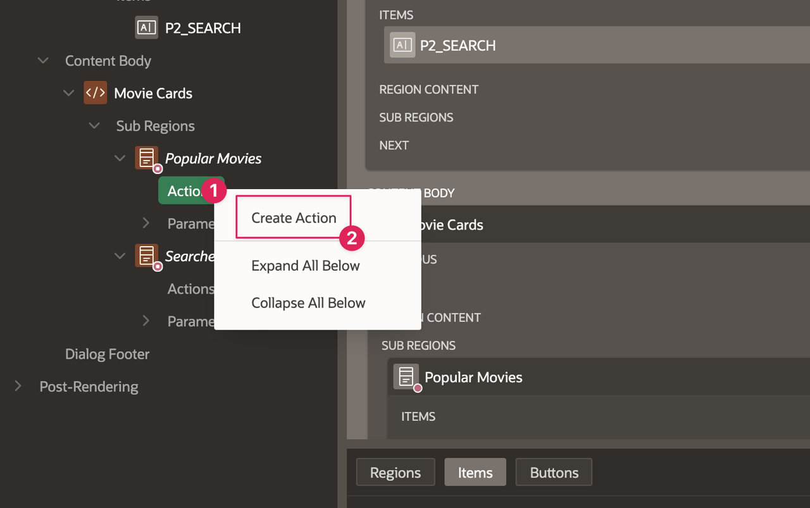

    * Identification → Type: **Full Card**

    * The Link section is where you can connect page 3 to page 2 by redirecting the user to a new page, similar to how a user gets to the Movie Search page from the Home page.

    * Click on **No Link Defined** next to Target to open the Link Builder dialog.

        - Page: **3**

        - You also need to set an ID item that will get passed to the Movie Details dialog so that the Movie Details page knows the ID of the movie that was clicked on.

        - Under Set Items, enter **P3_ID** as the Name.

        - Value: **&ID.**  
        	*Note: You can also use the buttons next to the name and value fields to browse items that you can pass values to. Notice that the options for Name all come from the Movie Details page (P3), because that is the item you want to set. The options for Value are the columns from the Movie Search data source because this is the what you are getting from page 2 and passing to page 3.*

        - Click **Ok**.

    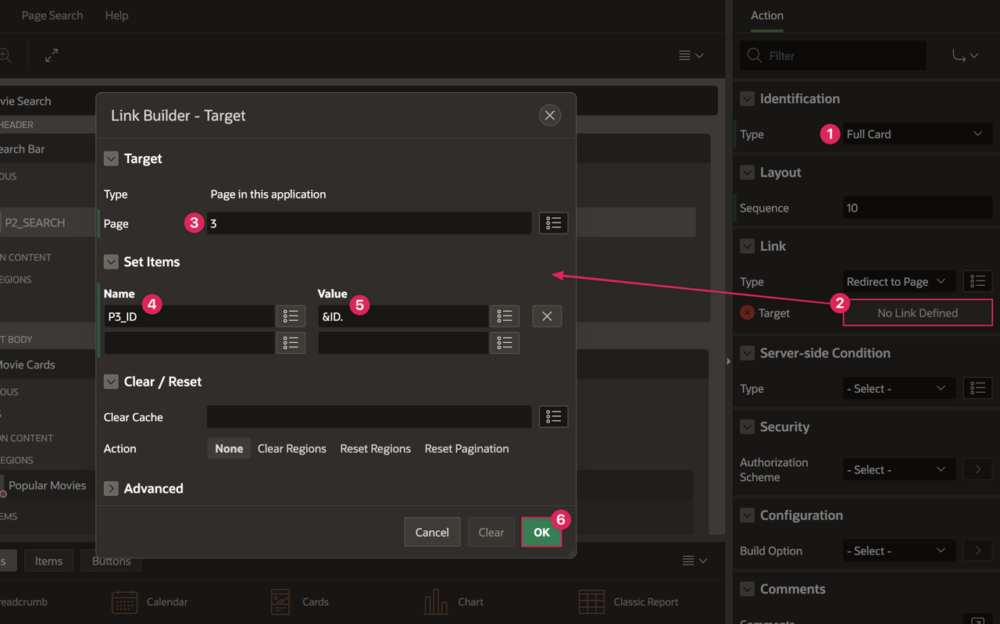

4. Right click on Actions under the Searched Movies region and select **Create Action**.

    * Type: **Full Card**

    * In the Link property group, click on **Target**.

        - Page: **3**

        - Name: **P3_ID**

        - Value: **&ID.**

        - Click **Ok**.

    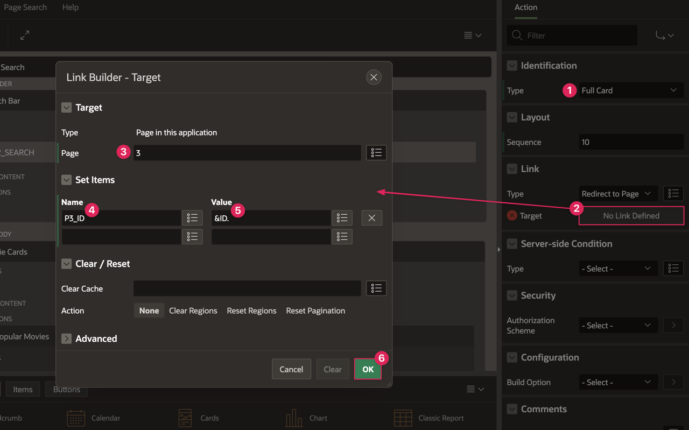

5. Click **Save**.

6. Refresh the page where your application is running.

7. Test the Movie Details page by clicking the **Add a Movie** button to open the Movie Search page.

8. Click on the movie of choice to see the details.

    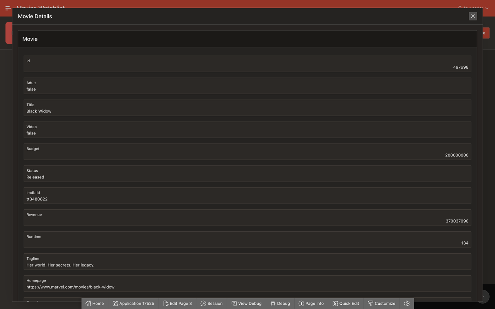

You may now **proceed to the next lab**.

## Resources 

- **REST Source Row Selector:** Using a single period **.** for the Row Selector when setting up a REST data source instructs APEX to use the root of the JSON object that gets returned from TMDB Movie Details API. If you were to leave the field empty, APEX would automatically look for an array within the return object to use as the results, which is what happens for the Popular Movies and Search Movies sources. However, the Movie Details source comes back in a different format, so you have to include instructions for APEX to discover the correct data.

	You can compare the Example responses for [Popular Movies](https://developers.themoviedb.org/3/movies/get-popular-movies) and [Movie Details](https://developers.themoviedb.org/3/movies/get-movie-details) from TMDB's API. Notice that Popular Movies has a "results" array in the response that contains the current popular movies, which is what APEX auto-detects, while the data for Movie Details is not returned in an array.  

- [REST Data Sources Documentation](https://docs.oracle.com/en/database/oracle/application-express/21.1/htmdb/managing-REST-data-sources.html#GUID-93D7A596-03A9-48AF-9FC9-6538BCC25DED)  

- [Modal Dialog Pages](https://docs.oracle.com/en/database/oracle/application-express/21.1/htmdb/creating-dialog-pages.html#GUID-BBFB0724-E33B-4846-AC94-A20E491B5D4E)  

- [Variables in APEX](https://www.talkapex.com/2011/01/variables-in-apex/)  

## Stuck? Download the Application Here
Stuck on a step or struggling with the lab? You can download a copy of the Movies Watchlist application through Lab 4 and follow the instructions below to import it into your Oracle APEX workspace.

- [Click here](./files/lab4.sql) to download a copy of the app at the end of Lab 4.

- You can import Lab 4 to your APEX workspace by clicking **Import** in the App Builder home page and following the wizard steps.

- You will be prompted to provide credentials for the Movie Details REST data source set up in this lab. You can see in the screenshot below that Credentials for Movie Details does not already exist in your workspace.  
*Note: If you did not complete or import Labs 2 or 3, the Already Existed value for Credentials for Search Movies would also be No.*

      

- Within the Credentials for Movie Details row:

    - In the Client ID or Username column, enter **api_key**.

    - In the Client Secret or Password column, paste your unique API key that you got from The Movie Database.

    - In the Verify Client Secret/Password column, past your API key again.

        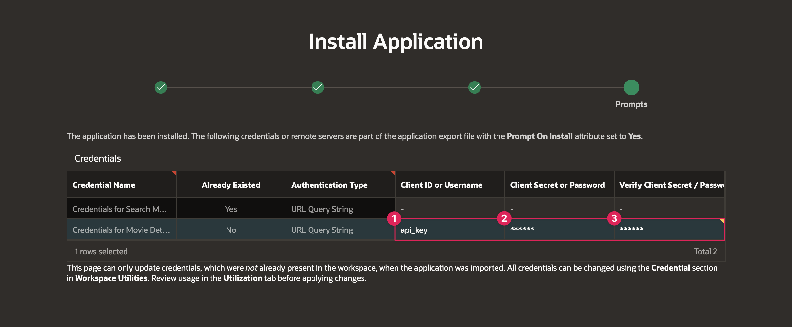

- Follow the instructions in the <a href="?lab=creating-movie-search-page#Stuck?DownloadtheApplicationHere" target="_blank">Stuck?</a> section of Lab 3 to update the Popular and Search Movies API keys.

## Acknowledgments

- **Author** - Paige Hanssen
- **Additional Contributors** - Kay Jasanya, Shakeeb Rahman, Steve Muench, Monica Godoy, Eli Feuerstein, Carlos Maciel, Dalia Vazquez
- **Last Updated By/Date** - Paige Hanssen, March 2022