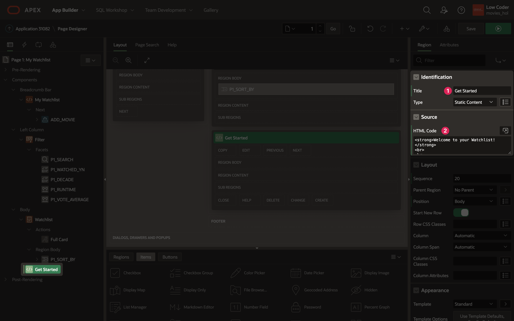
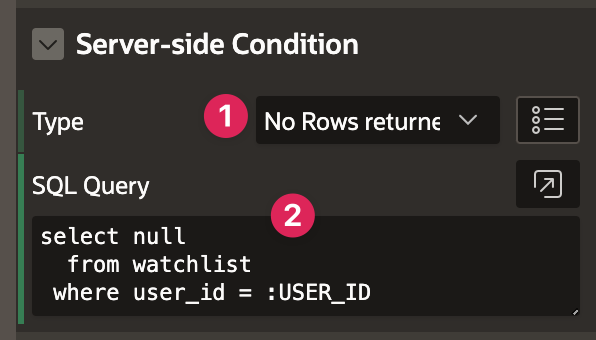
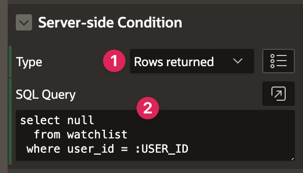
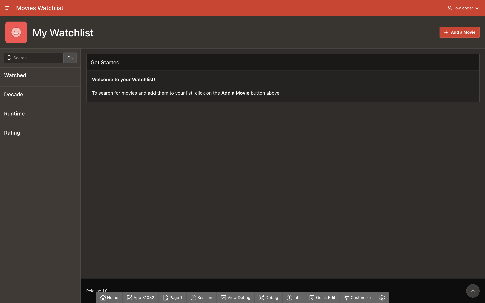
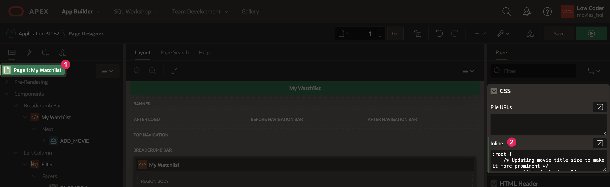
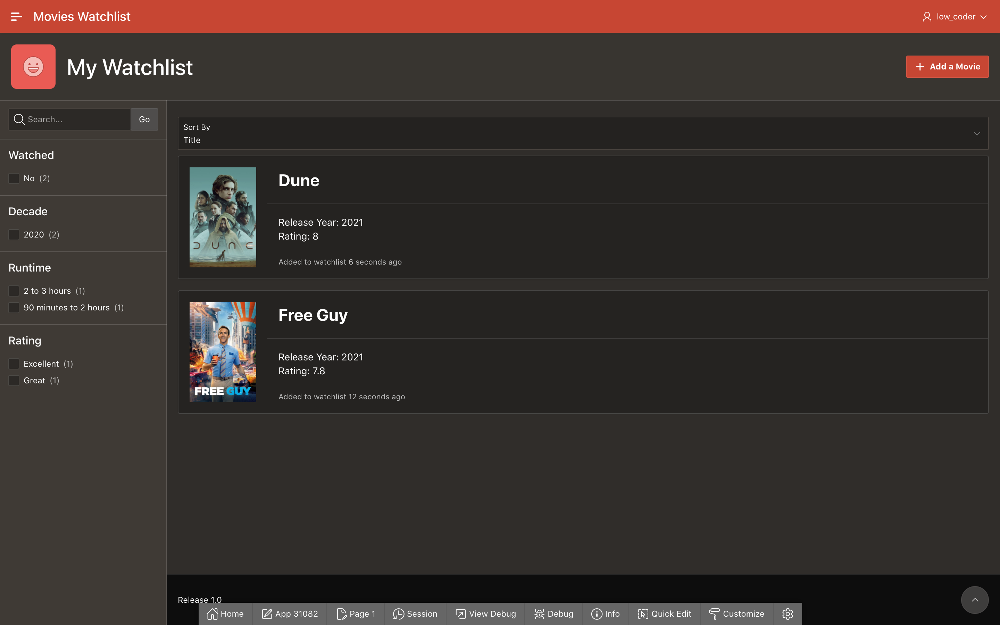
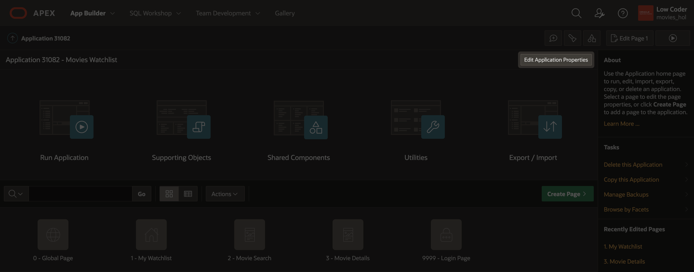
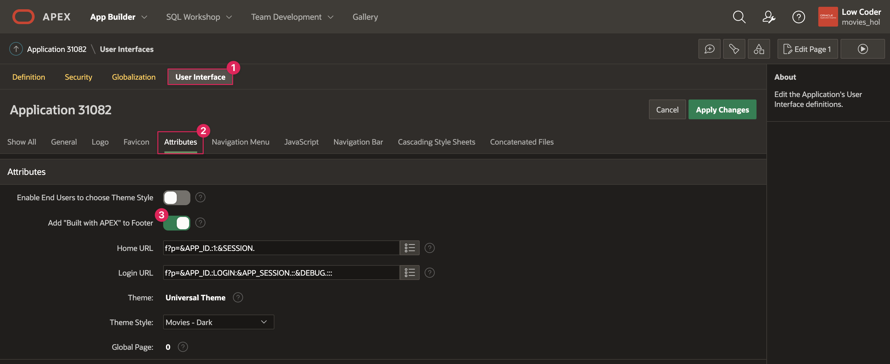
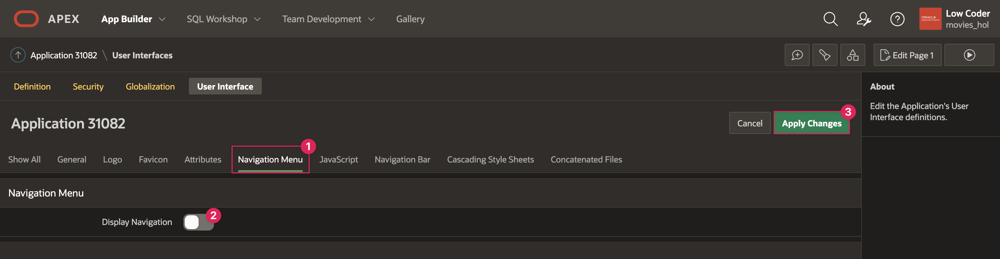
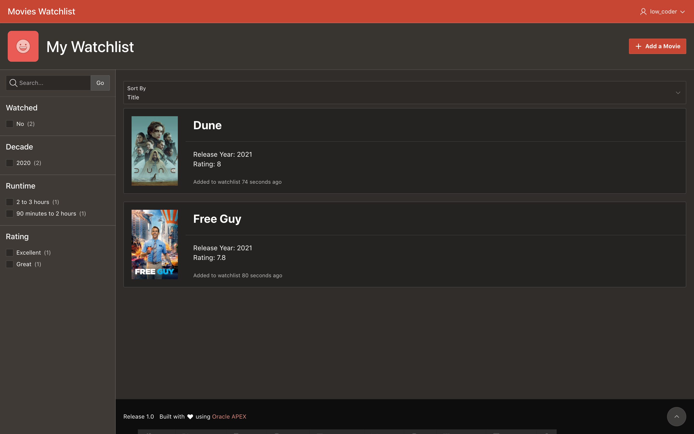

# Improve the My Watchlist Page (Optional)

## Introduction
There are a few more UI additions you can make to your app to really pull it all together and create the best user experience possible. This includes adding a welcome region for users when their Watchlist is empty to help them get started, customizing the Watchlist Cards style, and cleaning up the UI to remove unnecessary items.

Estimated Lab Time: 5 minutes

### Objectives
In this lab, you will:  
- Add a Get Started region to the My Watchlist page.  
- Add custom CSS to the My Watchlist page.  
- Remove the navigation menu.  
- Add the Oracle APEX footer.

### Prerequisites
- Completion of workshop through Lab 8

## Task 1: Create a Get Started Region
When a user logs into the Movies Watchlist app for the first time, they will not have any movies and the My Watchlist page will be blank. It would be helpful if there were a welcome message to assist users in getting started if there are no movies on the page.

1. In the Page Designer tab in your browser, navigate to page 1 of your application.

2. In the rendering pane, right click on Body and select **Create Region**.

    * Title: **Get Started**

    * Copy the below HTML code and paste it into the HTML Code box within the Source attribute group:

        ```
        <copy>
        &lt;strong>Welcome to your Watchlist!&lt;/strong>
        &lt;br>
        &lt;br>
        To search for movies and add them to your list, click on the &lt;strong>Add a Movie&lt;/strong> button above.
        ```

        

3. You also will need to add Server-side Conditions for the Get Started region and all other items within the Content Body page position, because you want to only show the Get Started region when a user has no movies in their watchlist. You only want to display the movie list, search, and sort by regions when a user has movies in their watchlist.

4. In the Get Started region, scroll down to **Server-side Condition**.

    * Type: **No Rows returned**

    * SQL Query:

        ```
        <copy>
        select null 
          from watchlist 
         where user_id = :USER_ID
        ```

        

5. You will use the same SQL Query in the Server-side Conditions for the Watchlist and Search Bar regions, but you will use the opposite type, Rows returned.

6. Click on the Watchlist region.

7. In Server-side Condition:

    * Type: **Rows returned**

    * SQL Query:

        ```
        <copy>
        select null 
          from watchlist 
         where user_id = :USER_ID
        ```

        

8. Save and run the page. You can test out your Get Started region by removing all the movies off your watchlist.

    

## Task 2: Style the Movie Cards
On the My Watchlist page, the cards that display the movies in the watchlist are very tall, and you can only see one full movie at a time without scrolling. It would be much better if you were able to view multiple movies on the same screen without having to scroll. You can add a little custom CSS to make this happen.

1. In the rendering pane, click on **Page 1: My Watchlist**.

2. Scroll down to the CSS property group.

3. Copy the code below and paste it within the Inline code editor:

    ```
    <copy>
    :root {
        /* Updating movie title size to make it more prominent */
        --a-cv-title-font-size: 24px;
        --a-cv-title-line-height: 1.5;
    }

    /* Update default width of images */
    .a-CardView-items--row .has-media {
        grid-template-columns: minmax(32px,128px) minmax(0,var(--a-cv-icon-spacer,44px)) 1fr minmax(0,auto);
    }
    ```

    

4. Save and run page 1. You will see that the height of the cards has decreased and the title of the movies within the cards has increased.

    

## Task 3: Remove the NavBar and Add Page Footer
You can put a couple finishing touches on your app UI by modifying the Application Properties, which are properties that are applied across the entire app, instead of individual pages and regions.

1. In the Page Designer tab, go to your Application home.

2. Click **Edit Application Properties**.

    

3. Click on the yellow **User Interface** text.

4. Click the **Attributes** tab.

    * Add "Built with APEX" to Footer: **on**

    

5. Click the **Navigation Menu** tab.

    * Because you only have one normal page and two modal dialog pages, it does not make much sense to have a navigation menu, so you can turn the navigation off.

    * Display Navigation: **off**

6. Click **Apply Changes**.

    

7. Refresh the tab your Movies Watchlist application is running in to use your completed app.

    

You have now completed your Movies Watchlist application and can search for movies and add them to your watchlist. However, there are many ways to continue to add functionality to and customize your application. You can check out the Resources section in this lab to learn about different ways you can enhance your app, including components that you can implement and API requests you can make to get additional data.

## Resources
- [Universal Theme Components](https://apex.oracle.com/pls/apex/apex_pm/r/ut/components)  

- [The Movie Database API](https://developers.themoviedb.org/3/getting-started/introduction)  

## Stuck? Download the Application Here
Stuck on a step or struggling with the lab? You can download a copy of the Movies Watchlist application through Lab 10 and follow the instructions below to import it into your Oracle APEX workspace.

- [Click here](./files/lab10.sql) to download a copy of the completed app.

- You can import Lab 10 to your APEX workspace by clicking **Import** in the App Builder home page and following the wizard steps.

- When you are prompted by the install wizard for Credentials, follow the instructions in the <a href="?lab=creating-movie-details-page#Stuck?DownloadtheApplicationHere" target="_blank">Stuck?</a> section of Lab 4 to provide credentials for the Movie Cast REST data source as well as Movie Details.

- Follow the instructions in the <a href="?lab=creating-movie-search-page#Stuck?DownloadtheApplicationHere" target="_blank">Stuck?</a> section of Lab 3 to update the Popular and Search Movies API keys.

## Acknowledgments

- **Author** - Paige Hanssen
- **Additional Contributors** - Kay Jasanya, Shakeeb Rahman, Steve Muench, Monica Godoy, Eli Feuerstein, Carlos Maciel, Dalia Vazquez
- **Last Updated By/Date** - Paige Hanssen, March 2022