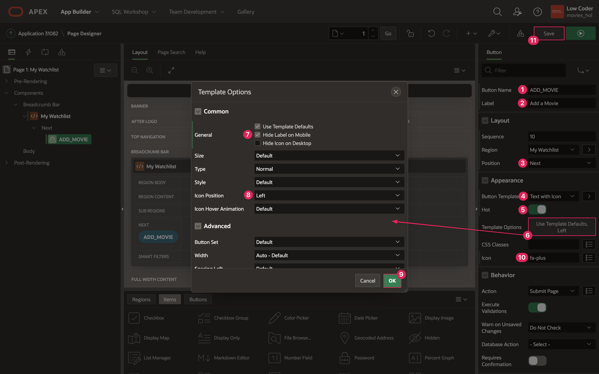
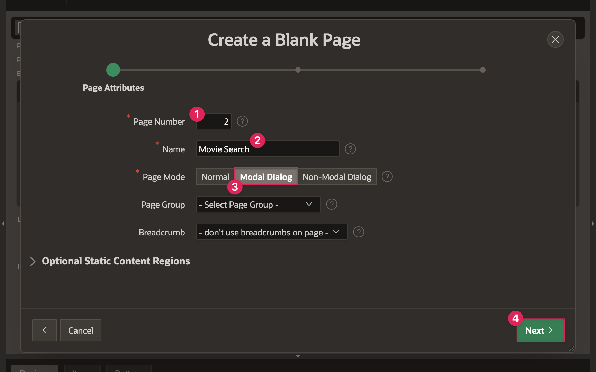
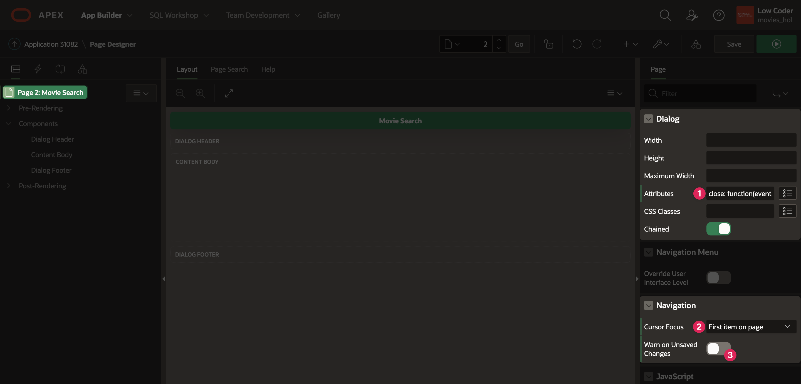
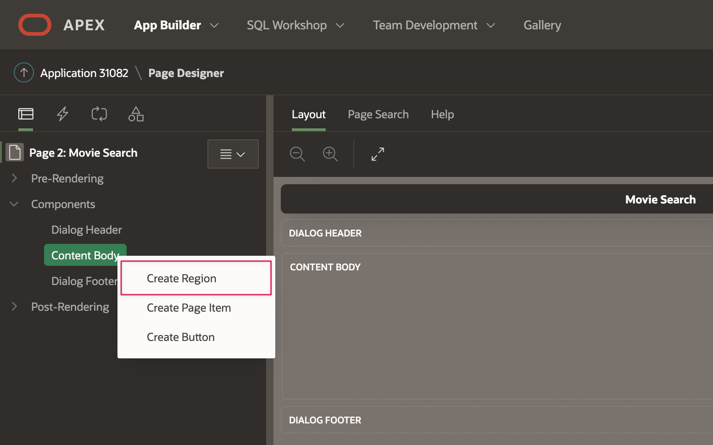
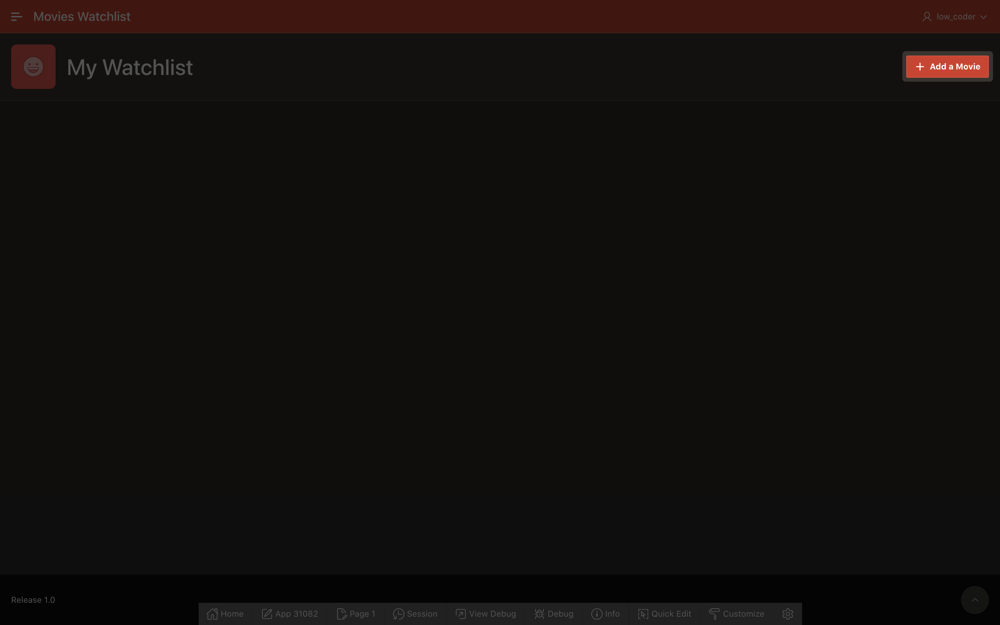

# Create the Movie Search Page

## Introduction
You will create and set up the Movie Search page in this lab so that you can view popular movies and search for a movie of your choice. The search functionality must be built out first in order to be able to create a watchlist even though the My Watchlist page is the home page of the application. You will need to first create a button on the home page that links to the Movie Search page. On the Movie Search page you will create regions that display the data from the REST data sources you created in the previous lab, and you will implement a search bar that lets you search for movies.

Estimated Lab Time: 20 minutes

### Objectives
In this lab, you will:  
- Add a button to link the Movie Search page to the Movie Watchlist page.  
- Create a new page.  
- Link the Popular Movies REST data source to the new page.  
- Link the Search Movies REST data source to the new page.  
- Set up search functionality to allow a user to search for a movie.

### Prerequisites
- Completion of workshop through Lab 2

## Task 1: Create the Add a Movie Button
You will need to create a button on the first page of the application before you can create the Movie Search page, so that you have a way to open up the page when you want to search for movies.

1. Return to the Movies Watchlist application home and click on page **1 - My Watchlist**.

    

2. The Page Designer in APEX is broken up into a few different panes: the rendering pane on the left, the layout pane in the middle, and the properties pane on the right. In the rendering pane on the left, click on the **Movies Watchlist** region in the Breadcrumbs Bar position.

    * In the properties panel on the right, set the Title: **My Watchlist** 

3. Right click on the My Watchlist region in the rendering pane and select **Create Button**.  

    

4. Set the following button Identification properties in the properties panel on the right:

    * Identification → Button Name: **ADD_MOVIE**
    
    * Identification → Label: **Add a Movie**

    * Layout → Position: **Next**

    * Appearance → Button Template: **Text with Icon**
    
    * Appearance → Hot: **on**

    * Appearance → Template Options:
    
        - Click on **Use Template Defaults, Left**

        - Check **Hide Label on Mobile**

        - Icon Position: **Left**

        - Click **Ok** to save and close the dialog.

    * Appearance → Icon: **fa-plus**

5. Click the **Save** button in the top right of the Page Designer to save everything.

    

## Task 2: Create the Movie Search Page
Now that you have a way of opening the Movie Search page, you will actually create the page in this step and do a little page setup before adding data.

1. In the toolbar at the top of the Page Designer, click the **Create** button (3 buttons left of the Save button) and select the **Page** option. 

    

2. In the Create wizard, click **Blank Page**.

    

3. Set the following page attributes:

    * Page Number: **2**

    * Name: **Movie Search**

    * Page Mode: **Modal Dialog**

    * Click **Next**.

    

    * Click **Next** again.

    * Click **Finish** to save and go to your new page.

4. On your new page, make sure that **Page 2: Movie Search** is selected in the rendering pane.

5. In the Page pane, scroll down to **Appearance** and click on **Template Options**.

    * In the Template Options popup dialog, check the **Stretch to Fit Window** box under Common.

    * Click **Ok**.

    

6. In the Dialog section, paste the following line in **Attributes**:  
	**`close: function(event, ui) {apex.navigation.dialog.close(true,{dialogPageId:&APP_PAGE_ID.});}`**

    * The line above assists with refreshing the Watchlist page when the Movie Search dialog closes. This will be important when you start adding and removing movies to and from your watchlist, because you want your home page to load automatically to reflect any changes without you having to manually refresh the page each time.

7. Within Navigation:

    * Cursor Focus: **First item on page**

    * Warn on Unsaved Changes: **off**

    

8. In the CSS property group, you will also add some custom CSS to style some of the items on the page.

    * Copy the code below and paste it in the Inline property code box:

        ```
        <copy>
        /* Set posters to be the same size/ratio */
        .a-CardView-media--square:before {
            padding-top: 150%; /* 2:3 ratio */
        }
        
        /* set position of the Card badge */
        .a-CardView-badge {
            position: absolute;
            top: 12px;
            right: 12px;
            margin: 0;
        }
        
        /* style the movie rating under the movie title */
            .movie-rating {
            margin-top: 4px;
        }
        
        /* style both the movie rating and the star icon under the movie title */
        .movie-rating,
        .movie-rating .fa {
            font-size: 12px;
            line-height: inherit;
            vertical-align: bottom;
            opacity: 0.75;
        }
        ```

    * The above code styles the movie poster images to all be the same size. It also adds some styling for the Cards region badge attribute that will be used in a later lab, to place it in the top right of a card. Finally, it adds some styling for the movie rating that you will display on the Card along with the movie title and poster.

    

## Task 3: Set up Popular and Searched Movies
In this step, you will start to add data to your app using the REST data sources you set up in Lab 2. First, you will be using the Popular Movies source to get the list of current popular movies and display them when a user has not searched for any movies.

1. In the rendering pane of the Page Designer, right click on Content Body and select **Create Region**.

    

2. Set the following properties:  

    * Identification → Title: **Popular Movies**

    * Identification → Type: **Cards**

    * Source → Location: **REST Source**

    * Source → REST Source: **Popular Movies**

        - When you click the dropdown for REST Source, you should see both the REST data sources you set up earlier - Popular Movies and Searched Movies. This will allow the Cards region to use the columns and data associated with the Popular Movies REST data source and populate the region.

    

3. Click the **Attributes** tab at the top of the properties pane on the right of the Page Designer. This is where you can select columns and set what data will display on each movie card. 

    * Appearance → Grid Columns: **5 Columns**

    * Card → Primary Key Column 1: **ID**

    * Title → Column: **TITLE**

    * Subtitle → Advanced Formatting: **on**

        - In your Cards region, you will show a star icon with the average rating of the movie next to it. Including multiple columns or custom text is not built-in to an attribute, but you can use Advanced Formatting to replace it with an HTML expression.

    * Subtitle → HTML Expression:
        
        ```
        <copy>
        &lt;div class="movie-rating">
        &lt;span aria-hidden="true" class="fa fa-star">&lt;/span> &VOTE_AVERAGE.&lt;/div>
        ```  
        *Note: In the HTML Expression, the &NAME. syntax is used to create a substitution string for the value of the VOTE_AVERAGE column for each movie. To learn more, check out the Resources section at the end of this lab.*

        

    * Media → Source: **URL Column**

    * Media → URL Column: **POSTER_URL**

    * Media → Position: **First**

    * Media → Appearance: **Square**

    * Media → Sizing: **Cover**

        

4. You also need to create a Cards region to display the data from the Search Movies REST source.  It will be almost exactly like the Popular Movies region, with a few minor changes.

5. Right click on the Popular Movies region in the rendering pane and select **Duplicate** to create a copy of the region.

6. Set the following properties:

    * Identification → Title: **Searched Movies**

    * Source → REST Source: **Search Movies**

7. You also need to set the pagination attributes for the Searched Movies region, because you are getting all the search results at one time. Within Searched Movies, set the following Pagination properties in Searched Movies region Attributes tab:

    * Type: **Page**

    * Cards per page: **25**

    

## Task 4: Add the Search Bar
The final region that needs to be added to the Movie Search page is the search bar, which will allow a user to search for movies. Additionally, both the Popular and Searched movie regions are currently displaying at the same time on the Movie Search page. You want to only show one at a time based on the condition that the Searched Movies region displays only if the search bar page item has a value. If the search bar has no value, the page will only display the Popular Movies region.

1. Right click on Dialog Header in the rendering pane and select **Create Region**.

    * Identification → Title: **Search Bar**

    * Appearance → Template: **Blank with Attributes**

    * Appearance → CSS Classes: **padding-sm**  
    *Note: If you open the options dialog next to the CSS Classes property, the only option available is margin-sm, so you need to manually enter padding-sm in the property text box.*

    

2. Right click on the new Search Bar region and select **Create Page Item**.

    * Identification → Name: **P2_SEARCH**

    

    * Appearance → Template: **Hidden**

    * Appearance → open the Template Options dialog:

        - Select **Stretch Form Item**

        - Size: **X Large**

        - Click **Ok**.

    * Appearance → Icon: **fa-search**

    * Appearance → Value Placeholder: **Search for a movie...**

    * Advanced → Warn on Unsaved Changes: **Ignore**

    

3. Click on the **Popular Movies** region.

    * Scroll down to Server-Side Condition in the properties pane.

        - Type: **Item is NULL**

        - Item: **P2_SEARCH**

    * Now you are displaying the Popular Movies region based on a condition. If the P2_SEARCH item is NULL, then the region will display. You will create an opposite condition for the Searched Movies region.

    

4. Click on **Searched Movies**.

    * Scroll down to Server-Side Condition.

        - Type: **Item is NOT NULL**

        - Item: **P2_SEARCH**

    * Now, you are only displaying Searched Movies if the P2_SEARCH item is NOT NULL (has a value).

    

5. In order to actually search for a movie, you have to edit the query parameter that is submitted with a call to TMDB Search Movies API. A search query is required, otherwise you will not get any results back. When you look at the two Cards regions in the rendering pane, you can see that underneath Searched Movies there is a **Parameters** dropdown section.

6. Expand the section and you will see **query** listed as a parameter. This is what you will link to the P2_SEARCH page item in order to control the search.

7. Click on the **query** parameter.

    * You will see that its Type is Static Value, and the Static Value is harry potter, which is the query you used in the URL when setting up the REST source.

    * Change the Type from Static Value to **Item**.

    * In the Item field, enter **P2_SEARCH**.

8. Save your changes by clicking the **Save** button in the top right of the Page Designer.

    

## Task 5: Link Add Movie to Movie Search
The last task in this lab is linking your Add a Movie button on the Watchlist page to the Movie Search page. A modal dialog page like Movie Search cannot run on its own, which is why you need the Add a Movie button to access it.

1. Go to page 1 by clicking the down arrow in the page navigation on the toolbar.

    

2. Click on the ADD_MOVIE button and set the following:

    * Behavior → Action: **Redirect to Page in this Application**
    
    * Click on **No Link Defined** next to Target to open the Link Builder dialog.

    * Click on the List of Values button next to Page.

        

        * Within the List of Values dialog, select the Movie Search page.

            

    * Clear Cache: **2**  
    *Note: This is the ID of your Movie Search page. Clearing the Movie Search page cache will ensure the page items in are cleared each time the page is opened so users can perform new searches.*

    * Click **Ok** to close the dialog.

    

3. You also need to add a Dynamic Action to the button so that the My Watchlist page updates properly when the Movie Search page dialog closes.

4. Right click on the **ADD_MOVIE** button in the rendering pane and select **Create Dynamic Action**.

    

    * Name: **Refresh on Dialog Closed**

5. In the rendering pane, click the arrow next to the Refresh on Dialog Closed to expand the action.

6. Below the new Dynamic Action, click on the **Refresh** action under True.

    * Action: **Submit Page**

7. Click the green Save and Run button at the top right of the Page Designer.

    

8. Click the **Add a Movie** button to open the Movie Search page.

    

9. You should only see the search bar and the list of popular movies.

    

10. Type "harry potter" in the search bar and hit Enter (Return on Mac).

    * You should get results for movies with the search term "harry potter" in the title.

    

11. Delete "harry potter" from the search bar and press Enter (Return on Mac). The popular movies should reappear.

12. In the Development Bar at the bottom of the page, click **Application XXXXX** to return to the Application home.

	

You now know how to create a new page in your APEX application and add components to define content in Page Designer. You may now **proceed to the next lab**.

## Resources

- [Page Designer Documentation](https://docs.oracle.com/en/database/oracle/application-express/21.1/htmdb/about-page-designer.html#GUID-F4A825A2-6BD5-4A11-8D68-B24B2B6ED18B)  

- [Cards Documentation](https://docs.oracle.com/en/database/oracle/application-express/21.1/htmdb/managing-cards.html#GUID-0F5699C1-D198-4951-9E9C-175F6D79936B)  

- [Cards in Universal Theme](https://apexcentral.us.oracle.com/apx212dev/oracle/r/ut211/card-regions)  

- [Modal Dialog Pages](https://docs.oracle.com/en/database/oracle/application-express/21.1/htmdb/creating-dialog-pages.html#GUID-BBFB0724-E33B-4846-AC94-A20E491B5D4E)  

- [Variables in APEX](https://www.talkapex.com/2011/01/variables-in-apex/)  

## Stuck? Download the Application Here
Stuck on a step or struggling with the lab? You can download a copy of the Movies Watchlist application through Lab 3 and follow the instructions below to import it into your Oracle APEX workspace.

- [Click here](./files/lab3.sql) to download a copy of the app at the end of Lab 3.

- You can import Lab 3 to your APEX workspace by clicking **Import** in the App Builder home page and following the wizard steps.

- Once the application is installed, you will need to update the API key for both the Popular Movies and Search Movies regions on the Search Movies page.

- Go to the App Home by clicking on **Edit Application** from the Application Installed success page.

- Click on page **2 - Movie Search**.

- Expand the **Parameters** section under Popular Movies.

    - Click on **api_key**.

    - Under Value, change Type to **Static**.

    - Paste your unique TMDB API key in the **Static Value** text area.

- Follow the same process for the Search Movies **api_key** parameter.

- Click **Save**.

## Acknowledgments

- **Author** - Paige Hanssen
- **Additional Contributors** - Kay Jasanya, Shakeeb Rahman, Steve Muench, Monica Godoy, Eli Feuerstein, Carlos Maciel, Dalia Vazquez
- **Last Updated By/Date** - Paige Hanssen, March 2022