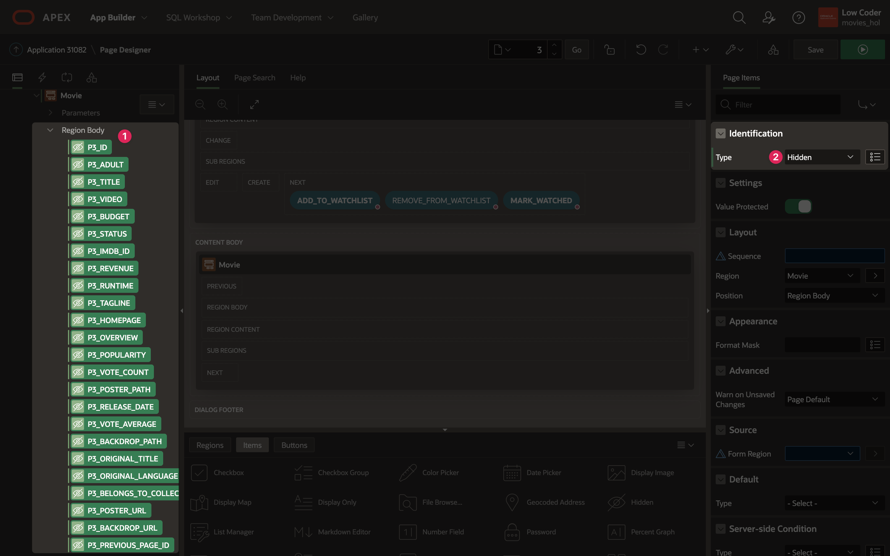
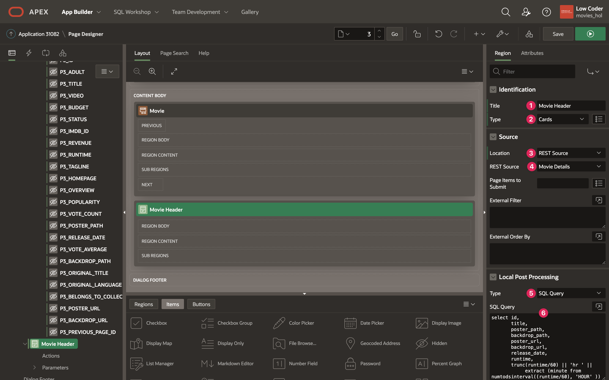
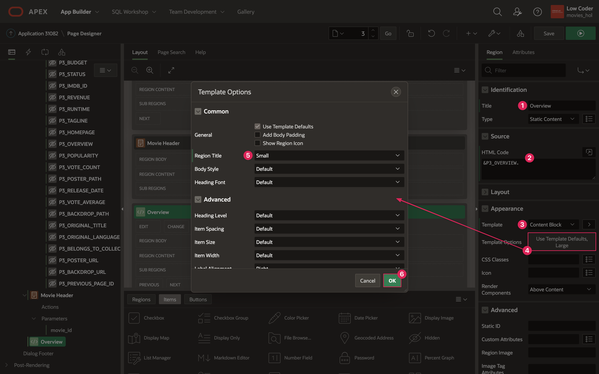
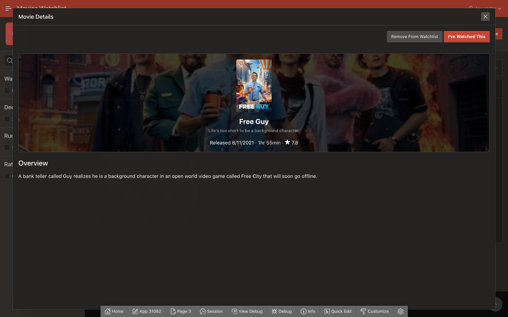

# Improve the Movie Details Page

## Introduction
At this point, you have built out the basic functionality of your Watchlist app. However, while the app is usable, it is not entirely user friendly. In this lab, you will revamp the Movie Details page UI to make it easier to read and understand.

Estimated Lab Time: 10 minutes

### Objectives
In this lab, you will:  
- Create a header region for the Movie Details page.  
- Add the movie overview.  
- Style the regions with CSS.

### Prerequisites
- Completion of workshop through Lab 7

## Task 1: Create the Movie Details Header
On your current Movie Details page, all that displays are simple form fields with the data that comes from the Movie Details API. While that tells you information about a movie, you want to be able to view it in a nicer format. To start, you can utilize a few columns to create a nice header that includes the movie poster, the background image, and the movie title.

1. In the Page Designer tab in your browser, navigate to page 3 - Movie Details.

2. In the rendering pane, click on the **Movie** region.

    * Appearance → Template: **Blank with Attributes**

3. You also will need to hide all the Movie page items so that you can still access them but create your own content for the page. To do this, you can set the Type of a column to Hidden, which will not display an item on the frontend.

    * To select all items, click on the first item under the Movie region, P3\_ID, and then hold shift and click on the last item, P3\_PREVIOUS\_PAGE\_ID.

    * In the Page Items editing pane, set Type: **Hidden**

    

4. To start creating the header for the Movie Details page, right click on Content Body and select **Create Region**.

    * Set the following:

        - Title: **Movie Header**

        - Type: **Cards**

        - Source → Location: **REST Source**

        - Source → REST Source: **Movie Details**

        - Local Post Processing → Type: **SQL Query**

        - Local Post Processing → replace the existing SQL query with the following:

            ```
            <copy>
            select id,
                   title,
                   poster_path,
                   backdrop_path,
                   poster_url,
                   backdrop_url,
                   release_date,
                   runtime,
                   trunc(runtime/60) || 'hr ' ||
                        extract (minute from numtodsinterval((runtime/60), 'HOUR' )) || 'min'
                        as runtime_friendly,
                   vote_average,
                   tagline
              from #APEX$SOURCE_DATA#
            ```

        - The above query is a simplified version of the original query because you only need a few columns for the header. It also converts RUNTIME into the hours and minutes format and returns it as RUNTIME\_FRIENDLY.

        

        - Appearance → open Template Options:

            + Style: **Style B**

            + Click **Ok**.

5. Click on the **Attributes** tab for the Movie Header region.

    * Set the following:

        - Appearance → Layout: **Horizontal (Row)**

        - Card → CSS Classes: **movie-header-card**

        - Card → Primary Key Column 1: **ID**

        - Title → Column: **TITLE**

        - Subtitle → Column: **TAGLINE**

        - Body → Advanced Formatting: **on**

        - Body → HTML Expression:

            ```
            <copy>
            &lt;div class="movie-details">
                &lt;span title="Release Date">Released &RELEASE_DATE.&lt;/span> &amp;middot; 
                &lt;span title="Runtime">&RUNTIME_FRIENDLY.&lt;/span> &amp;middot;
                &lt;span title="&VOTE_AVERAGE. out of 10">&lt;span class="fa fa-star" aria-hidden="true">&lt;/span> &VOTE_AVERAGE.&lt;/span>
            &lt;/div>
            ```

        - Icon and Badge → Icon Source: **Image URL**

        - Icon and Badge → Image URL: **&POSTER\_URL.**

        - Icon and Badge → Icon CSS Classes: **w100 h150**

        - Media → Source: **URL Column**

        - Media → URL Column: **BACKDROP\_URL**

        - Media → Position: **As Background Image**

        - Media → Sizing: **Cover**

            

6. Under the Movie Header region in the rendering pane, expand the **Parameters** dropdown.

7. Click **movie\_id**.

    * Set the following properties:

        - Type: **Item**

        - Item: **P3\_ID**
    
    

8. Now you will have a nice header that includes the movie title, poster image, and background image, and some of the movie details.

## Task 2: Add the Movie Overview
In addition to the header, you want to be able to see the overview of the movie, but formatted in a way that is better for viewing than in a form.

1. In the rendering pane on the left, right click on Content Body and select **Create Region**.

2. Set the following properties:

    * Title: **Overview**

    * Source → HTML Code: **&P3\_OVERVIEW.**

    * Appearance → Template: **Content Block**

    * Appearance → Template Options:

        - Region Title: **Small**

        - Click **Ok**.

    

## Task 3: Add Custom CSS
As the last step for the Movie Details page enhancements, you will add some custom CSS to style the page header you created and the cast cards that will be added in Lab 9. While the original layout and format of the Cards can get you pretty far, a little custom CSS goes a long way in really rounding out the entire look of a region and a page.

1. At the top of the rendering pane, click on **Page 3: Movie Details**.

2. Scroll down to the **CSS** property group.

3. Copy the code below and paste it into the Inline CSS code editor:

    ```
    <copy>
    /* Customize Movie Header Card */
    .movie-header-card.a-CardView {
        /* Increase the font sizes for movie name and tag line */
        --a-cv-title-font-size: 24px;
        --a-cv-subtitle-font-size: 16px;

        /* Add additional spacing around the header content */
        --ut-cv-subtitle-margin: 16px 0 0 0;
        display: flex;
        padding: 24px 0;
    }
    .movie-header-card .a-CardView-body {
        /* Remove unnecessary padding */
        padding-top: 0;
    }
    .movie-details {
        /* Center align Card Body text */
        text-align: center;
    }

    /* Set card images to be a portrait ratio */
    .a-CardView-media--square:before {
        padding-top: 150%; /* 2:3 ratio */
    }
    ```

    

4. Click the **Save** button.

5. Refresh the Movies Watchlist tab in your browser where your app is running, and open the Movie Details page to see the updates you have made.

    

You have now enhanced the Movie Details page and know how to improve your application with custom CSS. You may now **proceed to the next lab**.

## Resources

- [Cards Documentation](https://docs.oracle.com/en/database/oracle/application-express/21.1/htmdb/managing-cards.html#GUID-0F5699C1-D198-4951-9E9C-175F6D79936B)  

- [Variables in APEX](https://www.talkapex.com/2011/01/variables-in-apex/)  

## Stuck? Download the Application Here
Stuck on a step or struggling with the lab? You can download a copy of the Movies Watchlist application through Lab 8 and follow the instructions below to import it into your Oracle APEX workspace.

- [Click here](./files/lab8.sql) to download a copy of the app at the end of Lab 8.

- You can import Lab 8 to your APEX workspace by clicking **Import** in the App Builder home page and following the wizard steps.

- When the install wizard prompts you for Credentials, follow the instructions in the <a href="?lab=creating-movie-details-page#Stuck?DownloadtheApplicationHere" target="_blank">Stuck?</a> section of Lab 4 to update the API key for the Movie Details REST source.

- Follow the instructions in the <a href="?lab=creating-movie-search-page#Stuck?DownloadtheApplicationHere" target="_blank">Stuck?</a> section of Lab 3 to update the Popular and Search Movies API keys.

## Acknowledgments

- **Author** - Paige Hanssen
- **Additional Contributors** - Kay Jasanya, Shakeeb Rahman, Steve Muench, Monica Godoy, Eli Feuerstein, Carlos Maciel, Dalia Vazquez
- **Last Updated By/Date** - Paige Hanssen, March 2022