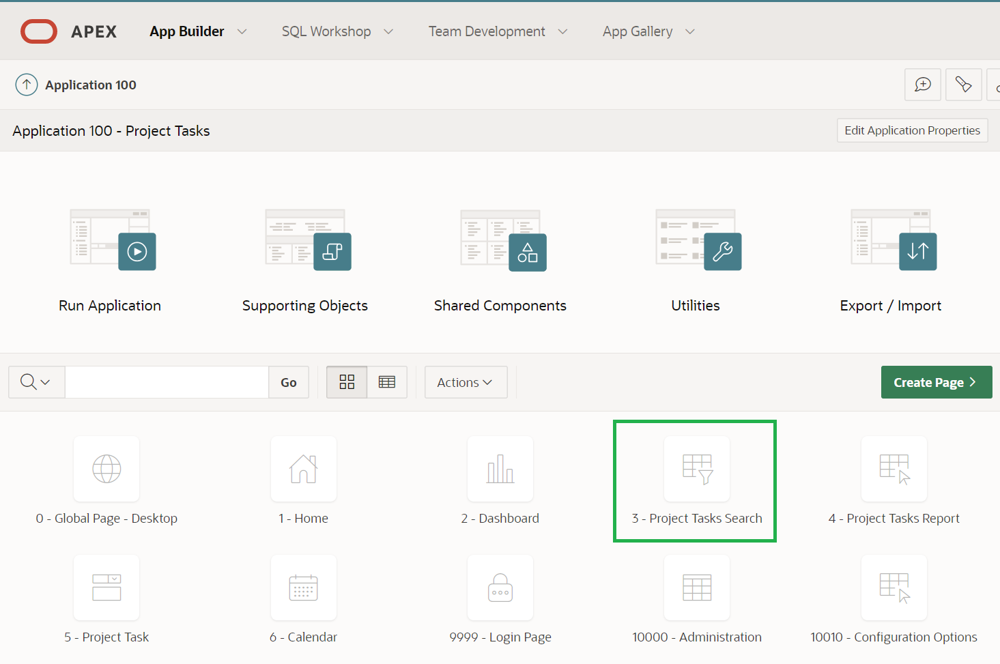
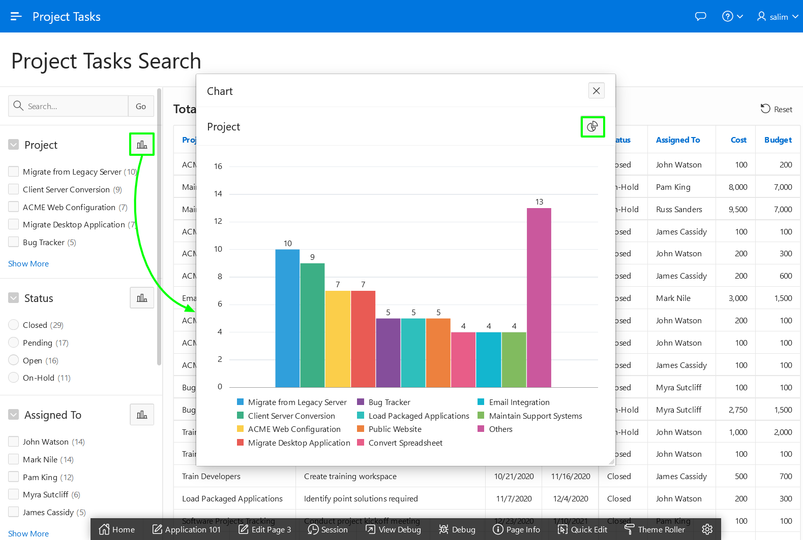
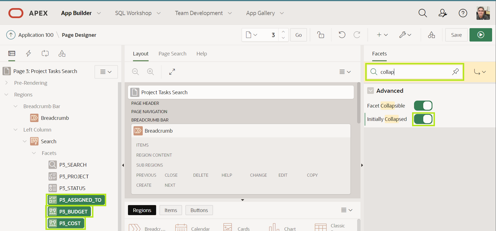
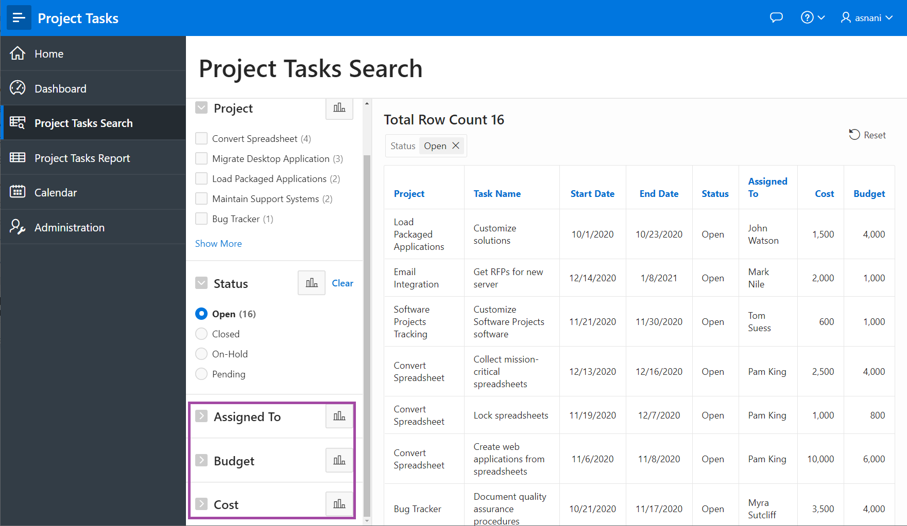

# Improving the Faceted Search

## Introduction
In this lab, you will get first-hand experience with enhancing the application by improving the faceted search page for better clarity and improved usability. The search page includes facets on the left which can readily be used to limit the data shown in the report on the right.

If you review the **Project Tasks Search** page you can check and uncheck various facets. When you check a facet, the counts on all of the remaining facets will be updated to show the number of records that meet the new criteria.

Estimated Time: 10 minutes

## Task 1: Enhancing the Status Facet
Reviewing the facets, you will notice that Status is down the page and you can choose multiple values.

1. From the runtime application, go to the search page by clicking **Project Tasks Search**. Given you ran this app from the APEX App Builder, a Developer Toolbar is displayed at the bottom of the screen. *Note - End users who log directly into the app will not see this toolbar.*

    In the Developer Toolbar click **Edit Page 3**.

    

    Alternatively, you can also navigate back to the APEX App Builder tab in your browser manually by selecting the appropriate browser tab or window. Once in the App Builder click **3 - Project Tasks Search**.

    

    You should now be in Page Designer. Page Designer is where you will spend the majority of your time improving your application. There are three panes within Page Designer. The left pane initially displays the Rendering tree, with a list of page components. The middle pane displays the Layout, a representation of the page, and Gallery, from which you can drag and drop new components into the Layout. The right pane is the Property Editor, where you can change attributes for the selected component.

2. Status is a very common search criteria, so you want to reorder the facets such that Status is between Project and Assigned To.

    In the Rendering tree (left pane), under **Search**, within **Facets**, click and hold **P3\_STATUS** and drag it up until it is under **P3\_PROJECT** then release the mouse.

       

3. Currently the Status facet is a series of checkboxes. However, it is unlikely that users will want to select more than one at a time, so you will convert it to a radio group.

    Continuing with **P3\_STATUS** selected, within the Property Editor (right pane), for Identification > Type, select **Radio Group**. Scroll down the properties in the Property Editor, and for List Entries > Zero Count Entries select **Show Last**.

       

4. At the top right of the page click **Save and Run Page** to save the changes made to the facets and review the app.

       

5. In the runtime environment, click one of the statuses. Review how the counts on the other facets are updated based on your selection. Also notice how you can still select one of the other statuses or click **Clear**, within the Status facet, to clear your selection and again show all the counts for statuses.

    

6. Click on the chart icon next to the Project facet. A popup window with a chart of the total counts shows up. You can toggle between the bar and the pie chart by clicking on the chart type icon.

    

    

## Task 2: Collapsing Facets
1. You may have noticed that the facets go off the bottom of the page. Therefore, it would be preferable to collapse the last three facets, making it easier to see all available facets.

    Navigate back to the development environment (APEX App Builder) by using the edit link in the Developer toolbar, or manually navigating to the appropriate browser tab.

    In the Rendering tree (left pane), under **Search**, within **Facets**, click **P3\_ASSIGNED\_TO**, hold down the *Shift* key and then click **P3\_COST**, such that three facets are selected. In the Property Editor (right pane), within the filter at the top, enter **collap**, so that only two attributes are displayed. For Advanced > Initially Collapsed, switch it to On.

       

    *Note - Rather than entering a filter you can also scroll down the properties until you find the correct attribute to update.*

7. Click **Save and Run Page** to see the improved search page.   

       

## **Summary**

You now know how to enhance a faceted search page and have been introduced to Page Designer.

## **Acknowledgements**

 - **Author/Contributors** -  Salim Hlayel, Principal Product Manager
 - **Last Updated By/Date** - Madhusudhan Rao, Apr 2022

