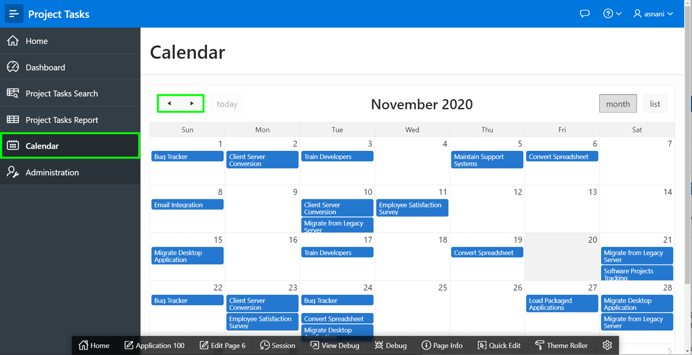
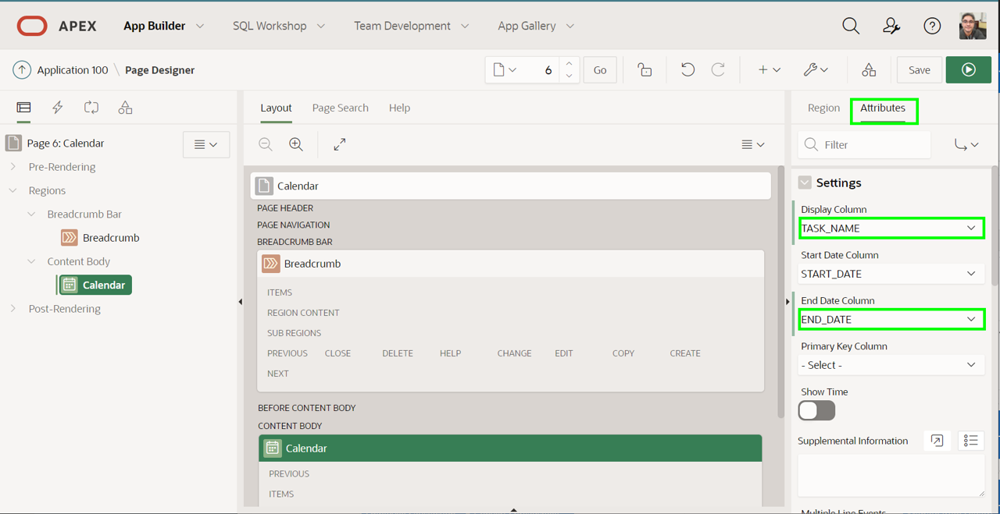
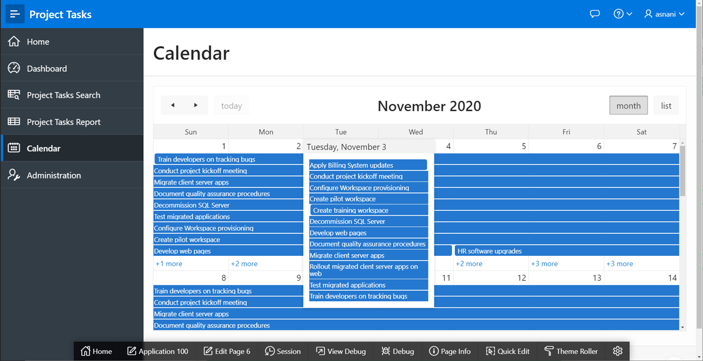
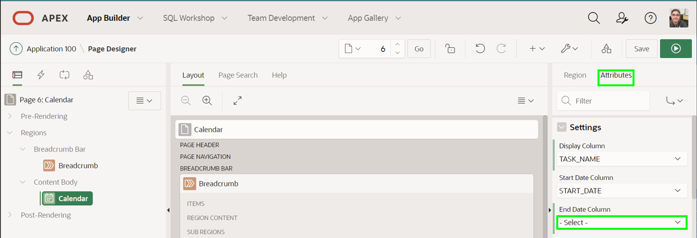
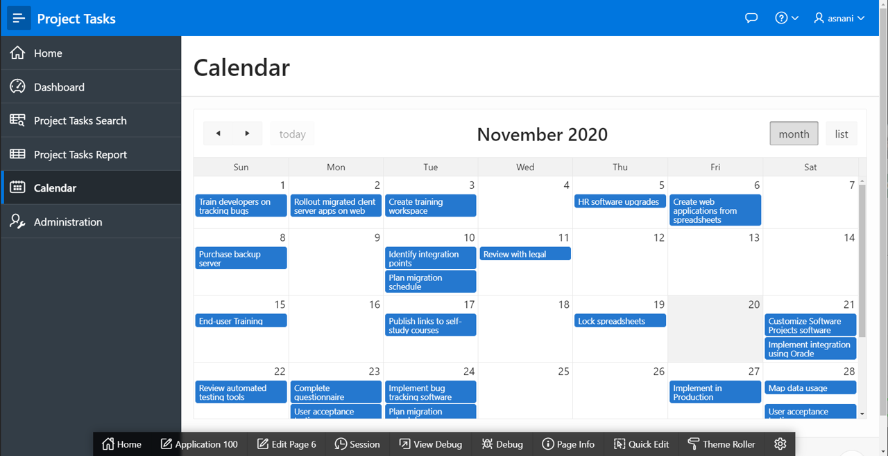
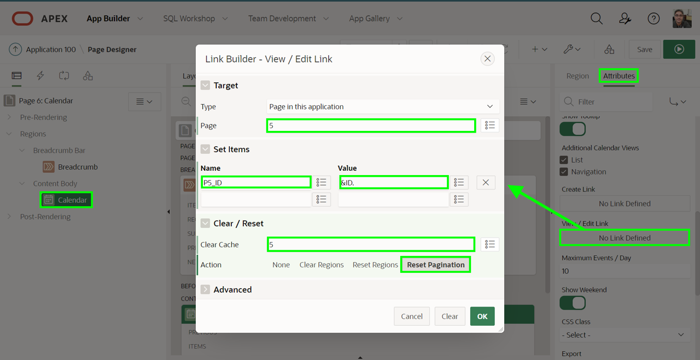
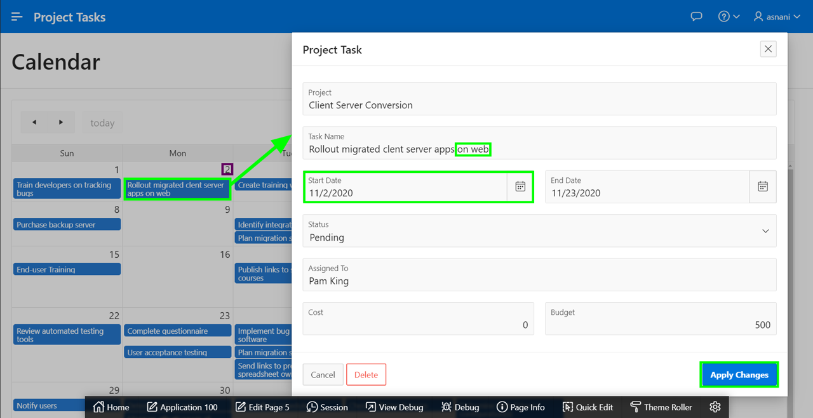
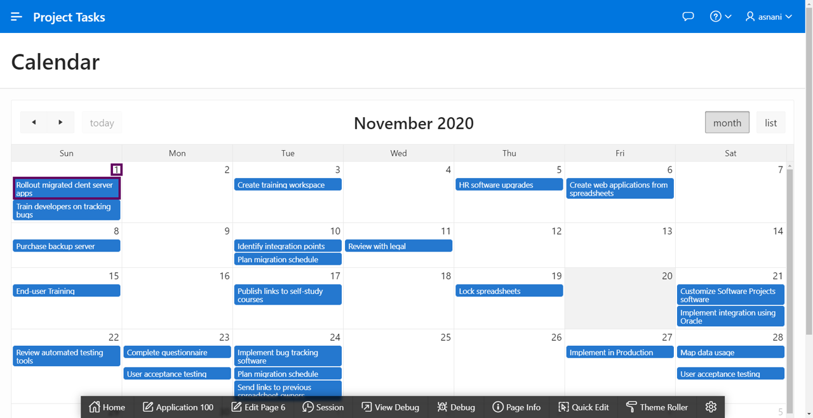

# Improving the Calendar

## Introduction
In this lab, you will learn how to improve a calendar and link an existing page to a modal form page.

Estimated Time: 5 minutes

## Task 1: Improving the Calendar
The **Calendar** page currently displays the project, rather than the task name, and only shows the start date, instead of displaying duration-based events.

1. In the runtime environment, click **Calendar**.

    

    *Note - You may have to use the arrows at the top of the calendar to navigate backward or forward months to see data displayed.*

2. In the Developer Toolbar, click **Edit Page 6**. Alternatively, navigate back to the APEX App Builder browser tab and manually navigate to Page 6.

3. You can change the displayed column and make the events duration based by updating the calendar attributes.

    In Page Designer, within the Rendering tree (left pane), find Calendar, and then click **Attributes** directly below that.
    Within the Property Editor (right pane), for Settings > Display Column select **TASK\_NAME**, and for End Date Column select **END\_DATE**.

    

4. In Page Designer, within the toolbar click **Save and Run** to review your changes.    

    

5. Reviewing the revised calendar changing to duration-based events is not optimal. Therefore, you should remove the End Date Column added above.

    In Page Designer, with Page 6 selected, within the Rendering tree (left pane), select Calendar. The **Attributes** tab appears next to the Region tab in the right pane.

    Click **Attributes**.  For Settings > End Date Column select **- Select -** to clear the **END_DATE** entry.

    

6. In Page Designer, click **Save and Run** to see the improved calendar.

    

## Task 2: Linking the Calendar
When you click on a calendar entry then it shows event details. It would be far better to link to the Project Task form page and allow end users to update the details.

1. Navigate to the App Builder, and ensure Page Designer is displayed with Page 6 selected.

2. Define a view / edit link from the **Calendar** region to **Page 5**, the Project Tasks form page you modified in the previous lab.

    In Page Designer, within the Rendering tree (left pane), find Calendar, and then click on **Attributes** tab in Property Editor (right pane).
    Within the **Attributes** tab, for Settings > View / Edit Link click **No Link Defined**.

    In the Link Builder dialog, select / enter the following and click **OK**.

    | Property | Value |
    | --- | --- |
    | Page | **5** |
    | Name | **P5\_ID** |
    | Value | **&ID.** |
    | Clear Cache | **5** |

    

3. In Page Designer, within the toolbar, click **Save and Run** to review the completed application.

    In the runtime environment, from the Calendar, select an event. In the Project Task form page update the Task Name and Start Date. Click **Apply Changes**.

    

    Confirm that the calendar refreshes to show the updated details.

    

## **Summary**

You now know how to create an application by uploading a file, enhancing the page using runtime environment and page designer, and also linking pages to enhance the application.

## **Learn More** - *Useful Links*

- [APEX on Autonomous](https://apex.oracle.com/autonomous)
- [APEX Collateral](https://www.oracle.com/database/technologies/appdev/apex/collateral.html)
- [Tutorials](https://apex.oracle.com/en/learn/tutorials)
- [Community](https://apex.oracle.com/community)
- [External Site + Slack](http://apex.world)

## **Acknowledgements**

 - **Author/Contributors** -  Salim Hlayel, Principal Product Manager
 - **Last Updated By/Date** - Salim Hlayel, Principal Product Manager, November 2020

