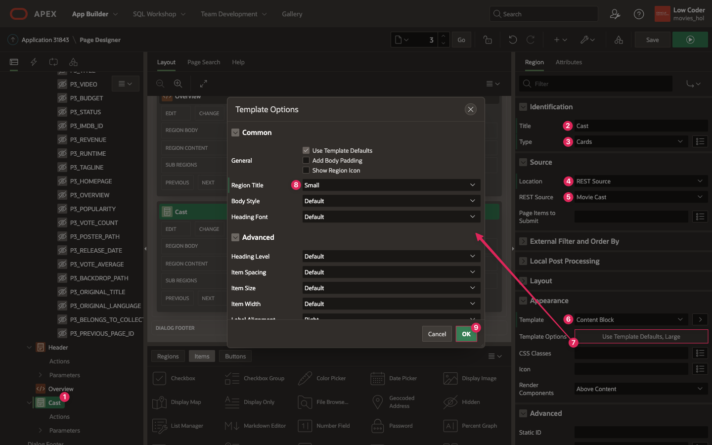
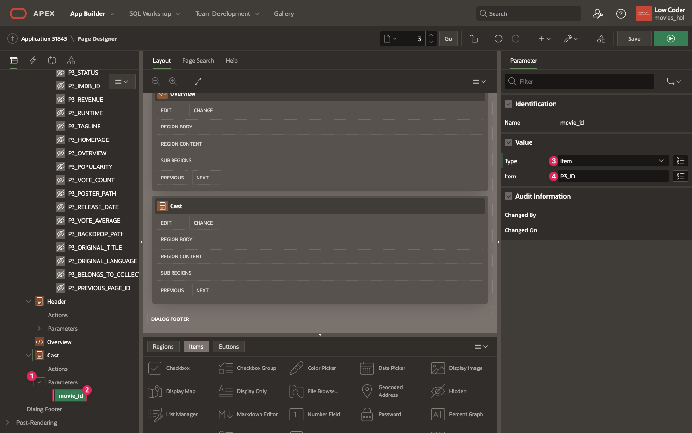

# Add Cast List to Movie Details Page (Optional)

## Introduction
This next lab is optional, but it would be fun and informative if a user were able to see not only the basic details of a movie but also the cast list when they open the Movie Details page. The steps are very similar to most of the work you have already done, but this lab will walk you through adding Cast Cards to your Movie Details page.

Estimated Lab Time: 5 minutes

### Objectives
In this lab, you will:  
- Use the Movie Cast REST data source to add Cast Cards the Movie Details page.

### Prerequisites
- Completion of workshop through Lab 4

## Task 1: Add the Cast Region to Movie Details Page
You already created the Movie Cast REST data source in Lab 2, and now you can use it on the Details page to display the cast list along with the movie details and overview to bring everything together.

1. Navigate to the **Movie Details** page of your Movies Watchlist application.

2. Right click on Content Body in the rendering pane and select **Create Region**.

    * Title: **Cast**

    * Type: **Cards**

    * Source → Location: **REST Source**

    * Source → REST Source: **Movie Cast**

    * Appearance → Template: **Content Block**

    * Appearance → open the Template Options dialog:

        - Region Title: **Small**

        - Click **Ok**.

        

3. Click on the Attributes tab and set the following:

    * Appearance → Grid Columns: **5 Columns**

    * Card → Primary Key Column 1: **ID**

    * Title Column: **CHARACTER**

    * Subtitle → Column: **NAME**

    * Media → Source: **Image URL**

    * Media → URL: **https://image.tmdb.org/t/p/w500&PROFILE\_PATH.**

    * Media → Position: **First**

    * Media → Appearance: **Square**

    * Media → Sizing: **Cover**

    * Pagination → Type: **Page**

    * Pagination → Cards per Page: **10**

    

4. Under the Cast region in the rendering pane, expand the **Parameters** dropdown.

5. Click on **movie\_id**.

6. Set the following properties:

    * Type: **Item**

    * Item: **P3\_ID**

7. Click **Save**.

    

8. Refresh the tab where your app is running and click on a movie either from your Watchlist or from the Movie Search to view the updated Movie Details page.

    

You have now improved the Movie Details page further by displaying a list of cast members along with the movie header and overview. You may now **proceed to the next lab**.

## Resources

- [REST Data Sources Documentation](https://docs.oracle.com/en/database/oracle/apex/22.1/htmdb/managing-REST-data-sources.html#GUID-93D7A596-03A9-48AF-9FC9-6538BCC25DED)  

- [Cards Documentation](https://docs.oracle.com/en/database/oracle/apex/22.1/htmdb/managing-cards.html)  

## Stuck? Download the Application Here
Stuck on a step or struggling with the lab? You can download a copy of the Movies Watchlist application through this lab and follow the instructions below to import it into your Oracle APEX workspace.

- [Click here](./files/lab-8.sql) to download a copy of the app at the end of this lab.

- You can import the app to your APEX workspace by clicking **Import** in the App Builder home page and following the wizard steps.

- You will be prompted for the Credentials for Movies web credential that was set up in lab 2. You can see in the screenshot below that Credentials for Movies does not already exist in the workspace.  
*Note: If you completed Lab 2, Credentials for Movies will already exist in your workspace and this will be pre-filled*

      

- If Credentials for Movies does not already within your workspace, set the following for the Credentials for Movies row:

    - In the Client ID or Username column, enter **api\_key**.

    - In the Client Secret or Password column, paste your unique API key that you got from The Movie Database.

    - In the Verify Client Secret/Password column, past your API key again.

        

- Click **Next**.

- Make sure Install Supporting Objects is **on** and click **Next** again.

- Click **Install** to install the supporting objects and finish importing the application.

## Acknowledgments

- **Author** - Paige Hanssen
- **Last Updated By/Date** - Paige Hanssen, August 2022