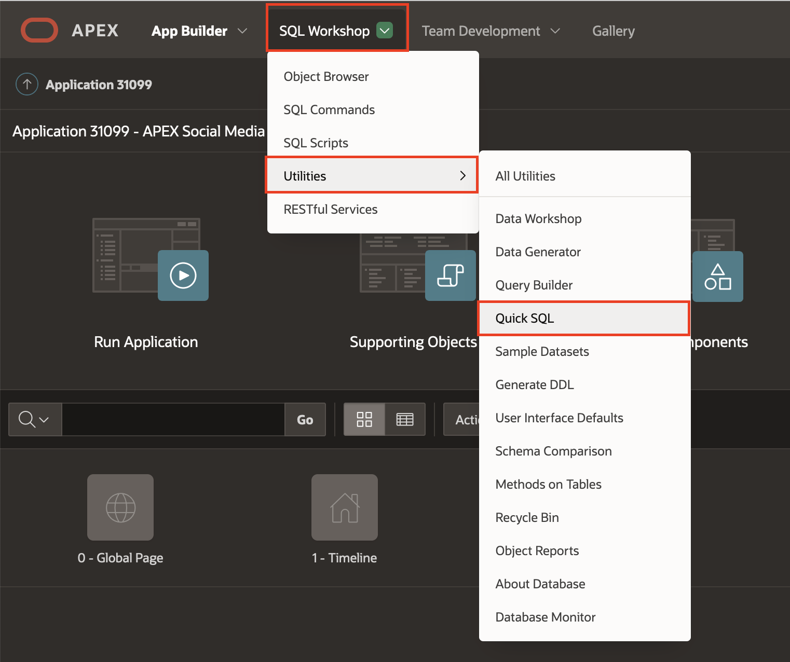
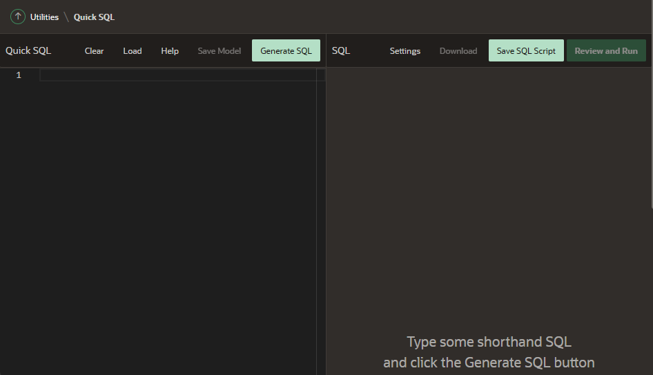
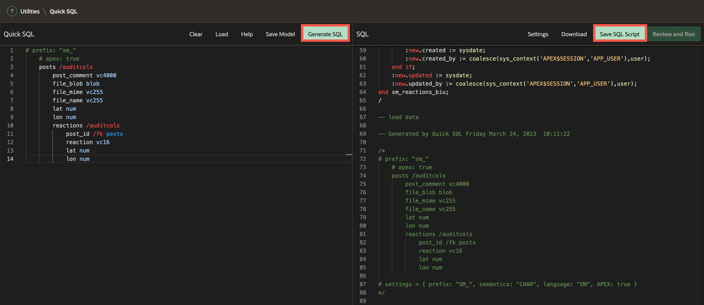
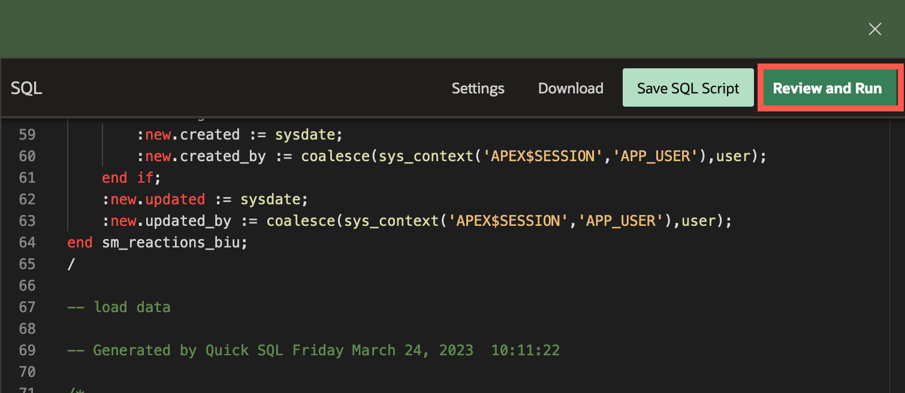
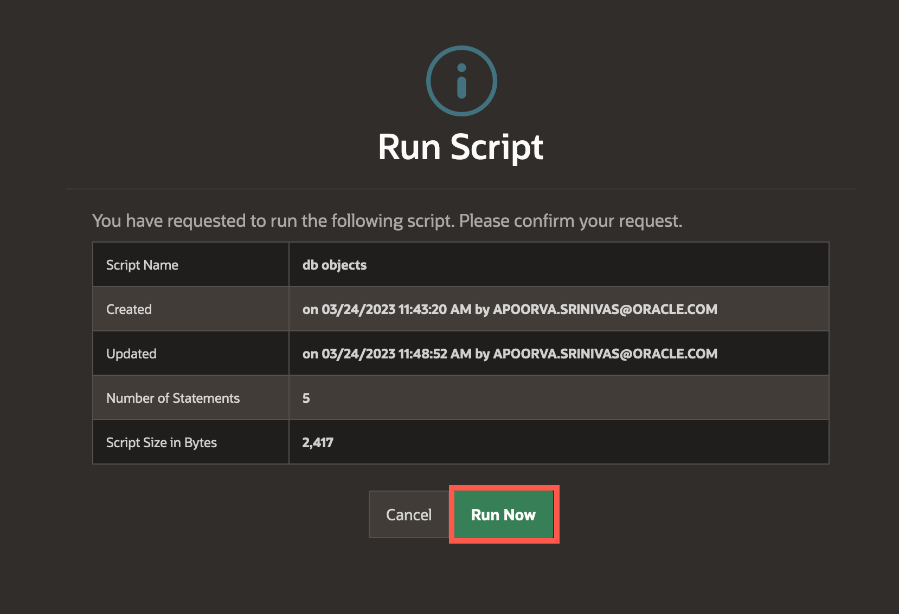
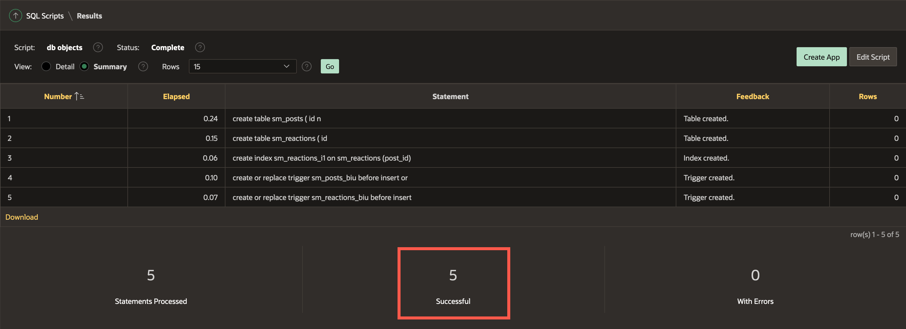

# Build the Data Model


## Introduction

In this lab, you will create the database objects and data required for the app. To do so, you will be introduced to the **SQL Workshop** component of APEX where you will build the database objects using **Quick SQL**, run SQL scripts and view the data using the Object Browser.

Estimated Time: 5 minutes

## **Task 1**: Data Model review and QuickSQL

1. Our application data model will consist of 2 tables: 
- A table for the **POSTS** 
- A table for the **REACTIONS** on the posts.

    These tables will have a primary key in each and a foreign key relationship linking **REACTIONS** to **POSTS**.
There will also be a constraint added to ensure that users can only react to a post once. We will be prefixing our database objects with ***SM\_*** (short for ***S***ocial ***M***edia) as shown in the following 
model:

    

2. To achieve this, we will create the database objects for our application using **QuickSQL** in **SQL Workshop**.

    

3. The **Quick SQL** page is displayed. 
The left side of this page is where a developer can enter **Quick SQL** shorthand notation that represents the design of our data model. The Help button has all the documentation for this shorthand.

    The right side of this page is where **Quick SQL** will generate the DDL
(Database Definition Language) script based on the shorthand entered by
the developer on the left side.

   


## **Task 2**: Create Database Objects

1. Copy and paste the below **Quick SQL** model into the left side, and then click the **Generate SQL**
button. 
    **Note**: It is very important that the tabbing be maintained so that all the objects get generated.

    ```
    <copy>
    # prefix: "sm_"
    # apex: true
    posts /auditcols
        post_comment vc4000
        file_blob blob
        file_mime vc255
        file_name vc255
        lat num
        lon num
        reactions /auditcols
            post_id /fk posts
            reaction vc16
            lat num
            lon num
    </copy>
    ```

2. In this case, we have used APEX **Quick SQL** shorthand that will be used to generate the SQL
script that we will run to build the database objects. This could be
done manually through APEX Object Browser or even by manually typed
code.

    Save SQL Script with a name like **db objects**.

    

    

     

## **Task 3**: Run script to create Database Objects

1. Now that we have saved the script, we need to **Review and Run** the
script to actually do the work of building the database objects that our
app will use.

    


2. Now, click **Run**.

    

3. We can review the summary of what will happen next, and then click
***Run Now:***

    

4. We can see that 5 statements were run successfully.

    

## **Task 4**: Create a Custom Table Constraint

Since we prefer that Users react to a post one time only, we need to add a constraint to the *SM_REACTIONS* table. This will facilitate the proper functioning of a database operation later in this workshop.


1.  From your APEX workspace homepage, click **SQL Workshop** and then right click **Object Browser**, and choose  **Open link in new tab** in order to open SQL Workshop in a new browser tab. 

2.  On the left side, select the Table **SM_REACTIONS**. In the main panel, click on the **Constraints** tab.

    

3.  Click the **Create** Button and configure the new constraint:
    | Parameter | Value |
    | -------- |:-------:|
    | Constraint Name | **SM\_REACTIONS\_CON** |
    | Constraint Type | **Unique** |
    | Unique column 1 | **POST_ID** |
    | Unique column 2 | **CREATED_BY** |

    

4.  Click **Next** and then **Finish** to create the Constraint.

## **Acknowledgements**

 - **Author** - Jayson Hanes, Principal Product Manager; Apoorva Srinivas, Senior Product Manager; 
 - **Last Updated By/Date** - Apoorva Srinivas, Senior Product Manager, March 2023