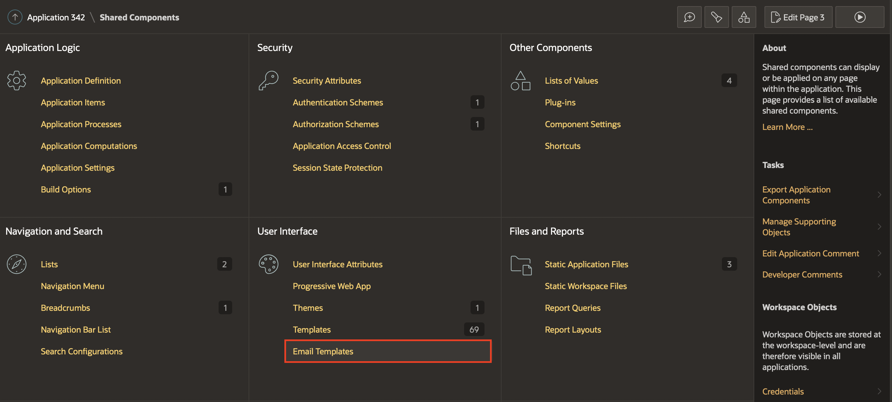
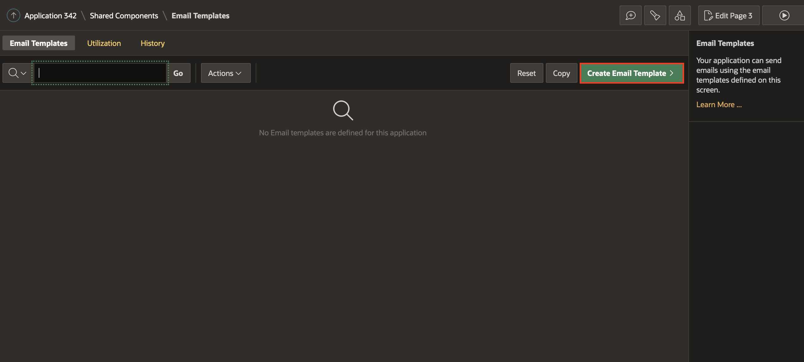
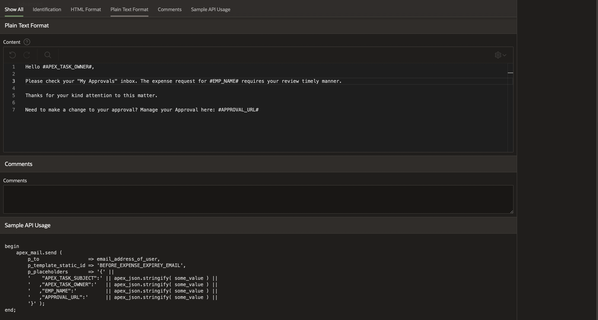

# Create an Email Template  

## Introduction

In this lab, you create an Email Template in the task definition. The email needs to be sent to the reviewer before an action expires.

Estimated Time: 5 minutes

### Objectives

In this lab, you will:
- Create an Email Template

## Task 1: Create an Email Template

To define an email template:

1. Navigate to the Shared Components page:

    - On the Workspace home page, click **App Builder**.

    - Select an **Expense Tracker** application.

    - On the Application home page, click **Shared Components**.

2. Under User Interface Components, select **Email Templates**.

   

3. On the Email Templates page, click **Create Email Template**.
   The Details page appears.

   

4. Under **Identification**:

    - For Template Name - Enter **BEFORE EXPENSE EXPIRY EMAIL**

    - For Email Subject - Copy and Paste the below Text

     ```
     <copy>
     Expense Request FOR #APEX_TASK_SUBJECT# Requires your review
     </copy>
     ```

    *Note: For substitution strings with the #STRING_NAME# format. You can pass in values for these strings using the Placeholder Values dialog for the Process in Page Designer or the APEX_MAIL API.

5. Under **HTML Format**:

    - For Header - Copy the text below and paste it into the Header:
    ```
    <copy>
    <b style="font-size: 24px;">My Approvals</b>
    </copy>
    ```
    - For Body - Copy the text below and paste it into the Body:
    ```
     <copy>
    <strong>Hello #APEX_TASK_OWNER#</strong>,<br>
    <br>Please check your "My Approvals" inbox. The expense request for #EMP_NAME# requires your timely review manner.<br>
    <br>Thanks for your kind attention to this matter.<br>
    <br>Need to make a change to your Approvals? <a href="#APPROVAL_URL#">Manage your Approvals here.</a>
    </copy>
     ```
    - For Plain Text Format - Copy the text below and paste it into Plain text format:
    ```
    <copy>
    Hello #APEX_TASK_OWNER#,
    Please check your "My Approvals" inbox. The expense request for #EMP_NAME# requires your timely review manner.
    Thanks for your kind attention to this matter.
    Need to make a change to your Approval? Manage your Approval here: #APPROVAL_URL#
    </copy>
    ```

    

    

6. Click **Create Email Template**

## **Summary**
You now know how to create an email template.

You may now **proceed to the next lab**.   

## Acknowledgments
- **Author** - Ankita Beri, Product Manager
- **Contributor** - Roopesh Thokala, Senior Product Manager
- **Last Updated By/Date** - Ankita Beri, Product Manager, June 2023
