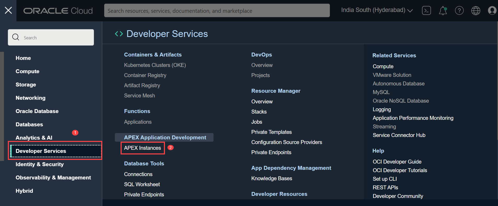
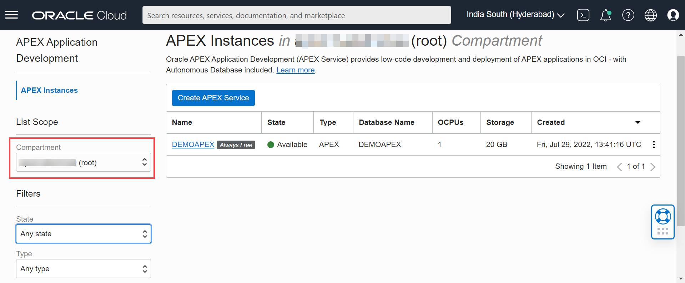
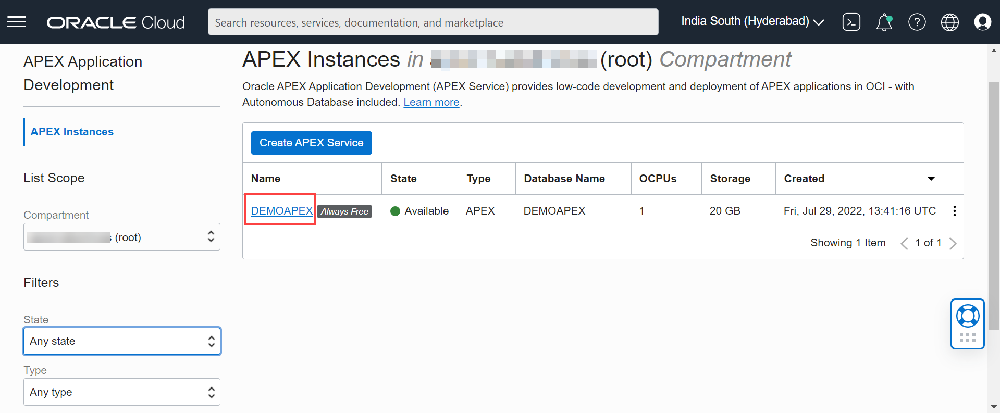
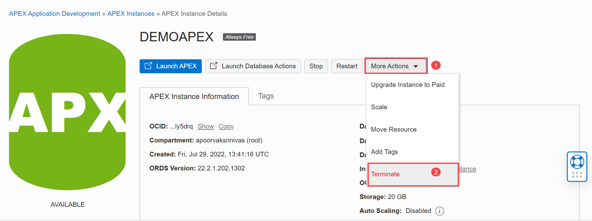
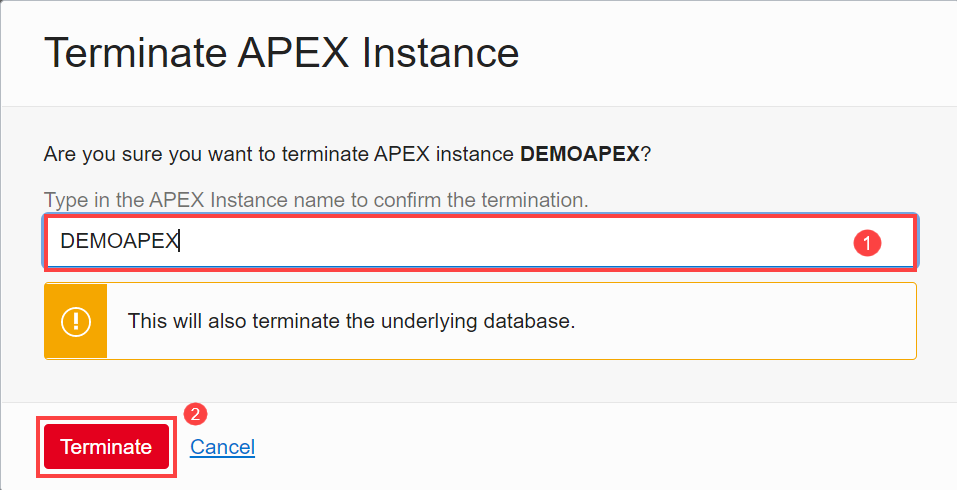
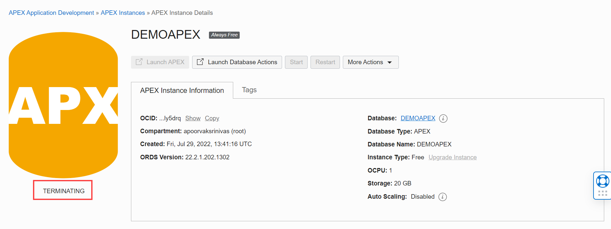
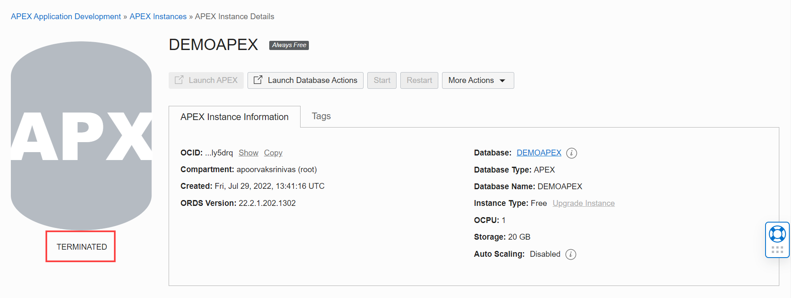

# Terminate Oracle APEX Service Instance

## Introduction

You can permanently delete (terminate) APEX instances that you no longer need. Terminating an APEX instance will delete the underlying Autonomous Database as well.

This lab walks you through the steps to terminate an available or stopped Oracle APEX instance. For the purpose of this lab, an always free demo Oracle APEX service instance named **DEMOAPEX** is provisioned in a compartment.

Estimated Time - 5 minutes

Objectives

- Terminate an available or stopped Oracle APEX service instance.

Prerequisites

- Should have an Oracle APEX service instance provisioned with Lifecycle Status - Available or Stopped.
- To provision an Oracle APEX service instance, there are detailed instructions in the Prerequisites section of this workshop.

## **Task 1**: Terminate a Provisioned Oracle APEX Service Instance

1. From your cloud console, click on the hamburger menu and navigate to **Developer Services**, and select **APEX Instances**.
    

2. From the compartment drop-down menu select the Compartment where your Oracle APEX service resource is provisioned. If there were a long list of databases, you could filter the list by the State of the databases (Available, Stopped, Terminated, etc).
    
    
3. From the databases displayed, click Display Name of the APEX instance you wish to terminate.    
In this lab, we are terminating the available **DEMOAPEX** Oracle APEX service instance. Click **DEMOAPEX**.

    

4. Click **More Actions** and select **Terminate**.

    

5. Confirm that you wish to terminate your Oracle APEX instance in the confirmation dialog. Type the APEX instance name in the input field and click **Terminate**.

In this lab, type DEMOAPEX and click **Terminate**.

    

6. Your instance will begin to terminate, the Lifecycle State will turn from Available to Terminating.

    

7. After a few minutes, once the instance is terminated, the Lifecycle state will change from Terminating to Terminated.

    

You have successfully terminated an Oracle APEX service instance.

## **Learn More**

- [Managing APEX Service](https://docs.oracle.com/en-us/iaas/apex/doc/manage-apex-service.html)

## **Acknowledgements**

 - **Author** -  Apoorva Srinivas, Senior Product Manager
 - **Last Updated By/Date** - Apoorva Srinivas, Senior Product Manager, July 2022
